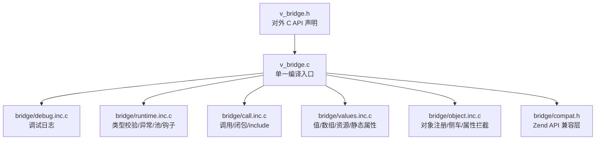
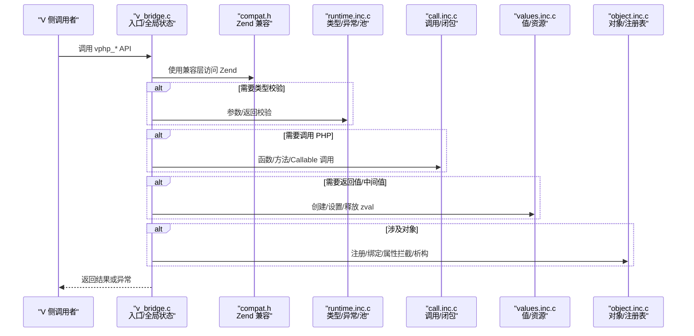
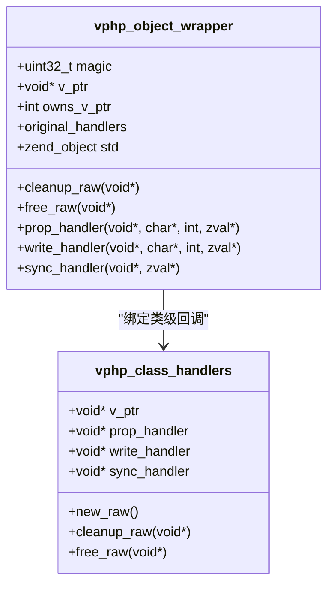
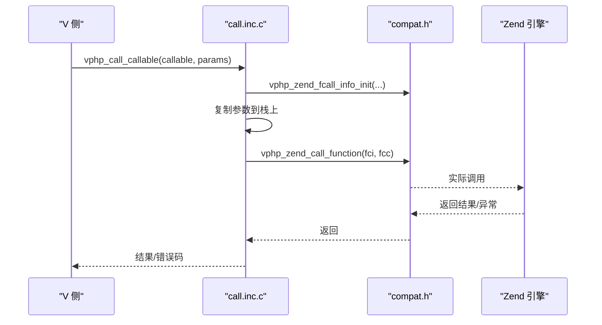
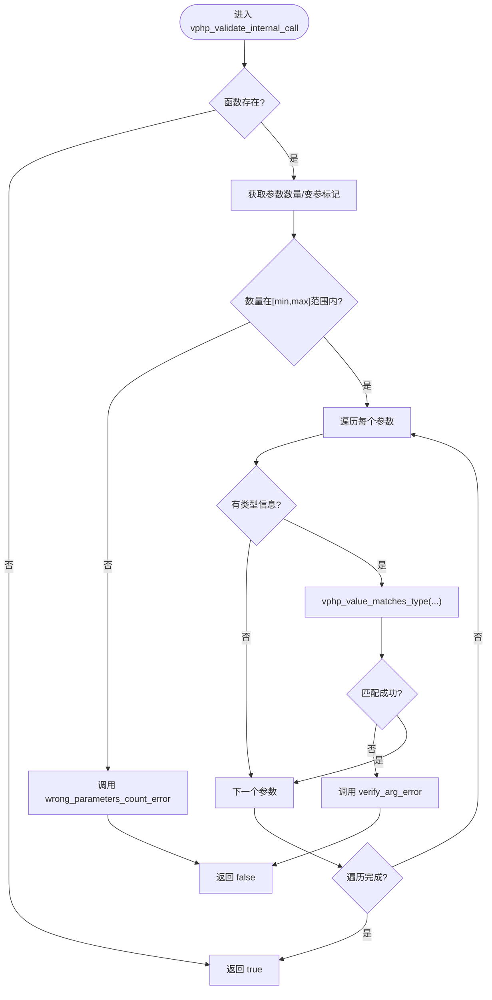
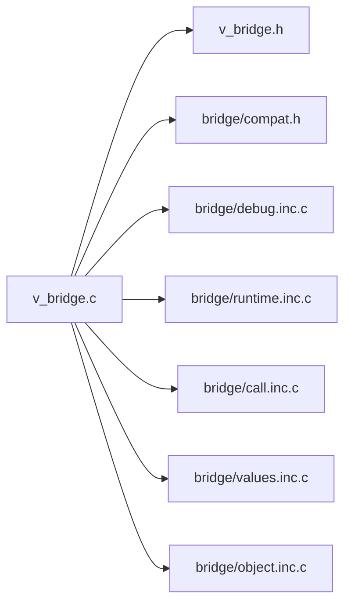

# Bridge 与 FFI 层

<cite>
**本文引用的文件**   
- [v_bridge.c](file://vphp/v_bridge.c)
- [v_bridge.h](file://vphp/v_bridge.h)
- [compat.h](file://vphp/bridge/compat.h)
- [call.inc.c](file://vphp/bridge/call.inc.c)
- [debug.inc.c](file://vphp/bridge/debug.inc.c)
- [object.inc.c](file://vphp/bridge/object.inc.c)
- [runtime.inc.c](file://vphp/bridge/runtime.inc.c)
- [values.inc.c](file://vphp/bridge/values.inc.c)
</cite>

## 目录
1. [简介](#简介)
2. [项目结构](#项目结构)
3. [核心组件](#核心组件)
4. [架构总览](#架构总览)
5. [详细组件分析](#详细组件分析)
6. [依赖关系分析](#依赖关系分析)
7. [性能考量](#性能考量)
8. [故障排查指南](#故障排查指南)
9. [结论](#结论)
10. [附录](#附录)

## 简介
本文件聚焦于 bridge/ 目录与 v_bridge.c/h 的 C 兼容层设计，以及 .inc.c 片段组织方式。该层是 V↔Zend/PHP 双向互操作的关键边界：对外暴露稳定的 C API（由 v_bridge.h 声明），对内通过 compat.h 屏蔽 PHP/Zend 版本差异，并通过多个 .inc.c 按功能域拆分实现，最终在单一编译单元 v_bridge.c 中组合，便于现有构建脚本消费。

## 项目结构
- v_bridge.h：对外 C API 头文件，定义对象包装、值操作、调用桥接、运行时钩子等接口。
- v_bridge.c：单一编译入口，包含全局状态、注册表、TLS 池、可选符号查找，并按顺序 include 各 .inc.c 片段。
- bridge/compat.h：集中封装对 Zend API 的直接调用，提供跨版本兼容宏与内联函数。
- bridge/*.inc.c：按领域拆分的实现片段：
  - debug.inc.c：统一的调试日志能力（环境变量控制输出目标）。
  - runtime.inc.c：类型校验、参数/返回验证、异常处理、自动释放池、请求生命周期钩子等。
  - call.inc.c：函数/静态方法/实例方法调用、闭包创建、include 执行等。
  - values.inc.c：zval 读写、数组/超全局访问、资源系统、静态属性/常量访问等。
  - object.inc.c：对象注册表、侧车包装器、继承处理器克隆、属性访问拦截、析构清理等。

图表来源
- [v_bridge.c:149-153](file://vphp/v_bridge.c#L149-L153)
- [v_bridge.h:1-265](file://vphp/v_bridge.h#L1-L265)
- [compat.h:1-242](file://vphp/bridge/compat.h#L1-L242)

章节来源
- [v_bridge.c:1-191](file://vphp/v_bridge.c#L1-L191)
- [v_bridge.h:1-265](file://vphp/v_bridge.h#L1-L265)
- [compat.h:1-242](file://vphp/bridge/compat.h#L1-L242)

## 核心组件
- 对象包装与绑定
  - vphp_object_wrapper：嵌入 zend_object，保存 V 侧指针、所有权、属性读写/同步回调、原始 handlers 等。
  - vphp_class_handlers：描述类级别的属性读写、同步、构造/析构等回调。
  - 对象注册表：v_ptr ↔ zend_object 的双向映射；侧车注册表：非内嵌对象的额外元数据。
- 值与资源
  - zval 分配/释放、持久化 zval、引用解包、字符串/数值转换。
  - 资源系统：通用 Resource 包装，带标签与自定义析构。
- 调用与闭包
  - 统一调用路径：函数/静态方法/实例方法/Callable。
  - 闭包工厂：支持固定元数、可变参数、全自动桥接三种模式。
- 运行时与类型校验
  - 参数/返回类型校验，支持标量掩码、命名类型、交集/联合、用户类型慢路径。
  - 异常抛出/读取/清除，错误输出。
  - 自动释放池与拥有池：配合请求生命周期进行批量回收。
- 兼容性
  - compat.h 将 Zend API 直接调用收敛到一处，屏蔽 8.2+ 至未来版本的签名变化。

章节来源
- [v_bridge.h:13-95](file://vphp/v_bridge.h#L13-L95)
- [object.inc.c:1-103](file://vphp/bridge/object.inc.c#L1-L103)
- [values.inc.c:137-209](file://vphp/bridge/values.inc.c#L137-L209)
- [call.inc.c:302-355](file://vphp/bridge/call.inc.c#L302-L355)
- [runtime.inc.c:288-380](file://vphp/bridge/runtime.inc.c#L288-L380)
- [compat.h:15-242](file://vphp/bridge/compat.h#L15-L242)

## 架构总览
整体采用“单编译单元 + 多片段”的组织方式：v_bridge.c 作为唯一被构建系统消费的编译单元，负责初始化全局状态、注册表、TLS 池、可选符号解析，并在末尾顺序 include 各 .inc.c 片段，从而获得清晰的职责边界与可维护性。

图表来源
- [v_bridge.c:149-153](file://vphp/v_bridge.c#L149-L153)
- [compat.h:42-242](file://vphp/bridge/compat.h#L42-L242)
- [runtime.inc.c:288-380](file://vphp/bridge/runtime.inc.c#L288-L380)
- [call.inc.c:14-54](file://vphp/bridge/call.inc.c#L14-L54)
- [values.inc.c:137-209](file://vphp/bridge/values.inc.c#L137-L209)
- [object.inc.c:105-196](file://vphp/bridge/object.inc.c#L105-L196)

## 详细组件分析

### 对象与类管理（object.inc.c）
- 关键数据结构
  - vphp_object_wrapper：内嵌 zend_object，持有 V 侧指针、所有权标志、属性读写/同步回调、原始 handlers 等。
  - vphp_class_handlers：描述类级别行为（属性读写、同步、构造/析构等）。
- 核心流程
  - 对象创建：vphp_create_object_handler / vphp_create_inherited_object_handler 负责分配并注入 vphp_obj_handlers。
  - 绑定与所有权：vphp_bind_handlers_with_ownership 确保已拥有的 V 实例不会被意外降级为借用。
  - 属性访问：read/write_property 优先走 wrapper 回调，否则回退到原始 handlers。
  - 析构：vphp_free_object_handler 清理注册表、调用原始 free_obj、释放 owned v_ptr、清理 sidecar。
- 复杂度与性能
  - 注册表查找 O(1)，sidecar 按需分配，避免每对象都携带额外开销。
  - 继承处理器克隆缓存，减少重复拷贝成本。

图表来源
- [v_bridge.h:13-35](file://vphp/v_bridge.h#L13-L35)
- [object.inc.c:713-769](file://vphp/bridge/object.inc.c#L713-L769)
- [object.inc.c:771-800](file://vphp/bridge/object.inc.c#L771-L800)

章节来源
- [object.inc.c:1-103](file://vphp/bridge/object.inc.c#L1-L103)
- [object.inc.c:398-591](file://vphp/bridge/object.inc.c#L398-L591)
- [object.inc.c:593-711](file://vphp/bridge/object.inc.c#L593-L711)
- [object.inc.c:713-769](file://vphp/bridge/object.inc.c#L713-L769)
- [object.inc.c:771-800](file://vphp/bridge/object.inc.c#L771-L800)

### 调用与闭包（call.inc.c）
- 调用路径
  - vphp_call_php_func：以函数名调用，内部复制参数列表，完成后释放。
  - vphp_call_static_method：拼接 Class::Method 字符串后走 Callable 路径。
  - vphp_call_method：实例方法调用，异常时返回 SUCCESS 以便上层检查 EG(exception)。
  - vphp_call_callable：统一入口，初始化 fci/fcc，复制参数，调用后清理。
- 闭包工厂
  - vphp_create_closure_FULL_AUTO_V2 / with_arity / variadic_closure：创建内部函数，将 V thunk 与桥接指针存入 reserved，统一由 vphp_closure_handler 分发。
- 包含执行
  - vphp_include_file：解析路径、去重、初始化 file_handle 并执行。

图表来源
- [call.inc.c:159-238](file://vphp/bridge/call.inc.c#L159-L238)
- [compat.h:100-109](file://vphp/bridge/compat.h#L100-L109)

章节来源
- [call.inc.c:14-54](file://vphp/bridge/call.inc.c#L14-L54)
- [call.inc.c:56-95](file://vphp/bridge/call.inc.c#L56-L95)
- [call.inc.c:97-117](file://vphp/bridge/call.inc.c#L97-L117)
- [call.inc.c:119-153](file://vphp/bridge/call.inc.c#L119-L153)
- [call.inc.c:302-355](file://vphp/bridge/call.inc.c#L302-L355)

### 运行时与类型校验（runtime.inc.c）
- 类型匹配
  - vphp_value_matches_type：处理 null、列表/交集/联合、iterable、命名类型、标量掩码、用户类型慢路径。
  - vphp_value_matches_named_type：处理 self/parent/static 字面量名称解析与 is_a 回退。
- 参数/返回校验
  - vphp_validate_internal_call：检查数量与每个参数的类型，必要时调用错误上报。
  - vphp_validate_internal_return：检查 void/never 语义与返回类型。
- 异常与错误
  - vphp_throw / vphp_throw_class / vphp_throw_object / vphp_error / vphp_output_write。
- 自动释放与拥有池
  - vphp_autorelease_mark/add/forget/drain：基于 mark 的区间释放，异常路径快速清空。
  - vphp_owned_add/remove：记录所有者的 zval，防止重复释放与误删。

图表来源
- [runtime.inc.c:288-340](file://vphp/bridge/runtime.inc.c#L288-L340)
- [runtime.inc.c:226-286](file://vphp/bridge/runtime.inc.c#L226-L286)

章节来源
- [runtime.inc.c:1-22](file://vphp/bridge/runtime.inc.c#L1-L22)
- [runtime.inc.c:24-81](file://vphp/bridge/runtime.inc.c#L24-L81)
- [runtime.inc.c:83-164](file://vphp/bridge/runtime.inc.c#L83-L164)
- [runtime.inc.c:166-224](file://vphp/bridge/runtime.inc.c#L166-L224)
- [runtime.inc.c:288-380](file://vphp/bridge/runtime.inc.c#L288-L380)
- [runtime.inc.c:397-469](file://vphp/bridge/runtime.inc.c#L397-L469)
- [runtime.inc.c:696-791](file://vphp/bridge/runtime.inc.c#L696-L791)

### 值与资源（values.inc.c）
- zval 生命周期
  - new/release/disown：新 zval 默认加入拥有池，release 从拥有池移除并 dtor/free。
  - persistent 变体：使用 pemalloc/pefree，适合跨请求复用。
- 基本操作
  - 标量读写、引用解包、字符串转换、数组/超全局访问。
- 资源系统
  - 通用 Resource 包装，带标签与自定义析构，用于跨边界传递任意指针。
- 静态属性/常量
  - 读/写静态属性与类常量，内部通过 compat.h 访问 Zend API。

章节来源
- [values.inc.c:1-101](file://vphp/bridge/values.inc.c#L1-L101)
- [values.inc.c:137-209](file://vphp/bridge/values.inc.c#L137-L209)
- [values.inc.c:456-498](file://vphp/bridge/values.inc.c#L456-L498)
- [values.inc.c:500-580](file://vphp/bridge/values.inc.c#L500-L580)

### 调试日志（debug.inc.c）
- 环境变量控制
  - VSLIM_CLI_DEBUG_FILE：写入指定文件。
  - VSLIM_CLI_DEBUG：输出到 stderr。
- 工具函数
  - vphp_bridge_debug_log / vphp_bridge_debug_log_zval：统一格式化输出，支持 zval 基本信息打印。

章节来源
- [debug.inc.c:1-93](file://vphp/bridge/debug.inc.c#L1-L93)

### 兼容性层（compat.h）
- 版本要求与宏
  - 最低 PHP 8.2，针对 8.4+ 的 ZEND_RAW_FENTRY 宏扩展。
- 内联适配
  - 类型检查、参数/返回错误、用户类型慢路径、闭包创建、异常抛出、资源注册、只读属性修改错误等。

章节来源
- [compat.h:11-21](file://vphp/bridge/compat.h#L11-L21)
- [compat.h:42-242](file://vphp/bridge/compat.h#L42-L242)

## 依赖关系分析
- 模块耦合
  - v_bridge.c 仅依赖 v_bridge.h 与 bridge/compat.h，其余实现通过 include 注入，降低显式依赖。
  - 各 .inc.c 通过 compat.h 访问 Zend，避免分散的版本分支。
- 外部依赖
  - Zend 引擎 API（类型系统、对象模型、执行上下文、异常、资源系统等）。
- 潜在循环
  - 无直接循环 include；通过 v_bridge.c 的顺序 include 保证符号可见性与初始化顺序。

图表来源
- [v_bridge.c:149-153](file://vphp/v_bridge.c#L149-L153)
- [v_bridge.h:1-265](file://vphp/v_bridge.h#L1-L265)
- [compat.h:1-242](file://vphp/bridge/compat.h#L1-L242)

章节来源
- [v_bridge.c:1-191](file://vphp/v_bridge.c#L1-L191)

## 性能考量
- 对象侧车与内嵌包装
  - 内嵌包装（offset 指向 vphp_object_wrapper）避免额外堆分配；非内嵌对象才分配 sidecar，降低内存占用。
- 继承处理器缓存
  - 克隆后的 handlers 缓存于哈希表，避免重复 memcpy。
- 自动释放池
  - 基于 mark 的区间释放，异常路径快速清空，减少逐条判断开销。
- 类型校验
  - 标量掩码快速路径优先，命名类型与用户类型慢路径仅在必要时触发。
- 闭包创建
  - 内部函数使用 pecalloc 持久分配，减少频繁分配/释放。

[本节为通用指导，不直接分析具体文件]

## 故障排查指南
- 启用调试
  - 设置 VSLIM_CLI_DEBUG 输出到 stderr，或设置 VSLIM_CLI_DEBUG_FILE 输出到文件。
- 常见问题定位
  - 参数/返回类型错误：查看 vphp_validate_internal_call / vphp_validate_internal_return 的日志与错误上报。
  - 对象生命周期问题：关注 vphp_free_object_handler 的清理路径与注册表一致性。
  - 自动释放泄漏：通过 vphp_runtime_counters 与 drain 日志观察池大小变化。
  - 闭包调用失败：检查 vphp_call_callable 的 fci/fcc 初始化与参数复制过程。

章节来源
- [debug.inc.c:14-46](file://vphp/bridge/debug.inc.c#L14-L46)
- [runtime.inc.c:288-380](file://vphp/bridge/runtime.inc.c#L288-L380)
- [object.inc.c:398-591](file://vphp/bridge/object.inc.c#L398-L591)
- [call.inc.c:159-238](file://vphp/bridge/call.inc.c#L159-L238)

## 结论
bridge/ 与 v_bridge.c/h 共同构成稳定、可维护的 C 兼容层：通过 compat.h 收敛版本差异，通过 .inc.c 按功能域拆分实现，再通过 v_bridge.c 组合为单一编译单元。该设计在保证高性能的同时，提供了清晰的职责边界与完善的调试能力，便于后续演进与问题定位。

[本节为总结性内容，不直接分析具体文件]

## 附录
- 对外 API 概览（部分）
  - 对象：vphp_return_bound_object / vphp_return_owned_object / vphp_return_borrowed_object / vphp_wrap_existing_object / vphp_allocate_contiguous_object
  - 调用：vphp_call_php_func / vphp_call_static_method / vphp_call_method / vphp_call_callable / vphp_is_callable
  - 值：vphp_new_zval / vphp_release_zval / vphp_reference_value / vphp_array_* / vphp_superglobal_*
  - 运行时：vphp_validate_internal_call / vphp_validate_internal_return / vphp_autorelease_* / vphp_request_startup / vphp_request_shutdown
  - 资源：vphp_make_res / vphp_fetch_res / vphp_init_resource_system

章节来源
- [v_bridge.h:51-265](file://vphp/v_bridge.h#L51-L265)