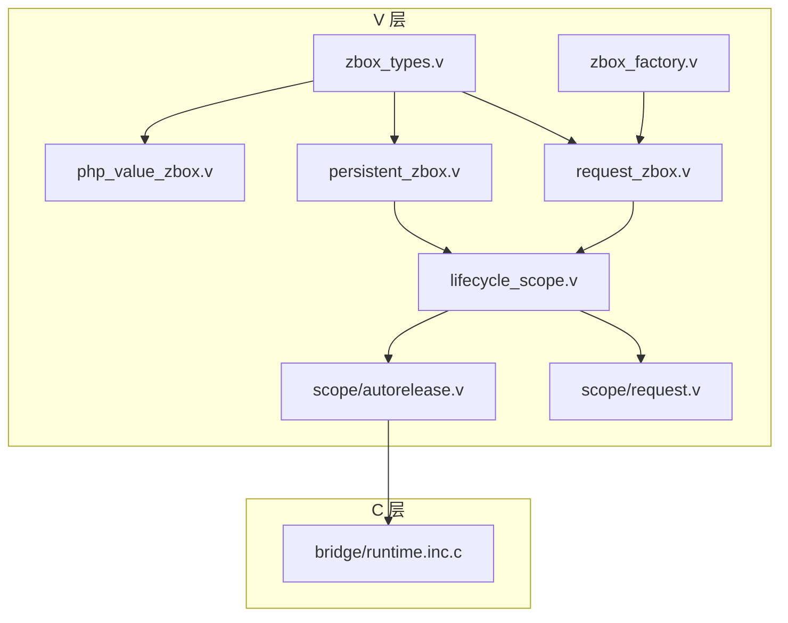
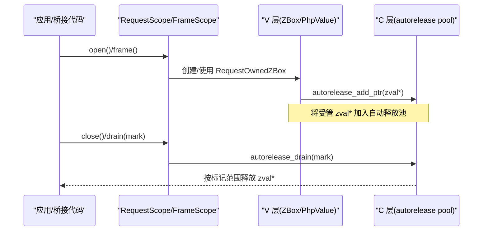
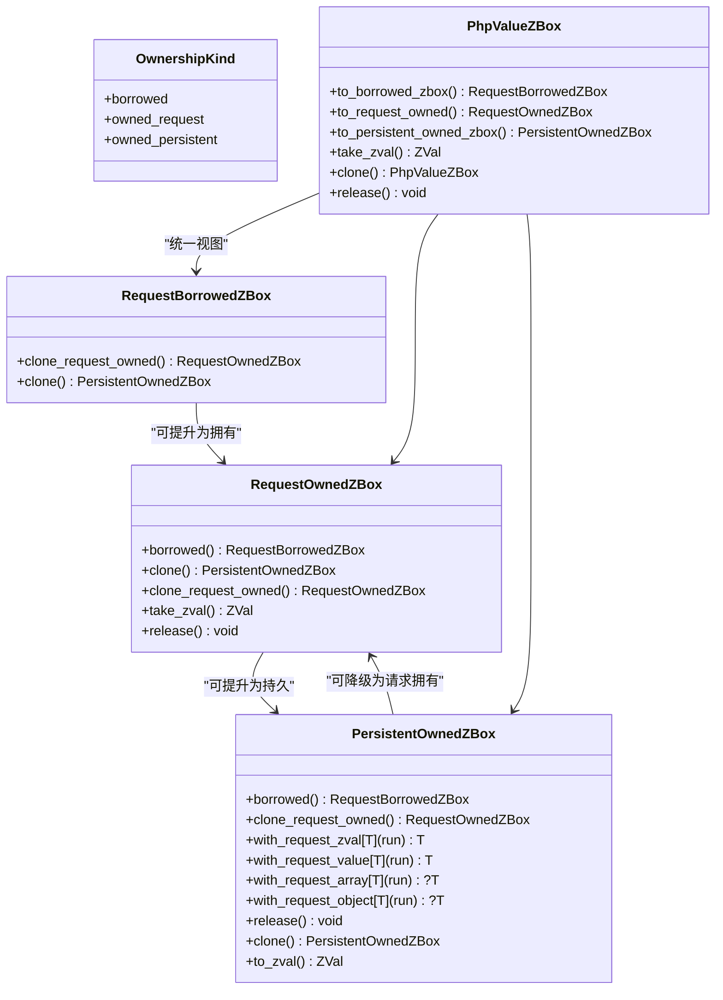
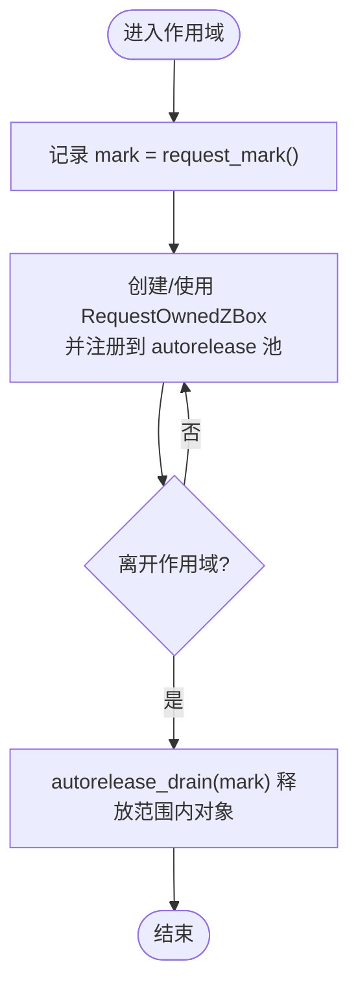
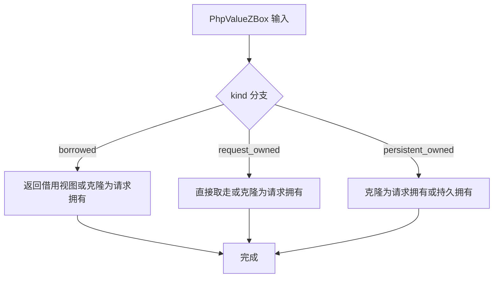
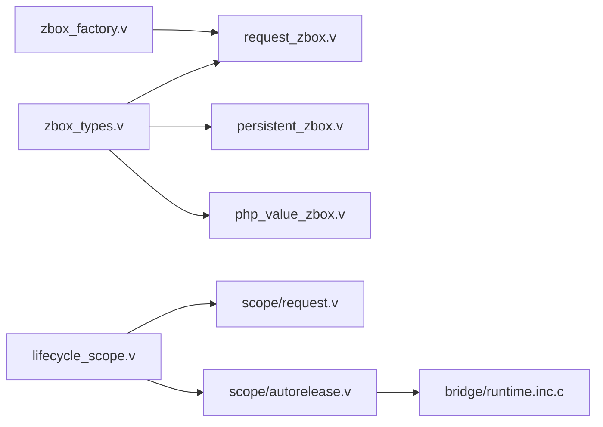

# 所有权与生命周期

<cite>
**本文引用的文件**   
- [ownership.md](file://vphp/docs/ownership.md)
- [lifecycle_model.md](file://vphp/docs/lifecycle_model.md)
- [zbox_types.v](file://vphp/zbox_types.v)
- [request_zbox.v](file://vphp/request_zbox.v)
- [persistent_zbox.v](file://vphp/persistent_zbox.v)
- [php_value_zbox.v](file://vphp/php_value_zbox.v)
- [zbox_factory.v](file://vphp/zbox_factory.v)
- [lifecycle_scope.v](file://vphp/lifecycle_scope.v)
- [scope_request.v](file://vphp/scope/request.v)
- [scope_autorelease.v](file://vphp/scope/autorelease.v)
- [runtime.inc.c](file://vphp/bridge/runtime.inc.c)
</cite>

## 目录
1. [简介](#简介)
2. [项目结构](#项目结构)
3. [核心组件](#核心组件)
4. [架构总览](#架构总览)
5. [详细组件分析](#详细组件分析)
6. [依赖关系分析](#依赖关系分析)
7. [性能考量](#性能考量)
8. [故障排查指南](#故障排查指南)
9. [结论](#结论)
10. [附录](#附录)

## 简介
本文件聚焦于 VPHP 中三种所有权语义 RequestBorrowed/Owned/Persistent、请求/帧作用域（request/frame scope）以及 autorelease 机制，给出从类型设计到运行时回收的完整说明。目标是在不改变现有行为的前提下，统一跨边界值的生命周期管理，使“借用 vs 拥有”和“请求 vs 持久”两个正交维度在 API 层面清晰可见。

## 项目结构
围绕所有权与生命周期，相关代码主要分布在以下位置：
- 类型与包装层：zbox_types.v、request_zbox.v、persistent_zbox.v、php_value_zbox.v、zbox_factory.v
- 作用域与自动释放：lifecycle_scope.v、scope/request.v、scope/autorelease.v
- C 侧实现：bridge/runtime.inc.c
- 文档与设计说明：docs/ownership.md、docs/lifecycle_model.md

图表来源
- [zbox_types.v:1-85](file://vphp/zbox_types.v#L1-L85)
- [request_zbox.v:1-44](file://vphp/request_zbox.v#L1-L44)
- [persistent_zbox.v:1-154](file://vphp/persistent_zbox.v#L1-L154)
- [php_value_zbox.v:98-184](file://vphp/php_value_zbox.v#L98-L184)
- [zbox_factory.v:59-99](file://vphp/zbox_factory.v#L59-L99)
- [lifecycle_scope.v:1-76](file://vphp/lifecycle_scope.v#L1-L76)
- [scope_request.v:1-16](file://vphp/scope/request.v#L1-L16)
- [scope_autorelease.v:1-22](file://vphp/scope/autorelease.v#L1-L22)
- [runtime.inc.c:696-950](file://vphp/bridge/runtime.inc.c#L696-L950)

章节来源
- [ownership.md:1-392](file://vphp/docs/ownership.md#L1-L392)
- [lifecycle_model.md:1-211](file://vphp/docs/lifecycle_model.md#L1-L211)

## 核心组件
- 所有权与生命周期类型
  - OwnershipKind：borrowed / owned_request / owned_persistent
  - RequestBorrowedZBox：只读借用视图，不释放
  - RequestOwnedZBox：当前请求内拥有，需在作用域结束或显式转移时释放
  - PersistentOwnedZBox：跨请求长期持有，需显式 release()
- 值包装层
  - PhpValueZBox：聚合三种 ZBox 的统一视图，提供 to_borrowed_zbox()/to_request_owned()/to_persistent_owned_zbox() 等转换
  - 工厂方法：RequestOwnedZBox.of/from_handle/adopt_zval/new_* 等便捷构造
- 作用域与自动释放
  - RequestScope/FrameScope：基于 autorelease mark/drain 的请求级作用域
  - scope.request_enter/leave 与 autorelease_add_ptr/forget_ptr/drain 对接 C 层

章节来源
- [zbox_types.v:1-85](file://vphp/zbox_types.v#L1-L85)
- [request_zbox.v:1-44](file://vphp/request_zbox.v#L1-L44)
- [persistent_zbox.v:1-154](file://vphp/persistent_zbox.v#L1-L154)
- [php_value_zbox.v:98-184](file://vphp/php_value_zbox.v#L98-L184)
- [zbox_factory.v:59-99](file://vphp/zbox_factory.v#L59-L99)
- [lifecycle_scope.v:1-76](file://vphp/lifecycle_scope.v#L1-L76)
- [scope_request.v:1-16](file://vphp/scope/request.v#L1-L16)
- [scope_autorelease.v:1-22](file://vphp/scope/autorelease.v#L1-L22)

## 架构总览
下图展示了从应用层到 C 层的调用链与数据流向，重点体现 request/frame 作用域与 autorelease 的协作。

图表来源
- [lifecycle_scope.v:38-76](file://vphp/lifecycle_scope.v#L38-L76)
- [scope_request.v:5-16](file://vphp/scope/request.v#L5-L16)
- [scope_autorelease.v:5-22](file://vphp/scope/autorelease.v#L5-L22)
- [runtime.inc.c:696-740](file://vphp/bridge/runtime.inc.c#L696-L740)

## 详细组件分析

### 类型与语义：RequestBorrowed/Owned/Persistent
- RequestBorrowedZBox
  - 语义：只读借用，不拥有，不释放
  - 典型用法：函数参数、回调内临时查看
  - 关键能力：clone_request_owned()/clone() 提升为拥有
- RequestOwnedZBox
  - 语义：当前请求内拥有，必须释放或转移
  - 关键能力：borrowed()/clone()/clone_request_owned()/take_zval()/release()
  - 工厂：of/from_handle/adopt_zval/new_*
- PersistentOwnedZBox
  - 语义：跨请求长期持有，需显式 release()
  - 内部形态：dyn_data 或 fallback_zval
  - 关键能力：borrowed()/clone_request_owned()/with_request_* 系列/release()/clone()/to_zval()

图表来源
- [zbox_types.v:1-85](file://vphp/zbox_types.v#L1-L85)
- [request_zbox.v:1-44](file://vphp/request_zbox.v#L1-L44)
- [persistent_zbox.v:1-154](file://vphp/persistent_zbox.v#L1-L154)
- [php_value_zbox.v:98-184](file://vphp/php_value_zbox.v#L98-L184)

章节来源
- [zbox_types.v:1-85](file://vphp/zbox_types.v#L1-L85)
- [request_zbox.v:1-44](file://vphp/request_zbox.v#L1-L44)
- [persistent_zbox.v:1-154](file://vphp/persistent_zbox.v#L1-L154)
- [php_value_zbox.v:98-184](file://vphp/php_value_zbox.v#L98-L184)
- [zbox_factory.v:59-99](file://vphp/zbox_factory.v#L59-L99)

### 作用域与自动释放：request/frame scope 与 autorelease
- RequestScope
  - enter()/leave() 封装 mark/drain，支持嵌套
  - open()/close() 配合 defer 使用，确保 drain
- FrameScope
  - 用于 frame 级别收集 RequestOwnedZBox，统一释放
- Autorelease 机制
  - add_ptr/forget_ptr/drain 将 zval* 加入/移出/释放池
  - 仅对“被 V 拥有”的 zval* 生效，避免重复释放

图表来源
- [lifecycle_scope.v:22-59](file://vphp/lifecycle_scope.v#L22-L59)
- [scope_request.v:5-16](file://vphp/scope/request.v#L5-L16)
- [scope_autorelease.v:5-22](file://vphp/scope/autorelease.v#L5-L22)
- [runtime.inc.c:696-740](file://vphp/bridge/runtime.inc.c#L696-L740)

章节来源
- [lifecycle_scope.v:1-76](file://vphp/lifecycle_scope.v#L1-L76)
- [scope_request.v:1-16](file://vphp/scope/request.v#L1-L16)
- [scope_autorelease.v:1-22](file://vphp/scope/autorelease.v#L1-L22)
- [runtime.inc.c:696-740](file://vphp/bridge/runtime.inc.c#L696-L740)

### 值包装层：PhpValueZBox 的统一视图
- 提供 to_borrowed_zbox()/to_request_owned()/to_persistent_owned_zbox() 等转换
- take_zval() 负责所有权转移，避免重复释放
- release() 根据内部 kind 选择对应释放路径

图表来源
- [php_value_zbox.v:98-184](file://vphp/php_value_zbox.v#L98-L184)

章节来源
- [php_value_zbox.v:98-184](file://vphp/php_value_zbox.v#L98-L184)

### 工厂与便捷构造：RequestOwnedZBox
- of/from_handle/adopt_zval/new_* 等工厂方法简化常见场景
- adopt_zval 表示“接管”传入 zval 的所有权
- new_* 用于在当前请求内快速构造标量/数组等

章节来源
- [zbox_factory.v:59-99](file://vphp/zbox_factory.v#L59-L99)

## 依赖关系分析
- V 层类型与包装相互依赖，形成清晰的升级/降级路径
- lifecycle_scope.v 依赖 scope/request.v 与 scope/autorelease.v
- scope/autorelease.v 通过 zend.* 桥接到 bridge/runtime.inc.c 的 autorelease 池
- php_value_zbox.v 作为统一视图，组合三种 ZBox 的行为

图表来源
- [zbox_types.v:1-85](file://vphp/zbox_types.v#L1-L85)
- [request_zbox.v:1-44](file://vphp/request_zbox.v#L1-L44)
- [persistent_zbox.v:1-154](file://vphp/persistent_zbox.v#L1-L154)
- [php_value_zbox.v:98-184](file://vphp/php_value_zbox.v#L98-L184)
- [zbox_factory.v:59-99](file://vphp/zbox_factory.v#L59-L99)
- [lifecycle_scope.v:1-76](file://vphp/lifecycle_scope.v#L1-L76)
- [scope_request.v:1-16](file://vphp/scope/request.v#L1-L16)
- [scope_autorelease.v:1-22](file://vphp/scope/autorelease.v#L1-L22)
- [runtime.inc.c:696-950](file://vphp/bridge/runtime.inc.c#L696-L950)

章节来源
- [zbox_types.v:1-85](file://vphp/zbox_types.v#L1-L85)
- [lifecycle_scope.v:1-76](file://vphp/lifecycle_scope.v#L1-L76)
- [runtime.inc.c:696-950](file://vphp/bridge/runtime.inc.c#L696-L950)

## 性能考量
- 优先使用 RequestBorrowedZBox 进行只读访问，避免不必要的复制
- 仅在需要跨作用域保存时使用 clone()/retain() 提升到持久化
- 合理使用 with_request_* 系列，减少手动管理临时对象
- 在 FPM 模式下由 Zend 收口；在 CLI Worker 下自行包裹 RequestScope

[本节为通用指导，无需源码引用]

## 故障排查指南
- 内存泄漏迹象
  - 检查是否在长驻结构中保存了 RequestOwnedZBox 而未释放
  - 确认是否遗漏 release() 或错误地多次释放
- 双重释放/崩溃
  - 检查是否同时存在 take_zval() 与 release() 的竞态
  - 确认 autorelease_forget_ptr 是否正确移除不再需要的指针
- 调试建议
  - 使用 C 层 debug 日志观察 autorelease_pool 状态
  - 在请求边界打印 mark 与 drain 范围，定位未释放区间

章节来源
- [runtime.inc.c:575-601](file://vphp/bridge/runtime.inc.c#L575-L601)
- [runtime.inc.c:696-740](file://vphp/bridge/runtime.inc.c#L696-L740)
- [runtime.inc.c:910-950](file://vphp/bridge/runtime.inc.c#L910-L950)

## 结论
通过将“借用 vs 拥有”和“请求 vs 持久”两个维度显式化，并结合 RequestScope/FrameScope 与 autorelease 机制，VPHP 实现了清晰、安全且高效的跨边界值生命周期管理。新代码应优先采用语义包装与统一视图，在边界处明确所有权转移与释放点。

[本节为总结性内容，无需源码引用]

## 附录
- 决策参考
  - 只在当前作用域读取：RequestBorrowedZBox
  - 在当前请求内拥有：RequestOwnedZBox
  - 跨请求长期保存：PersistentOwnedZBox
- 常用模式
  - 工厂构造：RequestOwnedZBox.new_* / of / from_handle / adopt_zval
  - 统一视图转换：PhpValueZBox.to_*_zbox()
  - 作用域收口：RequestScope.open/close 或 PhpScope.frame()

章节来源
- [ownership.md:1-392](file://vphp/docs/ownership.md#L1-L392)
- [lifecycle_model.md:1-211](file://vphp/docs/lifecycle_model.md#L1-L211)