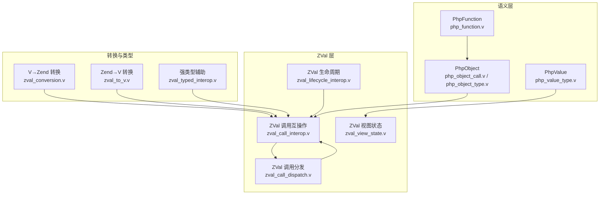
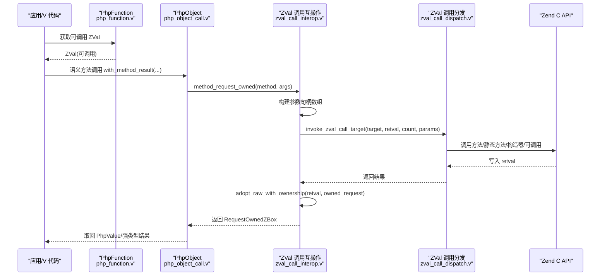
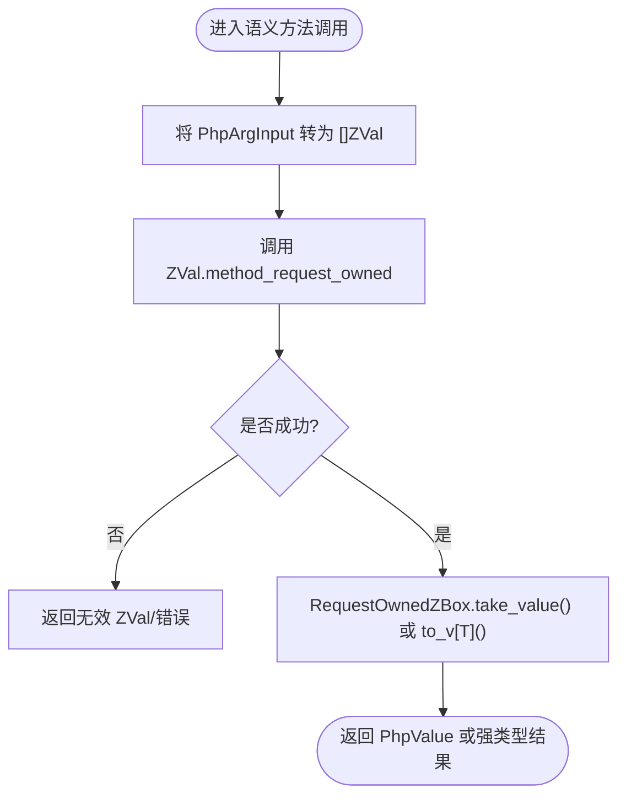
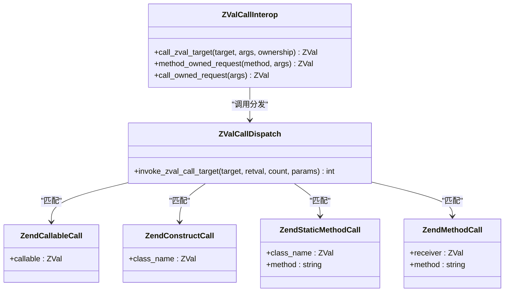
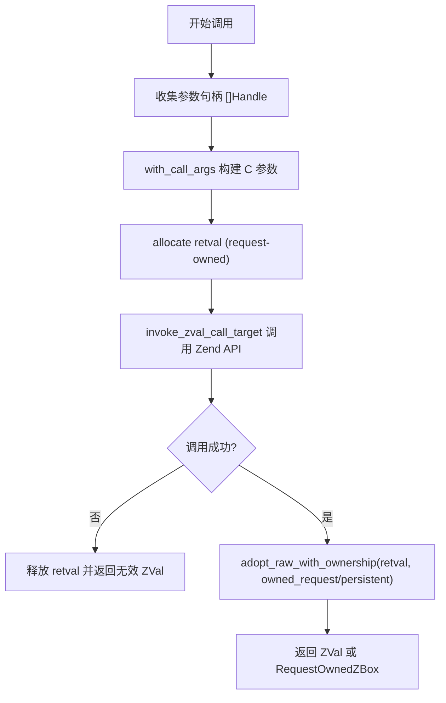
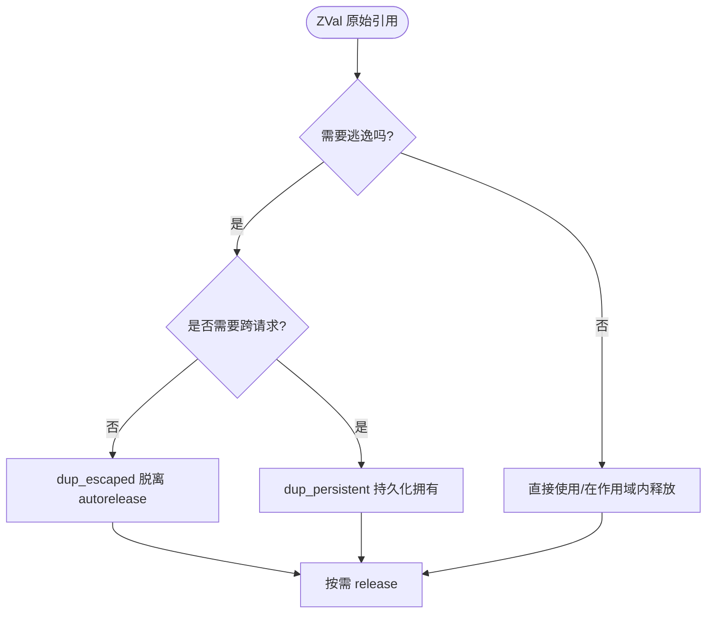
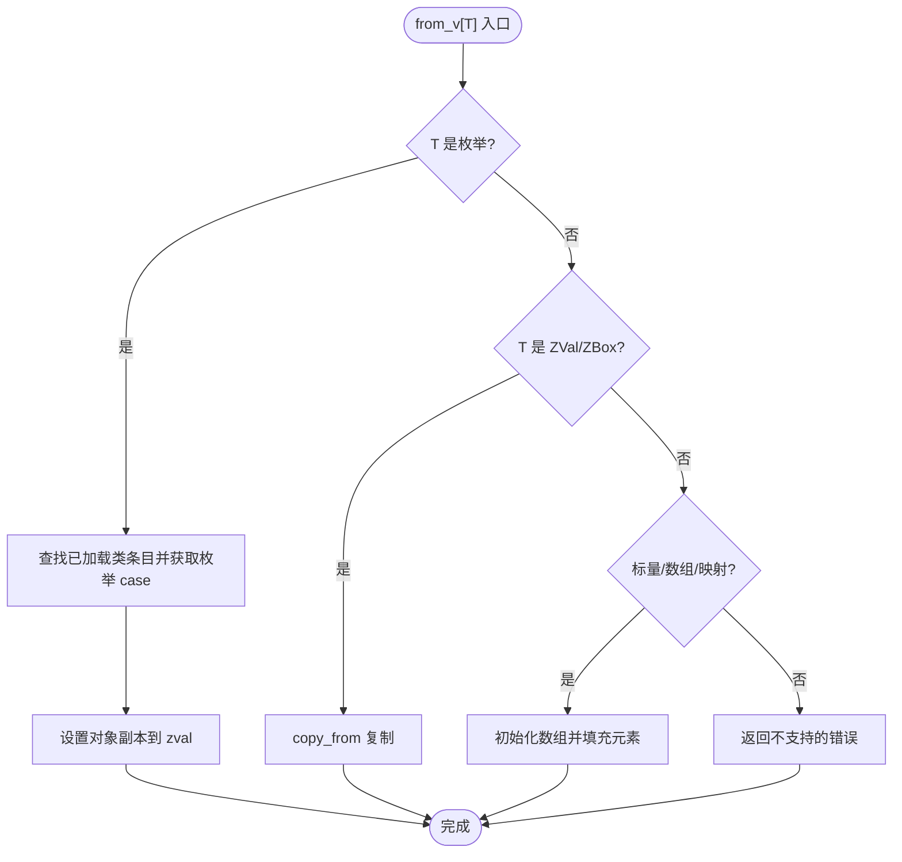
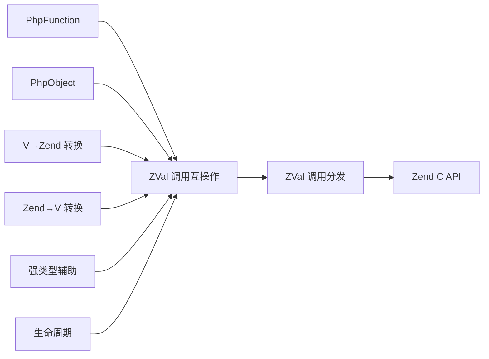

# V→PHP 互操作

<cite>
**本文引用的文件**   
- [README.md](file://vphp/README.md)
- [php_function.v](file://vphp/php_function.v)
- [php_object_call.v](file://vphp/php_object_call.v)
- [zval_call_dispatch.v](file://vphp/zval_call_dispatch.v)
- [zval_call_interop.v](file://vphp/zval_call_interop.v)
- [zval_conversion.v](file://vphp/zval_conversion.v)
- [zval_to_v.v](file://vphp/zval_to_v.v)
- [php_value_type.v](file://vphp/php_value_type.v)
- [php_object_type.v](file://vphp/php_object_type.v)
- [zval_lifecycle_interop.v](file://vphp/zval_lifecycle_interop.v)
- [zval_typed_interop.v](file://vphp/zval_typed_interop.v)
- [zval_view_state.v](file://vphp/zval_view_state.v)
- [zval_stringify.v](file://vphp/zval_stringify.v)
</cite>

## 目录
1. [简介](#简介)
2. [项目结构](#项目结构)
3. [核心组件](#核心组件)
4. [架构总览](#架构总览)
5. [详细组件分析](#详细组件分析)
6. [依赖关系分析](#依赖关系分析)
7. [性能考量](#性能考量)
8. [故障排查指南](#故障排查指南)
9. [结论](#结论)
10. [附录](#附录)

## 简介
本文件聚焦于 V 到 PHP 的互操作语义层与底层逃逸路径，围绕以下目标展开：
- PhpFunction/PhpObject 语义调用 API 的设计与使用
- ZVal 底层逃逸路径（参数传递、返回值处理、所有权与生命周期）
- 类型转换与强类型辅助方法
- 错误处理与调试信息输出

该文档面向希望深入理解 vphp 在“V → PHP”方向上如何安全高效地进行函数与方法调用、值传递与返回处理的读者。

## 项目结构
围绕本次主题的关键代码分布在如下位置：
- 语义调用入口与对象方法调用封装：php_function.v、php_object_call.v
- 底层调用分发与 Zend 桥接：zval_call_dispatch.v、zval_call_interop.v
- 值模型与转换：zval_conversion.v、zval_to_v.v、php_value_type.v、php_object_type.v
- 生命周期与逃逸：zval_lifecycle_interop.v、zval_view_state.v
- 强类型辅助：zval_typed_interop.v
- 字符串化与调试：zval_stringify.v

图表来源
- [php_function.v:1-11](file://vphp/php_function.v#L1-L11)
- [php_object_call.v:1-77](file://vphp/php_object_call.v#L1-L77)
- [php_object_type.v:1-210](file://vphp/php_object_type.v#L1-L210)
- [php_value_type.v:1-260](file://vphp/php_value_type.v#L1-L260)
- [zval_call_dispatch.v:1-46](file://vphp/zval_call_dispatch.v#L1-L46)
- [zval_call_interop.v:1-88](file://vphp/zval_call_interop.v#L1-L88)
- [zval_lifecycle_interop.v:1-61](file://vphp/zval_lifecycle_interop.v#L1-L61)
- [zval_view_state.v:1-98](file://vphp/zval_view_state.v#L1-L98)
- [zval_conversion.v:1-217](file://vphp/zval_conversion.v#L1-L217)
- [zval_to_v.v:1-372](file://vphp/zval_to_v.v#L1-L372)
- [zval_typed_interop.v:1-169](file://vphp/zval_typed_interop.v#L1-L169)

章节来源
- [README.md:1-492](file://vphp/README.md#L1-L492)

## 核心组件
- PhpFunction：提供以名称定位可调用项并转换为可执行 ZVal 的便捷入口，便于后续通过 ZVal 语义或底层 API 进行调用。
- PhpObject：对 PHP 对象的语义封装，提供方法调用、属性访问、构造器调用等高层 API，内部委托给 ZVal 层完成实际调用与所有权管理。
- ZVal：底层值包装，负责与 Zend C API 交互，包含方法/静态方法/构造器/可调用项的调用、参数构建、结果回收与所有权标记。
- 转换与类型：
  - zval_conversion.v：实现 V 类型到 Zend zval 的转换（from_v），以及工厂方法创建请求作用域内的 ZVal。
  - zval_to_v.v：实现 Zend zval 到 V 类型的严格转换（to_v），包括标量、数组、映射、枚举、结构体绑定对象、联合类型等。
  - zval_typed_interop.v：为常见操作提供带泛型结果的便捷方法（如 call_v、method_v、prop_v 等）。
- 生命周期与逃逸：
  - zval_lifecycle_interop.v：提供 dup/dup_escaped/dup_persistent/release/disown 等方法，控制 ZVal 的复制、释放与跨作用域逃逸。
  - zval_view_state.v：暴露只读视图，供上层包装复用通用能力而不直接暴露完整生命周期 API。

章节来源
- [php_function.v:1-11](file://vphp/php_function.v#L1-L11)
- [php_object_call.v:1-77](file://vphp/php_object_call.v#L1-L77)
- [php_object_type.v:1-210](file://vphp/php_object_type.v#L1-L210)
- [php_value_type.v:1-260](file://vphp/php_value_type.v#L1-L260)
- [zval_call_dispatch.v:1-46](file://vphp/zval_call_dispatch.v#L1-L46)
- [zval_call_interop.v:1-88](file://vphp/zval_call_interop.v#L1-L88)
- [zval_conversion.v:1-217](file://vphp/zval_conversion.v#L1-L217)
- [zval_to_v.v:1-372](file://vphp/zval_to_v.v#L1-L372)
- [zval_typed_interop.v:1-169](file://vphp/zval_typed_interop.v#L1-L169)
- [zval_lifecycle_interop.v:1-61](file://vphp/zval_lifecycle_interop.v#L1-L61)
- [zval_view_state.v:1-98](file://vphp/zval_view_state.v#L1-L98)

## 架构总览
下图展示了从语义层到 Zend 层的调用链路与数据流向，强调参数传递与返回值的所有权策略。

图表来源
- [php_function.v:1-11](file://vphp/php_function.v#L1-L11)
- [php_object_call.v:1-77](file://vphp/php_object_call.v#L1-L77)
- [zval_call_interop.v:1-88](file://vphp/zval_call_interop.v#L1-L88)
- [zval_call_dispatch.v:1-46](file://vphp/zval_call_dispatch.v#L1-L46)

## 详细组件分析

### PhpFunction 与 PhpObject 语义调用
- PhpFunction 提供基于名称的可调用项查找，返回可用于调用的 ZVal；同时提供存在性检查。
- PhpObject 提供多种方法调用变体：
  - 语义层：call_method、with_method_result、with_attribute 等，自动处理 RequestOwnedZBox 生命周期并在合适时机释放。
  - 底层逃逸：method_zval、method_owned_request、method_owned_persistent 等，直接返回 ZVal 并由调用方决定所有权。
- 典型流程：
  - 语义调用：将可变参按 PhpArgInput 转为 ZVal 数组，委托给 ZVal.method_request_owned，得到 RequestOwnedZBox，再取出 PhpValue 或强类型结果。
  - 底层调用：直接传入 []ZVal 参数，由 ZVal 层构建参数句柄并调用 Zend API，返回 ZVal 后由调用方接管所有权。

图表来源
- [php_object_call.v:1-77](file://vphp/php_object_call.v#L1-L77)
- [zval_call_interop.v:1-88](file://vphp/zval_call_interop.v#L1-L88)

章节来源
- [php_function.v:1-11](file://vphp/php_function.v#L1-L11)
- [php_object_call.v:1-77](file://vphp/php_object_call.v#L1-L77)

### ZVal 底层调用与分发
- 调用分发结构体：
  - ZendCallableCall：调用任意可调用项
  - ZendConstructCall：按类名构造实例
  - ZendStaticMethodCall：调用静态方法
  - ZendMethodCall：调用对象方法
- 统一入口 invoke_zval_call_target 根据目标类型选择具体调用路径，最终落到 zend.call_* 系列 API。
- 参数与返回值：
  - 参数：收集 []ZVal 的 handle 数组，交由 with_call_args 构建 C 侧参数指针。
  - 返回值：在调用前分配 retval，调用成功后 adopt_raw_with_ownership 标记所有权（owned_request 或 owned_persistent）。

图表来源
- [zval_call_dispatch.v:1-46](file://vphp/zval_call_dispatch.v#L1-L46)
- [zval_call_interop.v:1-88](file://vphp/zval_call_interop.v#L1-L88)

章节来源
- [zval_call_dispatch.v:1-46](file://vphp/zval_call_dispatch.v#L1-L46)
- [zval_call_interop.v:1-88](file://vphp/zval_call_interop.v#L1-L88)

### 参数传递与返回值处理
- 参数传递：
  - 语义层：PhpArgInput 经转换函数转为 []ZVal，再由 ZVal 层收集句柄并构建 C 侧参数数组。
  - 底层层：直接传入 []ZVal，避免额外拷贝，适合高性能路径。
- 返回值处理：
  - 语义层：优先返回 RequestOwnedZBox，调用方可选择 take_value() 或 to_v[T]() 消费结果。
  - 底层层：返回 ZVal，需显式管理所有权（release/dup_escaped/dup_persistent）。
- 关键路径：
  - call_zval_target：统一构建参数与结果，处理失败分支返回无效 ZVal。
  - adopt_raw_with_ownership：根据所有权策略标记 retval 的生命周期。

图表来源
- [zval_call_interop.v:1-88](file://vphp/zval_call_interop.v#L1-L88)
- [zval_call_dispatch.v:1-46](file://vphp/zval_call_dispatch.v#L1-L46)

章节来源
- [zval_call_interop.v:1-88](file://vphp/zval_call_interop.v#L1-L88)
- [zval_call_dispatch.v:1-46](file://vphp/zval_call_dispatch.v#L1-L46)

### ZVal 底层逃逸路径与生命周期
- 复制与逃逸：
  - dup：在当前请求作用域内克隆，保持 owned_request。
  - dup_escaped：克隆并脱离当前 autorelease 作用域，仍为请求级内存。
  - dup_persistent：克隆为持久化所有权，跨请求存活。
- 释放与放弃：
  - release：根据 is_persistent 选择释放策略，并清理 owned 标志。
  - disown：解除所有权但不释放，用于转移所有权。
- 当前 this 捕获：
  - current_this_owned_request：捕获当前 $this 作为请求级拥有的 ZVal，便于框架安全重入用户可见方法。

图表来源
- [zval_lifecycle_interop.v:1-61](file://vphp/zval_lifecycle_interop.v#L1-L61)

章节来源
- [zval_lifecycle_interop.v:1-61](file://vphp/zval_lifecycle_interop.v#L1-L61)

### 值转换与强类型辅助
- V → Zend：
  - from_v[T]：支持标量、数组、映射、枚举、结构体绑定对象等多种类型，必要时使用 RequestOwnedZBox 临时容器。
  - new_zval_from[T]/ZVal.from[T]：便捷工厂，自动加入 autorelease 列表。
- Zend → V：
  - to_v[T]：严格类型校验，支持标量、数组、映射、枚举、结构体绑定对象、联合类型等。
- 强类型辅助：
  - call_v/method_v/static_method_v/construct_v/prop_v/const_v 等，简化“基础动作 + to_v[T]”模式。

图表来源
- [zval_conversion.v:1-217](file://vphp/zval_conversion.v#L1-L217)
- [zval_to_v.v:1-372](file://vphp/zval_to_v.v#L1-L372)
- [zval_typed_interop.v:1-169](file://vphp/zval_typed_interop.v#L1-L169)

章节来源
- [zval_conversion.v:1-217](file://vphp/zval_conversion.v#L1-L217)
- [zval_to_v.v:1-372](file://vphp/zval_to_v.v#L1-L372)
- [zval_typed_interop.v:1-169](file://vphp/zval_typed_interop.v#L1-L169)

### 字符串化与调试
- stringify_value/stringify：
  - 针对 null/undef 返回空串
  - 标量直接 to_string
  - 数组尝试 JSON 编码，失败则返回占位符
  - 对象优先 __toString，其次 JSON 编码，最后退化为类名占位符
  - 资源类型显示 resource type
  - 其他类型显示类型名
- 调试日志：
  - 在 call_owned_request 等关键路径输出 raw 指针、有效性、类型、类名与参数详情，便于定位问题。

章节来源
- [zval_stringify.v:1-50](file://vphp/zval_stringify.v#L1-L50)
- [zval_call_interop.v:1-88](file://vphp/zval_call_interop.v#L1-L88)

## 依赖关系分析
- 语义层依赖底层 ZVal：
  - PhpObject 的方法调用最终委托给 ZVal.method_* 系列。
  - PhpFunction 返回的 ZVal 可直接参与 ZVal 调用体系。
- ZVal 层依赖 Zend C API：
  - 通过 zend.call_* 系列完成实际调用。
  - 通过 zval.* 系列完成值读写、数组/对象操作、生命周期管理。
- 转换模块与类型系统：
  - from_v/to_v 贯穿整个互操作链路，确保类型安全与一致性。
  - 强类型辅助减少样板代码，提升可读性与可维护性。

图表来源
- [php_function.v:1-11](file://vphp/php_function.v#L1-L11)
- [php_object_call.v:1-77](file://vphp/php_object_call.v#L1-L77)
- [zval_call_interop.v:1-88](file://vphp/zval_call_interop.v#L1-L88)
- [zval_call_dispatch.v:1-46](file://vphp/zval_call_dispatch.v#L1-L46)
- [zval_conversion.v:1-217](file://vphp/zval_conversion.v#L1-L217)
- [zval_to_v.v:1-372](file://vphp/zval_to_v.v#L1-L372)
- [zval_typed_interop.v:1-169](file://vphp/zval_typed_interop.v#L1-L169)
- [zval_lifecycle_interop.v:1-61](file://vphp/zval_lifecycle_interop.v#L1-L61)

章节来源
- [php_function.v:1-11](file://vphp/php_function.v#L1-L11)
- [php_object_call.v:1-77](file://vphp/php_object_call.v#L1-L77)
- [zval_call_interop.v:1-88](file://vphp/zval_call_interop.v#L1-L88)
- [zval_call_dispatch.v:1-46](file://vphp/zval_call_dispatch.v#L1-L46)
- [zval_conversion.v:1-217](file://vphp/zval_conversion.v#L1-L217)
- [zval_to_v.v:1-372](file://vphp/zval_to_v.v#L1-L372)
- [zval_typed_interop.v:1-169](file://vphp/zval_typed_interop.v#L1-L169)
- [zval_lifecycle_interop.v:1-61](file://vphp/zval_lifecycle_interop.v#L1-L61)

## 性能考量
- 优先使用语义 API：
  - 语义层自动处理生命周期与错误分支，减少手动 release 带来的开销与风险。
- 谨慎使用底层逃逸：
  - dup_escaped/dup_persistent 会引入额外拷贝与内存分配，仅在确有必要时使用。
- 批量参数传递：
  - 对于大量参数场景，尽量复用 []ZVal 以避免重复分配。
- 类型转换优化：
  - from_v/to_v 涉及类型判断与可能的递归遍历，建议在热点路径中缓存中间结果或使用更具体的类型接口。

[本节为通用指导，不直接分析具体文件]

## 故障排查指南
- 常见问题定位：
  - 调用失败：检查 ZVal 的有效性（is_valid）、类型（is_callable/is_object）与参数数量。
  - 返回值无效：确认 adopt_raw_with_ownership 是否正确标记所有权，避免提前释放。
  - 类型不匹配：查看 to_v[T] 的错误信息，确认源 zval 的类型与目标 T 兼容。
- 调试手段：
  - 使用 stringify_value 快速打印复杂值的字符串表示。
  - 关注 call_owned_request 的调试日志，核对 raw 指针、类型与类名。

章节来源
- [zval_stringify.v:1-50](file://vphp/zval_stringify.v#L1-L50)
- [zval_call_interop.v:1-88](file://vphp/zval_call_interop.v#L1-L88)
- [zval_to_v.v:1-372](file://vphp/zval_to_v.v#L1-L372)

## 结论
- vphp 在“V → PHP”方向提供了清晰的语义层与稳定的底层逃逸路径。
- PhpFunction/PhpObject 语义 API 简化了常见调用场景，而 ZVal 层为高级用户提供细粒度控制。
- 值转换与强类型辅助确保了类型安全与开发效率。
- 生命周期管理与调试工具帮助开发者在复杂场景中保持正确性与可观测性。

[本节为总结性内容，不直接分析具体文件]

## 附录
- 推荐实践：
  - 默认使用语义 API，仅在所有权边界需要时降级到底层 ZVal。
  - 对长生命周期值使用 dup_persistent，短期逃逸使用 dup_escaped。
  - 在热点路径中尽量避免频繁的类型转换与深层遍历。

[本节为补充建议，不直接分析具体文件]