# V→PHP 导出（Compiler）

<cite>
**本文引用的文件**   
- [entry.v](file://vphp/compiler/entry.v)
- [export.v](file://vphp/compiler/export.v)
- [c_emitter.v](file://vphp/compiler/c_emitter.v)
- [v_glue.v](file://vphp/compiler/v_glue.v)
- [architecture.md](file://vphp/compiler/docs/architecture.md)
- [emission_pipeline.md](file://vphp/compiler/docs/emission_pipeline.md)
- [class_parser.v](file://vphp/compiler/parser/class_parser.v)
- [function_parser.v](file://vphp/compiler/parser/function_parser.v)
- [class.v](file://vphp/compiler/repr/class.v)
- [function.v](file://vphp/compiler/repr/function.v)
- [interface.v](file://vphp/compiler/repr/interface.v)
- [enum.v](file://vphp/compiler/repr/enum.v)
</cite>

## 编译器流水线概览
V→PHP 导出编译器将带有 VPHP 元数据的 V 源码转换为三类产物：
- php_bridge.h / php_bridge.c：Zend/C 侧的扩展入口、函数表、类/接口/枚举注册与 C 包装器
- bridge.v：V 侧桥接层，负责把 PHP 可见的包装器转发到真实 V 实现，并处理上下文、参数解码、返回值写入等

整体流程遵循“AST → repr → linker → builder fragments → emitted C/V glue”的分层设计。顶层入口在 entry.v 中组织编译阶段；导出组装在 export.v 中完成；C 侧包装由 c_emitter.v 负责；V 侧桥接由 v_glue.v 生成。

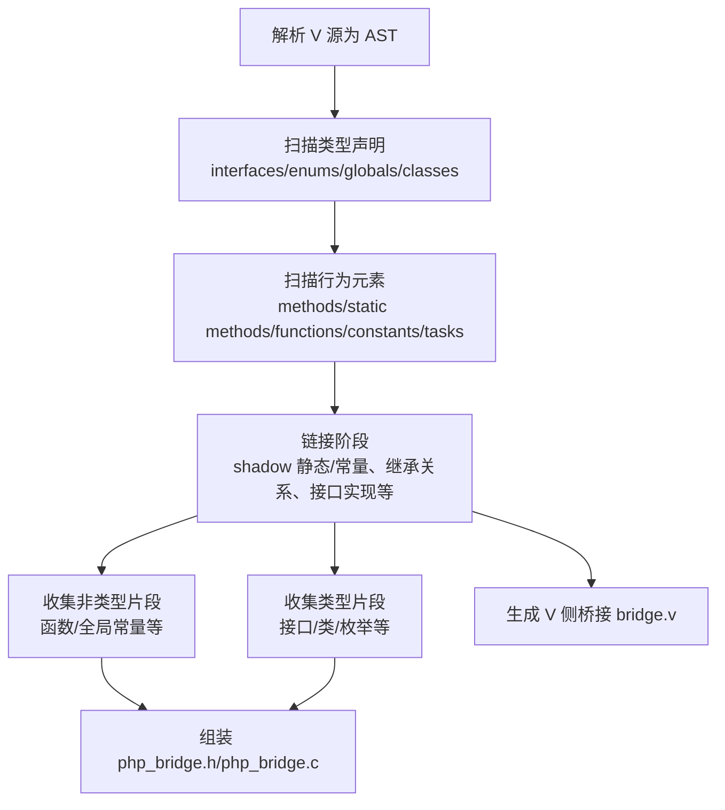

图示来源
- [entry.v:37-86](file://vphp/compiler/entry.v#L37-L86)
- [export.v:59-126](file://vphp/compiler/export.v#L59-L126)
- [architecture.md:510-522](file://vphp/compiler/docs/architecture.md#L510-L522)

章节来源
- [entry.v:37-86](file://vphp/compiler/entry.v#L37-L86)
- [export.v:59-126](file://vphp/compiler/export.v#L59-L126)
- [architecture.md:44-179](file://vphp/compiler/docs/architecture.md#L44-L179)

## 解析阶段（Parser）
解析阶段从 V AST 中提取导出符号，构建中间表示（repr）。主要职责包括：
- 识别带 VPHP 注解的结构体、函数、接口、枚举、任务、常量等
- 解析方法签名、参数名映射、默认值、可选性、可变参数、PHP 属性等
- 推断 borrowed 返回、委托目标方法、Context 模式等

关键入口与产出：
- 类/结构体解析：parse_class_decl → PhpClassRepr（含属性、方法、影子常量/静态、implements、embeds 等）
- 函数解析：parse_function_decl → PhpFuncRepr（含参数、返回 spec、是否使用 Context 等）
- 方法/静态方法注入：add_class_method / add_class_static_method → 向 PhpClassRepr.methods 追加 PhpMethodRepr

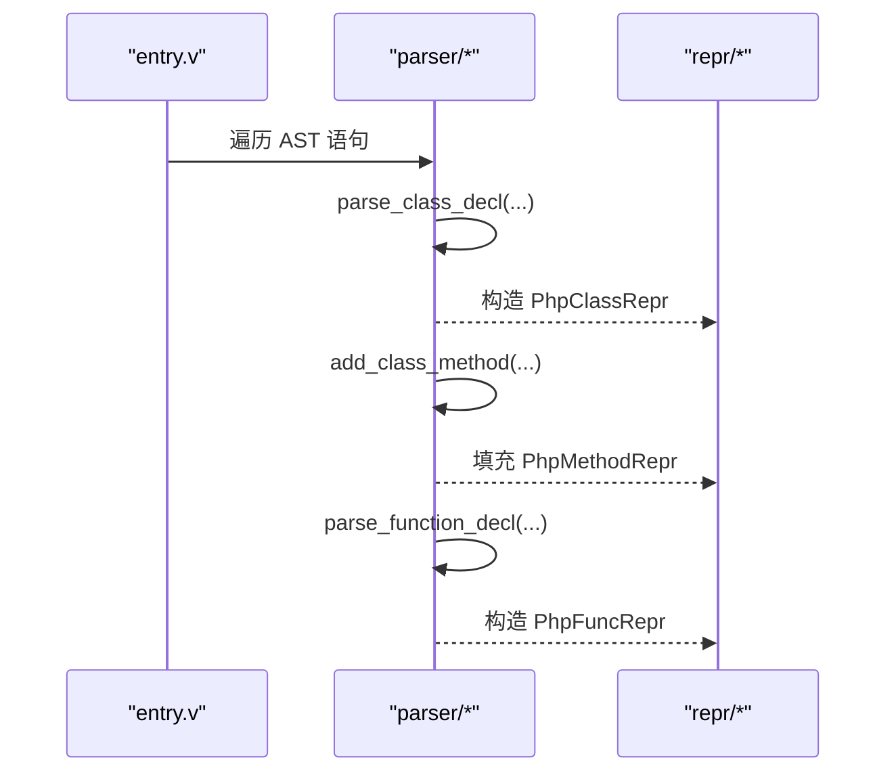

图示来源
- [class_parser.v:6-120](file://vphp/compiler/parser/class_parser.v#L6-L120)
- [class_parser.v:122-193](file://vphp/compiler/parser/class_parser.v#L122-L193)
- [function_parser.v:6-50](file://vphp/compiler/parser/function_parser.v#L6-L50)

章节来源
- [class_parser.v:6-120](file://vphp/compiler/parser/class_parser.v#L6-L120)
- [class_parser.v:122-193](file://vphp/compiler/parser/class_parser.v#L122-L193)
- [function_parser.v:6-50](file://vphp/compiler/parser/function_parser.v#L6-L50)

## 中间表示（Repr）
中间表示是纯数据模型，承载所有导出符号的规范化信息，供后续链接、构建与代码生成消费。核心类型包括：
- PhpClassRepr：类/结构体导出信息（名称、父类、trait、抽象/最终、属性、方法、影子常量/静态、implements、attributes 等）
- PhpMethodRepr：方法签名与返回 spec、是否静态、borrowed 返回、委托目标等
- PhpArgRepr：参数名、V/PHP 类型、可选/可变、默认值、来源（直参或 params 字段）、属性
- PhpParamsStruct / PhpParamsField：@[params] 展开后的命名参数对象
- PhpFuncRepr：全局函数导出信息（名称、模块、原始名、返回 spec、参数、是否使用 Context 等）
- PhpInterfaceRepr / PhpEnumRepr：接口与枚举导出信息

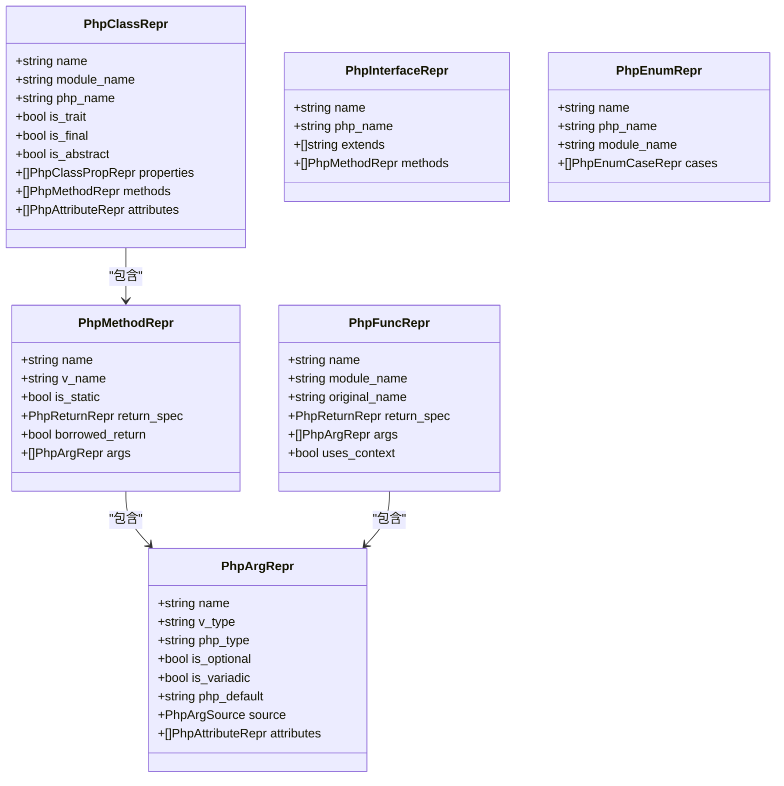

图示来源
- [class.v:3-145](file://vphp/compiler/repr/class.v#L3-L145)
- [function.v:3-26](file://vphp/compiler/repr/function.v#L3-L26)
- [interface.v:3-19](file://vphp/compiler/repr/interface.v#L3-L19)
- [enum.v:3-25](file://vphp/compiler/repr/enum.v#L3-L25)

章节来源
- [class.v:3-145](file://vphp/compiler/repr/class.v#L3-L145)
- [function.v:3-26](file://vphp/compiler/repr/function.v#L3-L26)
- [interface.v:3-19](file://vphp/compiler/repr/interface.v#L3-L19)
- [enum.v:3-25](file://vphp/compiler/repr/enum.v#L3-L25)

## 构建阶段（Builder）
构建阶段将 repr 转换为可复用的导出片段（ExportFragments），包括：
- 声明片段（declarations）
- 实现片段（implementations）
- MINIT/RINIT 行（minit_lines/rinit_lines）
- 函数表条目（function_table）

builder 层封装了 Zend/C 样板代码的拼装逻辑，如类注册、方法表、arginfo、常量注册等。顶层通过 c_emitter.v 将 repr 映射到具体 builder，再汇总到 export.v 进行输出组装。

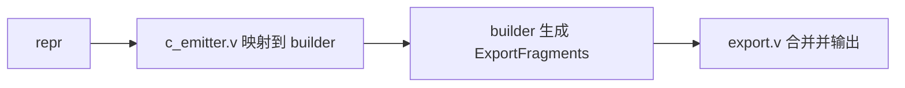

图示来源
- [export.v:8-54](file://vphp/compiler/export.v#L8-L54)
- [c_emitter.v:15-38](file://vphp/compiler/c_emitter.v#L15-L38)
- [architecture.md:120-179](file://vphp/compiler/docs/architecture.md#L120-L179)

章节来源
- [export.v:8-54](file://vphp/compiler/export.v#L8-L54)
- [c_emitter.v:15-38](file://vphp/compiler/c_emitter.v#L15-L38)
- [architecture.md:120-179](file://vphp/compiler/docs/architecture.md#L120-L179)

## 代码生成（Emitter）
代码生成分为两条路径：
- C 侧包装（c_emitter.v）：根据 repr 生成 PHP_METHOD/PHP_FUNCTION 等 C 包装器，以及接口/枚举的实现片段
- V 侧桥接（v_glue.v）：生成 bridge.v，提供 vphp_wrap_* 等函数，负责参数解码、调用真实 V 实现、结果写回

export.v 作为装配层，负责：
- 收集非类型片段（函数/全局常量）与类型片段（接口/类/枚举）
- 渲染模块级 C 块（MINIT/RINIT/GINIT 等）
- 写出 php_bridge.h/php_bridge.c 与 bridge.v

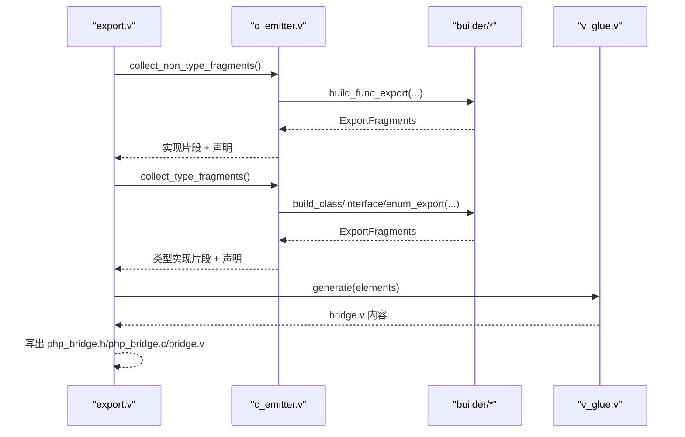

图示来源
- [export.v:59-141](file://vphp/compiler/export.v#L59-L141)
- [c_emitter.v:15-38](file://vphp/compiler/c_emitter.v#L15-L38)
- [v_glue.v:23-50](file://vphp/compiler/v_glue.v#L23-L50)

章节来源
- [export.v:59-141](file://vphp/compiler/export.v#L59-L141)
- [c_emitter.v:15-38](file://vphp/compiler/c_emitter.v#L15-L38)
- [v_glue.v:23-50](file://vphp/compiler/v_glue.v#L23-L50)

## 各类导出目标
本节聚焦 function/class/interface/trait/enum/closure 的导出机制与差异。

### 函数（Function）
- 解析：parse_function_decl 识别 @[php_function]，构建 PhpFuncRepr，支持 Context 模式、参数名映射、默认值、可选、可变参数、PHP 参数属性等
- 构建：c_emitter.v 通过 FuncBuilder 贡献声明与函数表项，同时生成 PHP_FUNCTION 包装体
- 桥接：v_glue.v 生成 vphp_wrap_*，负责参数读取、调用真实 V 函数、结果写回

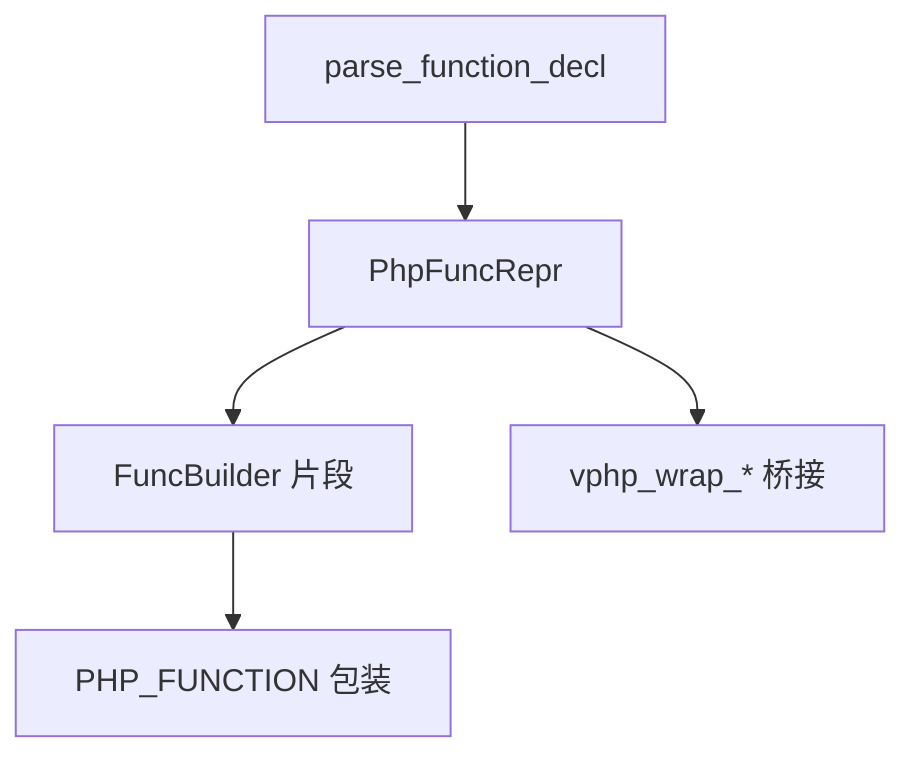

图示来源
- [function_parser.v:6-50](file://vphp/compiler/parser/function_parser.v#L6-L50)
- [c_emitter.v:15-19](file://vphp/compiler/c_emitter.v#L15-L19)
- [v_glue.v:73-79](file://vphp/compiler/v_glue.v#L73-L79)

章节来源
- [function_parser.v:6-50](file://vphp/compiler/parser/function_parser.v#L6-L50)
- [c_emitter.v:15-19](file://vphp/compiler/c_emitter.v#L15-L19)
- [v_glue.v:73-79](file://vphp/compiler/v_glue.v#L73-L79)

### 类（Class）
- 解析：parse_class_decl 识别 @[php_class]/@[php_trait]，提取属性、方法、影子常量/静态、implements/embeds、attributes 等
- 链接：linker 阶段补充 shadow 静态/常量、继承关系、接口实现等
- 构建：c_emitter.v 通过 ClassBuilder 贡献类注册、方法表、MINIT 行，并生成 PHP_METHOD 包装
- 桥接：v_glue.v 生成类相关 V 包装、处理器、属性同步、影子同步辅助

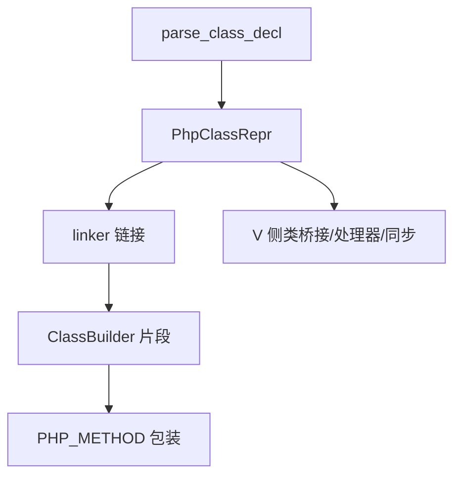

图示来源
- [class_parser.v:6-120](file://vphp/compiler/parser/class_parser.v#L6-L120)
- [c_emitter.v:33-38](file://vphp/compiler/c_emitter.v#L33-L38)
- [v_glue.v:80-92](file://vphp/compiler/v_glue.v#L80-L92)

章节来源
- [class_parser.v:6-120](file://vphp/compiler/parser/class_parser.v#L6-L120)
- [c_emitter.v:33-38](file://vphp/compiler/c_emitter.v#L33-L38)
- [v_glue.v:80-92](file://vphp/compiler/v_glue.v#L80-L92)

### 接口（Interface）
- 解析：接口定义被解析为 PhpInterfaceRepr，包含 extends 与方法列表
- 构建：c_emitter.v 以 interface_ 类型创建 ClassBuilder，贡献接口声明与注册
- 生成：c_emitter.v 生成接口方法元数据脚手架

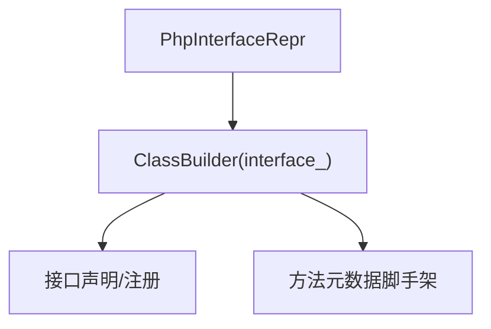

图示来源
- [interface.v:3-19](file://vphp/compiler/repr/interface.v#L3-L19)
- [c_emitter.v:21-25](file://vphp/compiler/c_emitter.v#L21-L25)

章节来源
- [interface.v:3-19](file://vphp/compiler/repr/interface.v#L3-L19)
- [c_emitter.v:21-25](file://vphp/compiler/c_emitter.v#L21-L25)

### Trait
- 解析：@[php_trait] 标记的结构体被视为 trait，解析为 PhpClassRepr.is_trait=true
- 构建：在类型片段收集时跳过 trait 的直接类注册，但参与方法/属性解析
- 用途：trait 用于组合方法/属性，不直接产生独立类注册

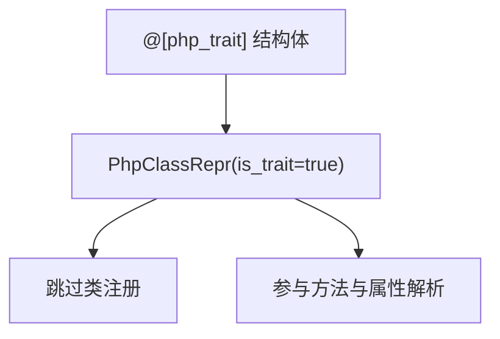

图示来源
- [class_parser.v:15-18](file://vphp/compiler/parser/class_parser.v#L15-L18)
- [export.v:45-51](file://vphp/compiler/export.v#L45-L51)

章节来源
- [class_parser.v:15-18](file://vphp/compiler/parser/class_parser.v#L15-L18)
- [export.v:45-51](file://vphp/compiler/export.v#L45-L51)

### 枚举（Enum）
- 解析：枚举定义被解析为 PhpEnumRepr，包含 case 列表
- 构建：c_emitter.v 以 enum_ 类型创建 ClassBuilder，贡献枚举声明、注册与常量
- 生成：c_emitter.v 生成枚举构造函数阻断包装等

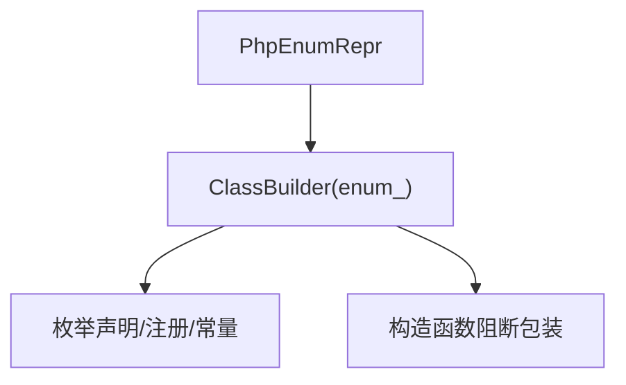

图示来源
- [enum.v:3-25](file://vphp/compiler/repr/enum.v#L3-L25)
- [c_emitter.v:27-31](file://vphp/compiler/c_emitter.v#L27-L31)

章节来源
- [enum.v:3-25](file://vphp/compiler/repr/enum.v#L3-L25)
- [c_emitter.v:27-31](file://vphp/compiler/c_emitter.v#L27-L31)

### Closure
- 解析：闭包通常通过函数式 API 或特定语法引入，其导出依赖函数/方法的桥接路径
- 构建：闭包返回会被编译器生成的具体桥接包裹，运行时仅保留底层闭包存储 API
- 桥接：v_glue.v 负责在 V 侧维护闭包生命周期与调用转发

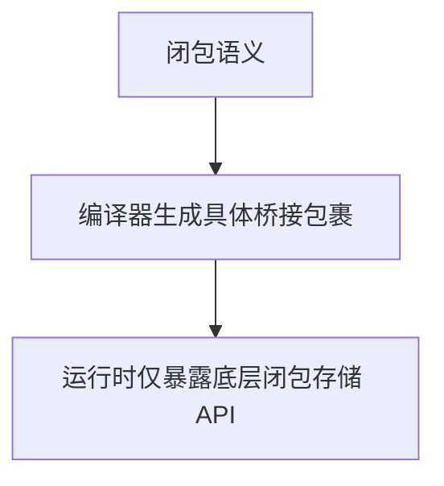

图示来源
- [v_glue.v:73-79](file://vphp/compiler/v_glue.v#L73-L79)

章节来源
- [v_glue.v:73-79](file://vphp/compiler/v_glue.v#L73-L79)

## 已知限制与待办
- export.v 仍承担较多片段分组与顺序控制逻辑，未来可进一步抽象
- c_emitter.v 模板较重，可按符号家族拆分（函数/类/枚举/接口）
- v_glue.v 混合了函数、类、任务等多领域胶水，建议按领域拆分
- 链接阶段已隔离 shadow-linking，未来新增关系校验可继续扩展 linker/

章节来源
- [architecture.md:703-721](file://vphp/compiler/docs/architecture.md#L703-L721)
- [emission_pipeline.md:398-430](file://vphp/compiler/docs/emission_pipeline.md#L398-L430)