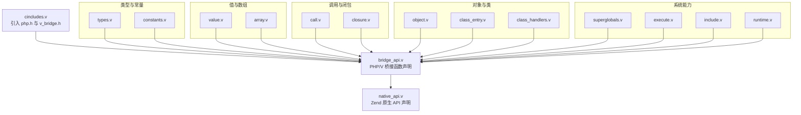
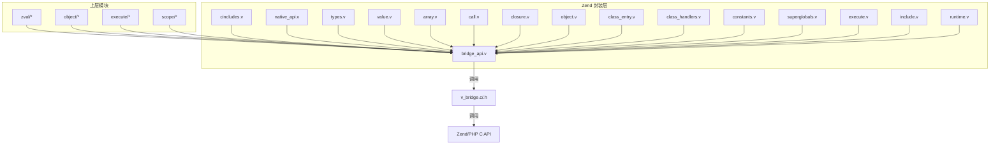
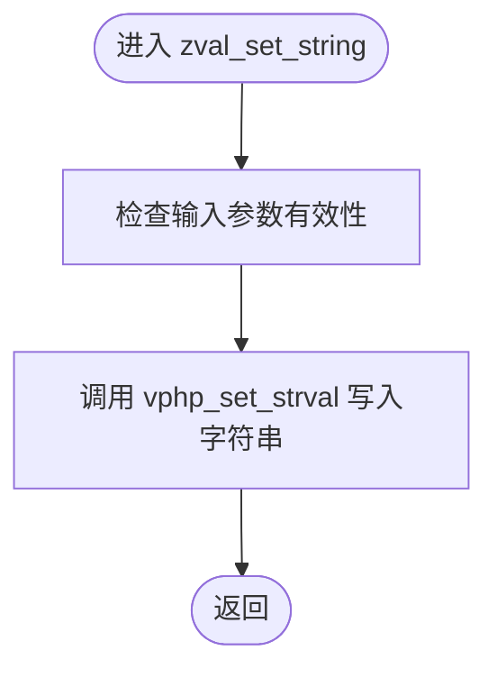
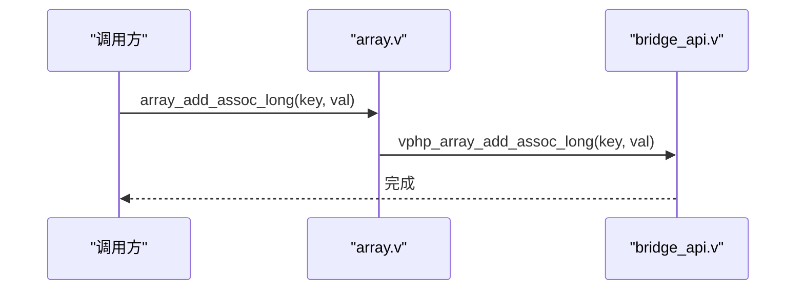
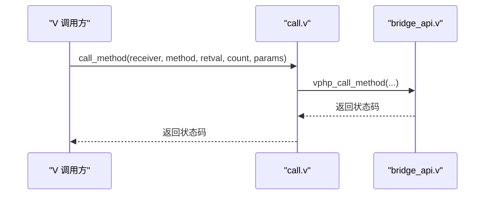
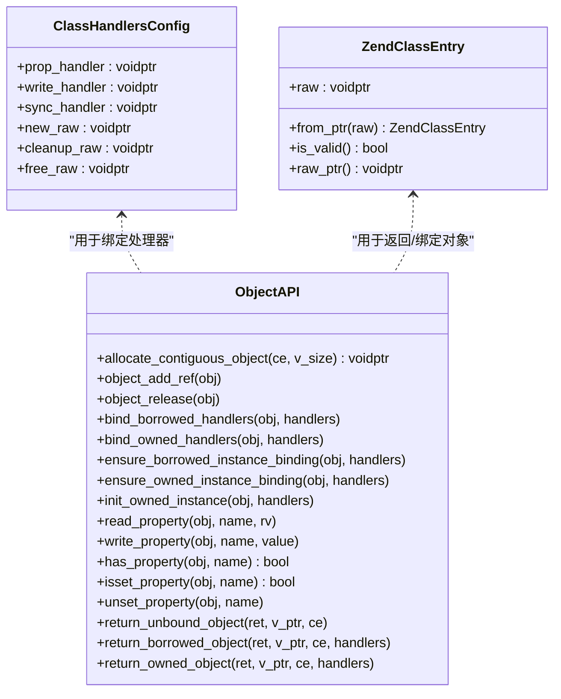
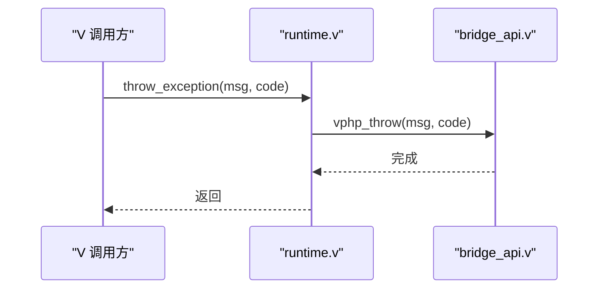
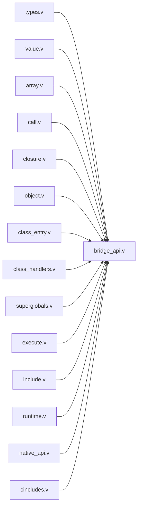

# Zend API 封装层

<cite>
**本文引用的文件**
- [zend/cincludes.v](file://vphp/zend/cincludes.v)
- [zend/bridge_api.v](file://vphp/zend/bridge_api.v)
- [zend/native_api.v](file://vphp/zend/native_api.v)
- [zend/types.v](file://vphp/zend/types.v)
- [zend/value.v](file://vphp/zend/value.v)
- [zend/array.v](file://vphp/zend/array.v)
- [zend/call.v](file://vphp/zend/call.v)
- [zend/closure.v](file://vphp/zend/closure.v)
- [zend/object.v](file://vphp/zend/object.v)
- [zend/class_entry.v](file://vphp/zend/class_entry.v)
- [zend/class_handlers.v](file://vphp/zend/class_handlers.v)
- [zend/constants.v](file://vphp/zend/constants.v)
- [zend/superglobals.v](file://vphp/zend/superglobals.v)
- [zend/execute.v](file://vphp/zend/execute.v)
- [zend/include.v](file://vphp/zend/include.v)
- [zend/runtime.v](file://vphp/zend/runtime.v)
</cite>

## 目录
1. [简介](#简介)
2. [项目结构](#项目结构)
3. [核心组件](#核心组件)
4. [架构总览](#架构总览)
5. [详细组件分析](#详细组件分析)
6. [依赖关系分析](#依赖关系分析)
7. [性能考量](#性能考量)
8. [故障排查指南](#故障排查指南)
9. [结论](#结论)

## 简介
本章节聚焦 zend/ 子目录对 Zend C API 的封装，涵盖类型、值、调用、闭包、数组、对象、类入口、常量、超全局变量、执行上下文、包含与运行时等。该层以 V 语言编写，通过 bridge_api.v 声明并调用 v_bridge.c/.h 提供的桥接函数，向上为 zval/、object/、execute/ 等高层模块提供稳定、安全的 C 互操作接口。

## 项目结构
zend/ 子目录按职责划分：
- 类型与常量：types.v、constants.v
- 值读写与生命周期：value.v
- 数组构建与访问：array.v
- 调用与静态属性/常量：call.v
- 闭包创建：closure.v
- 对象与类入口：object.v、class_entry.v、class_handlers.v
- 超全局变量：superglobals.v
- 执行上下文：execute.v
- 包含脚本：include.v
- 运行时与异常：runtime.v
- 桥接与原生 API 声明：bridge_api.v、native_api.v、cincludes.v

图示来源
- [zend/cincludes.v:1-5](file://vphp/zend/cincludes.v#L1-L5)
- [zend/bridge_api.v:1-192](file://vphp/zend/bridge_api.v#L1-L192)
- [zend/native_api.v:1-19](file://vphp/zend/native_api.v#L1-L19)
- [zend/types.v:1-100](file://vphp/zend/types.v#L1-L100)
- [zend/constants.v:1-19](file://vphp/zend/constants.v#L1-L19)
- [zend/value.v:1-287](file://vphp/zend/value.v#L1-L287)
- [zend/array.v:1-143](file://vphp/zend/array.v#L1-L143)
- [zend/call.v:1-89](file://vphp/zend/call.v#L1-L89)
- [zend/closure.v:1-20](file://vphp/zend/closure.v#L1-L20)
- [zend/object.v:1-242](file://vphp/zend/object.v#L1-L242)
- [zend/class_entry.v:1-56](file://vphp/zend/class_entry.v#L1-L56)
- [zend/class_handlers.v:1-26](file://vphp/zend/class_handlers.v#L1-L26)
- [zend/superglobals.v:1-64](file://vphp/zend/superglobals.v#L1-L64)
- [zend/execute.v:1-38](file://vphp/zend/execute.v#L1-L38)
- [zend/include.v:1-12](file://vphp/zend/include.v#L1-L12)
- [zend/runtime.v:1-139](file://vphp/zend/runtime.v#L1-L139)

章节来源
- [zend/cincludes.v:1-5](file://vphp/zend/cincludes.v#L1-L5)
- [zend/bridge_api.v:1-192](file://vphp/zend/bridge_api.v#L1-L192)
- [zend/native_api.v:1-19](file://vphp/zend/native_api.v#L1-L19)

## 核心组件
- 类型与常量
  - types.v：定义 C.zval、C.zend_string、C.zend_array、C.zend_object、C.zend_class_entry、C.zend_execute_data 等内核类型，以及统一的 vphp_class_handlers 聚合结构体。
  - constants.v：定义类型常量（如 is_null、is_long 等）与错误级别常量映射。
- 值与数组
  - value.v：围绕 &C.zval 的读写、构造、释放、引用、资源包装、foreach 遍历与运行时计数等。
  - array.v：面向数组的初始化、键值/顺序插入、计数与索引/键访问。
- 调用与闭包
  - call.v：方法调用、可调用调用、实例化、静态方法与静态属性/常量读写，并提供 with_arg_ptrs 辅助将 voidptr 数组转为 &C.zval 指针序列。
  - closure.v：创建固定参数与可变参数的闭包。
- 对象与类
  - object.v：对象分配、引用计数、绑定处理器、属性读写、类名获取、返回对象等。
  - class_entry.v：ZendClassEntry 包装与静态属性读写、接口绑定。
  - class_handlers.v：ClassHandlersConfig 与 new_class_handlers 用于构造统一处理器集合。
- 系统能力
  - superglobals.v：ENV/SERVER/GET/POST/COOKIE/FILES/REQUEST 超全局数组访问与设置。
  - execute.v：从 zend_execute_data 读取当前活动类、this 对象与参数。
  - include.v：动态包含 PHP 文件。
  - runtime.v：内存管理、异常抛出/检查/清理、输出、框架/请求生命周期钩子、自动释放池等。
  - native_api.v：直接声明部分 Zend 原生 API（如 add_property_*、ZVAL_* 宏）。
  - bridge_api.v：集中声明 v_bridge.c/.h 暴露的所有桥接函数，是 zend/ 的核心对外契约。

章节来源
- [zend/types.v:1-100](file://vphp/zend/types.v#L1-L100)
- [zend/constants.v:1-19](file://vphp/zend/constants.v#L1-L19)
- [zend/value.v:1-287](file://vphp/zend/value.v#L1-L287)
- [zend/array.v:1-143](file://vphp/zend/array.v#L1-L143)
- [zend/call.v:1-89](file://vphp/zend/call.v#L1-L89)
- [zend/closure.v:1-20](file://vphp/zend/closure.v#L1-L20)
- [zend/object.v:1-242](file://vphp/zend/object.v#L1-L242)
- [zend/class_entry.v:1-56](file://vphp/zend/class_entry.v#L1-L56)
- [zend/class_handlers.v:1-26](file://vphp/zend/class_handlers.v#L1-L26)
- [zend/superglobals.v:1-64](file://vphp/zend/superglobals.v#L1-L64)
- [zend/execute.v:1-38](file://vphp/zend/execute.v#L1-L38)
- [zend/include.v:1-12](file://vphp/zend/include.v#L1-L12)
- [zend/runtime.v:1-139](file://vphp/zend/runtime.v#L1-L139)
- [zend/native_api.v:1-19](file://vphp/zend/native_api.v#L1-L19)
- [zend/bridge_api.v:1-192](file://vphp/zend/bridge_api.v#L1-L192)

## 架构总览
zend/ 作为内部模块，遵循“只向下依赖”的原则：上层（zval/、object/、execute/、scope/）可导入 zend/，而 zend/ 不反向导入上层。其核心路径为：V 代码 → zend/* → bridge_api.v → v_bridge.c/.h → Zend/PHP C API。

图示来源
- [zend/cincludes.v:1-5](file://vphp/zend/cincludes.v#L1-L5)
- [zend/bridge_api.v:1-192](file://vphp/zend/bridge_api.v#L1-L192)
- [zend/native_api.v:1-19](file://vphp/zend/native_api.v#L1-L19)
- [zend/types.v:1-100](file://vphp/zend/types.v#L1-L100)
- [zend/value.v:1-287](file://vphp/zend/value.v#L1-L287)
- [zend/array.v:1-143](file://vphp/zend/array.v#L1-L143)
- [zend/call.v:1-89](file://vphp/zend/call.v#L1-L89)
- [zend/closure.v:1-20](file://vphp/zend/closure.v#L1-L20)
- [zend/object.v:1-242](file://vphp/zend/object.v#L1-L242)
- [zend/class_entry.v:1-56](file://vphp/zend/class_entry.v#L1-L56)
- [zend/class_handlers.v:1-26](file://vphp/zend/class_handlers.v#L1-L26)
- [zend/constants.v:1-19](file://vphp/zend/constants.v#L1-L19)
- [zend/superglobals.v:1-64](file://vphp/zend/superglobals.v#L1-L64)
- [zend/execute.v:1-38](file://vphp/zend/execute.v#L1-L38)
- [zend/include.v:1-12](file://vphp/zend/include.v#L1-L12)
- [zend/runtime.v:1-139](file://vphp/zend/runtime.v#L1-L139)

## 详细组件分析

### 类型与常量（types.v、constants.v）
- 定义 C.zval、C.zend_string、C.zend_array、C.zend_object、C.zend_class_entry、C.zend_execute_data 等内核结构体，便于在 V 中安全地以 C 类型进行互操作。
- 提供统一的 vphp_class_handlers 聚合结构体，承载属性读写、同步、生命周期回调等处理器指针，配合上层对象绑定使用。
- constants.v 提供类型常量与错误级别常量，供上层判断与报告错误时使用。

章节来源
- [zend/types.v:1-100](file://vphp/zend/types.v#L1-L100)
- [zend/constants.v:1-19](file://vphp/zend/constants.v#L1-L19)

### 值模型（value.v）
- 提供 zval 的类型检测、标量读写（整型、浮点、布尔、字符串）、null 设置、字符串构造、复制、释放、持久化、引用处理、资源包装与提取、foreach 遍历、运行时计数器等。
- 所有 voidptr 重载均通过 unsafe 转换为 &C.zval 后委托给 &C.zval 版本，确保调用一致性。

图示来源
- [zend/value.v:127-135](file://vphp/zend/value.v#L127-L135)
- [zend/bridge_api.v:58-63](file://vphp/zend/bridge_api.v#L58-L63)

章节来源
- [zend/value.v:1-287](file://vphp/zend/value.v#L1-L287)
- [zend/bridge_api.v:40-79](file://vphp/zend/bridge_api.v#L40-L79)

### 数组（array.v）
- 提供数组初始化、关联键添加（字符串/长整型/双精度/布尔/zval）、顺序追加、计数、索引与键访问等。
- 所有 voidptr 重载同样委托给 &C.zval 版本，保证行为一致。

图示来源
- [zend/array.v:23-31](file://vphp/zend/array.v#L23-L31)
- [zend/bridge_api.v:93-96](file://vphp/zend/bridge_api.v#L93-L96)

章节来源
- [zend/array.v:1-143](file://vphp/zend/array.v#L1-L143)
- [zend/bridge_api.v:82-108](file://vphp/zend/bridge_api.v#L82-L108)

### 调用（call.v）
- 支持对象方法调用、可调用调用、实例化、静态方法调用、静态属性/常量读写。
- with_arg_ptrs 将 voidptr 数组转换为 &C.zval 指针序列，简化 C 桥接的参数传递。

图示来源
- [zend/call.v:3-12](file://vphp/zend/call.v#L3-L12)
- [zend/bridge_api.v:158-162](file://vphp/zend/bridge_api.v#L158-L162)

章节来源
- [zend/call.v:1-89](file://vphp/zend/call.v#L1-L89)
- [zend/bridge_api.v:158-172](file://vphp/zend/bridge_api.v#L158-L172)

### 闭包（closure.v）
- 提供固定参数与可变参数闭包的创建接口，底层通过 vphp_create_closure_with_arity / vphp_create_variadic_closure 实现。

章节来源
- [zend/closure.v:1-20](file://vphp/zend/closure.v#L1-L20)
- [zend/bridge_api.v:170-172](file://vphp/zend/bridge_api.v#L170-L172)

### 对象与类（object.v、class_entry.v、class_handlers.v）
- object.v：对象分配、引用计数、处理器绑定、属性读写、类名获取、现有对象包装、返回对象等。
- class_entry.v：ZendClassEntry 包装、静态属性读写、类与接口绑定。
- class_handlers.v：ClassHandlersConfig 与 new_class_handlers 用于构造处理器集合。

图示来源
- [zend/class_handlers.v:1-26](file://vphp/zend/class_handlers.v#L1-L26)
- [zend/class_entry.v:1-56](file://vphp/zend/class_entry.v#L1-L56)
- [zend/object.v:1-242](file://vphp/zend/object.v#L1-L242)
- [zend/bridge_api.v:110-156](file://vphp/zend/bridge_api.v#L110-L156)

章节来源
- [zend/object.v:1-242](file://vphp/zend/object.v#L1-L242)
- [zend/class_entry.v:1-56](file://vphp/zend/class_entry.v#L1-L56)
- [zend/class_handlers.v:1-26](file://vphp/zend/class_handlers.v#L1-L26)
- [zend/bridge_api.v:110-156](file://vphp/zend/bridge_api.v#L110-L156)

### 超全局变量（superglobals.v）
- 提供 ENV/SERVER/GET/POST/COOKIE/FILES/REQUEST 的原始 zval 访问与设置接口，便于上层快速读写请求环境数据。

章节来源
- [zend/superglobals.v:1-64](file://vphp/zend/superglobals.v#L1-L64)
- [zend/bridge_api.v:98-106](file://vphp/zend/bridge_api.v#L98-L106)

### 执行上下文（execute.v）
- 从 zend_execute_data 获取当前活动类、this 对象与参数数量及具体参数，支撑扩展函数与方法实现。

章节来源
- [zend/execute.v:1-38](file://vphp/zend/execute.v#L1-L38)
- [zend/bridge_api.v:19-28](file://vphp/zend/bridge_api.v#L19-L28)

### 包含脚本（include.v）
- 提供 include_file_raw/once 控制的文件包含接口，返回结果 zval。

章节来源
- [zend/include.v:1-12](file://vphp/zend/include.v#L1-L12)
- [zend/bridge_api.v:164](file://vphp/zend/bridge_api.v#L164)

### 运行时与异常（runtime.v）
- 内存管理：emalloc/efree/v_runtime_free。
- 异常：抛出（字符串/类名/对象）、检查、获取消息、清理。
- 输出：向 PHP 输出流写入。
- 生命周期：框架初始化、安装/卸载运行时绑定钩子、请求启动/关闭、自动释放池标记/加入/忘记/排空。
- 计数器：运行时统计信息查询。

图示来源
- [zend/runtime.v:19-27](file://vphp/zend/runtime.v#L19-L27)
- [zend/bridge_api.v:33-35](file://vphp/zend/bridge_api.v#L33-L35)

章节来源
- [zend/runtime.v:1-139](file://vphp/zend/runtime.v#L1-L139)
- [zend/bridge_api.v:30-79](file://vphp/zend/bridge_api.v#L30-L79)

### 原生 API 与桥接（native_api.v、bridge_api.v、cincludes.v）
- native_api.v：直接声明部分 Zend 原生 API（如 add_property_*、ZVAL_* 宏），供 zend/* 直接使用。
- bridge_api.v：集中声明 v_bridge.c/.h 暴露的桥接函数，覆盖执行上下文、框架与异常、zval 类型检测与读写、数组、对象、闭包与调用、资源系统、静态属性、类注册等。
- cincludes.v：引入 php.h 与 v_bridge.h，确保类型与函数可用。

章节来源
- [zend/native_api.v:1-19](file://vphp/zend/native_api.v#L1-L19)
- [zend/bridge_api.v:1-192](file://vphp/zend/bridge_api.v#L1-L192)
- [zend/cincludes.v:1-5](file://vphp/zend/cincludes.v#L1-L5)

## 依赖关系分析
- 单向依赖：zend/ 仅依赖 C 头文件与 v_bridge.c/.h，不反向依赖上层模块，符合“内部模块”约束。
- 关键耦合点：
  - bridge_api.v 是所有 zend/* 模块的统一出口，集中声明外部函数，降低分散声明带来的维护成本。
  - types.v 定义的 C.* 结构与 bridge_api.v 中的 C.* 函数形成强耦合，任何内核结构变化需同步更新。
  - object.v 与 class_entry.v 共同协作完成对象生命周期与类入口操作，需保持处理器配置的一致性。

图示来源
- [zend/types.v:1-100](file://vphp/zend/types.v#L1-L100)
- [zend/bridge_api.v:1-192](file://vphp/zend/bridge_api.v#L1-L192)
- [zend/value.v:1-287](file://vphp/zend/value.v#L1-L287)
- [zend/array.v:1-143](file://vphp/zend/array.v#L1-L143)
- [zend/call.v:1-89](file://vphp/zend/call.v#L1-L89)
- [zend/closure.v:1-20](file://vphp/zend/closure.v#L1-L20)
- [zend/object.v:1-242](file://vphp/zend/object.v#L1-L242)
- [zend/class_entry.v:1-56](file://vphp/zend/class_entry.v#L1-L56)
- [zend/class_handlers.v:1-26](file://vphp/zend/class_handlers.v#L1-L26)
- [zend/superglobals.v:1-64](file://vphp/zend/superglobals.v#L1-L64)
- [zend/execute.v:1-38](file://vphp/zend/execute.v#L1-L38)
- [zend/include.v:1-12](file://vphp/zend/include.v#L1-L12)
- [zend/runtime.v:1-139](file://vphp/zend/runtime.v#L1-L139)
- [zend/native_api.v:1-19](file://vphp/zend/native_api.v#L1-L19)
- [zend/cincludes.v:1-5](file://vphp/zend/cincludes.v#L1-L5)

## 性能考量
- 避免不必要的 zval 复制：优先使用 copy_zval 与引用语义，减少重复分配。
- 批量数组构建：尽量使用 array_init 与批量追加接口，减少 HashTable 重分配次数。
- 字符串处理：优先使用长度已知的字符串写入接口，避免二次拷贝。
- 异常路径优化：在热点路径中尽量避免频繁抛出异常，必要时缓存或复用异常对象。
- 自动释放池：合理使用 autorelease_mark/add/forget/drain，减少手动释放开销。

[本节为通用指导，无需源码引用]

## 故障排查指南
- 常见错误定位
  - 类型不匹配：使用 zval_type 与常量常量表确认实际类型，再选择对应读取接口。
  - 空指针/越界：检查 voidptr 重载是否传入有效指针；注意 index 边界。
  - 异常未捕获：调用 has_exception 与 exception_message_opt 获取异常信息并清理。
  - 资源泄漏：确保 release_zval/release_persistent_zval 成对调用，或使用自动释放池。
- 调试建议
  - 使用 runtime_counters 查看自动释放、拥有者与对象注册表长度，评估内存压力。
  - 在关键路径前后记录 mark 并使用 drain 清理，验证资源回收。

章节来源
- [zend/constants.v:1-19](file://vphp/zend/constants.v#L1-L19)
- [zend/value.v:3-10](file://vphp/zend/value.v#L3-L10)
- [zend/runtime.v:38-65](file://vphp/zend/runtime.v#L38-L65)
- [zend/runtime.v:114-139](file://vphp/zend/runtime.v#L114-L139)

## 结论
zend/ 子目录提供了对 Zend C API 的系统性封装，通过 bridge_api.v 集中暴露稳定的桥接函数，向上层屏蔽 C 互操作的复杂性。其分层清晰、职责明确，既保证了安全性与可维护性，也为上层的高层抽象（zval/、object/、execute/）奠定了坚实基础。在实际使用中，应严格遵循所有权与生命周期约定，合理使用自动释放与资源管理工具，以获得最佳性能与稳定性。