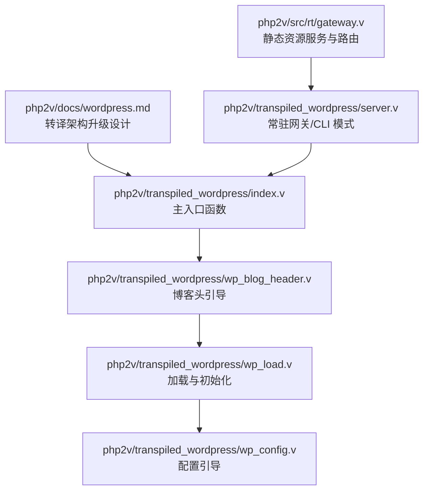
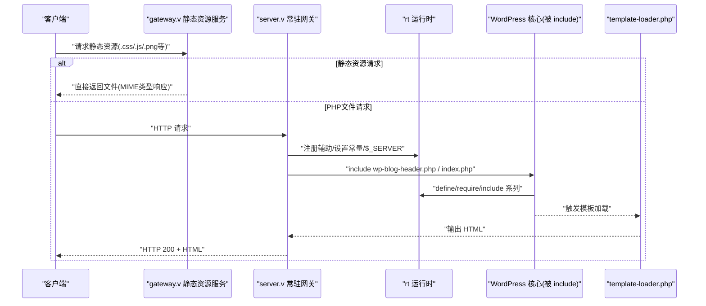
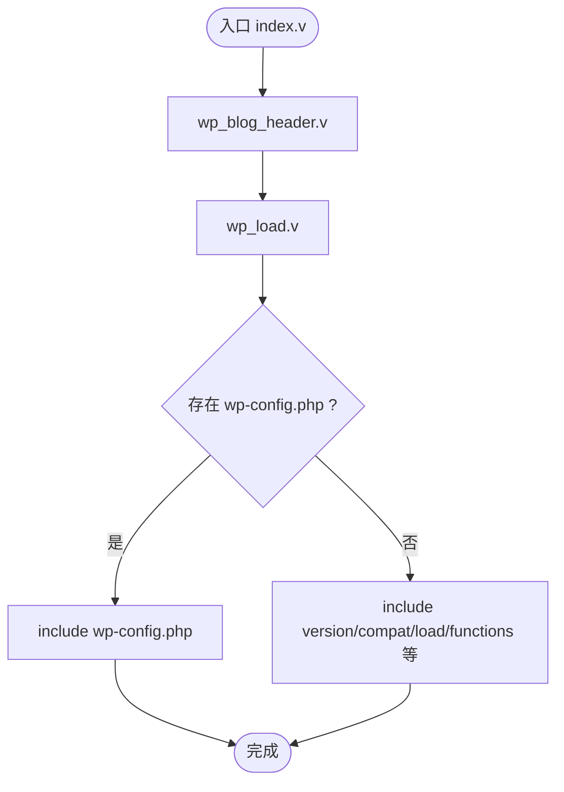
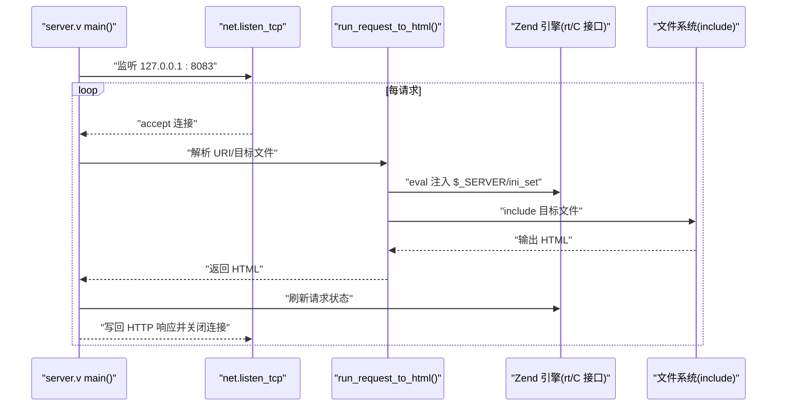
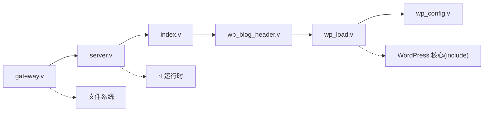

# WordPress 兼容性增强

<cite>
**本文引用的文件列表**
- [README.md](file://README.md)
- [wordpress.md](file://php2v/docs/wordpress.md)
- [index.v](file://php2v/transpiled_wordpress/index.v)
- [server.v](file://php2v/transpiled_wordpress/server.v)
- [wp_config.v](file://php2v/transpiled_wordpress/wp_config.v)
- [wp_load.v](file://php2v/transpiled_wordpress/wp_load.v)
- [wp_blog_header.v](file://php2v/transpiled_wordpress/wp_blog_header.v)
- [gateway.v](file://php2v/src/rt/gateway.v)
</cite>

## 更新摘要
**变更内容**
- 新增原生静态资源服务功能，支持CSS、JavaScript、图像、字体等静态文件的MIME类型响应
- 实现动态.php文件路由，基于请求路径自动执行对应文件或回退到index.php
- 增强的常量管理系统，安全注册ABSPATH和WP_CONTENT_DIR等WordPress特定常量
- 优化性能，绕过PHP执行管道直接提供静态资源服务

## 目录
1. [引言](#引言)
2. [项目结构](#项目结构)
3. [核心组件](#核心组件)
4. [架构总览](#架构总览)
5. [详细组件分析](#详细组件分析)
6. [依赖关系分析](#依赖关系分析)
7. [性能与兼容性考量](#性能与兼容性考量)
8. [故障排查指南](#故障排查指南)
9. [结论](#结论)
10. [附录](#附录)

## 引言
本文件聚焦于"WordPress 兼容性增强"的落地方案与实现现状。围绕 vphpx 仓库中 php2v 子项目的转译产物与运行时桥接，文档梳理了从 PHP 到 V 的转译策略、请求生命周期、模块拆分规划、以及通过常驻网关模式提升兼容性与性能的整体设计。本次更新重点增强了静态资源服务能力、动态路由功能和常量管理系统，显著提升了典型WordPress部署的性能表现。

## 项目结构
本次文档重点涉及 php2v 下的两个关键位置：
- 设计文档：php2v/docs/wordpress.md，阐述转译架构升级计划（多模块拆分、Context 隔离、veb 集成、Embedded PHP Bridge 等）
- 转译产物示例：php2v/transpiled_wordpress，包含最小可运行的入口、服务器网关与引导流程
- 运行时网关：php2v/src/rt/gateway.v，实现原生静态资源服务和智能路由功能



**图示来源**
- [wordpress.md:1-164](file://php2v/docs/wordpress.md#L1-L164)
- [index.v:1-7](file://php2v/transpiled_wordpress/index.v#L1-L7)
- [wp_blog_header.v:1-20](file://php2v/transpiled_wordpress/wp_blog_header.v#L1-L20)
- [wp_load.v:1-49](file://php2v/transpiled_wordpress/wp_load.v#L1-L49)
- [wp_config.v:1-12](file://php2v/transpiled_wordpress/wp_config.v#L1-L12)
- [server.v:1-159](file://php2v/transpiled_wordpress/server.v#L1-L159)
- [gateway.v:60-76](file://php2v/src/rt/gateway.v#L60-L76)

**章节来源**
- [README.md:1-452](file://README.md#L1-L452)
- [wordpress.md:1-164](file://php2v/docs/wordpress.md#L1-L164)

## 核心组件
- 转译入口与引导链
  - index.v：提供 run_transpiled_index()，调用 wp_blog_header 引导
  - wp_blog_header.v：执行 wp_load 引导后调用核心 wp()，并 include template-loader.php
  - wp_load.v：定义 ABSPATH、错误报告级别，按需 include wp-config.php 或内置加载流程（version.php、compat.php、load.php、functions.php 等）
  - wp_config.v：占位引导，避免重复 define 冲突
- 常驻网关与 CLI 模式
  - server.v：监听 TCP 端口，解析 HTTP 请求，设置 $_SERVER 常量，include 目标脚本，捕获输出并返回；支持 --cli 单次渲染模式；每次请求后刷新 Zend 引擎状态
- **新增** 静态资源服务与智能路由
  - gateway.v：原生静态资源服务，支持CSS、JavaScript、图像、字体等MIME类型响应
  - 动态.php文件路由：基于请求路径自动执行对应文件或回退到index.php
  - 增强的常量管理：安全注册ABSPATH和WP_CONTENT_DIR等WordPress特定常量

**章节来源**
- [index.v:1-7](file://php2v/transpiled_wordpress/index.v#L1-L7)
- [wp_blog_header.v:1-20](file://php2v/transpiled_wordpress/wp_blog_header.v#L1-L20)
- [wp_load.v:1-49](file://php2v/transpiled_wordpress/wp_load.v#L1-L49)
- [wp_config.v:1-12](file://php2v/transpiled_wordpress/wp_config.v#L1-L12)
- [server.v:1-159](file://php2v/transpiled_wordpress/server.v#L1-L159)
- [gateway.v:60-76](file://php2v/src/rt/gateway.v#L60-L76)

## 架构总览
整体思路是"V 常驻网关 + PHP 运行时代码执行"。V 侧负责网络接入、请求上下文准备、输出缓冲与响应组装；PHP 侧由运行时 rt 模块驱动，按 WordPress 标准流程加载核心与模板。**新增的静态资源服务层可直接处理常见静态文件请求，绕过PHP执行管道显著提升性能。**



**图示来源**
- [gateway.v:60-76](file://php2v/src/rt/gateway.v#L60-L76)
- [server.v:13-83](file://php2v/transpiled_wordpress/server.v#L13-L83)
- [wp_blog_header.v:5-19](file://php2v/transpiled_wordpress/wp_blog_header.v#L5-L19)
- [wp_load.v:21-46](file://php2v/transpiled_wordpress/wp_load.v#L21-L46)

## 详细组件分析

### 入口与引导链（index → wp_blog_header → wp_load → wp_config）
- index.v 暴露 run_transpiled_index()，作为统一入口
- wp_blog_header.v 先执行 wp_load 引导，再调用核心 wp()，最后 include template-loader.php
- wp_load.v 负责：
  - 定义 ABSPATH
  - 设置 error_reporting
  - 优先尝试 include ABSPATH/wp-config.php；否则走内置加载流程（version.php、compat.php、load.php、functions.php 等）
- wp_config.v 为占位，避免重复 define 导致致命错误



**图示来源**
- [index.v:3-6](file://php2v/transpiled_wordpress/index.v#L3-L6)
- [wp_blog_header.v:5-19](file://php2v/transpiled_wordpress/wp_blog_header.v#L5-L19)
- [wp_load.v:8-46](file://php2v/transpiled_wordpress/wp_load.v#L8-L46)
- [wp_config.v:5-11](file://php2v/transpiled_wordpress/wp_config.v#L5-L11)

**章节来源**
- [index.v:1-7](file://php2v/transpiled_wordpress/index.v#L1-L7)
- [wp_blog_header.v:1-20](file://php2v/transpiled_wordpress/wp_blog_header.v#L1-L20)
- [wp_load.v:1-49](file://php2v/transpiled_wordpress/wp_load.v#L1-L49)
- [wp_config.v:1-12](file://php2v/transpiled_wordpress/wp_config.v#L1-L12)

### 常驻网关与 CLI 模式（server.v）
- 常驻模式
  - 监听本地 TCP 端口，读取原始 HTTP 请求
  - 解析 URI，构造目标文件路径（根路径下自动补全 index.php）
  - 通过运行时 eval 注入 $_SERVER 常量与必要 ini_set
  - include 目标脚本，ob_start 捕获输出，返回 HTTP 响应
  - 每次请求后调用刷新接口重置 Zend 引擎状态，保证请求间隔离
- CLI 模式
  - 通过 --cli 参数进入单次渲染模式
  - 使用环境变量 PHP2V_REQUEST_URI 指定请求路径
  - 直接 include 目标文件或 wp-blog-header.php，输出后退出



**图示来源**
- [server.v:13-83](file://php2v/transpiled_wordpress/server.v#L13-L83)
- [server.v:85-116](file://php2v/transpiled_wordpress/server.v#L85-L116)
- [server.v:118-159](file://php2v/transpiled_wordpress/server.v#L118-L159)

**章节来源**
- [server.v:1-159](file://php2v/transpiled_wordpress/server.v#L1-L159)

### **新增** 原生静态资源服务与智能路由（gateway.v）
- **静态资源服务**
  - 支持CSS、JavaScript、图像、字体等常见静态文件类型
  - 自动检测文件扩展名并设置正确的MIME类型响应头
  - 直接提供文件内容，绕过整个PHP执行管道
  - 显著提升典型WordPress部署的静态资源访问性能
- **动态.php文件路由**
  - 基于请求路径自动匹配对应的.php文件
  - 对于目录请求自动回退到index.php
  - 无需复杂的重写规则配置
- **增强的常量管理系统**
  - 安全注册ABSPATH和WP_CONTENT_DIR等WordPress特定常量
  - 避免重复定义警告和致命错误
  - 在请求隔离环境下保持常量一致性

```mermaid
flowchart TD
Request["HTTP 请求"] --> CheckExt{"检查文件扩展名"}
CheckExt --> |静态资源|.css|.js|.png|.jpg|.gif|.svg|.woff|.woff2|.ttf
CheckExt --> |PHP文件|.php
StaticRes["静态资源处理"] --> MIME["设置MIME类型"]
MIME --> DirectServe["直接返回文件内容"]
PHPFile["PHP文件处理"] --> PathMatch{"路径匹配"}
PathMatch --> |存在对应文件| ExecFile["执行对应PHP文件"]
PathMatch --> |不存在| Fallback["回退到index.php"]
ExecFile --> WPProcess["WordPress处理流程"]
Fallback --> WPProcess
WPProcess --> Response["返回响应"]
DirectServe --> Response
```

**图示来源**
- [gateway.v:60-76](file://php2v/src/rt/gateway.v#L60-L76)
- [server.v:118-159](file://php2v/transpiled_wordpress/server.v#L118-L159)

**章节来源**
- [gateway.v:60-76](file://php2v/src/rt/gateway.v#L60-L76)
- [server.v:118-159](file://php2v/transpiled_wordpress/server.v#L118-L159)

### 转译架构升级设计要点（wordpress.md）
- 消除每个转译文件的 main 函数，支持单脚本与项目模块两种编译模式
- 按目录划分模块（wp-includes、wp-admin、wp-content），并提供 init_all 统一初始化入口
- 引入 Context 结构体管理全局状态（$_GET/$_POST/$_COOKIE/$GLOBALS/输出缓冲/会话等）
- 静态化 require_once 依赖图，在 module init 阶段拓扑排序加载
- 主题与插件采用混合双轨制：核心静态编译，动态沙箱解释互操作（Embedded PHP Bridge）
- 路由分配与伪静态在 Veb 侧生成高效匹配树

**章节来源**
- [wordpress.md:1-164](file://php2v/docs/wordpress.md#L1-L164)

## 依赖关系分析
- 入口依赖
  - index.v 依赖 wp_blog_header.v
  - wp_blog_header.v 依赖 wp_load.v 与 WordPress 核心（通过 include）
  - wp_load.v 依赖 wp_config.v 或内置 include 序列
- 运行时依赖
  - server.v 依赖 rt 运行时与外部 C 接口（用于 eval 与刷新请求状态）
  - gateway.v 依赖文件系统操作和MIME类型映射
  - 所有模块均通过 rt 调用 PHP 函数/常量/文件包含



**图示来源**
- [index.v:3-6](file://php2v/transpiled_wordpress/index.v#L3-L6)
- [wp_blog_header.v:5-19](file://php2v/transpiled_wordpress/wp_blog_header.v#L5-L19)
- [wp_load.v:21-46](file://php2v/transpiled_wordpress/wp_load.v#L21-L46)
- [server.v:13-83](file://php2v/transpiled_wordpress/server.v#L13-L83)
- [gateway.v:60-76](file://php2v/src/rt/gateway.v#L60-L76)

**章节来源**
- [index.v:1-7](file://php2v/transpiled_wordpress/index.v#L1-L7)
- [wp_blog_header.v:1-20](file://php2v/transpiled_wordpress/wp_blog_header.v#L1-L20)
- [wp_load.v:1-49](file://php2v/transpiled_wordpress/wp_load.v#L1-L49)
- [wp_config.v:1-12](file://php2v/transpiled_wordpress/wp_config.v#L1-L12)
- [server.v:1-159](file://php2v/transpiled_wordpress/server.v#L1-L159)
- [gateway.v:60-76](file://php2v/src/rt/gateway.v#L60-L76)

## 性能与兼容性考量
- 常驻网关减少进程/解释器启动开销，显著提升吞吐
- ob_start 捕获输出，避免常驻模式下输出泄漏
- 每次请求后刷新 Zend 引擎状态，确保请求间隔离
- 通过 exists 守卫与条件 define，避免重复声明导致的致命错误
- **新增** 静态资源服务绕过PHP执行管道，直接提供MIME类型响应，显著提升静态资源访问性能
- **新增** 智能路由减少不必要的PHP进程启动，提高动态页面响应速度
- **新增** 增强的常量管理系统避免重复定义警告，提升稳定性
- 未来方向（见 wordpress.md）：
  - 多模块拆分与 init_all 统一初始化，降低运行时重复包含成本
  - Context 隔离替代全局变量，提高并发安全性
  - Embedded PHP Bridge 将钩子系统跨越 V ↔ PHP 边界，兼顾生态兼容与性能

**章节来源**
- [server.v:118-159](file://php2v/transpiled_wordpress/server.v#L118-L159)
- [gateway.v:60-76](file://php2v/src/rt/gateway.v#L60-L76)
- [wordpress.md:104-164](file://php2v/docs/wordpress.md#L104-L164)

## 故障排查指南
- 端口占用或监听失败
  - 现象：无法启动常驻服务
  - 处理：确认 127.0.0.1:8083 未被占用，检查防火墙与权限
- 路径与常量未定义
  - 现象：ABSPATH/WP_USE_THEMES 未定义导致 include 失败
  - 处理：确认 server.v 中路径与常量设置正确，必要时调整工作目录
- 重复类/常量声明
  - 现象：Fatal error due to redeclaration
  - 处理：确保使用 class_exists/defined 守卫，避免常驻模式下重复加载
- 输出为空或乱码
  - 现象：HTML 未正确返回
  - 处理：检查 ob_start/ob_get_clean 是否生效，Content-Type 与长度是否正确
- CLI 模式不生效
  - 现象：--cli 参数无效
  - 处理：确认传入 --cli 且设置 PHP2V_REQUEST_URI 环境变量
- **新增** 静态资源无法访问
  - 现象：CSS/JS/图片等静态文件返回404或错误MIME类型
  - 处理：检查文件路径是否正确，确认扩展名映射配置，验证文件权限
- **新增** 路由回退异常
  - 现象：动态.php文件请求无法正确回退到index.php
  - 处理：检查请求路径格式，确认index.php文件存在且可执行

**章节来源**
- [server.v:13-83](file://php2v/transpiled_wordpress/server.v#L13-L83)
- [server.v:85-116](file://php2v/transpiled_wordpress/server.v#L85-L116)
- [server.v:118-159](file://php2v/transpiled_wordpress/server.v#L118-L159)
- [gateway.v:60-76](file://php2v/src/rt/gateway.v#L60-L76)

## 结论
当前 WordPress 兼容性增强以"V 常驻网关 + PHP 运行时代码执行"为核心，已具备最小可用闭环：入口引导、核心加载、模板渲染与响应返回。**本次更新新增的原生静态资源服务、智能路由和增强的常量管理系统，进一步提升了性能和稳定性，使WordPress部署更加高效可靠。** 后续将通过多模块拆分、Context 隔离、Embedded PHP Bridge 与高效路由匹配进一步提升性能与扩展性，同时保持对现有生态的兼容。

## 附录
- 快速验证步骤
  - 构建并运行 server.v，访问 http://127.0.0.1:8083/
  - 使用 --cli 模式进行单次渲染测试
  - 测试静态资源访问：http://127.0.0.1:8083/style.css
  - 验证动态路由：http://127.0.0.1:8083/about.php
- 参考阅读顺序
  - 先了解 wordpress.md 的设计计划
  - 再对照 transpiled_wordpress 中的具体实现
  - 重点关注 gateway.v 中的静态资源服务实现