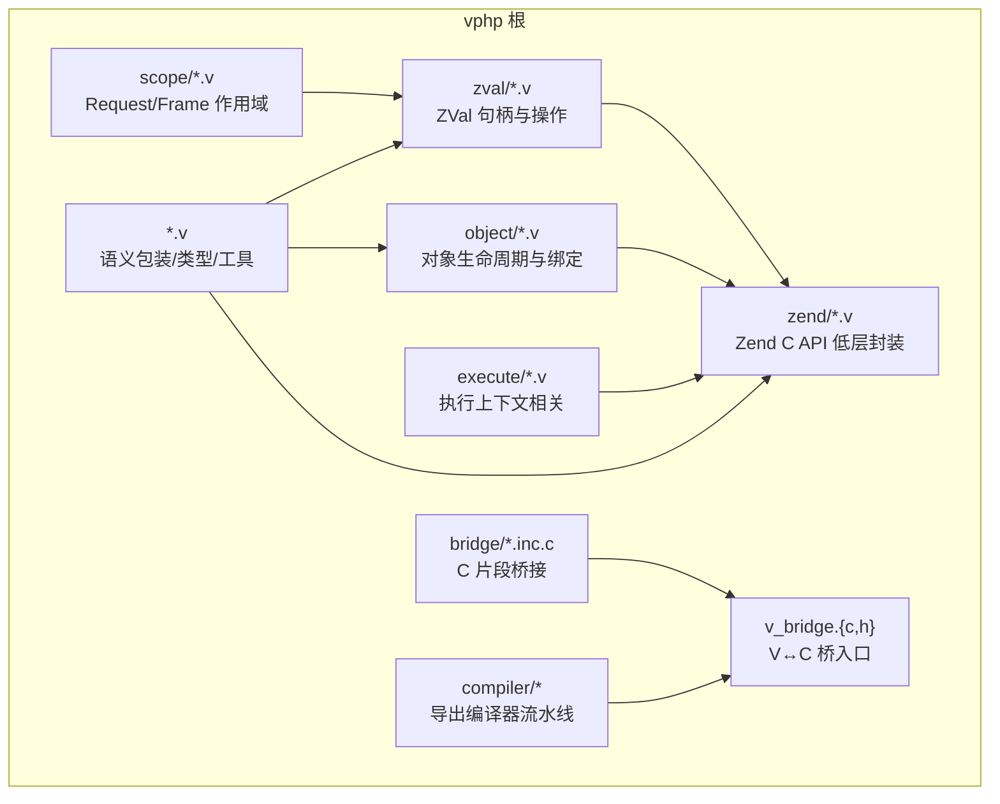
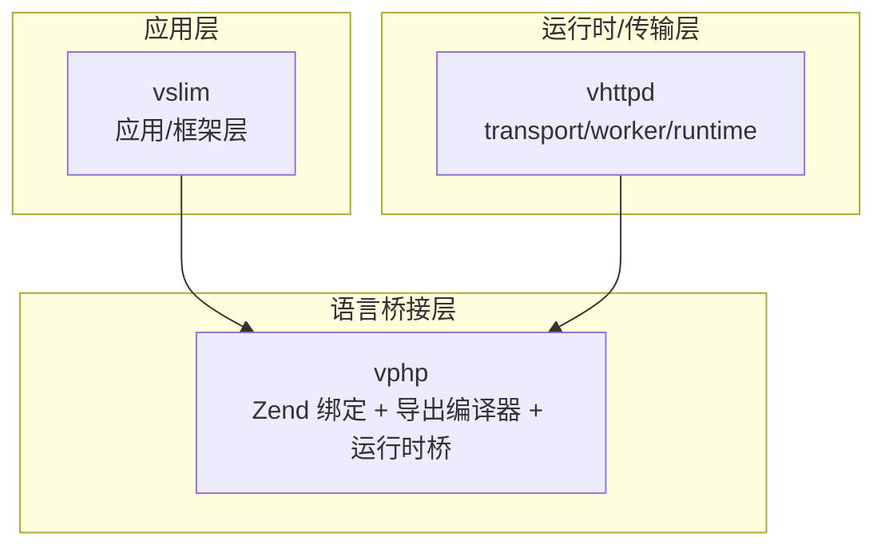
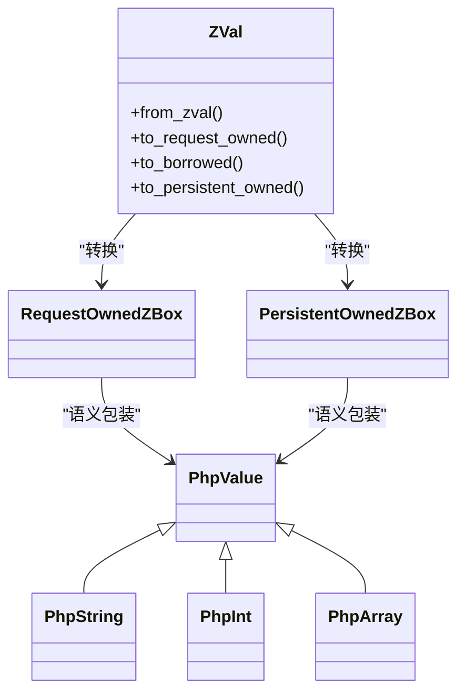
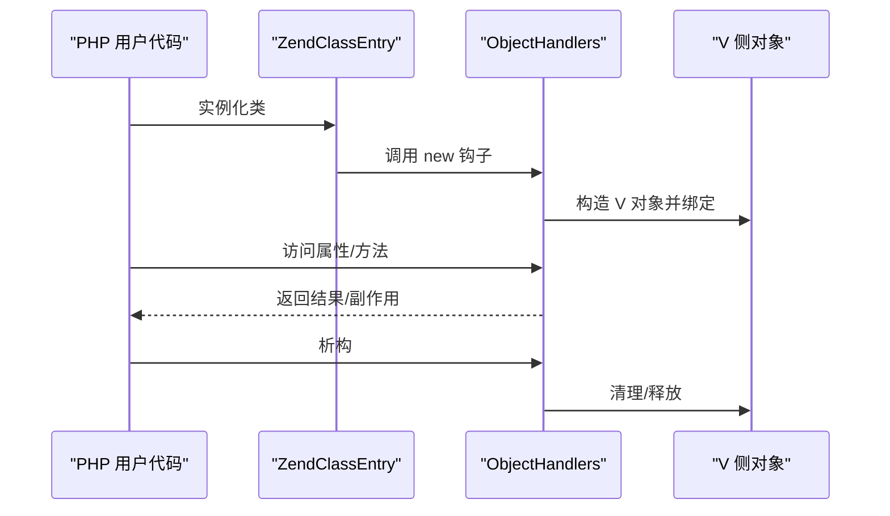
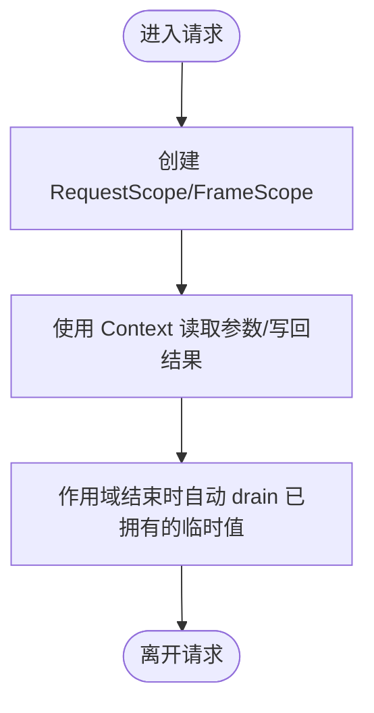
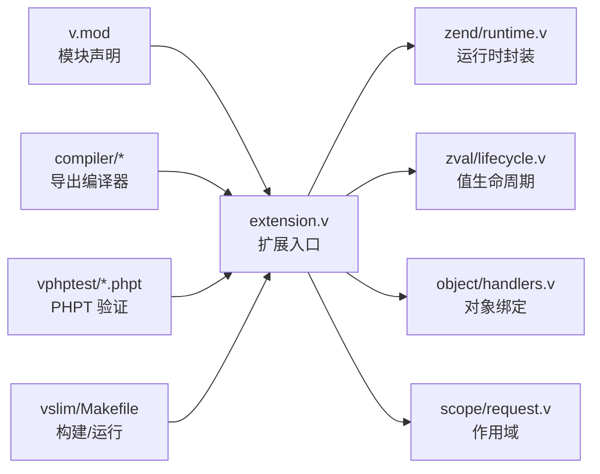

# vphp 模块总览

<cite>
**本文引用的文件**   
- [vphp/README.md](file://vphp/README.md)
- [vphp/docs/OVERVIEW.md](file://vphp/docs/OVERVIEW.md)
- [vphp/docs/README.md](file://vphp/docs/README.md)
- [vphp/compiler/README.md](file://vphp/compiler/README.md)
- [vphp/v.mod](file://vphp/v.mod)
- [vphp/zend/runtime.v](file://vphp/zend/runtime.v)
- [vphp/zval/lifecycle.v](file://vphp/zval/lifecycle.v)
- [vphp/object/handlers.v](file://vphp/object/handlers.v)
- [vphp/scope/request.v](file://vphp/scope/request.v)
- [vphp/extension.v](file://vphp/extension.v)
- [vphp/execute/context.v](file://vphp/execute/context.v)
</cite>

## 更新摘要
**变更内容**   
- 移除了中文语言的'模块总览.md'独立文档，但核心英文技术文档结构保持不变
- 主要技术文档无需重大修订，保持现有架构和组件分析不变
- 更新了引用文件列表以反映当前实际存在的文件

## 目录
1. [简介](#简介)
2. [项目结构](#项目结构)
3. [核心组件](#核心组件)
4. [架构总览](#架构总览)
5. [详细组件分析](#详细组件分析)
6. [依赖关系分析](#依赖关系分析)
7. [性能与可维护性要点](#性能与可维护性要点)
8. [故障排查指南](#故障排查指南)
9. [结论](#结论)

## 简介
vphp 是 V 面向 Zend/PHP 的底层绑定与导出层，承担"V 代码导出为 PHP function/class/interface/trait/enum"和"V 调用 PHP 函数/方法/对象/属性/常量/callable"的双向互操作职责。其设计重心是在 Zend 原始运行时模型与 V 的类型化、显式所有权模型之间建立稳定边界，并为上层（如 vslim）提供可靠的基础能力。

- 模块名：vphp
- 位置：vphp/ 目录
- 一句话定位：Zend Binding for Vlang

章节来源
- [vphp/README.md:1-40](file://vphp/README.md#L1-L40)
- [vphp/docs/OVERVIEW.md:14-44](file://vphp/docs/OVERVIEW.md#L14-L44)

## 项目结构
vphp 采用分层与分域组织方式，围绕"值模型、对象模型、执行上下文、编译器导出、C/FFI 桥接"等维度划分目录与文件。

图表来源
- [vphp/zval/lifecycle.v:1-40](file://vphp/zval/lifecycle.v#L1-L40)
- [vphp/object/handlers.v:1-21](file://vphp/object/handlers.v#L1-L21)
- [vphp/zend/runtime.v:1-139](file://vphp/zend/runtime.v#L1-L139)
- [vphp/execute/context.v:1-12](file://vphp/execute/context.v#L1-L12)
- [vphp/scope/request.v:1-16](file://vphp/scope/request.v#L1-L16)
- [vphp/compiler/README.md:19-32](file://vphp/compiler/README.md#L19-L32)

章节来源
- [vphp/docs/README.md:1-37](file://vphp/docs/README.md#L1-L37)
- [vphp/compiler/README.md:19-32](file://vphp/compiler/README.md#L19-L32)

## 核心组件
- 值模型与生命周期
  - ZVal 句柄与转换、读写、迭代、引用、资源等位于 zval/ 子目录；统一的生命周期包装在 zval/lifecycle.v 中体现。
  - 语义层包装（PhpValue/PhpInt/PhpString 等）在根目录多个 php_*.v 文件中定义，形成四层值栈：Zend zval → ZVal → ZBox 生命周期包装 → 语义 PHP 包装。
- 对象模型与绑定
  - object/ 负责 PHP 对象在 V 侧的绑定：handle、handlers、property、lifecycle、return、roots、zval 交互等。
- Zend 低层封装
  - zend/ 对 Zend C API 进行封装：types、value、call、closure、object、array、include、constants、superglobals、execute 等。
- 执行上下文与作用域
  - execute/ 包含 args.v、context.v、handle.v，配合 scope/request.v 提供的 RequestScope/FrameScope 管理 request/frame 级临时值与自动释放。
- 编译器导出管线
  - compiler/ 实现 parser → repr → builder → emitter → 生成 C/V glue 的完整流水线，详见 compiler/README.md。
- C/FFI 桥接
  - bridge/ 包含 .inc.c 片段与 compat.h，配合 v_bridge.c / v_bridge.h 作为 V↔C 的桥接入口。

章节来源
- [vphp/zval/lifecycle.v:1-40](file://vphp/zval/lifecycle.v#L1-L40)
- [vphp/object/handlers.v:1-21](file://vphp/object/handlers.v#L1-L21)
- [vphp/zend/runtime.v:1-139](file://vphp/zend/runtime.v#L1-L139)
- [vphp/execute/context.v:1-12](file://vphp/execute/context.v#L1-L12)
- [vphp/scope/request.v:1-16](file://vphp/scope/request.v#L1-L16)
- [vphp/compiler/README.md:19-32](file://vphp/compiler/README.md#L19-L32)

## 架构总览
vphp 处于整个技术栈的最底层，向上支撑 vslim 应用框架层，再往上是 vhttpd 运行时/传输层。

图表来源
- [vphp/docs/OVERVIEW.md:29-44](file://vphp/docs/OVERVIEW.md#L29-L44)

章节来源
- [vphp/docs/OVERVIEW.md:29-44](file://vphp/docs/OVERVIEW.md#L29-L44)

## 详细组件分析

### 值模型与生命周期（zval/ 与根目录语义包装）
- 四层值栈：Zend zval → ZVal → ZBox 生命周期包装 → 语义 PHP 包装。
- 关键接口与行为集中在 zval/lifecycle.v 与根目录 php_* 类型文件中，负责创建、借用、拥有、持久化、转换与销毁。
- 典型使用路径：从 Zend zval 构造 ZVal，再转换为 RequestOwnedZBox/PersistentOwnedZBox，最后包装为 PhpValue/PhpString 等语义类型。

图表来源
- [vphp/zval/lifecycle.v:1-40](file://vphp/zval/lifecycle.v#L1-L40)

章节来源
- [vphp/zval/lifecycle.v:1-40](file://vphp/zval/lifecycle.v#L1-L40)

### 对象绑定与处理（object/）
- object/handlers.v 等文件负责对象生命周期钩子、属性访问、返回绑定等，将 V 侧对象与 PHP 对象系统对接。
- 通过 handlers 注册 new/cleanup/free 等回调，确保对象在请求或持久化场景下正确释放。

图表来源
- [vphp/object/handlers.v:1-21](file://vphp/object/handlers.v#L1-L21)

章节来源
- [vphp/object/handlers.v:1-21](file://vphp/object/handlers.v#L1-L21)

### Zend 低层封装（zend/）
- zend/runtime.v 等文件对 Zend C API 进行封装，屏蔽底层细节，向上暴露稳定的类型、值、调用、闭包、对象、数组、常量、超全局变量、执行上下文等接口。
- 该层避免上层语义包装直接散落 C 调用，保证边界清晰。

章节来源
- [vphp/zend/runtime.v:1-139](file://vphp/zend/runtime.v#L1-L139)

### 执行上下文与作用域（execute/ 与 scope/）
- execute/context.v 提供 Context 抽象，用于获取参数元信息、手动写入返回值等。
- scope/request.v 提供 RequestScope/FrameScope，管理 request/frame 级临时值的自动释放。

图表来源
- [vphp/execute/context.v:1-12](file://vphp/execute/context.v#L1-L12)
- [vphp/scope/request.v:1-16](file://vphp/scope/request.v#L1-L16)

章节来源
- [vphp/execute/context.v:1-12](file://vphp/execute/context.v#L1-L12)
- [vphp/scope/request.v:1-16](file://vphp/scope/request.v#L1-L16)

### 编译器导出管线（compiler/）
- 流水线：AST → repr → linker/builder → emitted C/V bridge code。
- 支持 V 标量、语义 PHP 包装、可选参数、params struct、arginfo/default 生成、parameter attributes、closure export 等。
- 入口与文档见 compiler/README.md。

章节来源
- [vphp/compiler/README.md:19-32](file://vphp/compiler/README.md#L19-L32)
- [vphp/compiler/README.md:95-110](file://vphp/compiler/README.md#L95-L110)
- [vphp/compiler/README.md:111-160](file://vphp/compiler/README.md#L111-L160)
- [vphp/compiler/README.md:355-460](file://vphp/compiler/README.md#L355-L460)

### C/FFI 桥接（bridge/ 与 v_bridge.*）
- bridge/ 包含 .inc.c 片段与兼容头文件，配合 v_bridge.c / v_bridge.h 作为 V↔C 的桥接入口。
- debug.inc.c 等片段用于调试与诊断辅助。

## 依赖关系分析
- 模块声明：vmod 定义模块名与描述，表明 vphp 的定位为"Zend binding and export pipeline for Vlang"。
- 运行时扩展入口：extension.v 负责扩展配置与注册，结合 zend/runtime.v 完成与 Zend 的对接。
- 测试与验证：vphptest 通过 PHPT 用例验证编译器生成的 glue 与 interop 行为。
- 上层集成：vslim 在其 Makefile 中构建自身扩展并依赖 vphp 的能力。

图表来源
- [vphp/v.mod:1-6](file://vphp/v.mod#L1-L6)
- [vphp/extension.v:1-11](file://vphp/extension.v#L1-L11)
- [vphp/zend/runtime.v:1-139](file://vphp/zend/runtime.v#L1-L139)
- [vphp/zval/lifecycle.v:1-40](file://vphp/zval/lifecycle.v#L1-L40)
- [vphp/object/handlers.v:1-21](file://vphp/object/handlers.v#L1-L21)
- [vphp/scope/request.v:1-16](file://vphp/scope/request.v#L1-L16)
- [vphp/compiler/README.md:19-32](file://vphp/compiler/README.md#L19-L32)

章节来源
- [vphp/v.mod:1-6](file://vphp/v.mod#L1-L6)
- [vphp/extension.v:1-11](file://vphp/extension.v#L1-L11)

## 性能与可维护性要点
- 值模型分层清晰，优先使用语义包装，仅在必要时退到底层 ZVal/ZBox，有助于减少不必要的拷贝与转换。
- 显式所有权模型（RequestBorrowedZBox/RequestOwnedZBox/PersistentOwnedZBox）配合 RequestScope/FrameScope，能显著降低泄漏风险。
- 编译器导出管线将复杂逻辑收敛在 compiler/ 内部，上层只需关注注解与签名，有利于长期演进与维护。

## 故障排查指南
- 若出现对象生命周期异常或内存问题，优先检查：
  - 是否正确区分 RequestOwnedZBox 与 PersistentOwnedZBox 的使用场景
  - 是否在 RequestScope/FrameScope 内及时关闭作用域以触发自动释放
  - 对象 handlers 是否正确注册 new/cleanup/free 钩子
- 若编译器生成的 glue 行为不符合预期，参考 PHPT 用例与编译器文档，确认注解、参数结构与默认值设置是否符合规范。

章节来源
- [vphp/scope/request.v:1-16](file://vphp/scope/request.v#L1-L16)
- [vphp/object/handlers.v:1-21](file://vphp/object/handlers.v#L1-L21)
- [vphp/compiler/README.md:95-110](file://vphp/compiler/README.md#L95-L110)

## 结论
vphp 作为 V 与 Zend/PHP 的双向互操作基础层，提供了稳定的值模型、对象模型、执行上下文与编译器导出管线，并通过 C/FFI 桥接与 Zend 深度集成。它不负责应用模型与 HTTP 运行时，而是为上层（如 vslim）提供"V 驱动 PHP"的核心能力。对于希望用 V 编写 PHP 扩展或更高层 PHP-facing 基础设施的团队，vphp 是最合适的起点。