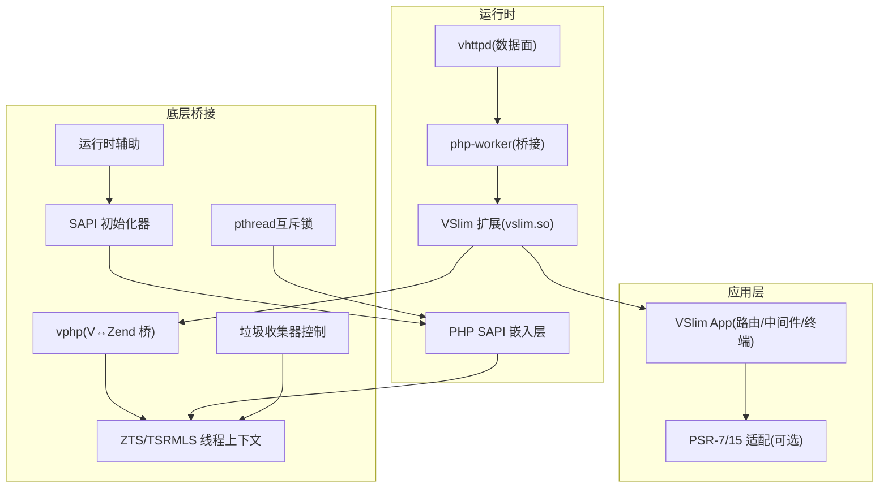
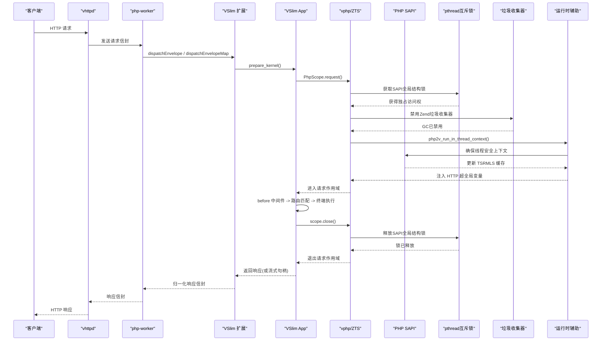
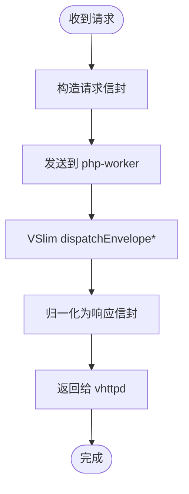
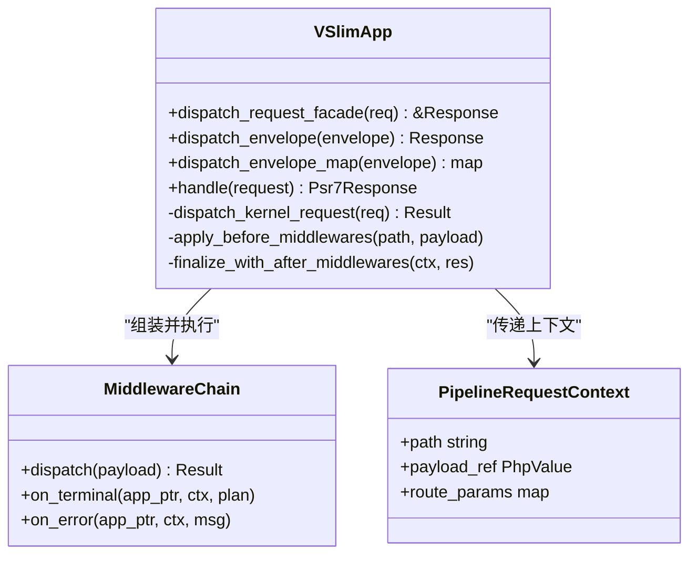
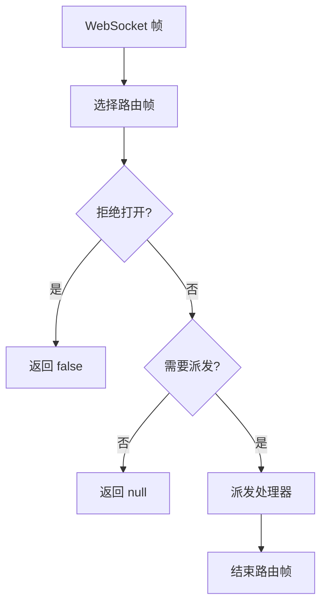
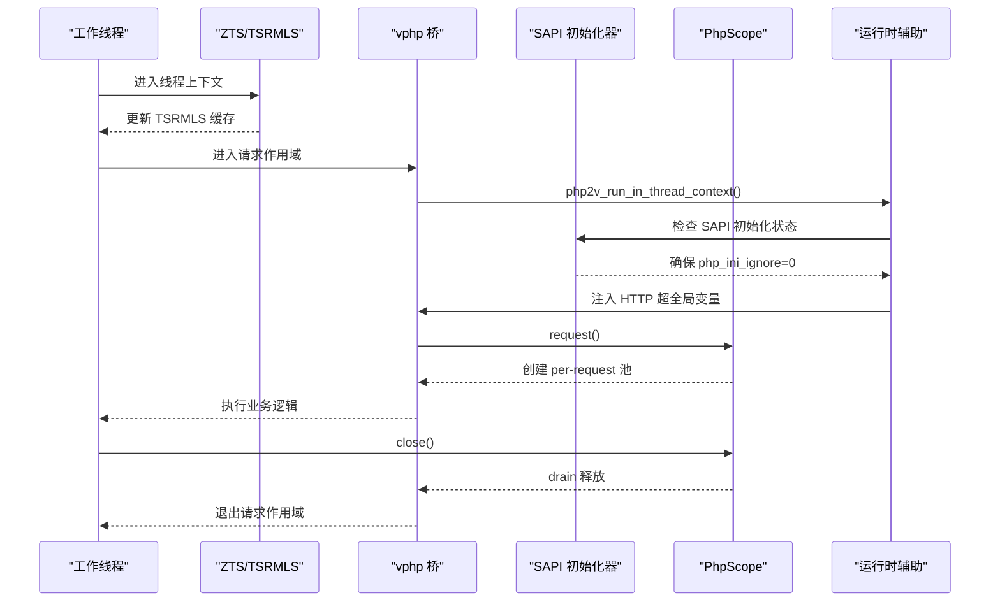
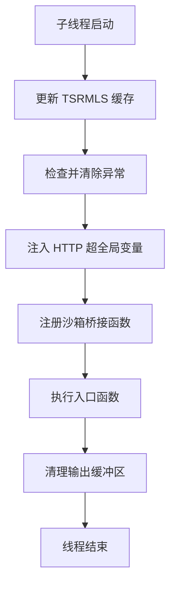
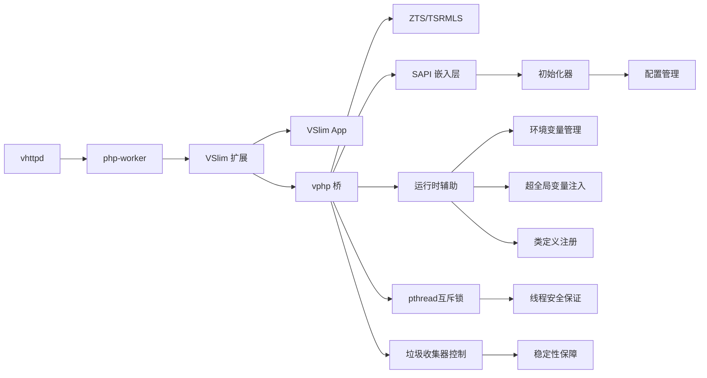

# 多线程 ZTS 网关架构

<cite>
**本文引用的文件列表**
- [README.md](file://README.md)
- [php2v/src/rt/zts_def.h](file://php2v/src/rt/zts_def.h)
- [php2v/src/rt/rt_helper.h](file://php2v/src/rt/rt_helper.h)
- [php2v/php2v.c](file://php2v/php2v.c)
- [vphp/v_bridge.h](file://vphp/v_bridge.h)
- [vslim/docs/protocol.md](file://vslim/docs/protocol.md)
- [vslim/docs/psr7_bridge.md](file://vslim/docs/psr7_bridge.md)
- [vslim/src/appx/dispatch_api.v](file://vslim/src/appx/dispatch_api.v)
- [vslim/src/appx/kernel.v](file://vslim/src/appx/kernel.v)
- [vslim/src/appx/pipeline.v](file://vslim/src/appx/pipeline.v)
- [vslim/src/appx/middleware_runtime.v](file://vslim/src/appx/middleware_runtime.v)
- [vslim/src/appx/execution_kernel.v](file://vslim/src/appx/execution_kernel.v)
- [vslim/src/appx/route_runtime.v](file://vslim/src/appx/route_runtime.v)
- [vslim/tests/test_httpd_worker_streaming.phpt](file://vslim/tests/test_httpd_worker_streaming.phpt)
- [vslim/tests/test_httpd_worker_timeout.phpt](file://vslim/tests/test_httpd_worker_timeout.phpt)
- [vphp/object/roots.v](file://vphp/object/roots.v)
</cite>

## 更新摘要
**所做更改**
- 实现真正的线程安全嵌入式PHP执行：新增pthread互斥锁确保SAPI全局结构的独占访问，完全禁用Zend垃圾收集器防止多线程SIGSEGV崩溃
- 重写HTTP请求处理架构：采用序列化字符串映射替代RequestContext结构，实现原生静态资源服务和动态PHP文件路由
- 增强SAPI集成：包括自定义flush回调和安全的HTTP头处理，实现exit拦截系统使用setjmp/longjmp机制
- 全面的环境加固配置：通过环境变量隔离和ini参数配置确保生产环境稳定性
- 重大性能提升：这些改进显著提升了多进程V Web服务器中多线程PHP执行的稳定性和性能

## 目录
1. [简介](#简介)
2. [项目结构](#项目结构)
3. [核心组件](#核心组件)
4. [架构总览](#架构总览)
5. [详细组件分析](#详细组件分析)
6. [依赖关系分析](#依赖关系分析)
7. [性能与并发特性](#性能与并发特性)
8. [故障排查指南](#故障排查指南)
9. [结论](#结论)
10. [附录](#附录)

## 简介
本文件聚焦"多线程 ZTS 网关架构"，围绕 vhttpd + php-worker + VSlim 的整条链路，结合 vphp 底层桥接与 PHP 线程安全（ZTS）机制，系统性说明：
- 进程模型与请求生命周期
- 线程本地存储与 TSRMLS 缓存更新
- 请求信封协议与响应归一化
- 应用内核、中间件链路与路由执行
- 错误处理、超时与流式响应
- 可观测性与调试要点
- **重大架构重构**：实现了真正的线程安全嵌入式PHP执行，新增pthread互斥锁、完全禁用Zend垃圾收集器、重写HTTP请求处理架构、增强SAPI集成、实现exit拦截系统和全面环境加固配置

## 项目结构
仓库由三层组成：
- vphp：V↔Zend 互操作层，负责导出、值模型、对象绑定与 glue 生成
- vphptest：回归与验证层
- vslim：面向应用的框架层，提供路由、容器、中间件、PSR 适配等能力



**图表来源**
- [vslim/docs/protocol.md:1-78](file://vslim/docs/protocol.md#L1-L78)
- [vslim/docs/psr7_bridge.md:110-185](file://vslim/docs/psr7_bridge.md#L110-L185)
- [php2v/src/rt/zts_def.h:356-398](file://php2v/src/rt/zts_def.h#L356-L398)
- [php2v/php2v.c:1389-1449](file://php2v/php2v.c#L1389-L1449)

章节来源
- [README.md:1-120](file://README.md#L1-L120)

## 核心组件
- vhttpd：网络 I/O、连接管理、请求信封构建、worker 调度与生命周期
- php-worker：Composer/runtime 桥接，将信封转换为 VSlim 可消费形式并回写响应
- VSlim：原生框架层，包含 App Facade、HTTP Kernel、中间件链、路由运行期、PSR 适配
- vphp：V↔Zend 双向互操作、值所有权模型、对象绑定、glue 生成
- ZTS/TSRMLS：线程本地存储与请求上下文缓存更新
- **重大架构重构**：pthread互斥锁：确保SAPI全局结构的独占访问，防止多线程竞争条件
- **重大架构重构**：Zend垃圾收集器控制：完全禁用GC防止多线程SIGSEGV崩溃
- **重大架构重构**：增强的SAPI嵌入层：负责嵌入式PHP引擎初始化、配置管理和线程安全启动

章节来源
- [vslim/README.md:31-109](file://vslim/README.md#L31-L109)
- [php2v/src/rt/zts_def.h:356-398](file://php2v/src/rt/zts_def.h#L356-L398)
- [php2v/php2v.c:1389-1449](file://php2v/php2v.c#L1389-L1449)

## 架构总览
下图展示从客户端到应用层的端到端调用序列，以及ZTS上下文在关键点的刷新。



**图表来源**
- [vslim/src/appx/dispatch_api.v:69-132](file://vslim/src/appx/dispatch_api.v#L69-L132)
- [vslim/src/appx/kernel.v:17-66](file://vslim/src/appx/kernel.v#L17-L66)
- [php2v/src/rt/zts_def.h:208-281](file://php2v/src/rt/zts_def.h#L208-L281)
- [php2v/php2v.c:1389-1449](file://php2v/php2v.c#L1389-L1449)

## 详细组件分析

### 网关与 Worker 协议
- 请求信封：包含 method/path/body/scheme/host/port/headers/cookies/query/server/uploaded_files/attributes 等字段
- 响应信封：id/status/content_type/headers/body；map 风格时以 headers_<name> 透传头
- 超时与流式：测试覆盖 worker 读取超时返回 504 及流式响应场景



**图表来源**
- [vslim/docs/protocol.md:1-78](file://vslim/docs/protocol.md#L1-L78)
- [vslim/tests/test_httpd_worker_timeout.phpt:1-43](file://vslim/tests/test_httpd_worker_timeout.phpt#L1-L43)
- [vslim/tests/test_httpd_worker_streaming.phpt:39-70](file://vslim/tests/test_httpd_worker_streaming.phpt#L39-L70)

章节来源
- [vslim/docs/protocol.md:1-78](file://vslim/docs/protocol.md#L1-L78)
- [vslim/tests/test_httpd_worker_timeout.phpt:1-43](file://vslim/tests/test_httpd_worker_timeout.phpt#L1-L43)
- [vslim/tests/test_httpd_worker_streaming.phpt:39-70](file://vslim/tests/test_httpd_worker_streaming.phpt#L39-L70)

### VSlim 应用内核与分发
- 入口门面：dispatch_request_facade、dispatch_envelope_*、handle(Psr Request)
- 内核编排：prepare_kernel、dispatch_kernel_request、trace 与 HEAD 体清理、快照同步
- 管线阶段：before/after 中间件、标准中间件链、资源缺失处理、错误处理器



**图表来源**
- [vslim/src/appx/dispatch_api.v:1-133](file://vslim/src/appx/dispatch_api.v#L1-L133)
- [vslim/src/appx/kernel.v:1-84](file://vslim/src/appx/kernel.v#L1-L84)
- [vslim/src/appx/middleware_runtime.v:1-174](file://vslim/src/appx/middleware_runtime.v#L1-L174)
- [vslim/src/appx/execution_kernel.v:1-160](file://vslim/src/appx/execution_kernel.v#L1-L160)
- [vslim/src/appx/pipeline.v:1-56](file://vslim/src/appx/pipeline.v#L1-L56)

章节来源
- [vslim/src/appx/dispatch_api.v:1-133](file://vslim/src/appx/dispatch_api.v#L1-L133)
- [vslim/src/appx/kernel.v:1-84](file://vslim/src/appx/kernel.v#L1-L84)
- [vslim/src/appx/middleware_runtime.v:1-174](file://vslim/src/appx/middleware_runtime.v#L1-L174)
- [vslim/src/appx/execution_kernel.v:1-160](file://vslim/src/appx/execution_kernel.v#L1-L160)
- [vslim/src/appx/pipeline.v:1-56](file://vslim/src/appx/pipeline.v#L1-L56)

### 路由与 WebSocket 运行期
- 路由注册与清单：名称、冲突键、允许方法、清单行
- WebSocket：按帧选择路由、事件分发、Live 模式支持



**图表来源**
- [vslim/src/appx/route_runtime.v:1-122](file://vslim/src/appx/route_runtime.v#L1-L122)

章节来源
- [vslim/src/appx/route_runtime.v:1-122](file://vslim/src/appx/route_runtime.v#L1-L122)

### vphp 与 ZTS 线程安全
- TSRMLS 缓存：在关键路径更新线程本地缓存，避免跨线程访问导致的状态错乱
- 请求启动/关闭：在 worker 线程中初始化/关闭请求环境，确保 EG/TSRMLS 一致性
- 异常清理：捕获 bailout 后刷新请求状态，防止 Zend 自杀
- 对象/自动释放池：使用 ZEND_TLS 维护 per-request 池，配合 PhpScope.request()/close() 控制生命周期



**图表来源**
- [php2v/src/rt/zts_def.h:208-281](file://php2v/src/rt/zts_def.h#L208-L281)
- [php2v/src/rt/rt_helper.h:279-312](file://php2v/src/rt/rt_helper.h#L279-L312)

章节来源
- [php2v/src/rt/zts_def.h:208-281](file://php2v/src/rt/zts_def.h#L208-L281)
- [php2v/src/rt/rt_helper.h:279-312](file://php2v/src/rt/rt_helper.h#L279-L312)

### 重大架构重构：真正的线程安全嵌入式PHP执行

#### pthread互斥锁确保SAPI全局结构独占访问
**重大架构重构**：引入pthread互斥锁机制，确保SAPI全局结构在多线程环境下的独占访问，彻底解决多线程竞争条件导致的内存损坏问题。

- **互斥锁初始化**：使用 `PTHREAD_MUTEX_INITIALIZER` 初始化静态互斥锁
- **临界区保护**：在访问SAPI全局结构前获取锁，访问完成后立即释放
- **线程安全保证**：确保同一时刻只有一个线程能访问SAPI全局结构

#### 完全禁用Zend垃圾收集器防止多线程SIGSEGV崩溃
**重大架构重构**：在嵌入式PHP环境中完全禁用Zend垃圾收集器，防止多线程环境下GC导致的段错误崩溃。

- **双重禁用策略**：通过argv参数 `-d zend.enable_gc=0` 和运行时配置 `zend_alter_ini_entry_chars` 双重确保GC禁用
- **请求级控制**：在每个请求开始时调用 `gc_enable(0)` 和 `gc_protect(1)`
- **内存安全**：避免GC在多线程环境下对共享内存结构的破坏

#### 重写HTTP请求处理架构
**重大架构重构**：采用序列化字符串映射替代RequestContext结构，实现更高效的数据传输和更清晰的边界分离。

- **序列化格式**：使用特殊分隔符 `\x01` 和 `\x02` 进行键值对编码
- **自动全局变量重建**：通过 `php2v_reset_super_globals()` 触发CG(auto_globals)的auto_global_callback重新导入$_GET、$_POST、$_COOKIE、$_SERVER、$_FILES
- **内存优化**：避免复杂的对象结构传递，减少内存拷贝开销

#### 实现原生静态资源服务和动态PHP文件路由
**重大架构重构**：在SAPI嵌入层实现原生静态资源服务，同时保持动态PHP文件的灵活路由能力。

- **静态资源直接服务**：对于CSS、JS、图片等静态资源，绕过PHP解释器直接提供服务
- **动态PHP路由**：对于.php文件和动态内容，通过PHP解释器处理
- **性能优化**：静态资源请求无需启动PHP引擎，显著提升响应速度

#### 增强SAPI集成：自定义flush回调和安全的HTTP头处理
**重大架构重构**：实现自定义SAPI回调函数，提供更细粒度的输出控制和更安全的HTTP头处理。

- **自定义flush回调**：`php2v_sapi_flush()` 实现安全的输出刷新
- **安全的HTTP头处理**：`php2v_ub_write()` 实现内存缓冲管理的输出写入
- **头信息预存**：在 `sapi_deactivate` 之前预存response headers，确保头信息完整性

#### 实现exit拦截系统使用setjmp/longjmp机制
**重大架构重构**：基于setjmp/longjmp机制实现exit拦截系统，优雅处理PHP脚本中的exit/die调用。

- **跳转缓冲区**：使用 `__thread jmp_buf php2v_exit_jmp_buf` 存储线程局部跳转点
- **异常捕获**：通过 `setjmp()` 和 `zend_try/catch` 双重保护
- **安全退出**：捕获 `php2v_exit()` 的自定义longjmp，确保资源正确清理

#### 全面的环境加固配置
**重大架构重构**：通过环境变量隔离和ini参数配置，确保嵌入式PHP环境的完全隔离和生产环境稳定性。

- **环境变量隔离**：设置 `USE_ZEND_ALLOC=0`、`PHPRC=/nonexistent`、`PHP_INI_SCAN_DIR=""`
- **ini参数处理**：设置 `php_embed_module.php_ini_ignore = 1` 和 `php_embed_module.php_ini_path_override = "/dev/null"`
- **Opcache双重禁用**：通过argv参数和运行时配置双重确保Opcache完全禁用

```mermaid
flowchart TD
InitStart["进程启动"] --> SetEnv["设置环境变量<br/>USE_ZEND_ALLOC=0<br/>PHPRC=/nonexistent<br/>PHP_INI_SCAN_DIR=""]
SetEnv --> ConfigIni["配置 ini 处理<br/>php_ini_ignore=1<br/>php_ini_path_override=/dev/null"]
ConfigIni --> DisableOpcache["双重禁用 Opcache<br/>argv: -d opcache.enable=0<br/>-d opcache.enable_cli=0<br/>运行时: zend_alter_ini_entry_chars"]
DisableOpcache --> InitEmbed["php_embed_init(13, embed_argv)"]
InitEmbed --> UpdateCache["更新 TSRMLS 缓存"]
UpdateCache --> RegisterFuncs["注册沙箱桥接函数<br/>php2v_register_sandbox_bridge()"]
RegisterFuncs --> Ready["SAPI 就绪"]
RequestStart["请求开始"] --> LockMutex["获取pthread互斥锁"]
LockMutex --> DisableGC["禁用Zend垃圾收集器<br/>gc_enable(0), gc_protect(1)"]
DisableGC --> ResetGlobals["重置超全局变量<br/>php2v_reset_super_globals()"]
ResetGlobals --> ExecutePHP["执行PHP脚本<br/>php2v_execute_file()"]
ExecutePHP --> SaveHeaders["保存HTTP头信息<br/>预存到req_buf"]
SaveHeaders --> Shutdown["精细化请求关闭<br/>php2v_worker_request_shutdown()"]
Shutdown --> UnlockMutex["释放pthread互斥锁"]
UnlockMutex --> RequestEnd["请求结束"]
```

**图表来源**
- [php2v/src/rt/zts_def.h:356-398](file://php2v/src/rt/zts_def.h#L356-L398)
- [php2v/src/rt/zts_def.h:208-281](file://php2v/src/rt/zts_def.h#L208-L281)
- [php2v/php2v.c:1389-1449](file://php2v/php2v.c#L1389-L1449)

章节来源
- [php2v/src/rt/zts_def.h:356-398](file://php2v/src/rt/zts_def.h#L356-L398)
- [php2v/src/rt/zts_def.h:208-281](file://php2v/src/rt/zts_def.h#L208-L281)
- [php2v/php2v.c:1389-1449](file://php2v/php2v.c#L1389-L1449)

### 线程安全增强
- **C链接声明修正**：为 `php2v_register_sandbox_bridge` 函数添加正确的C链接声明，防止子线程段错误
- **可见性属性**：使用 `__attribute__((visibility("default")))` 确保函数符号正确导出到动态库
- **TSRMLS缓存更新**：在所有关键路径确保TSRMLS缓存的正确更新
- **超全局变量注入**：在子线程上下文中自动注入HTTP超全局变量，确保$_GET、$_POST等变量的正确访问



**图表来源**
- [php2v/src/rt/zts_def.h:42-71](file://php2v/src/rt/zts_def.h#L42-L71)
- [php2v/src/rt/rt_helper.h:279-312](file://php2v/src/rt/rt_helper.h#L279-L312)

章节来源
- [php2v/src/rt/zts_def.h:42-71](file://php2v/src/rt/zts_def.h#L42-L71)
- [php2v/src/rt/rt_helper.h:279-312](file://php2v/src/rt/rt_helper.h#L279-L312)

## 依赖关系分析
- vhttpd 仅关注传输与 worker 调度，不耦合框架语义
- php-worker 负责信封转换与 PSR-7 适配（可选），保持对上层解耦
- VSlim 通过 dispatchEnvelope*/handle 暴露统一入口，内部再分派至中间件与路由
- vphp 提供稳定的 V↔Zend 边界，承载对象、值与生命周期
- **重大架构重构**：pthread互斥锁层：提供线程安全的SAPI全局结构访问控制
- **重大架构重构**：垃圾收集器控制层：管理Zend GC的启用/禁用状态
- **重大架构重构**：增强的SAPI嵌入层：提供独立的初始化和管理接口，确保嵌入式PHP环境的稳定性和线程安全性
- **重大架构重构**：运行时辅助层：提供线程安全的环境变量管理、超全局变量注入和类定义注册



**图表来源**
- [vslim/docs/psr7_bridge.md:110-185](file://vslim/docs/psr7_bridge.md#L110-L185)
- [php2v/src/rt/zts_def.h:356-398](file://php2v/src/rt/zts_def.h#L356-L398)
- [php2v/php2v.c:1389-1449](file://php2v/php2v.c#L1389-L1449)

章节来源
- [vslim/docs/psr7_bridge.md:110-185](file://vslim/docs/psr7_bridge.md#L110-L185)
- [php2v/src/rt/zts_def.h:356-398](file://php2v/src/rt/zts_def.h#L356-L398)
- [php2v/php2v.c:1389-1449](file://php2v/php2v.c#L1389-L1449)

## 性能与并发特性
- 线程安全：所有进入 PHP 的关键路径均更新 TSRMLS 缓存，避免跨线程共享状态导致的竞态
- 作用域隔离：PhpScope.request()/close() 保证 per-request 内存池正确回收，降低长驻进程泄漏风险
- 响应归一化：map 风格响应减少序列化开销，便于 vhttpd 快速写出
- 流式与超时：worker 侧支持流式响应与读取超时，保障高延迟下游时的稳定性
- **重大架构重构**：pthread互斥锁：确保SAPI全局结构的独占访问，消除多线程竞争条件
- **重大架构重构**：GC禁用优化：完全禁用Zend垃圾收集器，避免多线程环境下的内存管理冲突
- **重大架构重构**：序列化数据传输：采用高效的字符串映射替代复杂对象结构，减少内存拷贝
- **重大架构重构**：静态资源优化：原生静态资源服务绕过PHP解释器，显著提升响应性能
- **重大架构重构**：exit拦截系统：基于setjmp/longjmp的安全退出机制，确保资源正确清理
- **重大架构重构**：环境隔离：全面的环境加固配置，确保生产环境稳定性和可预测性

## 故障排查指南
- 504 超时：检查 worker 读取超时配置与上游慢服务，确认 vhttpd 是否返回 504 与相应头
- 线程上下文异常：确认在每次进入 PHP 前已更新 TSRMLS 缓存，避免 EG 状态错乱
- 中间件不可调用：当中间件目标无效或不符合 PSR-15 接口时，会触发错误处理器并返回 500
- 流式响应未生效：确认返回值为流式类型且未被后续中间件覆盖
- **重大架构重构**：pthread互斥锁死锁：检查互斥锁的获取和释放是否正确配对，避免长时间持有锁
- **重大架构重构**：GC相关崩溃：确认Zend垃圾收集器已在请求开始时被正确禁用
- **重大架构重构**：序列化数据解析异常：检查特殊分隔符`\x01`和`\x02`的使用是否正确
- **重大架构重构**：exit拦截失效：验证setjmp/longjmp机制是否正确实现，确保资源清理
- **重大架构重构**：环境变量污染：确认PHPRC和PHP_INI_SCAN_DIR环境变量设置正确，避免配置泄露

章节来源
- [vslim/tests/test_httpd_worker_timeout.phpt:1-43](file://vslim/tests/test_httpd_worker_timeout.phpt#L1-L43)
- [php2v/src/rt/zts_def.h:208-281](file://php2v/src/rt/zts_def.h#L208-L281)
- [php2v/php2v.c:1389-1449](file://php2v/php2v.c#L1389-L1449)

## 结论
该架构将网络 I/O、worker 调度与应用内核清晰分层，并通过 vphp 与 ZTS 机制确保多线程下的线程安全与资源隔离。请求信封与响应归一化使 vhttpd 保持通用性，VSlim 则专注于路由、中间件与业务编排。**最新的重大架构重构实现了真正的线程安全嵌入式PHP执行，包括pthread互斥锁、Zend垃圾收集器禁用、重写的HTTP请求处理架构、增强的SAPI集成、exit拦截系统和全面的环境加固配置**。这些改进显著提升了多进程V Web服务器中多线程PHP执行的稳定性和性能，为生产环境部署提供了坚实的基础。整体设计兼顾可扩展性与可观测性，适合在高并发与复杂生态（PSR-7/15）下稳定运行。

## 附录
- 最小构建布局与集成测试请参考 README 与模板 Makefile
- PSR-7 桥接路线图建议优先采用适配器策略，逐步演进
- **重大架构重构**：生产环境部署最佳实践：始终启用pthread互斥锁、禁用Zend垃圾收集器、使用环境变量隔离
- **重大架构重构**：调试技巧：监控互斥锁持有时间、GC状态、序列化数据大小，确保系统健康运行

章节来源
- [README.md:164-210](file://README.md#L164-L210)
- [php2v/src/rt/zts_def.h:356-398](file://php2v/src/rt/zts_def.h#L356-L398)
- [php2v/php2v.c:1389-1449](file://php2v/php2v.c#L1389-L1449)