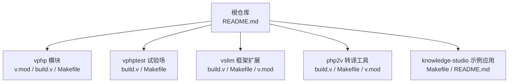
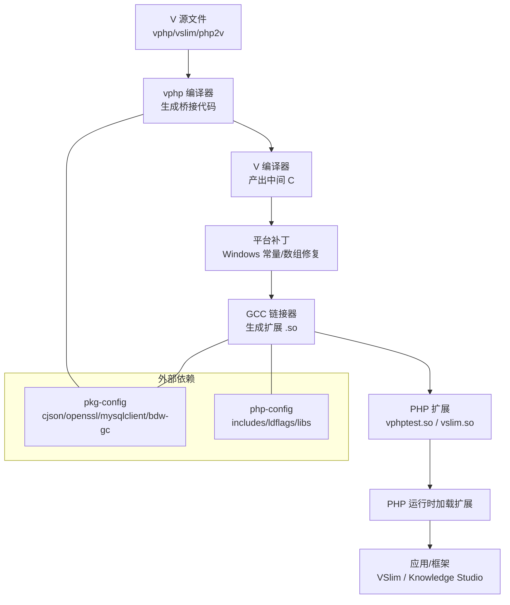
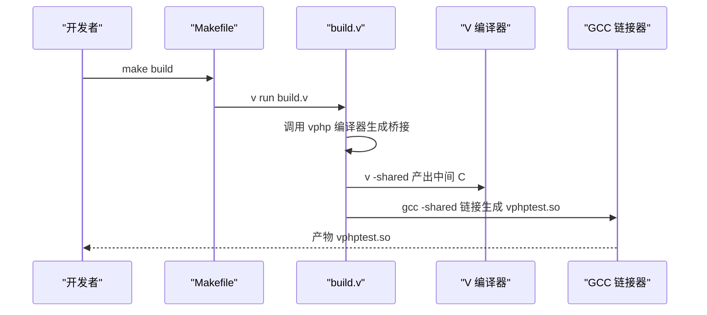
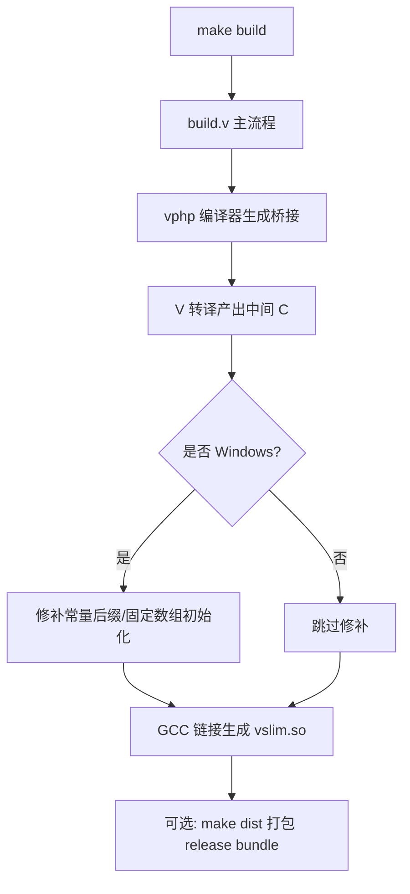
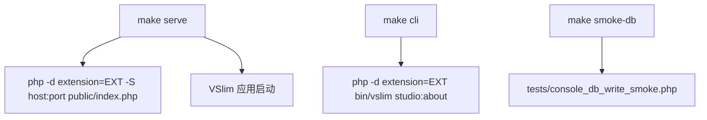
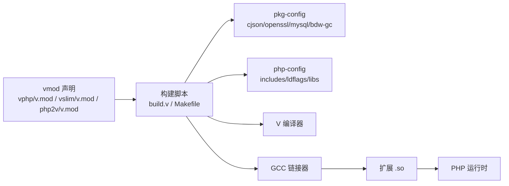

# 构建系统与开发工具

<cite>
**本文引用的文件**   
- [README.md](file://README.md)
- [vphp/README.md](file://vphp/README.md)
- [vslim/README.md](file://vslim/README.md)
- [knowledge-studio/README.md](file://knowledge-studio/README.md)
- [vphptest/Makefile](file://vphptest/Makefile)
- [vslim/Makefile](file://vslim/Makefile)
- [knowledge-studio/Makefile](file://knowledge-studio/Makefile)
- [php2v/Makefile](file://php2v/Makefile)
- [vphp/v.mod](file://vphp/v.mod)
- [vslim/v.mod](file://vslim/v.mod)
- [php2v/v.mod](file://php2v/v.mod)
- [vphptest/build.v](file://vphptest/build.v)
- [vslim/build.v](file://vslim/build.v)
- [php2v/build.v](file://php2v/build.v)
</cite>

## 目录
1. [简介](#简介)
2. [项目结构](#项目结构)
3. [核心组件](#核心组件)
4. [架构总览](#架构总览)
5. [详细组件分析](#详细组件分析)
6. [依赖关系分析](#依赖关系分析)
7. [性能与可移植性](#性能与可移植性)
8. [故障排查指南](#故障排查指南)
9. [结论](#结论)
10. [附录](#附录)

## 简介
本仓库围绕“用 V 构建 PHP 扩展与上层应用基础设施”的目标，提供从底层桥接到框架层、再到示例应用的完整构建与开发工具链。整体分为三层：
- vphp：V 到 Zend/PHP 的底层绑定与导出编译器、运行时桥接与值所有权模型
- vphptest：回归与验证层，将 vphp 能力落地为真实扩展并覆盖 PHPT 测试
- vslim：运行在 vphp 之上的 PHP 微框架扩展，提供路由、容器、CLI、视图、PSR 风格 HTTP 类型等能力
- php2v：将 PHP 源码转译为 V 源码并编译为二进制（AOT）的工具链

此外，knowledge-studio 是基于 VSlim 的一个真实业务原型，用于串联数据库、会话、认证、流式响应、WebSocket/LiveView 等能力。

**章节来源**
- [README.md:1-120](file://README.md#L1-L120)
- [vphp/README.md:1-120](file://vphp/README.md#L1-L120)
- [vslim/README.md:1-120](file://vslim/README.md#L1-L120)
- [knowledge-studio/README.md:1-120](file://knowledge-studio/README.md#L1-L120)

## 项目结构
仓库采用分层组织方式，顶层 README 给出总体地图与阅读顺序；各子模块各自维护独立的构建脚本与说明文档。

**图表来源**
- [README.md:99-163](file://README.md#L99-L163)
- [vphp/v.mod:1-6](file://vphp/v.mod#L1-L6)
- [vslim/v.mod:1-7](file://vslim/v.mod#L1-L7)
- [php2v/v.mod:1-9](file://php2v/v.mod#L1-L9)

**章节来源**
- [README.md:99-163](file://README.md#L99-L163)

## 核心组件
- vphp 模块定义与定位
  - 模块名与描述由 v.mod 声明，作为整个栈的基础层
- vphptest 构建流程
  - 通过 build.v 驱动 vphp 编译器生成桥接代码，再调用 V 编译器产出 C，最后 GCC 链接为 .so
- vslim 构建流程
  - 在 vphptest 基础上增加 cjson/openssl/mysql 探测、Windows 补丁、emit-only 模式、打包与 runtime-check 等目标
- php2v 工具链
  - 提供 make 目标与 build.v 脚本，支持将 PHP 源码转译为 V 并编译为可执行二进制
- knowledge-studio 应用
  - 基于 VSlim 的示例应用，提供 serve/cli/test/smoke-db 等便捷目标

**章节来源**
- [vphp/v.mod:1-6](file://vphp/v.mod#L1-L6)
- [vphptest/build.v:77-185](file://vphptest/build.v#L77-L185)
- [vslim/build.v:410-544](file://vslim/build.v#L410-L544)
- [php2v/build.v:1-109](file://php2v/build.v#L1-L109)
- [knowledge-studio/README.md:120-234](file://knowledge-studio/README.md#L120-L234)

## 架构总览
下图展示了从源代码到最终产物与运行时的关键路径，包括编译器、转译器、链接器以及可选的外部依赖。

**图表来源**
- [vphptest/build.v:104-185](file://vphptest/build.v#L104-L185)
- [vslim/build.v:451-544](file://vslim/build.v#L451-L544)
- [php2v/build.v:47-109](file://php2v/build.v#L47-L109)

## 详细组件分析

### vphptest 构建系统
- 入口与目标
  - Makefile 提供 all/build/ext/test/clean 目标；默认先跑 vphp 编译器，再链接扩展
  - build.v 负责：收集目标文件、调用 vphp 编译器生成桥接、V 转译、GCC 链接、输出 vphptest.so
- 关键步骤
  - 自动检测 V 根目录包含路径（zip/miniz.h）
  - 自动检测 GC 模式（boehm/none），注入编译/链接标志
  - 使用 php-config 获取 includes/ldflags/libs，并清理无效 -L 路径
  - macOS 下启用动态查找与可见性默认策略
- 典型命令
  - make build：完整构建
  - make ext：仅链接已有 *_generated.c
  - make test：构建后运行 run_tests.sh

**图表来源**
- [vphptest/Makefile:28-56](file://vphptest/Makefile#L28-L56)
- [vphptest/build.v:77-185](file://vphptest/build.v#L77-L185)

**章节来源**
- [vphptest/Makefile:1-56](file://vphptest/Makefile#L1-L56)
- [vphptest/build.v:1-185](file://vphptest/build.v#L1-L185)

### vslim 构建系统
- 入口与目标
  - Makefile 提供 build/emit-only/prod/dist/stubs/runtime-check 等丰富目标
  - build.v 负责：参数解析、vphp 编译器调用、V 转译、Windows 补丁、GCC 链接、打包与发布
- 增强能力
  - 自动探测 cjson/openssl/mysqlclient 头与库路径
  - Windows 环境对生成的 C 进行常量后缀与固定数组初始化修补
  - emit-only 模式只生成桥接与中间 C，不本地链接
  - dist 目标生成 release bundle（含模板、文档、原生运行时库）
- 集成测试
  - runtime-check 会构建 vhttpd 并运行 worker/streaming/timeout 等集成用例

**图表来源**
- [vslim/Makefile:64-156](file://vslim/Makefile#L64-L156)
- [vslim/build.v:410-544](file://vslim/build.v#L410-L544)

**章节来源**
- [vslim/Makefile:1-156](file://vslim/Makefile#L1-L156)
- [vslim/build.v:1-544](file://vslim/build.v#L1-L544)

### php2v 转译与 AOT 构建
- 目标
  - 将 PHP 源码转译为 V 源码，再编译为可执行二进制
- 流程
  - make php2v 编译 php2v 编译器
  - make %.bin 或 v run build.v <input.php> 完成转译与编译
  - build.v 自适应探测 PHP 头与库路径（优先嵌入式 PHP，否则回退 php-config）
- 适用场景
  - 需要把 PHP 逻辑以 V 实现并编译为独立二进制，减少运行时开销

```mermaid
sequenceDiagram
participant Dev as "开发者"
participant MK as "Makefile"
participant BV as "build.v"
participant P2V as "php2v 编译器"
participant VC as "V 编译器"
Dev->>MK : make tests/fixtures/14_include.bin
MK->>BV : v run build.v <input.php>
BV->>P2V : 转译 PHP -> V
BV->>VC : 编译 V -> 二进制
VC-->>Dev : 输出可执行文件
```

**图表来源**
- [php2v/Makefile:1-23](file://php2v/Makefile#L1-L23)
- [php2v/build.v:1-109](file://php2v/build.v#L1-L109)

**章节来源**
- [php2v/Makefile:1-23](file://php2v/Makefile#L1-L23)
- [php2v/build.v:1-109](file://php2v/build.v#L1-L109)

### knowledge-studio 应用构建与运行
- 目标
  - serve：使用 PHP 内置服务器启动应用
  - cli/cli-help：运行 CLI 命令与帮助
  - health/login/console：快速访问入口页面
  - smoke-db：验证数据库写入路径
  - test-assistant/test-unit/test-feature：运行 Pest 测试
- 依赖
  - 通过 EXT 指定已构建的 vslim.so 路径
  - 读取 .env 配置，支持 demo/db 数据源切换

**图表来源**
- [knowledge-studio/Makefile:23-55](file://knowledge-studio/Makefile#L23-L55)
- [knowledge-studio/README.md:120-234](file://knowledge-studio/README.md#L120-L234)

**章节来源**
- [knowledge-studio/Makefile:1-55](file://knowledge-studio/Makefile#L1-L55)
- [knowledge-studio/README.md:1-234](file://knowledge-studio/README.md#L1-L234)

## 依赖关系分析
- 模块元信息
  - vphp/v.mod、vslim/v.mod、php2v/v.mod 分别声明模块名、版本与描述
- 构建期依赖
  - pkg-config：cjson、openssl、mysqlclient、bdw-gc
  - php-config：includes、ldflags、libs
  - V 编译器：-shared/-nocache/-enable-globals 等
  - GCC：-shared -fPIC 及平台相关链接选项
- 运行时依赖
  - PHP 扩展加载机制（COMPILE_DL_* 宏）
  - 可选原生运行时库（MySQL/MariaDB client、OpenSSL、cJSON）

**图表来源**
- [vphp/v.mod:1-6](file://vphp/v.mod#L1-L6)
- [vslim/v.mod:1-7](file://vslim/v.mod#L1-L7)
- [php2v/v.mod:1-9](file://php2v/v.mod#L1-L9)
- [vslim/build.v:90-103](file://vslim/build.v#L90-L103)
- [vphptest/build.v:150-176](file://vphptest/build.v#L150-L176)

**章节来源**
- [vphp/v.mod:1-6](file://vphp/v.mod#L1-L6)
- [vslim/v.mod:1-7](file://vslim/v.mod#L1-L7)
- [php2v/v.mod:1-9](file://php2v/v.mod#L1-L9)
- [vslim/build.v:90-103](file://vslim/build.v#L90-L103)
- [vphptest/build.v:150-176](file://vphptest/build.v#L150-L176)

## 性能与可移植性
- 性能
  - VSlim 在 MacBook Air M2 + 4 个 PHP 进程条件下，K6 压测显示约 5000+ req/s，平均延迟约 3ms，P95 约 5.65ms，错误率 0%
- 可移植性
  - 构建脚本针对 macOS/Windows/Linux 做了差异处理（如动态查找、MSVC 选择、常量后缀修补、固定数组初始化修补）
  - 通过环境变量控制 GC 模式、是否启用 OpenSSL、是否禁用 vschannel、是否强制 Windows 补丁等

**章节来源**
- [vslim/README.md:408-507](file://vslim/README.md#L408-L507)
- [vslim/build.v:141-150](file://vslim/build.v#L141-L150)
- [vslim/build.v:229-240](file://vslim/build.v#L229-L240)
- [vslim/build.v:282-394](file://vslim/build.v#L282-L394)

## 故障排查指南
- 未找到 *_generated.c
  - 现象：ext 目标报错找不到 *_generated.c
  - 解决：先执行 make build 触发 vphp 编译器生成桥接代码
- V 编译失败
  - 现象：V 编译器返回非零退出码
  - 排查：检查 V 安装、PATH、第三方 zip/miniz.h 路径、GC 模式与 openssl 开关
- GCC 链接失败
  - 现象：gcc 链接阶段失败
  - 排查：确认 php-config 可用且 ldflags 中的 -L 路径存在；macOS 需允许动态查找；确保 cjson/openssl/mysqlclient 头与库路径正确
- Windows 平台问题
  - 现象：常量后缀或固定数组初始化导致编译失败
  - 解决：启用 Windows 补丁（自动或在环境变量中强制），必要时设置 VHP_V_FORCE_WINDOWS_PATCH=1
- 运行时找不到原生库
  - 现象：直接连接 MySQL 时找不到客户端库
  - 解决：设置 LD_LIBRARY_PATH/DYLD_LIBRARY_PATH/PATH 指向 bundle 中的 runtime 目录，或改用 vhttpd_upstream 传输

**章节来源**
- [vphptest/Makefile:36-46](file://vphptest/Makefile#L36-L46)
- [vslim/Makefile:92-102](file://vslim/Makefile#L92-L102)
- [vslim/README.md:236-256](file://vslim/README.md#L236-L256)
- [vslim/build.v:229-240](file://vslim/build.v#L229-L240)
- [vslim/build.v:282-394](file://vslim/build.v#L282-L394)

## 结论
本仓库提供了从底层 V↔Zend 互操作到上层 PHP 框架与示例应用的完整构建与开发工具链。通过统一的 build.v 与 Makefile 组合，实现了跨平台、可扩展的构建体验，并在 vslim 层面证明了该桥接能支撑更丰富的应用级能力。对于希望以 V 构建高性能 PHP 扩展与基础设施的团队，这套体系提供了清晰的路径与完善的回归保障。

## 附录
- 常用命令速查
  - vphptest：make build / make ext / make test
  - vslim：make build / make emit-only / make prod / make stubs / make dist / make runtime-check
  - php2v：make php2v / make tests/fixtures/*.bin
  - knowledge-studio：make serve / make cli / make smoke-db / make test-*

**章节来源**
- [vphptest/Makefile:28-56](file://vphptest/Makefile#L28-L56)
- [vslim/Makefile:64-156](file://vslim/Makefile#L64-L156)
- [php2v/Makefile:1-23](file://php2v/Makefile#L1-L23)
- [knowledge-studio/Makefile:23-55](file://knowledge-studio/Makefile#L23-L55)