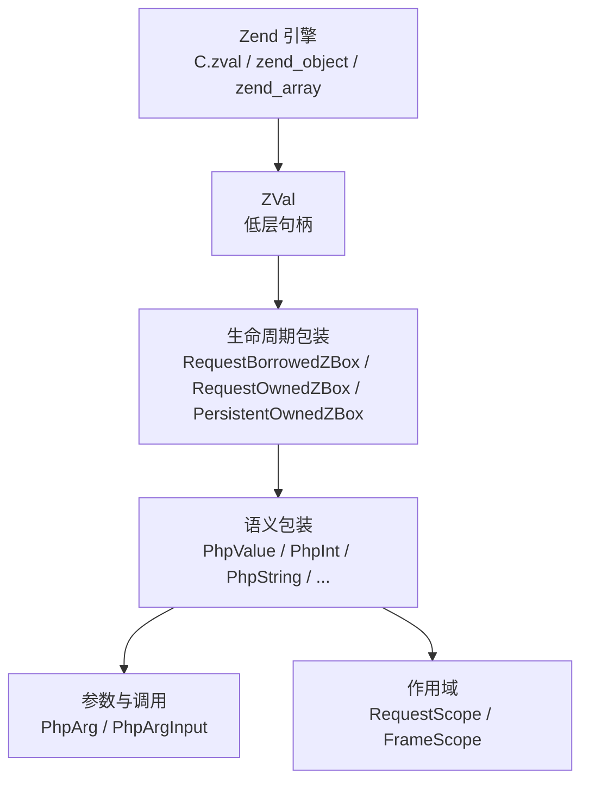
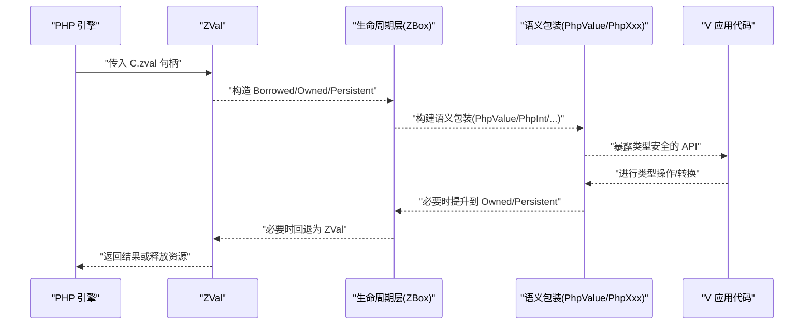
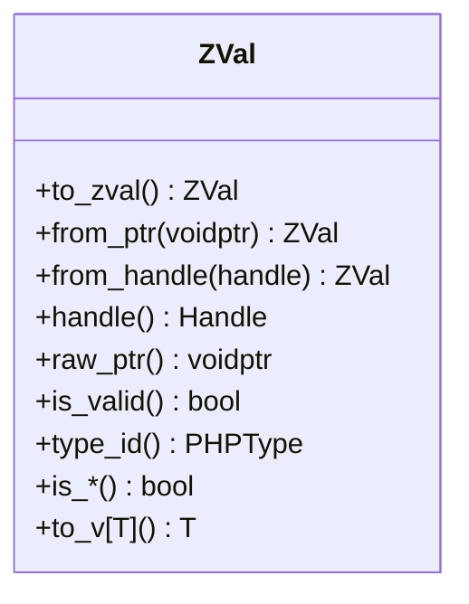
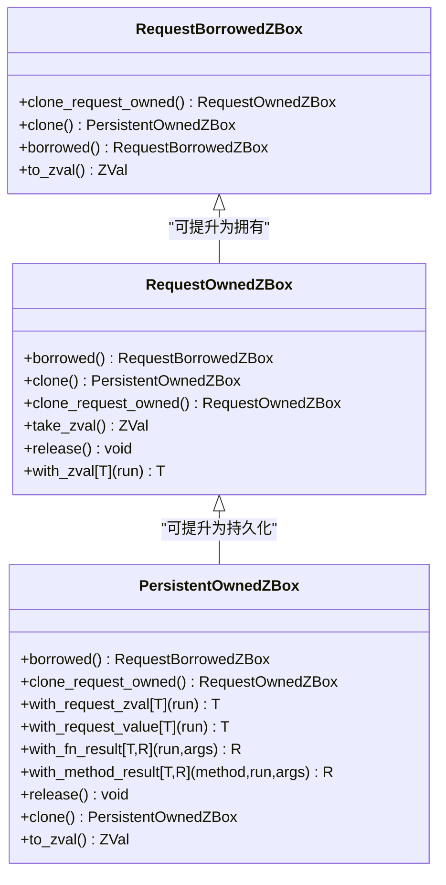
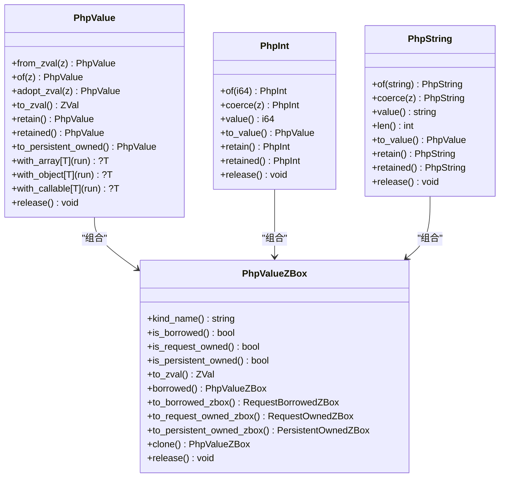
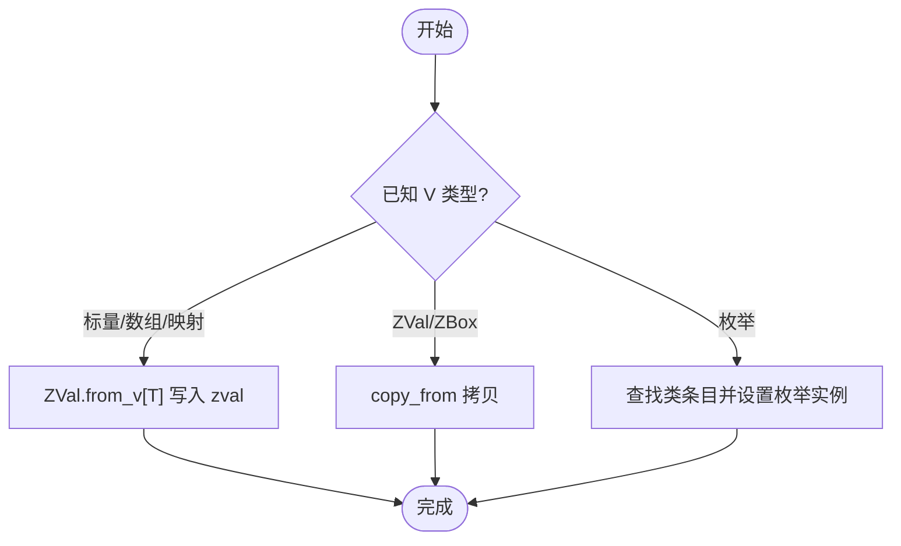
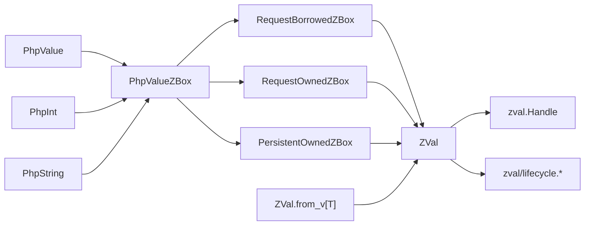

# 值模型与分层架构

<cite>
**本文引用的文件**   
- [value_layers.md](file://vphp/docs/value_layers.md)
- [zval.v](file://vphp/zval.v)
- [zval_type.v](file://vphp/zval_type.v)
- [zval_conversion.v](file://vphp/zval_conversion.v)
- [lifecycle.v](file://vphp/zval/lifecycle.v)
- [request_zbox.v](file://vphp/request_zbox.v)
- [persistent_zbox.v](file://vphp/persistent_zbox.v)
- [php_value_zbox.v](file://vphp/php_value_zbox.v)
- [php_value_type.v](file://vphp/php_value_type.v)
- [php_int_type.v](file://vphp/php_int_type.v)
- [php_string_type.v](file://vphp/php_string_type.v)
- [dyn_value_zbox.v](file://vphp/dyn_value_zbox.v)
</cite>

## 目录
1. [引言](#引言)
2. [项目结构](#项目结构)
3. [核心组件](#核心组件)
4. [架构总览](#架构总览)
5. [详细组件分析](#详细组件分析)
6. [依赖关系分析](#依赖关系分析)
7. [性能考量](#性能考量)
8. [故障排查指南](#故障排查指南)
9. [结论](#结论)
10. [附录](#附录)

## 引言
本文件聚焦于 vphp 的值模型与分层设计，围绕“ZVal → ZBox → 语义包装”的三层职责边界与类型转换规则展开。目标是在不泄露底层细节的前提下，为扩展/框架开发者提供清晰、可操作的选型与使用建议，确保生命周期安全、类型语义明确、调用路径高效。

## 项目结构
vphp 将值模型按“低层句柄 → 生命周期包装 → 语义包装”分层组织：
- 低层句柄层：ZVal（直接桥接 Zend zval）
- 生命周期层：RequestBorrowedZBox / RequestOwnedZBox / PersistentOwnedZBox（显式所有权与释放策略）
- 语义包装层：PhpValue 及 PhpInt/PhpString/PhpArray/PhpObject 等（表达 PHP 类型意图）
- 辅助层：DynValue（运行时动态值）、Scope（请求/帧级作用域）、Arg（参数元数据与输入形状）

图示来源
- [value_layers.md:18-40](file://vphp/docs/value_layers.md#L18-L40)

章节来源
- [value_layers.md:1-53](file://vphp/docs/value_layers.md#L1-L53)

## 核心组件
- ZVal：对 Zend zval 的低层封装，用于桥接与内部实现；不建议在应用层直接使用。
- ZBox 家族：为 ZVal 附加生命周期与所有权语义，区分借用视图、请求期拥有、持久化拥有三类。
- 语义包装：以 PhpValue 为核心，派生 PhpInt/PhpString/PhpArray/PhpObject 等，表达 PHP 类型意图并承载生命周期。
- DynValue：运行时动态值，便于跨边界传递与转换，支持向 ZBox 提升。
- Arg/Scope：参数元数据与临时作用域，简化调用与清理。

章节来源
- [zval.v:1-167](file://vphp/zval.v#L1-L167)
- [php_value_zbox.v:1-185](file://vphp/php_value_zbox.v#L1-L185)
- [php_value_type.v:1-260](file://vphp/php_value_type.v#L1-L260)
- [dyn_value_zbox.v:1-197](file://vphp/dyn_value_zbox.v#L1-L197)
- [value_layers.md:54-126](file://vphp/docs/value_layers.md#L54-L126)

## 架构总览
下图展示从 PHP 到 V 的完整值流转路径与各层职责边界。

图示来源
- [value_layers.md:350-398](file://vphp/docs/value_layers.md#L350-L398)
- [zval.v:1-167](file://vphp/zval.v#L1-L167)
- [php_value_type.v:1-260](file://vphp/php_value_type.v#L1-L260)

## 详细组件分析

### 低层句柄层：ZVal
- 职责：直接持有 &C.zval 指针，提供类型判断、基础读写、工厂方法等。
- 关键能力：
  - 有效性检查与类型判定（如 is_null/is_bool/is_string/is_array/is_object/is_callable 等）
  - 从指针/Handle 构造、无效值处理
  - 与生命周期层的互转入口（adopt/clone/autorelease）
- 注意事项：
  - 仅作为桥接与内部实现使用；上层应优先选择带生命周期的包装。

图示来源
- [zval.v:14-125](file://vphp/zval.v#L14-L125)
- [zval_type.v:1-110](file://vphp/zval_type.v#L1-L110)

章节来源
- [zval.v:1-167](file://vphp/zval.v#L1-L167)
- [zval_type.v:1-110](file://vphp/zval_type.v#L1-L110)

### 生命周期层：ZBox 家族
- 分类与语义：
  - RequestBorrowedZBox：借用视图，不释放
  - RequestOwnedZBox：请求期拥有，随请求结束或显式 release 释放
  - PersistentOwnedZBox：持久化拥有，需显式 release
- 典型转换：
  - borrowed ↔ request_owned ↔ persistent_owned
  - with_request_zval/with_request_value 等回调模式，避免泄漏
- 与底层交互：
  - 通过 Handle 管理内存分配/复制/释放
  - 与 RequestScope 协作自动回收请求期对象

图示来源
- [request_zbox.v:1-44](file://vphp/request_zbox.v#L1-L44)
- [persistent_zbox.v:1-154](file://vphp/persistent_zbox.v#L1-L154)
- [lifecycle.v:1-40](file://vphp/zval/lifecycle.v#L1-L40)

章节来源
- [request_zbox.v:1-44](file://vphp/request_zbox.v#L1-L44)
- [persistent_zbox.v:1-154](file://vphp/persistent_zbox.v#L1-L154)
- [lifecycle.v:1-40](file://vphp/zval/lifecycle.v#L1-L40)

### 语义包装层：PhpValue 与具体类型
- PhpValue：统一入口，承载任意 PHP 值，并提供 to_zval()/retain()/with_* 等通用 API。
- 具体类型：PhpInt/PhpString/PhpArray/PhpObject/PhpCallable/PhpResource 等，提供强类型方法与转换。
- 生命周期：内部通过 PhpValueZBox 组合三种 ZBox 形态，对外暴露一致的 retain/borrow/owned 语义。

图示来源
- [php_value_zbox.v:1-185](file://vphp/php_value_zbox.v#L1-L185)
- [php_value_type.v:1-260](file://vphp/php_value_type.v#L1-L260)
- [php_int_type.v:1-152](file://vphp/php_int_type.v#L1-L152)
- [php_string_type.v:1-163](file://vphp/php_string_type.v#L1-L163)

章节来源
- [php_value_zbox.v:1-185](file://vphp/php_value_zbox.v#L1-L185)
- [php_value_type.v:1-260](file://vphp/php_value_type.v#L1-L260)
- [php_int_type.v:1-152](file://vphp/php_int_type.v#L1-L152)
- [php_string_type.v:1-163](file://vphp/php_string_type.v#L1-L163)

### 动态值与转换：DynValue 与 from_v
- DynValue：运行时动态值，支持 is_persistent_safe 判定、字符串/数值/布尔等便捷转换，以及向 RequestOwnedZBox 提升。
- ZVal.from_v[T]：将多种 V 类型（标量、数组、映射、枚举、ZVal/ZBox 等）写入 Zend zval，是 V→Zend 的核心转换入口。

图示来源
- [dyn_value_zbox.v:1-197](file://vphp/dyn_value_zbox.v#L1-L197)
- [zval_conversion.v:1-217](file://vphp/zval_conversion.v#L1-L217)

章节来源
- [dyn_value_zbox.v:1-197](file://vphp/dyn_value_zbox.v#L1-L197)
- [zval_conversion.v:1-217](file://vphp/zval_conversion.v#L1-L217)

### 命名与边界约定
- 命名方向强调“类型语义 + 生命周期语义”，例如：
  - from_zval/from_request_owned_zbox/from_persistent_owned_zbox
  - to_zval/zval/zbox/to_request_owned/persistent_owned_zbox
  - with_result/with_method_result/_zval 后缀表示低层出口
- 原则：能用高层表达意图时，不使用更低层。

章节来源
- [value_layers.md:429-462](file://vphp/docs/value_layers.md#L429-L462)

## 依赖关系分析
- 低层依赖：ZVal 依赖 zval.Handle 与 Zend 分配/复制/释放 API。
- 生命周期层依赖：ZBox 依赖 Handle 与 RequestScope 自动回收机制。
- 语义层依赖：PhpValue/PhpXxx 组合 PhpValueZBox，再委托至对应 ZBox 变体。
- 转换层依赖：ZVal.from_v[T] 依赖各类型的 set_* 与 array_init/add_* 系列。

图示来源
- [zval.v:1-167](file://vphp/zval.v#L1-L167)
- [lifecycle.v:1-40](file://vphp/zval/lifecycle.v#L1-L40)
- [request_zbox.v:1-44](file://vphp/request_zbox.v#L1-L44)
- [persistent_zbox.v:1-154](file://vphp/persistent_zbox.v#L1-L154)
- [php_value_zbox.v:1-185](file://vphp/php_value_zbox.v#L1-L185)
- [php_value_type.v:1-260](file://vphp/php_value_type.v#L1-L260)
- [php_int_type.v:1-152](file://vphp/php_int_type.v#L1-L152)
- [php_string_type.v:1-163](file://vphp/php_string_type.v#L1-L163)
- [zval_conversion.v:1-217](file://vphp/zval_conversion.v#L1-L217)

章节来源
- [zval.v:1-167](file://vphp/zval.v#L1-L167)
- [php_value_zbox.v:1-185](file://vphp/php_value_zbox.v#L1-L185)
- [zval_conversion.v:1-217](file://vphp/zval_conversion.v#L1-L217)

## 性能考量
- 尽量复用借用视图（RequestBorrowedZBox），减少不必要的克隆。
- 仅在需要跨请求/跨作用域保存时使用 retain()/to_persistent_owned()。
- 批量构造数组/映射时，优先使用 array_init/add_assoc_* 系列，避免多次中间对象创建。
- 使用 with_result/with_method_result 等回调模式，避免显式释放临时返回值。

[本节为通用指导，无需列出具体文件来源]

## 故障排查指南
- 常见错误定位：
  - 类型不符：使用 must_from_zval 或 is_* 前置校验，避免隐式转换失败。
  - 生命周期泄漏：确认所有 Owned 路径都有 release/defer/close 配对。
  - 非法句柄：is_valid 检查后再访问，避免空指针。
- 调试建议：
  - 使用 kind_name/retain/borrow 等诊断 API 观察当前生命周期状态。
  - 借助 with_request_zval/with_request_value 在受限作用域内执行危险操作。

章节来源
- [php_int_type.v:1-152](file://vphp/php_int_type.v#L1-L152)
- [php_string_type.v:1-163](file://vphp/php_string_type.v#L1-L163)
- [php_value_type.v:1-260](file://vphp/php_value_type.v#L1-L260)
- [zval_type.v:1-110](file://vphp/zval_type.v#L1-L110)

## 结论
通过将“ZVal → ZBox → 语义包装”分层解耦，vphp 在保证与 Zend 引擎高效互操作的同时，提供了清晰的类型语义与显式的生命周期管理。遵循命名与边界约定，结合作用域与回调模式，可在复杂场景中兼顾安全性与性能。

[本节为总结性内容，无需列出具体文件来源]

## 附录
- 参考文档：值模型分层说明与常见流程
- 实践建议：优先使用语义包装与 with_* 回调；仅在桥接边界使用 _zval 低层 API。

章节来源
- [value_layers.md:1-462](file://vphp/docs/value_layers.md#L1-L462)