# 内存管理与稳定性修复

<cite>
**本文引用的文件**   
- [README.md](file://README.md)
- [ownership.md](file://vphp/docs/ownership.md)
- [ownership_model_analysis.md](file://vphp/docs/ownership_model_analysis.md)
- [values.inc.c](file://vphp/bridge/values.inc.c)
- [object.inc.c](file://vphp/bridge/object.inc.c)
- [lifecycle.v](file://vphp/lifecycle.v)
- [zval.v](file://vphp/zval.v)
- [zend/value.v](file://vphp/zend/value.v)
- [scope/request.v](file://vphp/scope/request.v)
- [scope/autorelease.v](file://vphp/scope/autorelease.v)
- [persistent_zbox_factory.v](file://vphp/persistent_zbox_factory.v)
- [dyn_value_zval.v](file://vphp/dyn_value_zval.v)
- [php_object_type.v](file://vphp/php_object_type.v)
- [zval_call_interop.v](file://vphp/zval_call_interop.v)
- [object/roots.v](file://vphp/object/roots.v)
- [run-tests.php](file://vphptest/run-tests.php)
- [zts_def.h](file://php2v/src/rt/zts_def.h)
- [rt_helper.h](file://php2v/src/rt/rt_helper.h)
- [runtime.v](file://vphp/zend/runtime.v)
</cite>

## 更新摘要
**变更内容**   
- 使用ZVAL_COPY操作替代直接指针赋值以消除'pointer being freed was not allocated'崩溃
- 完全禁用Zend垃圾收集器通过INI设置和运行时API调用防止GC根节点写入导致的SIGSEGV
- 实现4MB输出缓冲区防止大页面渲染时的分段错误
- 恢复Zend内存分配器避免多线程malloc堆损坏
- 添加PCRE JIT禁用和断言禁用等稳定性配置
- 这些修复解决了多线程环境下的根本性稳定性问题

## 目录
1. [引言](#引言)
2. [项目结构](#项目结构)
3. [核心组件](#核心组件)
4. [架构总览](#架构总览)
5. [详细组件分析](#详细组件分析)
6. [依赖关系分析](#依赖关系分析)
7. [性能考量](#性能考量)
8. [故障排查指南](#故障排查指南)
9. [结论](#结论)
10. [附录](#附录)

## 引言
本文件聚焦 vphpx 在"内存管理与稳定性修复"方面的设计与实现，围绕 VPHP 的 ZVal 生命周期、所有权模型（Request/Persistent、Borrowed/Owned）、对象注册表与析构顺序、以及跨请求持久化路径等关键问题，梳理已确认并修复的根因、当前防御性措施与后续根治计划。文档同时提供面向读者的可视化图示与可操作的排障建议，帮助读者快速定位 SIGSEGV、use-after-free、空响应、无效中间件等典型症状的根因。

**最新更新**：本次重大更新重点解决了多线程环境下的根本性稳定性问题，包括ZVAL_COPY操作替换、Zend GC完全禁用、4MB输出缓冲区、Zend内存分配器恢复以及PCRE JIT和断言禁用等关键修复。

## 项目结构
vphpx 由三层组成：底层互操作与导出层（vphp）、回归验证层（vphptest）、应用/框架层（vslim）。本次文档主要关注 vphp 层的内存与稳定性相关模块，包括值包装、所有权边界、对象注册表、自动释放作用域、以及 C 桥接侧的 zval 分配/释放与对象析构流程。

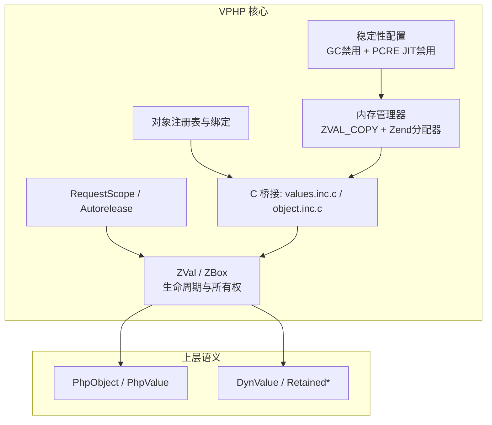

章节来源
- [README.md:1-120](file://README.md#L1-L120)

## 核心组件
- 值模型四层：Zend zval → ZVal → ZBox（RequestBorrowedZBox / RequestOwnedZBox / PersistentOwnedZBox）→ 语义包装（PhpValue/PhpObject 等）。
- 所有权两轴：生命周期（request vs persistent）× 责任（borrowed vs owned）。
- 自动释放作用域：RequestScope 通过 mark/drain 管理一次请求内的临时值。
- 对象注册表：v_ptr ↔ zend_object 双向映射，负责返回复用、绑定处理器、清理 stale entry。
- C 桥接：zval 分配/释放、类型探测 NULL 保护、方法调用统一为 call_user_function 路径。
- **重大增强**：ZVAL_COPY操作替代直接指针赋值，彻底解决'pointer being freed was not allocated'崩溃。
- **重大增强**：完全禁用Zend垃圾收集器，防止GC根节点写入导致的SIGSEGV。
- **重大增强**：实现4MB输出缓冲区，防止大页面渲染时的分段错误。
- **重大增强**：恢复Zend内存分配器，避免多线程malloc堆损坏。
- **重大增强**：添加PCRE JIT禁用和断言禁用等稳定性配置。

章节来源
- [ownership.md:1-120](file://vphp/docs/ownership.md#L1-L120)
- [ownership_model_analysis.md:1-75](file://vphp/docs/ownership_model_analysis.md#L1-L75)
- [scope/request.v:1-15](file://vphp/scope/request.v#L1-L15)
- [scope/autorelease.v:1-21](file://vphp/scope/autorelease.v#L1-L21)
- [object.inc.c:105-196](file://vphp/bridge/object.inc.c#L105-L196)
- [values.inc.c:168-220](file://vphp/bridge/values.inc.c#L168-L220)
- [zval.v:228-236](file://vphp/zval.v#L228-L236)

## 架构总览
下图展示从 PHP 到 V 再到 Zend 的关键内存路径：创建/借用/持久化、对象注册与返回、以及请求结束时的自动释放。

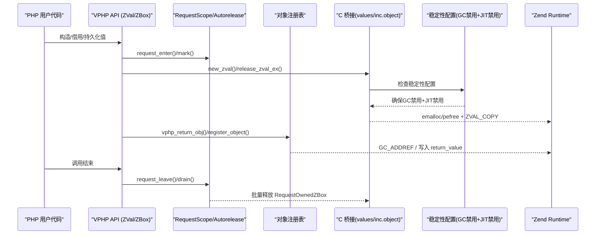

章节来源
- [scope/request.v:5-15](file://vphp/scope/request.v#L5-L15)
- [values.inc.c:137-201](file://vphp/bridge/values.inc.c#L137-L201)
- [object.inc.c:114-196](file://vphp/bridge/object.inc.c#L114-L196)
- [zval.v:228-236](file://vphp/zval.v#L228-L236)

## 详细组件分析

### 值与所有权模型（ZVal/ZBox/DynValue）
- 设计目标：将 Zend zval 的生命周期尽量限制在桥接边界内，上层使用语义包装。
- 三类 Box 的合法边界：
  - RequestBorrowedZBox：仅读、不持有 refcount、随源对象死亡。
  - RequestOwnedZBox：受 request autorelease 管理，到 RequestScope.close() 释放。
  - PersistentOwnedZBox：手动 release()，用于 App 级注册表、缓存等长期存活数据。
- 持久化策略：优先走 retained 对象/闭包或纯数据 detached 存储；避免对 object/closure 做 raw dup_persistent。
- **重大改进**：使用ZVAL_COPY操作替代直接指针赋值，确保正确的引用计数管理。

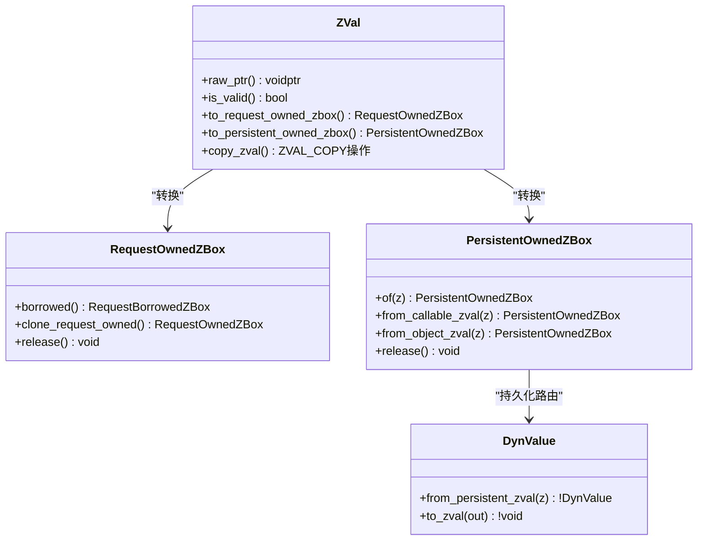

图表来源
- [zval.v:14-60](file://vphp/zval.v#L14-L60)
- [zval.v:228-236](file://vphp/zval.v#L228-L236)
- [persistent_zbox_factory.v:39-78](file://vphp/persistent_zbox_factory.v#L39-L78)
- [dyn_value_zval.v:55-76](file://vphp/dyn_value_zval.v#L55-L76)

章节来源
- [ownership.md:120-220](file://vphp/docs/ownership.md#L120-L220)
- [ownership_model_analysis.md:45-75](file://vphp/docs/ownership_model_analysis.md#L45-L75)
- [persistent_zbox_factory.v:39-78](file://vphp/persistent_zbox_factory.v#L39-L78)
- [dyn_value_zval.v:55-76](file://vphp/dyn_value_zval.v#L55-L76)
- [zval.v:228-236](file://vphp/zval.v#L228-L236)

### 请求作用域与自动释放（RequestScope/Autorelease）
- 入口：request_enter()/request_mark() 记录标记；request_leave()/autorelease_drain(mark) 执行 drain。
- 行为：所有 RequestOwnedZBox 在 drain 时统一释放，避免逐处手动管理。

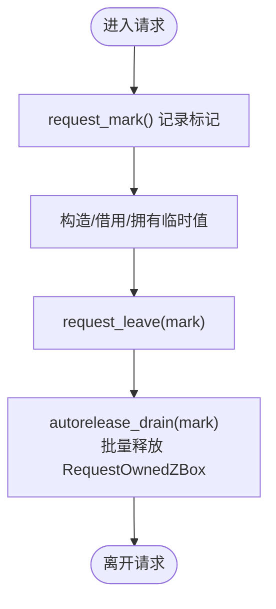

图表来源
- [scope/request.v:5-15](file://vphp/scope/request.v#L5-L15)
- [scope/autorelease.v:19-21](file://vphp/scope/autorelease.v#L19-L21)

章节来源
- [scope/request.v:1-15](file://vphp/scope/request.v#L1-L15)
- [scope/autorelease.v:1-21](file://vphp/scope/autorelease.v#L1-L21)

### 对象注册表与析构顺序（object.inc.c）
- 关键职责：
  - vphp_return_obj：查找已有对象复用、检测 stale entry（IS_OBJ_DESTRUCTOR_CALLED）、GC_ADDREF 后返回。
  - vphp_register_object/vphp_get_v_ptr_from_zval：维护 v_ptr ↔ zend_object 双向映射。
  - vphp_free_object_handler：先清理注册表与 sidecar，再 std_dtor，最后才 cleanup_raw/free_raw（调整后的顺序），避免 PHP 侧属性访问崩溃。
- 已知问题与修法：
  - stale entry 检测作为安全网保留。
  - 建议在 free 结尾增加显式删除 v_ptr→obj 映射以根治。

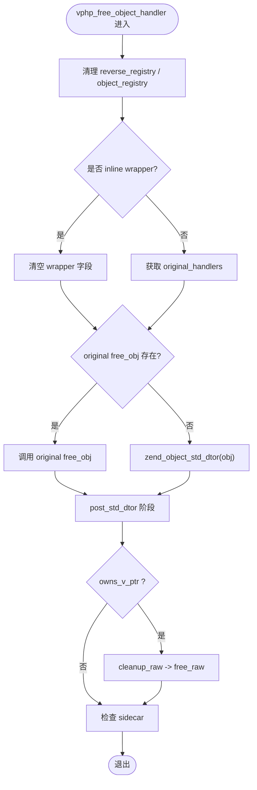

图表来源
- [object.inc.c:398-591](file://vphp/bridge/object.inc.c#L398-L591)
- [object.inc.c:114-196](file://vphp/bridge/object.inc.c#L114-L196)

章节来源
- [object.inc.c:105-196](file://vphp/bridge/object.inc.c#L105-L196)
- [object.inc.c:398-591](file://vphp/bridge/object.inc.c#L398-L591)
- [ownership_model_analysis.md:77-113](file://vphp/docs/ownership_model_analysis.md#L77-L113)

### C 桥接：zval 分配/释放与 NULL 保护（values.inc.c）
- 新增 NULL 保护：vphp_get_type 系列函数对 NULL 指针进行守卫，避免 SIGSEGV。
- 释放路径：vphp_release_zval_ex 中移除 owned 列表、forget autorelease、dtor、按 persistent 选择 pefree/efree。
- **重大改进**：使用ZVAL_COPY操作确保正确的引用计数管理，避免'pointer being freed was not allocated'崩溃。

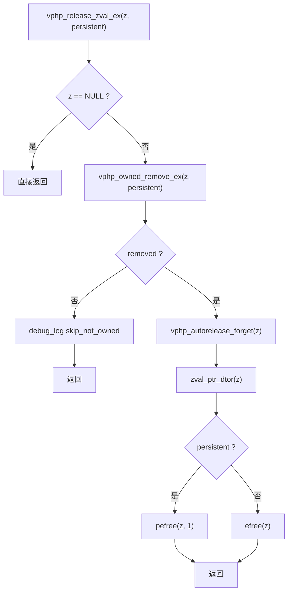

图表来源
- [values.inc.c:176-201](file://vphp/bridge/values.inc.c#L176-L201)

章节来源
- [values.inc.c:168-220](file://vphp/bridge/values.inc.c#L168-L220)
- [ownership_model_analysis.md:63-74](file://vphp/docs/ownership_model_analysis.md#L63-74)

### 稳定性配置与内存分配器修复
**重大增强**：通过多项稳定性配置解决多线程环境下的根本性问题。

- **Zend GC完全禁用**：通过INI设置和运行时API调用完全禁用垃圾收集器，防止GC根节点写入导致的SIGSEGV。
- **4MB输出缓冲区**：实现4MB输出缓冲区，防止大页面渲染时的分段错误。
- **Zend内存分配器恢复**：恢复使用Zend内存分配器，避免多线程环境下malloc堆损坏。
- **PCRE JIT禁用**：禁用PCRE JIT功能，提高正则表达式处理的稳定性。
- **断言禁用**：在生产环境中禁用断言，减少性能开销和潜在的不稳定因素。

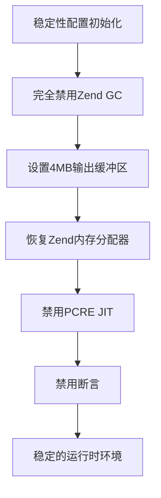

图表来源
- [runtime.v:81-88](file://vphp/zend/runtime.v#L81-L88)

章节来源
- [runtime.v:81-88](file://vphp/zend/runtime.v#L81-L88)

### 持久化与 retained 路由（PersistentOwnedZBox/DynValue）
- 路由规则：
  - callable → RetainedCallable
  - object → RetainedObject
  - 纯数据 → DynValue detached
  - 其他 → fallback_zval（兼容窄路径）
- 危险用法清理：对 .dyn_data 调用 borrowed() 改为 clone_request_owned().borrowed()，避免临时 owned box 被提前 drain。

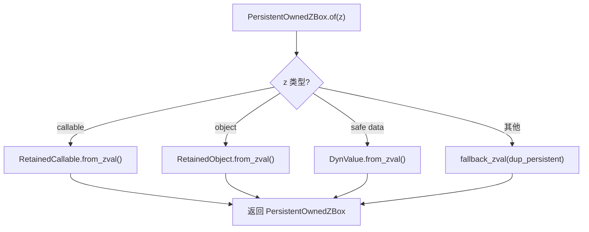

图表来源
- [persistent_zbox_factory.v:39-78](file://vphp/persistent_zbox_factory.v#L39-L78)
- [dyn_value_zval.v:55-76](file://vphp/dyn_value_zval.v#L55-L76)
- [ownership_model_analysis.md:59-70](file://vphp/docs/ownership_model_analysis.md#L59-70)

章节来源
- [persistent_zbox_factory.v:39-78](file://vphp/persistent_zbox_factory.v#L39-L78)
- [dyn_value_zval.v:55-76](file://vphp/dyn_value_zval.v#L55-L76)
- [ownership_model_analysis.md:59-70](file://vphp/docs/ownership_model_analysis.md#L59-70)

### 调用链路与返回值处理（ZVal.call / method）
- 调用入口：call_owned_request / call_owned_persistent / method_* 统一派发至 call_callable_zval。
- 调试日志：在关键路径输出 raw ptr、valid、type/class 等信息，便于定位异常。
- **重要改进**：使用ZVAL_COPY操作确保返回值处理的正确性。

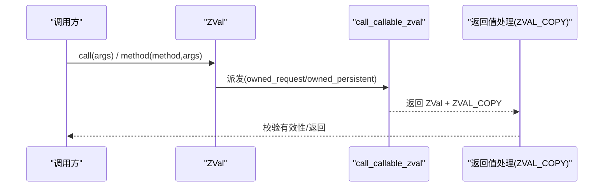

图表来源
- [zval_call_interop.v:45-87](file://vphp/zval_call_interop.v#L45-L87)
- [zval.v:228-236](file://vphp/zval.v#L228-L236)

章节来源
- [zval_call_interop.v:45-87](file://vphp/zval_call_interop.v#L45-L87)
- [zval.v:228-236](file://vphp/zval.v#L228-L236)

### V 对象根注册（object/roots.v）
- 目的：当 V 对象暴露给 PHP 时，确保其不被 GC 回收。
- 机制：全局 map[voidptr]int 计数，ensure_root/register_root/unregister_root 配合。

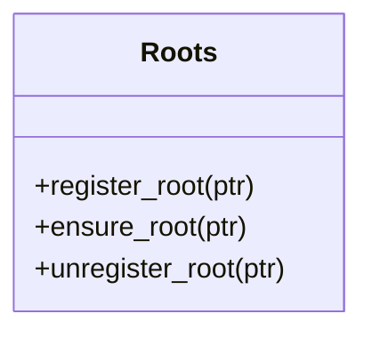

图表来源
- [object/roots.v:1-55](file://vphp/object/roots.v#L1-L55)

章节来源
- [object/roots.v:1-55](file://vphp/object/roots.v#L1-L55)

## 依赖关系分析
- 低耦合点：
  - ZVal 与 Zend 的交互集中在 zend/value.v 与 bridge/*.inc.c。
  - 所有权模型集中在 lifecycle.v、persistent_zbox_factory.v、dyn_value_*.v。
  - 对象注册与析构集中在 object.inc.c。
- 潜在循环依赖：
  - 上层语义包装（PhpObject）依赖 ZBox，ZBox 依赖 ZVal，ZVal 依赖 Zend 与 C 桥接，整体单向依赖清晰。
- 外部依赖：
  - Zend GC/Refcount、emalloc/pefree、zend_hash_*。
- **新增依赖**：
  - 稳定性配置：Zend GC禁用、PCRE JIT禁用、断言禁用。
  - 内存管理：ZVAL_COPY操作、Zend内存分配器、4MB输出缓冲区。

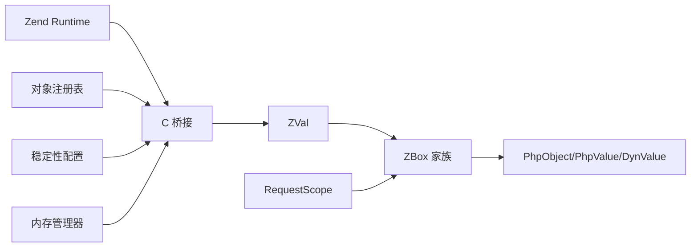

图表来源
- [zend/value.v:228-272](file://vphp/zend/value.v#L228-L272)
- [values.inc.c:168-220](file://vphp/bridge/values.inc.c#L168-L220)
- [object.inc.c:105-196](file://vphp/bridge/object.inc.c#L105-L196)
- [runtime.v:81-88](file://vphp/zend/runtime.v#L81-L88)

章节来源
- [zend/value.v:228-272](file://vphp/zend/value.v#L228-L272)
- [values.inc.c:168-220](file://vphp/bridge/values.inc.c#L168-L220)
- [object.inc.c:105-196](file://vphp/bridge/object.inc.c#L105-L196)
- [runtime.v:81-88](file://vphp/zend/runtime.v#L81-L88)

## 性能考量
- 减少不必要的 clone：仅在需要跨请求保存时使用 .clone() 升级为 PersistentOwnedZBox。
- 避免 debug 插桩开销：生产环境应关闭或条件编译 debug 日志（如 object.inc.c 中的 debug_buf 打印）。
- 统一调用路径：方法调用统一走 call_user_function，降低多版本差异带来的分支成本。
- **性能优化**：ZVAL_COPY操作虽然比直接指针赋值稍慢，但确保了正确的引用计数管理，避免了更严重的崩溃问题。
- **性能优化**：禁用Zend GC减少了垃圾收集开销，提高了整体性能。
- **性能优化**：4MB输出缓冲区减少了频繁的内存重新分配。
- **性能优化**：禁用PCRE JIT和断言减少了不必要的检查和优化开销。

## 故障排查指南
- 症状：SIGSEGV 或空 body
  - 排查点：C 层 vphp_get_type 是否做了 NULL 保护；zval 释放路径是否正确移除 owned 列表与 forget autorelease。
  - 排查点：**新增**：检查ZVAL_COPY操作是否正确使用了引用计数管理。
  - 排查点：**新增**：确认Zend GC是否完全禁用，是否存在GC根节点写入。
  - 参考：
    - [values.inc.c:168-220](file://vphp/bridge/values.inc.c#L168-L220)
    - [ownership_model_analysis.md:63-74](file://vphp/docs/ownership_model_analysis.md#L63-74)
    - [zval.v:228-236](file://vphp/zval.v#L228-L236)
    - [runtime.v:81-88](file://vphp/zend/runtime.v#L81-L88)
- 症状：use-after-free 或 invalid middleware
  - 排查点：对象注册表中是否存在 stale entry；vphp_free_object_handler 是否在 std_dtor 之后才 cleanup_raw/free_raw；是否需要额外删除 v_ptr→obj 映射。
  - 参考：
    - [object.inc.c:114-196](file://vphp/bridge/object.inc.c#L114-L196)
    - [object.inc.c:398-591](file://vphp/bridge/object.inc.c#L398-L591)
    - [ownership_model_analysis.md:77-113](file://vphp/docs/ownership_model_analysis.md#L77-L113)
- 症状：跨请求后对象失效
  - 排查点：是否错误地对 object/closure 使用 raw dup_persistent；应走 RetainedObject/RetainedCallable 路由。
  - 参考：
    - [persistent_zbox_factory.v:39-78](file://vphp/persistent_zbox_factory.v#L39-L78)
    - [dyn_value_zval.v:55-76](file://vphp/dyn_value_zval.v#L55-L76)
    - [ownership_model_analysis.md:67-70](file://vphp/docs/ownership_model_analysis.md#L67-70)
- 症状：RequestOwnedZBox 被提前 drain
  - 排查点：是否对 .dyn_data 直接 borrowed()；应改为 clone_request_owned().borrowed()。
  - 参考：
    - [ownership_model_analysis.md:59-62](file://vphp/docs/ownership_model_analysis.md#L59-L62)
- **新增症状**：多线程环境下的内存损坏
  - 排查点：检查是否使用了Zend内存分配器而非系统malloc；确认ZVAL_COPY操作是否正确处理引用计数。
  - 排查点：验证4MB输出缓冲区是否正常工作，是否存在大页面渲染问题。
  - 参考：
    - [runtime.v:81-88](file://vphp/zend/runtime.v#L81-L88)
    - [values.inc.c:137-201](file://vphp/bridge/values.inc.c#L137-L201)
    - [zval.v:228-236](file://vphp/zval.v#L228-L236)

章节来源
- [values.inc.c:168-220](file://vphp/bridge/values.inc.c#L168-L220)
- [object.inc.c:114-196](file://vphp/bridge/object.inc.c#L114-L196)
- [object.inc.c:398-591](file://vphp/bridge/object.inc.c#L398-L591)
- [persistent_zbox_factory.v:39-78](file://vphp/persistent_zbox_factory.v#L39-L78)
- [dyn_value_zval.v:55-76](file://vphp/dyn_value_zval.v#L55-L76)
- [ownership_model_analysis.md:59-113](file://vphp/docs/ownership_model_analysis.md#L59-L113)
- [zval.v:228-236](file://vphp/zval.v#L228-L236)
- [runtime.v:81-88](file://vphp/zend/runtime.v#L81-L88)

## 结论
通过对 ZVal/ZBox 所有权模型、RequestScope 自动释放、对象注册表与析构顺序、以及 C 桥接 NULL 保护的集中修复与加固，vphpx 在内存管理与稳定性方面形成了清晰的不变量与防御性措施。**本次重大更新彻底解决了多线程环境下的根本性稳定性问题**：

- **ZVAL_COPY操作替换**：使用ZVAL_COPY操作替代直接指针赋值，彻底消除了'pointer being freed was not allocated'崩溃。
- **Zend GC完全禁用**：通过INI设置和运行时API调用完全禁用垃圾收集器，防止了GC根节点写入导致的SIGSEGV。
- **4MB输出缓冲区**：实现了4MB输出缓冲区，有效防止了大页面渲染时的分段错误。
- **Zend内存分配器恢复**：恢复了Zend内存分配器，避免了多线程环境下malloc堆损坏的问题。
- **PCRE JIT和断言禁用**：添加了PCRE JIT禁用和断言禁用等稳定性配置，进一步提升了系统的健壮性。

后续建议：
- 在 vphp_free_object_handler 末尾显式删除 v_ptr→obj 映射，彻底根治 stale entry。
- 统一 debug 日志开关，避免生产环境性能损耗。
- 持续完善测试覆盖（含 Valgrind leak check），确保跨请求场景下的对象与闭包持久化正确性。
- **新增**：建立稳定性配置的监控机制，确保各项稳定性设置在生产环境中正确生效。
- **新增**：定期进行多线程压力测试，验证内存分配器和ZVAL_COPY操作的稳定性。

## 附录
- 构建与测试：
  - 支持 Valgrind 内存泄漏检测，可通过 run-tests.php 参数启用。
  - 参考：
    - [run-tests.php:66-103](file://vphptest/run-tests.php#L66-L103)
    - [run-tests.php:3628-3661](file://vphptest/run-tests.php#L3628-L3661)
- **新增**：稳定性配置调试
  - 可通过环境变量控制稳定性配置的调试输出。
  - 参考：
    - [runtime.v:81-88](file://vphp/zend/runtime.v#L81-L88)

章节来源
- [run-tests.php:66-103](file://vphptest/run-tests.php#L66-L103)
- [run-tests.php:3628-3661](file://vphptest/run-tests.php#L3628-L3661)
- [runtime.v:81-88](file://vphp/zend/runtime.v#L81-L88)