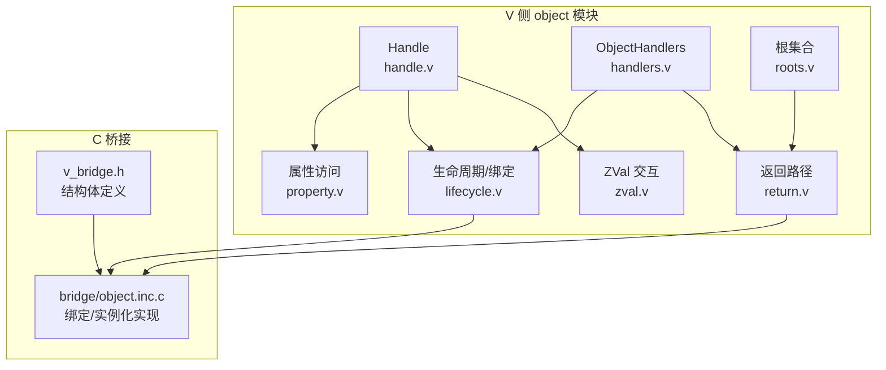
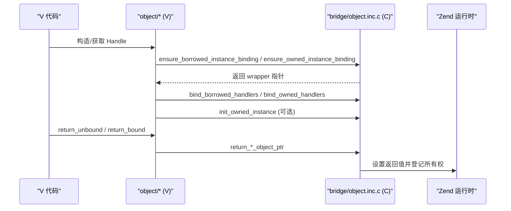
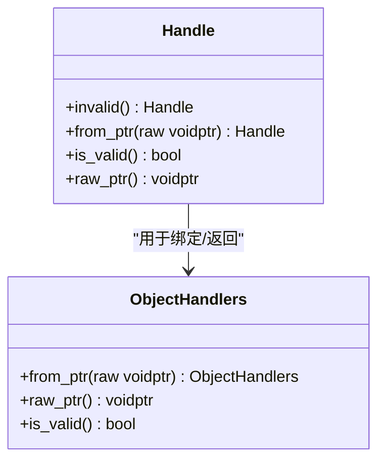
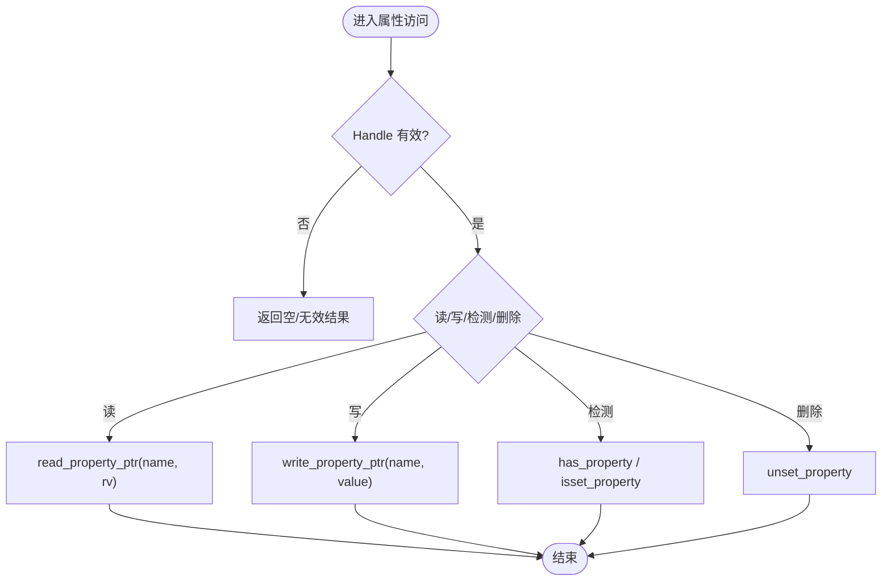
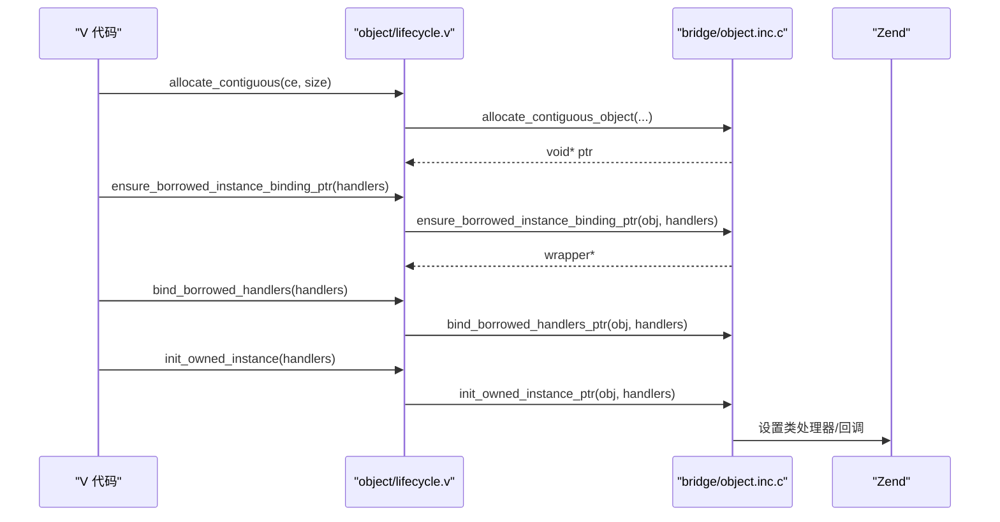
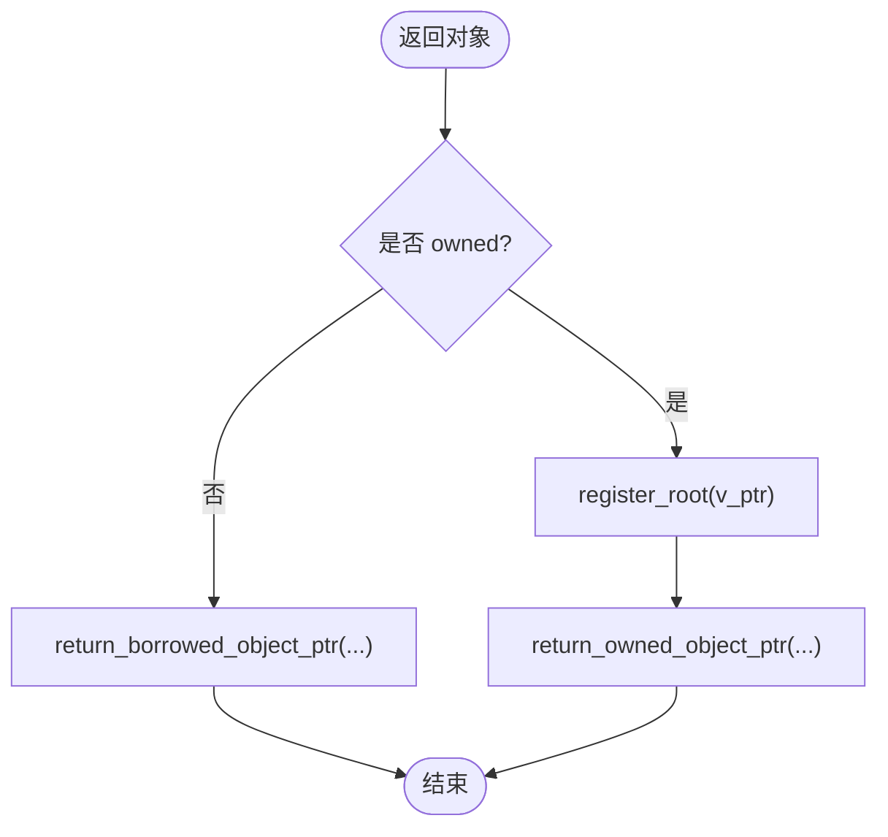
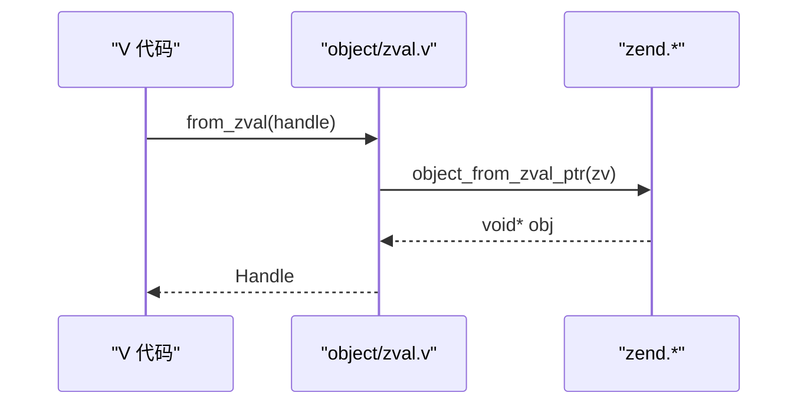
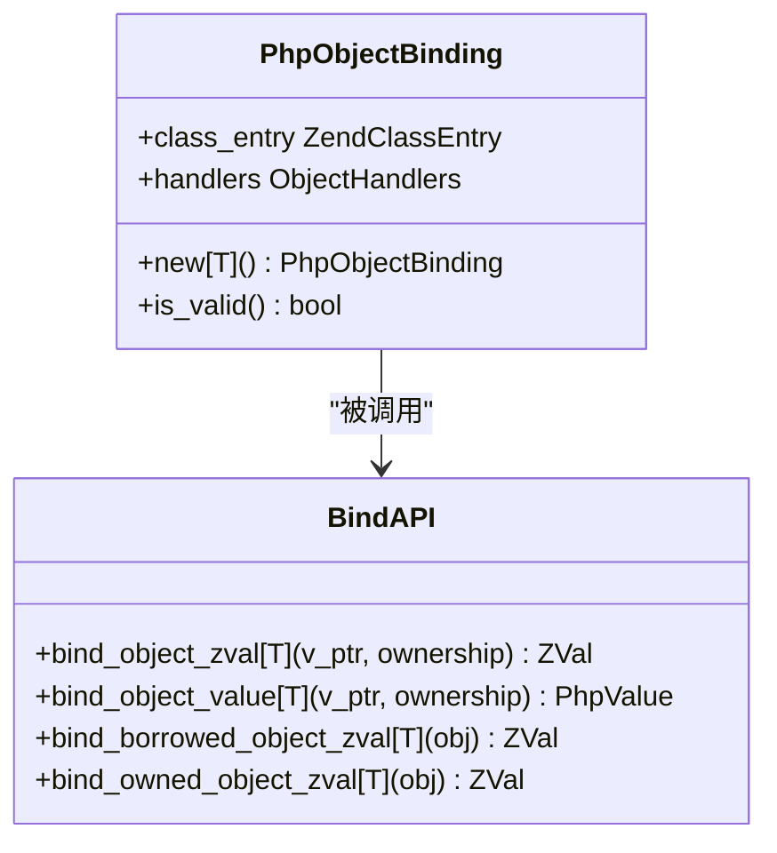
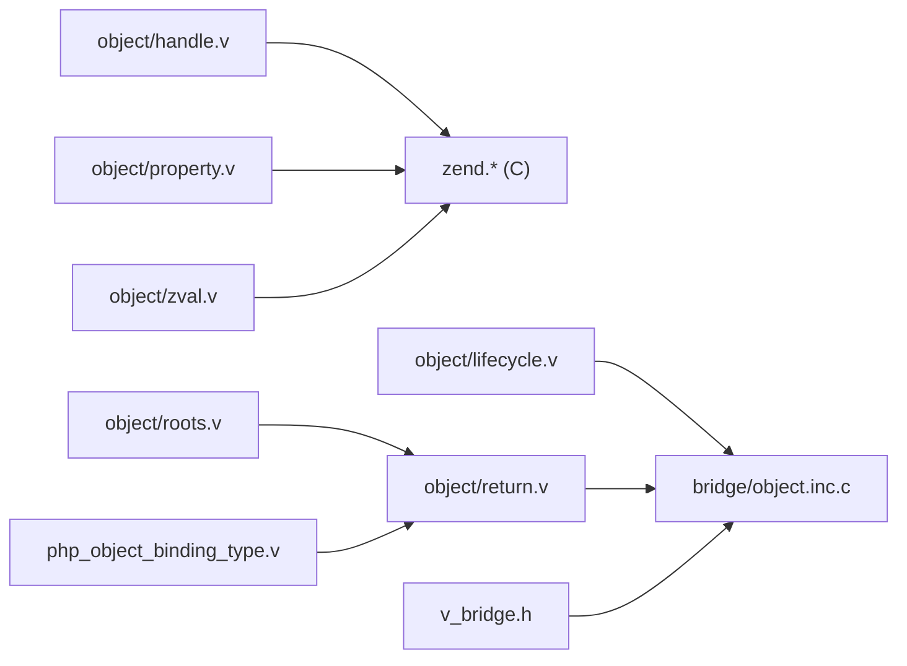

# 对象系统

<cite>
**本文引用的文件**
- [object/handle.v](file://vphp/object/handle.v)
- [object/handlers.v](file://vphp/object/handlers.v)
- [object/property.v](file://vphp/object/property.v)
- [object/lifecycle.v](file://vphp/object/lifecycle.v)
- [object/return.v](file://vphp/object/return.v)
- [object/roots.v](file://vphp/object/roots.v)
- [object/zval.v](file://vphp/object/zval.v)
- [php_object_binding_type.v](file://vphp/php_object_binding_type.v)
- [v_bridge.h](file://vphp/v_bridge.h)
- [bridge/object.inc.c](file://vphp/bridge/object.inc.c)
- [lifecycle_model.md](file://vphp/docs/lifecycle_model.md)
</cite>

## 目录
1. [简介](#简介)
2. [项目结构](#项目结构)
3. [核心组件](#核心组件)
4. [架构总览](#架构总览)
5. [详细组件分析](#详细组件分析)
6. [依赖关系分析](#依赖关系分析)
7. [性能考量](#性能考量)
8. [故障排查指南](#故障排查指南)
9. [结论](#结论)

## 简介
本章节聚焦 vphp 的 object/ 子目录，围绕“对象绑定、属性处理、handler 链、生命周期管理”四个维度进行系统化说明。该子系统负责在 V 侧对 PHP/Zend 对象进行统一抽象与操作，打通 V↔Zend 的双向互操作边界，确保对象在跨语言调用时的所有权清晰、属性访问高效、生命周期可控。

## 项目结构
object/ 子目录按职责划分：
- handle.v：对象句柄 Handle，封装底层 void* 指针并提供有效性检查
- handlers.v：ObjectHandlers，封装 C 层类处理器指针
- property.v：基于 Handle 的属性读写、存在性判断等便捷方法
- lifecycle.v：对象分配、引用计数、绑定（borrowed/owned）、实例初始化、wrapper 访问
- return.v：将 V 对象返回给 Zend 的统一入口（支持 borrowed/owned）
- roots.v：V 侧根集合，用于 owned 对象的根注册与释放
- zval.v：ZVal 与对象句柄之间的转换与包装

图示来源
- [object/handle.v:1-24](file://vphp/object/handle.v#L1-L24)
- [object/handlers.v:1-21](file://vphp/object/handlers.v#L1-L21)
- [object/property.v:1-37](file://vphp/object/property.v#L1-L37)
- [object/lifecycle.v:1-64](file://vphp/object/lifecycle.v#L1-L64)
- [object/return.v:1-25](file://vphp/object/return.v#L1-L25)
- [object/roots.v:1-55](file://vphp/object/roots.v#L1-L55)
- [object/zval.v:1-19](file://vphp/object/zval.v#L1-L19)
- [v_bridge.h:14-35](file://vphp/v_bridge.h#L14-L35)
- [bridge/object.inc.c:771-874](file://vphp/bridge/object.inc.c#L771-L874)

章节来源
- [object/handle.v:1-24](file://vphp/object/handle.v#L1-L24)
- [object/handlers.v:1-21](file://vphp/object/handlers.v#L1-L21)
- [object/property.v:1-37](file://vphp/object/property.v#L1-L37)
- [object/lifecycle.v:1-64](file://vphp/object/lifecycle.v#L1-L64)
- [object/return.v:1-25](file://vphp/object/return.v#L1-L25)
- [object/roots.v:1-55](file://vphp/object/roots.v#L1-L55)
- [object/zval.v:1-19](file://vphp/object/zval.v#L1-L19)

## 核心组件
- Handle：统一的对象句柄类型，提供无效值构造、从原始指针构造、有效性判断与原始指针访问。所有上层能力均建立在 Handle 之上。
- ObjectHandlers：封装 C 层类处理器指针，供绑定与返回阶段使用。
- 属性访问：通过 Handle 暴露 read/write/has/isset/unset 等方法，内部委托至 zend.* 低层 API。
- 生命周期：提供分配、引用计数、绑定（borrowed/owned）、实例初始化、wrapper 与 v_ptr 访问。
- 返回路径：将 V 对象以 borrowed 或 owned 语义返回到 Zend，owned 时自动注册为根。
- 根集合：维护 V 侧全局 map，记录 owned 对象的引用计数，配合请求作用域完成释放。
- ZVal 交互：从 zval.Handle 提取对象句柄，或将已有 zval 包装为现有对象。

章节来源
- [object/handle.v:1-24](file://vphp/object/handle.v#L1-L24)
- [object/handlers.v:1-21](file://vphp/object/handlers.v#L1-L21)
- [object/property.v:1-37](file://vphp/object/property.v#L1-L37)
- [object/lifecycle.v:1-64](file://vphp/object/lifecycle.v#L1-L64)
- [object/return.v:1-25](file://vphp/object/return.v#L1-L25)
- [object/roots.v:1-55](file://vphp/object/roots.v#L1-L55)
- [object/zval.v:1-19](file://vphp/object/zval.v#L1-L19)

## 架构总览
下图展示了 V 侧 object 模块与 C 桥接层的交互关系，以及对象从创建、绑定到返回的关键路径。

图示来源
- [object/lifecycle.v:34-55](file://vphp/object/lifecycle.v#L34-L55)
- [object/return.v:10-24](file://vphp/object/return.v#L10-L24)
- [bridge/object.inc.c:771-874](file://vphp/bridge/object.inc.c#L771-L874)

## 详细组件分析

### 对象句柄与处理器
- Handle：提供 invalid/from_ptr/is_valid/raw_ptr 等基础能力，是后续所有操作的输入。
- ObjectHandlers：仅持有 C 层处理器指针，提供 raw_ptr/is_valid 以便生命周期与返回路径使用。

图示来源
- [object/handle.v:1-24](file://vphp/object/handle.v#L1-L24)
- [object/handlers.v:1-21](file://vphp/object/handlers.v#L1-L21)

章节来源
- [object/handle.v:1-24](file://vphp/object/handle.v#L1-L24)
- [object/handlers.v:1-21](file://vphp/object/handlers.v#L1-L21)

### 属性处理
属性访问通过 Handle 扩展方法实现，内部委托至 zend.* 函数族：
- read_property/read_property_ptr：读取属性，返回 ReadResult 或直接返回 zval 指针
- write_property_ptr：写入属性
- has_property/isset_property/unset_property：存在性与销毁

图示来源
- [object/property.v:6-36](file://vphp/object/property.v#L6-L36)

章节来源
- [object/property.v:1-37](file://vphp/object/property.v#L1-L37)

### 生命周期与绑定
生命周期管理包含以下关键流程：
- 分配与释放：allocate_contiguous/runtime_free
- 引用计数：add_ref/release
- 绑定处理器：bind_borrowed_handlers/bind_owned_handlers
- 确保实例绑定：ensure_borrowed_instance_binding_ptr/ensure_owned_instance_binding_ptr
- 初始化已拥有实例：init_owned_instance
- Wrapper 访问：wrapper_ptr/bound_v_ptr

图示来源
- [object/lifecycle.v:10-63](file://vphp/object/lifecycle.v#L10-L63)
- [bridge/object.inc.c:771-874](file://vphp/bridge/object.inc.c#L771-L874)

章节来源
- [object/lifecycle.v:1-64](file://vphp/object/lifecycle.v#L1-L64)

### 返回路径与根注册
返回路径根据所有权策略决定行为：
- return_unbound：直接返回未绑定的对象
- return_bound：根据 borrowed/owned 选择不同返回函数；owned 时先 register_root 再返回

图示来源
- [object/return.v:10-24](file://vphp/object/return.v#L10-L24)
- [object/roots.v:7-20](file://vphp/object/roots.v#L7-L20)

章节来源
- [object/return.v:1-25](file://vphp/object/return.v#L1-L25)
- [object/roots.v:1-55](file://vphp/object/roots.v#L1-L55)

### ZVal 交互
- from_zval：从 zval.Handle 提取对象句柄
- wrap_existing_zval：将已有 zval 包装为现有对象

图示来源
- [object/zval.v:6-11](file://vphp/object/zval.v#L6-L11)

章节来源
- [object/zval.v:1-19](file://vphp/object/zval.v#L1-L19)

### 高层绑定封装
php_object_binding_type.v 提供了面向泛型的绑定封装，简化了将 V 对象绑定为 PHP 对象的过程，并统一了 borrowed/owned_request 的语义。

图示来源
- [php_object_binding_type.v:5-59](file://vphp/php_object_binding_type.v#L5-L59)

章节来源
- [php_object_binding_type.v:1-59](file://vphp/php_object_binding_type.v#L1-L59)

## 依赖关系分析
- object/* 模块依赖 zend.* 低层 API 完成与 Zend 的交互
- bridge/object.inc.c 实现了具体的绑定、实例化与返回逻辑
- v_bridge.h 定义了对象包装器与类处理器结构体，贯穿 V/C 两侧

图示来源
- [object/property.v:1-37](file://vphp/object/property.v#L1-L37)
- [object/lifecycle.v:1-64](file://vphp/object/lifecycle.v#L1-L64)
- [object/return.v:1-25](file://vphp/object/return.v#L1-L25)
- [object/roots.v:1-55](file://vphp/object/roots.v#L1-L55)
- [object/zval.v:1-19](file://vphp/object/zval.v#L1-L19)
- [php_object_binding_type.v:1-59](file://vphp/php_object_binding_type.v#L1-L59)
- [v_bridge.h:14-35](file://vphp/v_bridge.h#L14-L35)
- [bridge/object.inc.c:771-874](file://vphp/bridge/object.inc.c#L771-L874)

章节来源
- [object/property.v:1-37](file://vphp/object/property.v#L1-L37)
- [object/lifecycle.v:1-64](file://vphp/object/lifecycle.v#L1-L64)
- [object/return.v:1-25](file://vphp/object/return.v#L1-L25)
- [object/roots.v:1-55](file://vphp/object/roots.v#L1-L55)
- [object/zval.v:1-19](file://vphp/object/zval.v#L1-L19)
- [php_object_binding_type.v:1-59](file://vphp/php_object_binding_type.v#L1-L59)
- [v_bridge.h:14-35](file://vphp/v_bridge.h#L14-L35)
- [bridge/object.inc.c:771-874](file://vphp/bridge/object.inc.c#L771-L874)

## 性能考量
- 属性访问尽量使用 read_property_ptr/write_property_ptr 以减少中间拷贝
- 避免重复绑定：同一对象多次绑定应复用已有 wrapper，减少 handler 覆盖开销
- owned 对象仅在必要时注册为根，避免不必要的根集合增长
- 合理使用 borrowed 语义以降低所有权转移成本

[本节为通用指导，不直接分析具体文件]

## 故障排查指南
- 对象无效：检查 Handle.is_valid 与 ObjectHandlers.is_valid，确认原始指针非零
- 属性访问异常：核对属性名大小写与可见性，确认 zend.has_property/isset_property 的行为
- 生命周期泄漏：确认 owned 对象是否在请求结束时被 drain，检查 roots 计数是否正确递减
- 绑定冲突：避免在同一对象上混用 borrowed 与 owned 绑定导致所有权不一致

章节来源
- [object/handle.v:17-23](file://vphp/object/handle.v#L17-L23)
- [object/handlers.v:18-20](file://vphp/object/handlers.v#L18-L20)
- [object/roots.v:38-54](file://vphp/object/roots.v#L38-L54)

## 结论
object/ 子目录围绕 Handle 与 ObjectHandlers 构建了统一的对象抽象，并通过 lifecycle 与 return 模块明确了 borrowed/owned 的所有权模型。属性处理与 ZVal 交互则提供了高效的跨语言访问通道。结合 C 桥接层的绑定与实例化实现，整个对象系统在 V↔Zend 边界上具备清晰的职责划分与可控的生命周期。