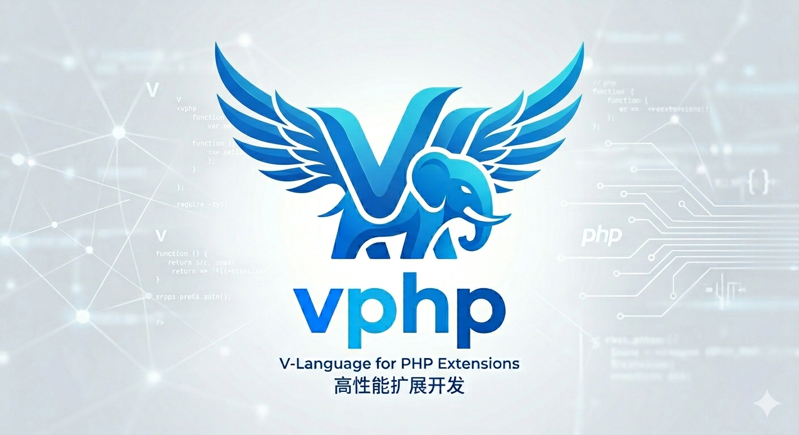

# vphpx

`vphpx` 是一套用 V 构建 PHP 扩展、PHP 运行时桥接和上层框架的工程栈。

它想解决的不是“再写一个 PHP 扩展脚手架”，而是这几个更大的问题：

- 能不能让 V 成为 PHP 的实现语言之一，而不是只能写 C
- 能不能把 Zend 生命周期、对象桥接、导出 glue 这些脏活压到一层稳定边界里
- 能不能在这层边界之上，继续往上长出真正可用的框架和应用模板

如果一句话概括：

- `vphpx` = 用 V 连接 Zend，并在这个连接之上继续构建 PHP 应用栈

## 这个仓库的价值

如果你只是想“写一个 C 扩展的替代品”，市面上已经有成熟方案，比如 PHP-CPP 或 ext-php-rs。

`vphpx` 的差异不只是语言换成 V，而是它把事情做成了三层：

1. `vphp`
   负责 V 和 Zend/PHP 之间的语言桥接、导出、生命周期模型、编译 glue。
2. `vphptest`
   负责把底层 interop 能力变成可验证、可回归的扩展试验场。
3. `vslim`
   负责证明这套桥接不只是能跑 demo，而是真的能支撑一个带 HTTP、CLI、Container、PSR 能力的框架。

也就是说，这不是一个单点库，而是一条完整的技术路径：

- 从底层 `ZVal` / ownership / export
- 到中间层回归与 bridge 验证
- 再到上层 PHP-facing framework

## 仓库结构

### `vphp/`

核心价值是：

- 导出 V 函数、类、trait、interface、enum 到 PHP
- 从 V 调 PHP 函数、类、对象、属性、常量
- 管理 `ZVal` 与 ownership/lifetime 边界
- 生成扩展 glue 和运行时桥接代码

现在主模型已经收成：

- `ZVal`
  低层 raw Zend 能力
- `RequestBorrowedZBox`
- `RequestOwnedZBox`
- `PersistentOwnedZBox`

以及长期持有的智能分发：

- 纯数据 -> `dyn_data`
- 对象 -> `retained_object`
- callable -> `retained_callable`
- 兜底 -> `fallback_zval`

如果你想理解这套技术栈最底层的设计，从这里开始。

入口文档：

- [vphp/README.md](/Users/guweigang/Source/vphpx/vphp/README.md)
- [vphp/docs/OVERVIEW.md](/Users/guweigang/Source/vphpx/vphp/docs/OVERVIEW.md)
- [vphp/ownership.md](/Users/guweigang/Source/vphpx/vphp/ownership.md)

### `vphptest/`

核心价值是：

- 把 `vphp` 的 interop 能力做成一个真实扩展
- 用 PHPT 和桥接样例把底层行为锁住
- 作为 compiler/glue/runtime 的回归试验场

它不是给最终用户的框架，更像是：

- `vphp` 的验证跑道
- `ZVal` / closure / object / callable / export 行为的回归场

当我们改 ownership、compiler、bridge、codegen 时，最先该看的就是这里。

典型用途：

- 验证 raw `ZVal` 行为
- 验证导出函数、类、接口
- 验证 closure / callable / object bridge
- 验证 compiler 生成 glue 是否还正确

### `vslim/`

核心价值是：

- 证明 `vphp` 不只是能导出函数，而是真的能支撑应用层框架
- 给 PHP 用户提供熟悉的 app / route / middleware / container / CLI 体验
- 把这套底层桥接推进到 PSR、HTTP、CLI、View、WebSocket、MCP 等真实场景

`vslim` 现在已经不只是 demo，已经覆盖：

- `VSlim\App`
- `VSlim\Cli\App`
- `VSlim\Container`
- `VSlim\Config`
- `VSlim\Psr7/*`
- `PSR-11 / 14 / 15 / 16 / 17 / 18 / 20`
- View / MVC / WebSocket / MCP 等扩展原生能力

如果你关心“这套桥接在真实 PHP 框架里到底能不能成立”，就看这里。

入口文档：

- [vslim/README.md](/Users/guweigang/Source/vphpx/vslim/README.md)

## 适合谁

这个仓库最适合这几类人：

- 想用 V 写 PHP 扩展，而不是直接下场写 Zend C
- 想研究 V <-> PHP 的语言桥接和生命周期模型
- 想在扩展层做 framework/runtime，而不只是暴露几个函数
- 想给 PHP 提供原生对象、路由、CLI、PSR 组件，而底层实现写在 V

如果你只想：

- 很快包一层已有 C++ 代码给 PHP
- 或单纯追求 Rust 风格扩展开发

那 PHP-CPP / ext-php-rs 可能更直接。

但如果你的目标是：

- 让 V 真正进入 Zend 世界
- 再在其上继续长出框架和应用栈

`vphpx` 才是更对口的方向。

## 推荐阅读顺序

如果你第一次进这个仓库，建议按这个顺序：

1. 先看这份 README，建立整体地图
2. 看 [vphp/README.md](/Users/guweigang/Source/vphpx/vphp/README.md)
3. 看 [vphp/ownership.md](/Users/guweigang/Source/vphpx/vphp/ownership.md)
4. 看 [vphptest/tests](/Users/guweigang/Source/vphpx/vphptest/tests)
5. 再看 [vslim/README.md](/Users/guweigang/Source/vphpx/vslim/README.md)

这样你会先知道：

- 底层是怎么桥的
- 中间怎么验证
- 上层怎么落成框架

## 当前仓库状态

这个仓库来自 `vphpext` 的拆分，目前主线已经比较明确：

- `ZVal` 只保留低层 raw Zend 能力
- `*ZBox` 是主 ownership/lifetime 模型
- `vphptest` 负责底层回归
- `vslim` 负责应用层验证

也就是说，`vphpx` 现在不是一个“只有零散实验代码”的仓库，而是已经形成了：

- 核心桥接层
- 回归验证层
- 框架落地层

## 本地布局

当前默认的兄弟目录布局仍然是：

- `/Users/guweigang/Source/vphpx`
- `/Users/guweigang/Source/vhttpd`
- `/Users/guweigang/Source/vshx`

有些集成文档和测试还沿用了老 monorepo 习惯，后续会继续清理，但不影响你理解 `vphpx` 这三个子项目各自的职责。
