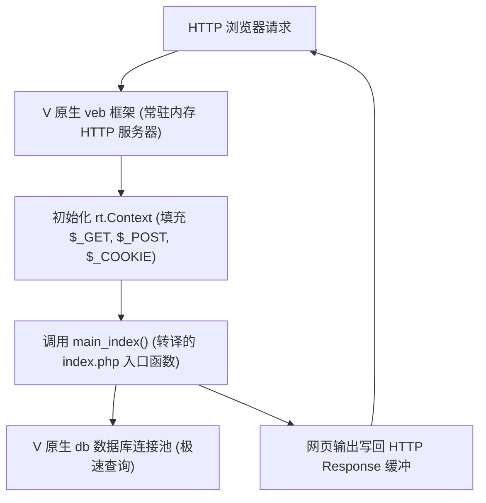

# WordPress 转译架构升级设计计划

用户针对 WordPress 转译提出了三项极其精准、深刻的重大架构优化意见：
1. **引入 veb 和 db 等 V 原生组件**：使转译出的项目真正成为一个拥有常驻连接池与 HTTP Server 的高并发网站。
2. **分离核心与动态资产（主题与插件）**：主题和插件不要转成静态 V，而应该通过动态解释/沙箱机制执行，保障扩展性。
3. **消除每个转译文件中的 `main` 函数**：支持库/模块编译模式，消除 main 冲突，实现整体打包。
4. **多 module 折分**：对于 wp-admin、wp-content、wp-includes 划分为 3 个 module，如果 V 的 module 不支持 "-" 符号，以用 "_" 替代。

本计划将围绕上述三点重构 `php2v` 的代码生成机制与 VPHP 运行时体系。

注意：
- 本地 wordpress 源码位置：`~/wwwroot/wordpress/`
- 转换的 V 源码位置：`~/wwwroot/wordpress_v/`

---

## 架构方案设计

### 1. 消除转译文件中的 `main` 函数与多 module 拆分
目前 `php2v` 默认对每个文件都生成独立的 `fn main()`。为了使转译出的整个项目可被统一编译，我们将 `php2v` 重构为支持两种编译模式：

1. **单脚本模式 (Single File Mode)**：
   * 用于测试用例（如回归测试）或单独小工具，保持生成 `fn main()`。
2. **项目模块模式 (Project Module Mode)**：
   * 转译出来的非入口文件（如被包含的 `blocks.php` 等）**不生成 `fn main()` 声明**。
   * 根据文件所在的文件夹结构生成对应的子模块：
     * 位于 `wp-includes/` 下的文件，第一行生成 `module wp_includes`。
     * 位于 `wp-admin/` 下的文件，第一行生成 `module wp_admin`。
     * 位于 `wp-content/` 下的文件（如有转译资产），第一行生成 `module wp_content`。
     * 每一个 module 提供统一的“初始化入口”（例如 `wp_includes.init_all()`），在主入口 `main.v` 里按依赖关系顺序去初始化这些 module。
   * `php2v` 的命令行将新增 `-mode [exe|lib]` 选项来控制此项生成。

### 2. 引入 `veb` 和数据库连接池：打造常驻常新高性能 Web 服务器
为了让转译出的 WordPress 能够作为一个真正的常驻网站运行，运行时 `rt` 模块与编译模式将进行如下升级：



* **Veb 框架整合**：以 V 原生的 `veb` 库作为前端网关，通过常驻协程/线程监听 HTTP 请求，收到请求后填充 `rt.Context` 变量上下文，并在内存中直接调度调用主入口 V 函数，彻底免除传统 PHP 每次请求拉起新进程或解释器的巨大开销。
* **数据库连接池**：在 `rt` 模块中实现 `PDO` / `mysqli` 的 V 语言底层重构，让数据库连接不再是“每次请求打开/关闭”，而是**共用一个全局长连接池**，使数据库查询拥有数十倍的吞吐率。

这个思路很清晰，V 的生态基本能覆盖：

| PHP 机制 | V 替代方案 |
|---------|-----------|
| MySQL/PDO | `vlib/db/mysql` |
| 正则 `preg_*` | `vlib/regex` 或 `pcre` |
| 文件系统 `file_*` | `vlib/os` |
| HTTP Server | `Veb` |
| 类继承 | ✅ 已实现 (`class entry`) |

### 3. 系统上下文与依赖初始化

```
当前 WordPress 转译结果：
wp-settings.v  ← 各自独立文件
functions.v    ← 互不认识
class-wpdb.v
...
↓ 想要的：
[Veb App]
  main.v  ←── 引导所有初始化
    ├── 调用 wp_includes.init_all() (包含 functions 等)
    ├── 调用 wp_admin.init_all()
    ├── 初始化全局 RequestContext 并建立数据库连接池
    └── 注册 Veb 路由 → WordPress 请求分发
```

核心挑战有两个：

** 1. 全局状态隔离与上下文管理**
PHP 的 `$wpdb`、`$wp_query` 等是真正的全局变量，跨文件共享。V 需要一个显式的 context struct：

```v
// vphpx/rt/context.v
pub struct Context {
pub mut:
    // HTTP 超全局状态（由 Veb 注入）
    method      string
    uri         string
    query       map[string]PhpVal   // $_GET
    post        map[string]PhpVal   // $_POST
    cookies     map[string]PhpVal   // $_COOKIE
    files       map[string]PhpVal   // $_FILES
    server      map[string]PhpVal   // $_SERVER
    // PHP 全局状态，替代原有的可变全局变量
    globals     map[string]PhpVal   // $GLOBALS
    // 输出缓冲控制
    ob_stack    []strings.Builder   // ob_start/ob_end_clean
    // 会话数据
    session     map[string]PhpVal   // $_SESSION
    // Embedded PHP bridge（插件/主题用）
    php_bridge  &EmbeddedPhpBridge
}
```

** 2. 静态化 require_once 依赖图**
WordPress 的 `require_once` 绝大多数是静态可分析的路径。转译阶段我们会建立源文件的依赖树，在 V 的 module init 阶段按拓扑排序进行初始化加载，避免运行时重复包含开销。

### 4. 主题与插件：核心静态编译 + 动态沙箱解释互操作
由于插件和主题要求在后台支持动态下载、安装和热启用，我们无法将它们编译进主 V 二进制。我们采用**混合双轨制 (Hybrid Dual-Track System)**：

* **WordPress 核心**：完全转译成静态、高效的 V 语言二进制，处理路由、主循环、用户系统及核心 API。
* **插件与主题**：保留其原始 PHP 代码，由 V 运行时集成的轻量级嵌入式 PHP 解释器（基于 Zend VM 的 libphp 库，通过 V 语言 FFI 绑定加载）执行。
* **跨语言互操作 (V ↔ PHP FFI Bridge)**：
  * V 核心提供 `add_action`、`add_filter`、`do_action` 的桥接接口。
  * 数据类型装箱转换：V 语言的 `rt.PhpVal` 和 Zend VM 的 `zval` 结构体进行内存映射与无缝的数据拷贝交互。
  * 性能优势：V 核心进行高性能计算与核心拦截，仅在必要处通过 FFI 穿透调用 PHP 插件代码，既保留了 100% 生态兼容性，又极大地提升了系统的底层性能。

```v
// Hook 系统跨越 V ↔ PHP 边界
pub struct EmbeddedPhpBridge {
mut:
    // 已注册的 hooks（PHP 侧 add_action/add_filter）
    actions  map[string][]PhpCallable
    filters  map[string][]PhpCallable
    // PHP interpreter 实例 (libphp FFI 句柄)
    php_vm   voidptr
}

// V Core 触发 hook，PHP 插件代码响应
pub fn (mut b EmbeddedPhpBridge) do_action(hook string, args ...PhpVal) {
    // 调用 FFI 将 args 转换为 zval 列表，并执行 Zend VM 中的对应 action
}

pub fn (mut b EmbeddedPhpBridge) apply_filters(hook string, val PhpVal) PhpVal {
    // 调用 FFI 过滤值并接收 Zend VM 的返回值，转回 PhpVal
}
```

### 5. 路由分配与伪静态
对于 WordPress 的动态伪静态路由，在 V 语言 `veb` 侧生成高效路由匹配树，从而免去复杂的正则重写规则在大循环中的匹配开销。

---

## 用户审核要求

> [!IMPORTANT]
> 这是一个重大的架构性调整：
> 1. 为了保持对原本 `make test` 回归测试用例的绝对向后兼容，`php2v` 的默认输出模式依然是 `exe` 单文件模式，当且仅当传入 `-mode lib` 或 `-mode project` 时才进入模块化编译。
> 2. 为避免破坏现有的 `rt` 库，我们将在 `rt` 内部额外新增并隔离支持 `veb` 上下文的 `rt.Context` 结构体，以及面向原生 `mysql` 的全局连接池包装器，确保核心模块高内聚。

---

## 实施步骤

1. **第一阶段：消灭 V 编译错误（正在进行中）**
   * 目标：使 `wp-includes` 核心公共文件（如 `functions.php` 等）在 V 语言中能无错编译。
2. **第二阶段：支持 -mode lib 并实现 Module 分拆**
   * 修改 `php2v` 输出，支持将 `wp-includes`、`wp-admin` 等按模块划分子目录并定义 `module` 命名空间。
3. **第三阶段：实现 RequestContext 与 Veb Web 服务接入**
   * 设计并落地 `rt.Context`，为 `veb` 编写生命周期挂载插件，替代 PHP 全局 `$GLOBALS`，实现入口引导。
4. **第四阶段：集成 Embedded PHP Bridge (Zend FFI)**
   * 用 V 编写 PHP `zval` 到 `rt.PhpVal` 的 FFI 通信模块，提供 FFI hook 桥接。
5. **第五阶段：运行时内置函数库 (rt) 补全与端到端测试**
   * 补全常用的 `db/mysql`、`regex` 等 API，运行 WordPress 端到端核心业务逻辑流。
