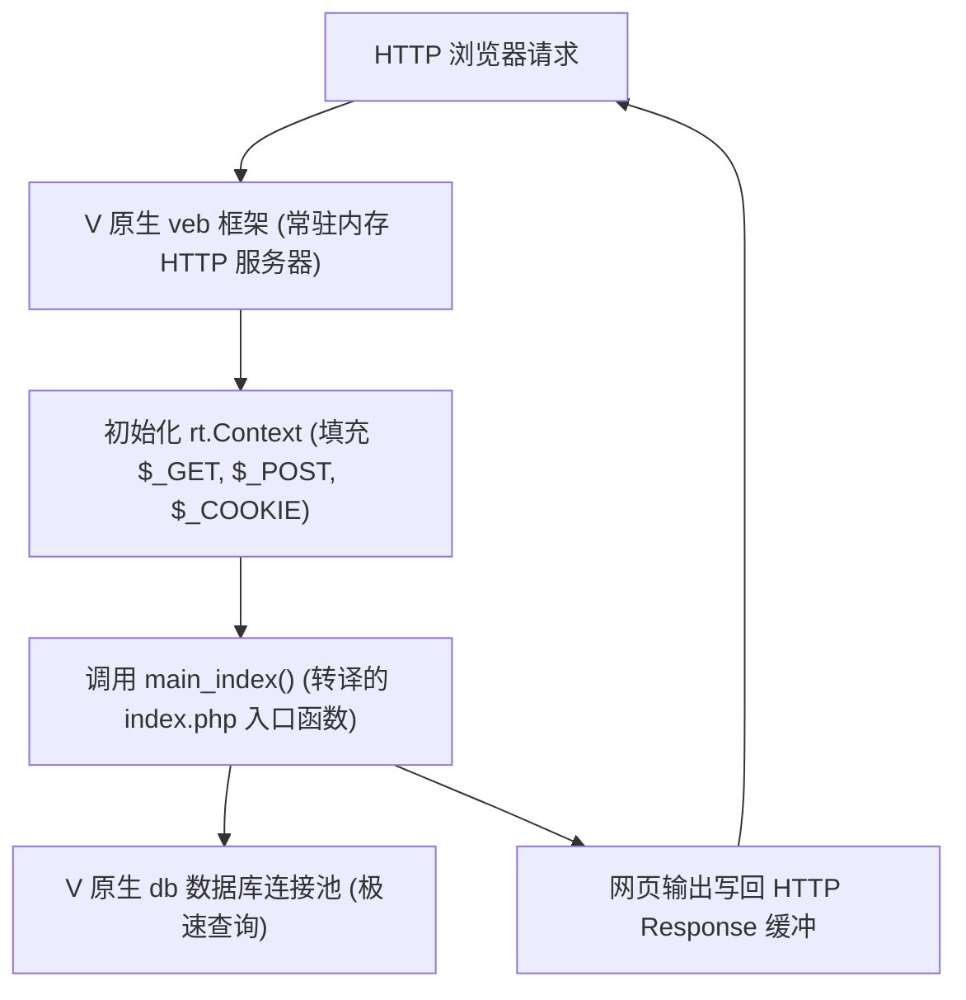

# WordPress 转译架构升级设计计划

用户针对 WordPress 转译提出了三项极其精准、深刻的重大架构优化意见：
1. **引入 veb 和 db 等 V 原生组件**：使转译出的项目真正成为一个拥有常驻连接池与 HTTP Server 的高并发网站。
2. **分离核心与动态资产（主题与插件）**：主题和插件不要转成静态 V，而应该通过动态解释/沙箱机制执行，保障扩展性。
3. **消除每个转译文件中的 `main` 函数**：支持库/模块编译模式，消除 main 冲突，实现整体打包。
4. **多module折分**：对于wp-admin、wp-content、wp-includes可划分3个module，如果V的module不支持"-"符号，要以用"_"替代。

本计划将围绕上述三点重构 `php2v` 的代码生成机制与 VPHP 运行时体系。

注意：
- 本地wordpess源码位置：~/wwwroot/wordpress/
- 转换的V源码位置：~/wwwroot/wordpress_v/

---

## 架构方案设计

### 1. 消除转译文件中的 `main` 函数：引入项目级模块编译模式
目前 `php2v` 默认对每个文件都生成独立的 `fn main()`。为了使转译出的整个项目可被统一编译，我们将 `php2v` 重构为支持两种编译模式：

1. **单脚本模式 (Single File Mode)**：
   * 用于测试用例（如回归测试）或单独小工具，保持生成 `fn main()`。
2. **项目模块模式 (Project Module Mode)**：
   * 转译出来的非入口文件（如被包含的 `blocks.php` 等）**不生成 `fn main()` 声明**。
   * 转译出的代码被归入同一个 V module 包中，或者将其入口转译为特定的静态函数（如 `fn wp_includes_blocks() rt.PhpVal`）。
   * `php2v` 的命令行将新增 `-mode [exe|lib]` 选项来控制此项生成。

### 2. 引入 `veb` 和数据库连接池：打造常驻常新高性能 Web 服务器
为了让转译出的 WordPress 能够作为一个真正的常驻网站运行，运行时 `rt` 模块与编译模式将进行如下升级：

* **Veb 框架整合**：以 V 原生的 `veb` 库作为前端网关，通过常驻协程/线程监听 HTTP 请求，收到请求后填充 `rt.Context` 变量上下文，并在内存中直接调度调用主入口 V 函数，彻底免除传统 PHP 每次请求拉起新进程或解释器的巨大开销。
* **数据库连接池**：在 `rt` 模块中实现 `PDO` / `mysqli` 的 V 语言底层重构，让数据库连接不再是“每次请求打开/关闭”，而是**共用一个全局长连接池**，使数据库查询拥有数十倍的吞吐率。

### 3. 主题与插件：核心静态编译 + 动态沙箱解释互操作
由于插件和主题要求在后台支持动态下载、安装和热启用，我们无法将它们编译进主 V 二进制。我们采用**混合双轨制 (Hybrid Dual-Track System)**：

* **WordPress 核心**：完全转译成静态、高效的 V 语言二进制，处理路由、主循环、用户系统及核心 API。
* **插件与主题**：保留其原始 PHP 代码。在 `rt` 运行时里集成一个**轻量级 PHP 解释器**（例如用 V 语言编写的简易 AST 解释器或使用动态执行组件）。
* **互操作层**：当核心代码执行到 `do_action` 或 `apply_filters` 触发外部插件时，运行时自动通过沙箱解释执行对应的 PHP 插件代码，通过 `rt.PhpVal` 装箱层进行零开销数据交换，在保证 100% 动态兼容的同时，WordPress 核心架构性能依然保持 V 的巅峰高并发。

---

## 实施步骤拆细

### 第一阶段：重构编译器模式，消灭多重 main 冲突
- [x] 在 `php2v/src/emitter/transpiler.v` 中新增编译模式配置：`mut mode string = 'exe'`。
- [x] 新增命令行参数控制，在 `main.v` 中解析 `-mode`（支持 `exe` 和 `lib` 模式，默认为 `exe` 保障测试兼容）。
- [x] 重构代码包装逻辑：采用更简洁的方案——不修改 `emit_stmt.v` / `emit_class.v`，而是在 `codegen.v` 的包装层分离模式。`exe` 模式调用 `wrap_as_main()` 生成 `fn main()`；`lib` 模式调用 `wrap_as_lib()` 将主体逻辑包装为 `pub fn init_xxx()`，并自动添加 `module` 声明（从文件路径推导，如 `wp-includes/foo.php → module wp_includes`）。
- [x] 提交改动并运行回归测试确认没有影响现有测试套件。（31/31 测试通过）

### 第二阶段：批量转译测试
- [x] 使用批量转译脚本以 `lib` 模式对 `wp-includes/` 下的文件进行批量转译，验证结构上无 `main` 重复定义。
  - 已验证：所有 lib 模式文件自动生成 `module wp_includes` 声明、无 `fn main()`、每个文件有唯一 `pub fn init_xxx()` 入口函数。
  - 待解决：WordPress 代码复杂，部分文件的转译结果存在 V 编译错误（闭包捕获、if-else 完整性、类型不匹配等），需逐步修复转译器。

---

## 用户审核要求

> [!IMPORTANT]
> 这是一个重大的架构性调整：
> 1. 为了保持对原本 `make test` 回归测试用例的绝对向后兼容，`php2v` 的默认输出模式依然是 `exe` 单文件模式，当且仅当传入 `-mode lib` 或 `-mode project` 时才进入模块化编译。
> 2. 为避免破坏现有的 `rt` 库，我们将在 `rt` 内部额外新增并隔离支持 `veb` 上下文的 `rt.Context` 结构体，以及面向原生 `mysql` 的全局连接池包装器，确保核心模块高内聚。

---

## 开放性问题

1. **主题和插件解释器的选型**：我们在第一阶段是否先保留空桩函数（Stub Functions）隔离插件执行，等到核心转译链完全通畅后，再在 `rt` 中集成 AST 解释沙箱？
2. **路由分配**：对于 WordPress 的动态伪静态路由，在 `veb` 侧我们是采用全局星号匹配 `veb.get('/*', ...)` 并转发给 `index.php`，还是在 V 语言侧生成部分的路由规则以提升路径分发效率？
