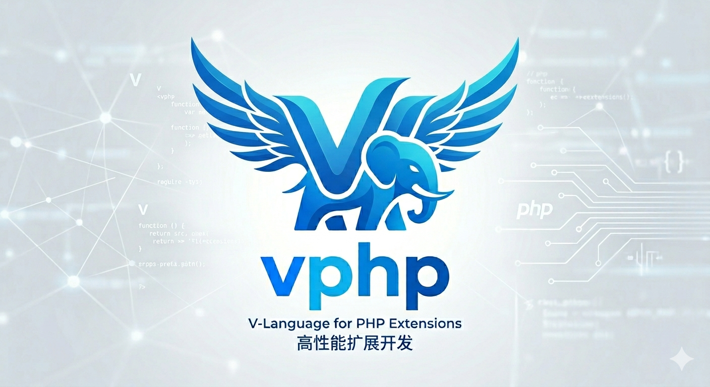

# vphp



English | [中文](#中文)

`vphp` is the low-level Zend binding and PHP export layer for V.

It answers the foundational questions behind the whole stack:

- how V code is exported as PHP functions, classes, interfaces, traits, and enums
- how V code calls PHP functions, classes, objects, properties, constants, and callables
- how `ZVal`, object pointers, request ownership, persistent ownership, and closure bridges are represented safely

In one sentence:

- `vphp` = Zend Binding for Vlang

## Documentation

- overview: [docs/OVERVIEW.md](docs/OVERVIEW.md)
- docs index: [docs/README.md](docs/README.md)
- interop: [docs/interop.md](docs/interop.md)
- Zend wrapper layers: [docs/zend_wrapper_layers.md](docs/zend_wrapper_layers.md)
- ownership: [docs/ownership.md](docs/ownership.md)
- lifecycle: [docs/lifecycle_model.md](docs/lifecycle_model.md)
- OOP export: [docs/oop_features.md](docs/oop_features.md)
- compiler: [compiler/README.md](compiler/README.md)

## Why vphp Exists

`vphp` is not just a PHP extension scaffold. Its goal is to make V a practical implementation language for PHP extensions and PHP-facing runtime infrastructure.

It provides both directions of the bridge:

- `V -> PHP` interop: call PHP functions, methods, constructors, and read/write Zend values.
- `V -> Zend export`: expose V functions, classes, interfaces, traits, enums, properties, constants, attributes, and closures to PHP.

The design center is a stable boundary between Zend's raw runtime model and V's typed, explicit ownership model.

## One-Minute Example

The smallest useful flow is:

- define `ExtensionConfig`
- export a function
- compile the extension
- load it from PHP

```v
module main

import vphp

const ext_config = vphp.ExtensionConfig{
    name: 'hello_vphp'
    version: '0.1.0'
    description: 'Hello extension built with vphp'
}

@[php_function]
fn hello_from_v(name string) string {
    return 'Hello, ${name} from VPHP'
}
```

Then the extension build flow looks like:

```bash
make -C vphptest build
```

And the PHP side looks like:

```bash
php -d extension=./hello_vphp.so -r 'echo hello_from_v("PHP"), PHP_EOL;'
```

If you want a real in-repo example instead of a toy snippet, start with:

- [`../vphptest/config.v`](../vphptest/config.v)
- [`../vphptest/functions.v`](../vphptest/functions.v)
- [`../vphptest/Makefile`](../vphptest/Makefile)

## vphp vs PHP-CPP vs ext-php-rs

All three projects help developers build PHP extensions without writing raw Zend C directly, but they optimize for different languages and boundaries.

| Area | vphp | PHP-CPP | ext-php-rs |
| --- | --- | --- | --- |
| Main language | V | C++ | Rust |
| Core positioning | Zend binding + PHP export compiler + runtime bridge for V-driven PHP infrastructure | C++-friendly PHP extension SDK | Rust Zend API binding with macro/trait abstractions |
| PHP function export | Yes | Yes | Yes |
| PHP class export | Yes | Yes | Yes |
| Interface / trait / enum export | Yes; part of the export model | Class/object/method export is the primary documented path; trait/enum are not the central model | Class/interface support is explicit; trait/enum are less central in the public entry path |
| PHP attributes / metadata | Yes; PHP 8 class attributes and export metadata | Not a primary advertised abstraction | Macro/doc-comment driven metadata; Rust attributes are central |
| Runtime value abstraction | `ZVal`, `PhpValue`, `PhpInt`, `PhpString`, `PhpBool`, `PhpDouble`, `PhpArray`, `PhpObject`, `PhpClosure`, `PhpCallable` | `Php::Value`, `Php::Parameters` | `Zval`, `ZBox`, `IntoZval`, `FromZval`, `ZendObject` |
| Function call arguments | Semantic `PhpArgInput`; `PhpValue` and scalar/object wrappers can be used at the semantic layer | `Php::Parameters` / `Php::Value` | Trait-based conversion into zvals |
| Exported function input model | Raw `Context`, unpacked V scalars, semantic wrappers like `PhpValue` / `PhpObject` / `PhpArray`, optional args, params structs, and `PhpArg` where raw input metadata is needed | C++ function/method signatures with PHP-CPP wrappers | Rust function signatures with proc-macro driven conversions |
| Closure bridge | Compiler-generated closure bridges; struct-param closures; variadic closure invoke for `PhpValue`, `ZVal`, `RequestBorrowedZBox`, and `VScalarValue` | Callback/function support through C++ wrapper APIs | Callable/closure support through Rust binding abstractions |
| Ownership / lifetime model | Explicit: `RequestBorrowedZBox`, `RequestOwnedZBox`, `PersistentOwnedZBox`, `PhpValueZBox`, request/frame scopes, retained objects/callables | Available through extension lifecycle and C++ ownership patterns; more manual | Strongly shaped by Rust ownership and module/request lifecycle hooks |
| Request / frame scope | Objectized `RequestScope` / `FrameScope` helpers and autorelease handling | Extension callbacks such as request/startup/shutdown | Module/request startup and shutdown hooks |
| PHP function and method calls from V | Semantic APIs: `PhpFunction.named(...).with_result(...)`, `PhpObject.with_method_result...`, plus lower-level `ZVal` escape hatches | PHP values/functions through C++ SDK APIs | Rust APIs around Zend values and callable invocation |
| Compiler/export pipeline | Built in: parser -> repr -> builder -> emitter -> generated C/V glue | Not a V-like compiler pipeline; C++ code is the extension source | Proc macros generate extension glue from Rust code |
| Best fit | Building PHP extensions and higher-level PHP-facing infrastructure in V, especially when runtime/lifecycle boundaries matter | Exposing C++ code or writing C++-style PHP extensions | Writing PHP extensions with Rust safety and Rust ecosystem leverage |

A simplified view:

- PHP-CPP is a C++-friendly extension SDK.
- ext-php-rs is a Rust-style Zend binding and macro framework.
- `vphp` is a V-to-Zend bridge plus export compiler, designed to support higher PHP-facing layers such as `vslim`.

## Current Capabilities

The current `vphp` runtime and compiler include:

- low-level `ZVal` interop for raw Zend values
- semantic value wrappers: `PhpValue`, `PhpNull`, `PhpBool`, `PhpInt`, `PhpDouble`, `PhpString`, `PhpArray`, `PhpObject`, `PhpCallable`, `PhpClosure`, `PhpResource`, `PhpReference`, `PhpIterable`, `PhpThrowable`
- explicit ownership wrappers: `RequestBorrowedZBox`, `RequestOwnedZBox`, `PersistentOwnedZBox`
- unified value lifecycle storage through `PhpValueZBox`
- request/frame scope helpers for temporary request-owned values
- `PhpArgInput` for semantic PHP function-call arguments
- `PhpArg` for exported-function input metadata and raw PHP argument access
- `PhpArgAttribute` / `PhpArgMeta.attributes` for parameter attribute metadata in V runtime code
- `PhpFunction` and `PhpObject` semantic call helpers, with lower-level `ZVal` escape hatches where needed
- V export to PHP functions, classes, interfaces, traits, enums, constants, properties, static properties, and class attributes
- compiler support for V scalars, semantic PHP wrappers, option args, params structs, generated arginfo/defaults, and parameter attributes
- closure export through generated bridges, including struct params and variadic closure invoke
- lifecycle hooks for module/request startup and shutdown

## Value Model

The value stack is intentionally layered:

```text
Zend zval
  -> ZVal
  -> ZBox lifecycle wrappers
  -> semantic PHP wrappers
```

The most common semantic wrappers are:

```v
value := vphp.PhpValue.from_zval(z)
name := vphp.PhpString.of('vphp')
id := vphp.PhpInt.of(42)
items := vphp.PhpArray.empty()
```

When lifecycle matters, wrappers expose explicit conversion methods:

```v
owned := value.to_request_owned()
borrowed := value.to_borrowed()
persistent := value.to_persistent_owned()
```

## Calling PHP From V

Prefer the semantic APIs first:

```v
len := vphp.PhpFunction.named('strlen').with_result[i64]([
    vphp.PhpString.of('hello')
])

obj.with_method_result[vphp.PhpValue]('handle', [
    vphp.PhpString.of('payload')
])
```

Drop down to `ZVal` or `ZBox` only when the ownership boundary requires it.

## Exporting V To PHP

Example:

```v
module main

import vphp

@[php_class: 'Demo\\Counter']
pub struct Counter {
mut:
    value int
}

@[php_method]
pub fn (mut c Counter) inc(step int) int {
    c.value += step
    return c.value
}
```

`vphp` generates the PHP-facing class registration, arginfo, method glue, object binding, and return conversion.

## Closure Bridge

V closures can be returned to PHP through compiler-generated bridge code.

Struct params:

```v
@[params]
pub struct SearchParams {
    q string
    limit int
}

fn search_cb(p SearchParams) string {
    return '${p.q}:${p.limit}'
}

@[php_function]
pub fn get_search_cb() fn (SearchParams) string {
    return search_cb
}
```

Variadic values:

```v
fn join_cb(args ...vphp.VScalarValue) string {
    return args.map(it.str()).join(',')
}

@[php_function]
pub fn get_join_cb() fn (...vphp.VScalarValue) string {
    return join_cb
}
```

Supported variadic carriers:

- `vphp.PhpValue`
- `vphp.ZVal`
- `vphp.RequestBorrowedZBox`
- `vphp.VScalarValue`

Supported closure returns follow the normal vphp return binding rules, including `void`, V scalars, `vphp.PhpValue`, and `vphp.VScalarValue`.

## 中文

`vphp` 是 V 面向 Zend/PHP 的底层绑定层和导出层。

它负责回答整套技术栈背后的底层问题：

- V 代码如何导出成 PHP function / class / interface / trait / enum
- V 代码如何调用 PHP 函数、类、对象、属性、常量、callable
- `ZVal`、对象指针、request ownership、persistent ownership、closure bridge 如何安全表达

一句话：

- `vphp` = Zend Binding for Vlang

## 文档入口

- 总览：[docs/OVERVIEW.md](docs/OVERVIEW.md)
- 文档索引：[docs/README.md](docs/README.md)
- interop：[docs/interop.md](docs/interop.md)
- Zend wrapper 分层：[docs/zend_wrapper_layers.md](docs/zend_wrapper_layers.md)
- ownership：[docs/ownership.md](docs/ownership.md)
- lifecycle：[docs/lifecycle_model.md](docs/lifecycle_model.md)
- OOP 导出：[docs/oop_features.md](docs/oop_features.md)
- compiler：[compiler/README.md](compiler/README.md)

## vphp 解决什么问题

`vphp` 不是普通 PHP 扩展脚手架。它的目标是让 V 成为 PHP 扩展和 PHP-facing runtime infrastructure 的实现语言之一。

它同时处理两个方向：

- `V -> PHP` interop：从 V 调 PHP 函数、方法、构造器，读写 Zend 值。
- `V -> Zend export`：把 V 的函数、类、接口、trait、enum、属性、常量、attribute、closure 导出给 PHP。

它的设计重点，是在 Zend 原始 runtime 模型和 V 的类型化 ownership 模型之间建立稳定边界。

## 一分钟上手

最小可用流程其实很简单：

- 定义 `ExtensionConfig`
- 导出一个函数
- 编译扩展
- 在 PHP 里加载

```v
module main

import vphp

const ext_config = vphp.ExtensionConfig{
    name: 'hello_vphp'
    version: '0.1.0'
    description: 'Hello extension built with vphp'
}

@[php_function]
fn hello_from_v(name string) string {
    return 'Hello, ${name} from VPHP'
}
```

编译这类扩展时，仓库内真实样例的构建流程是：

```bash
make -C vphptest build
```

PHP 侧加载时的使用方式类似：

```bash
php -d extension=./hello_vphp.so -r 'echo hello_from_v("PHP"), PHP_EOL;'
```

如果你想看仓库里的真实扩展，而不是最小示例，直接从这里开始：

- [`../vphptest/config.v`](../vphptest/config.v)
- [`../vphptest/functions.v`](../vphptest/functions.v)
- [`../vphptest/Makefile`](../vphptest/Makefile)

## vphp vs PHP-CPP vs ext-php-rs

三者都在解决“避免直接写 Zend C，也能开发 PHP 扩展”的问题，但语言、抽象边界和目标场景不同。

| 维度 | vphp | PHP-CPP | ext-php-rs |
| --- | --- | --- | --- |
| 主要语言 | V | C++ | Rust |
| 核心定位 | Zend binding + PHP 导出编译器 + V 驱动 PHP runtime 的桥接层 | C++ 友好的 PHP 扩展 SDK | Rust 的 Zend API binding + macro/trait 抽象 |
| PHP 函数导出 | 支持 | 支持 | 支持 |
| PHP 类导出 | 支持 | 支持 | 支持 |
| interface / trait / enum 导出 | 支持，是当前导出模型的一部分 | 文档主线更聚焦 class/object/method；trait/enum 不是中心模型 | class/interface 支持明确；trait/enum 不是公开入口里的中心能力 |
| PHP attributes / 元信息 | 支持 PHP 8 class attributes 和导出元信息 | 不是主要宣传的核心抽象 | macro/doc-comment 驱动，Rust attributes 是核心入口 |
| runtime value 抽象 | `ZVal`、`PhpValue`、`PhpInt`、`PhpString`、`PhpBool`、`PhpDouble`、`PhpArray`、`PhpObject`、`PhpClosure`、`PhpCallable` | `Php::Value`、`Php::Parameters` | `Zval`、`ZBox`、`IntoZval`、`FromZval`、`ZendObject` |
| PHP 函数调用参数 | 语义化 `PhpArgInput`；语义层可以直接使用 `PhpValue` 和标量/对象 wrapper | `Php::Parameters` / `Php::Value` | 基于 trait 转换到 zval |
| 导出函数入参模型 | `Context`、解包后的 V 标量、`PhpValue` / `PhpObject` / `PhpArray` 等语义 wrapper、optional args、params struct，以及需要原始输入元信息时的 `PhpArg` | C++ 函数/方法签名 + PHP-CPP wrapper | Rust 函数签名 + proc macro 转换 |
| Closure bridge | 编译器生成 closure bridge；支持 struct params；variadic closure invoke 支持 `PhpValue`、`ZVal`、`RequestBorrowedZBox`、`VScalarValue` | 通过 C++ wrapper API 支持 callback/function | 通过 Rust binding 抽象支持 callable/closure |
| ownership / lifetime | 显式分层：`RequestBorrowedZBox`、`RequestOwnedZBox`、`PersistentOwnedZBox`、`PhpValueZBox`、request/frame scope、retained object/callable | 有扩展生命周期回调，但对象 ownership 更偏 C++ 开发者管理 | 强依赖 Rust ownership、trait 与 module/request lifecycle hook |
| request / frame scope | 对象化 `RequestScope` / `FrameScope` helper 和 autorelease 处理 | extension callbacks，如 request/startup/shutdown | module/request startup/shutdown hooks |
| V 调 PHP 函数和方法 | 语义 API：`PhpFunction.named(...).with_result(...)`、`PhpObject.with_method_result...`，必要时可退到底层 `ZVal` | 通过 C++ SDK API 操作 PHP 值和函数 | 通过 Rust API 操作 Zend 值与 callable |
| compiler/export pipeline | 内置：parser -> repr -> builder -> emitter -> generated C/V glue | 不是 V 这种导出编译链；C++ 源码就是扩展源码 | proc macro 从 Rust 代码生成扩展 glue |
| 最适合场景 | 用 V 写 PHP 扩展和更上层 PHP-facing 基础设施，尤其重视 runtime/lifecycle 边界 | 暴露 C++ 代码或写 C++ 风格 PHP 扩展 | 利用 Rust 安全性和生态写 PHP 扩展 |

简化理解：

- PHP-CPP 更像 C++ 友好的扩展 SDK。
- ext-php-rs 更像 Rust 风格的 Zend binding / macro 框架。
- `vphp` 更像把 V 接进 Zend 世界的桥接层和导出编译器，并服务于 `vslim` 这样的上层。

## 当前能力

当前 `vphp` 已具备：

- 底层 `ZVal` interop
- 语义值 wrapper：`PhpValue`、`PhpNull`、`PhpBool`、`PhpInt`、`PhpDouble`、`PhpString`、`PhpArray`、`PhpObject`、`PhpCallable`、`PhpClosure`、`PhpResource`、`PhpReference`、`PhpIterable`、`PhpThrowable`
- ownership wrapper：`RequestBorrowedZBox`、`RequestOwnedZBox`、`PersistentOwnedZBox`
- 统一值生命周期存储：`PhpValueZBox`
- request/frame scope helper，用于 request-owned 临时值
- `PhpArgInput`，用于语义化 PHP 函数调用参数
- `PhpArg`，用于导出函数入参元信息和原始 PHP 入参访问
- `PhpArgAttribute` / `PhpArgMeta.attributes`，用于在 V runtime 读取参数 attribute 元信息
- `PhpFunction` / `PhpObject` 语义调用 API，必要时仍可退到底层 `ZVal`
- V 导出 PHP function / class / interface / trait / enum / constant / property / static property / class attribute
- compiler 支持 V 标量、PHP 语义 wrapper、option args、params struct、arginfo/default 生成、parameter attributes
- closure export 支持生成 bridge、struct params、variadic closure invoke
- module/request startup/shutdown lifecycle hook

## 值模型

值模型分层如下：

```text
Zend zval
  -> ZVal
  -> ZBox lifecycle wrappers
  -> semantic PHP wrappers
```

常用语义 wrapper：

```v
value := vphp.PhpValue.from_zval(z)
name := vphp.PhpString.of('vphp')
id := vphp.PhpInt.of(42)
items := vphp.PhpArray.empty()
```

涉及生命周期时，用显式转换：

```v
owned := value.to_request_owned()
borrowed := value.to_borrowed()
persistent := value.to_persistent_owned()
```

## 从 V 调 PHP

优先使用语义 API：

```v
len := vphp.PhpFunction.named('strlen').with_result[i64]([
    vphp.PhpString.of('hello')
])

obj.with_method_result[vphp.PhpValue]('handle', [
    vphp.PhpString.of('payload')
])
```

只有 ownership 边界需要时，再退到底层 `ZVal` 或 `ZBox`。

## 导出 V 到 PHP

示例：

```v
module main

import vphp

@[php_class: 'Demo\\Counter']
pub struct Counter {
mut:
    value int
}

@[php_method]
pub fn (mut c Counter) inc(step int) int {
    c.value += step
    return c.value
}
```

`vphp` 会生成 PHP-facing class registration、arginfo、method glue、object binding 和返回值转换。

## Closure Bridge

V closure 可以通过编译器生成的 bridge 返回给 PHP。

Struct params：

```v
@[params]
pub struct SearchParams {
    q string
    limit int
}

fn search_cb(p SearchParams) string {
    return '${p.q}:${p.limit}'
}

@[php_function]
pub fn get_search_cb() fn (SearchParams) string {
    return search_cb
}
```

Variadic values：

```v
fn join_cb(args ...vphp.VScalarValue) string {
    return args.map(it.str()).join(',')
}

@[php_function]
pub fn get_join_cb() fn (...vphp.VScalarValue) string {
    return join_cb
}
```

支持的 variadic carriers：

- `vphp.PhpValue`
- `vphp.ZVal`
- `vphp.RequestBorrowedZBox`
- `vphp.VScalarValue`

closure 返回遵循正常 vphp return binding 规则，包括 `void`、V 标量、`vphp.PhpValue`、`vphp.VScalarValue`。

## 推荐阅读顺序

如果你第一次看 `vphp`，推荐顺序：

1. 先看这页
2. 再看 [docs/OVERVIEW.md](docs/OVERVIEW.md)
3. 再看 [docs/interop.md](docs/interop.md)
4. 再看 [docs/oop_features.md](docs/oop_features.md)
5. 最后看 [compiler/README.md](compiler/README.md)
