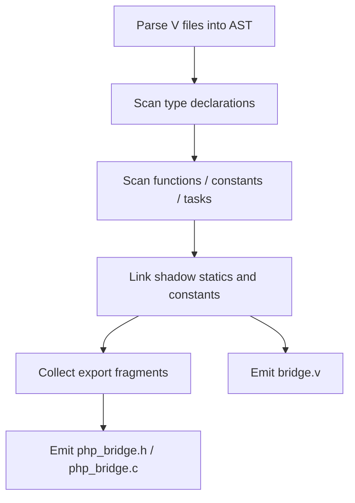
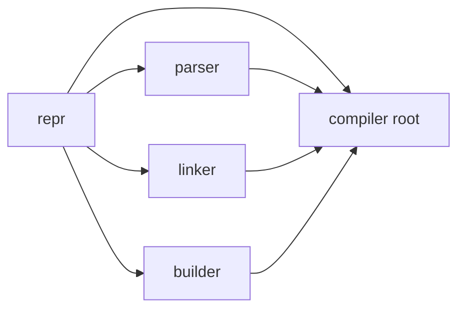

# VPHP Compiler Architecture

## Goal

`vphp.compiler` is responsible for turning V source annotated with VPHP metadata into:

- `php_bridge.h`
- `php_bridge.c`
- `bridge.v`

The compiler is intentionally split into a few small layers so that parsing, linking, and code generation can evolve independently.

## Top-Level Layout

```text
vphp/compiler/
  entry.v        # Compiler entry and compile pipeline
  export.v       # export assembly and final file emission
  c_emitter.v    # C-side wrapper and glue emission
  v_glue.v       # V-side bridge/glue emission
  arg_binding.v  # PhpArgRepr -> V glue argument bindings
  params_struct_binding.v # @[params] struct argument construction
  return_binding.v # PhpReturnRepr -> V glue return handling
  class_method_binding.v # class method call / sync / return composition
  class_property_binding.v # class property get / set / sync glue
  php_types/     # shared PHP-facing type/spec mapping
  repr/          # compiler representations
  parser/        # AST -> repr
  linker/        # repr -> linked repr
  builder/       # repr -> export/code fragments
```

## Layer Responsibilities

### 1. `repr`

Module: `vphp.compiler.repr`

Purpose:

- Define the compiler's internal representations
- Hold normalized export metadata
- Stay as close as possible to "plain data"

Examples:

- `PhpClassRepr`
- `PhpInterfaceRepr`
- `PhpEnumRepr`
- `PhpFuncRepr`
- `PhpConstRepr`
- `PhpTaskRepr`
- `PhpGlobalsRepr`

Non-goals:

- No AST walking
- No builder logic
- No final code emission

### 2. `parser`

Module: `vphp.compiler.parser`

Purpose:

- Parse V AST nodes into `repr` values
- Own all "how do we read this V syntax?" logic

Examples:

- `parse_class_decl(...)`
- `parse_interface_decl(...)`
- `parse_enum_decl(...)`
- `parse_function_decl(...)`
- `parse_constant_decl(...)`
- `add_class_method(...)`
- `add_class_static_method(...)`

Input:

- `v.ast` nodes

Output:

- `repr.Php*Repr`

### 3. `linker`

Module: `vphp.compiler.linker`

Purpose:

- Resolve relationships that are not fully known during the initial parse
- Perform post-parse enrichment on `repr`

Current responsibility:

- Class shadow linking:
  - shadow static properties
  - shadow constants

Current entry:

- `link_class_shadows(mut elements, table)`

This layer exists to keep `entry.v` from becoming a second parser.

### 4. `builder`

Module: `vphp.compiler.builder`

Purpose:

- Convert `repr` into reusable export/code fragments
- Encapsulate repetitive Zend/C boilerplate assembly

Key types:

- `ClassBuilder`
- `FuncBuilder`
- `ConstantBuilder`
- `ModuleBuilder`
- `ExportFragments`

This layer should answer:

- "What should this symbol export?"
- "What declarations / registrations / tables does it contribute?"

It should not answer:

- "How do I parse V syntax?"

### 4.5. `php_types`

Module: `vphp.compiler.php_types`

Purpose:

- Describe PHP-facing type semantics once
- Share V type normalization between glue and arginfo generation
- Keep semantic wrapper metadata out of ad hoc emitter branches

Typical examples:

- `PhpTypeSpec`
- `PhpTypeSpec.from_v_type(...)`
- `PhpTypeSpec.semantic_wrapper_for(...)`
- `PhpDefaultSpec.from_v_type(...)`
- `normalize_v_type_key(...)`

This layer is intentionally small. It should describe facts such as
"`PhpArray` maps to PHP `array` and uses `PhpInArg.array()` for decoding"; it
should not render C macros or V glue lines directly.

### 5. `export`

File: `vphp/compiler/export.v`

Purpose:

- Orchestrate all export fragments
- Emit final `php_bridge.h` and `php_bridge.c`
- Coordinate `builder`, `c_emitter`, and `v_glue`

This file is not a parser and not a low-level emitter.
It is the assembly layer.

### 6. `c_emitter`

File: `vphp/compiler/c_emitter.v`

Purpose:

- Generate concrete C wrappers and method glue
- Emit C function bodies that cannot be expressed as simple builder fragments

Typical examples:

- `PHP_METHOD(...)` wrappers
- object construction wrappers
- instance/static method bridge templates

### 7. `v_glue`

File: `vphp/compiler/v_glue.v`

Purpose:

- Generate the V-side bridge layer in `bridge.v`
- Connect PHP-visible wrappers to real V logic

Typical examples:

- `@[export: 'vphp_wrap_xxx']`
- task registration glue
- object property sync helpers

Ownership-facing rule:

- generated glue should prefer `ctx.arg[T](...)` with `T = RequestBorrowedZBox`
  / `RequestOwnedZBox` / `PersistentOwnedZBox` when the exported V signature can
  express that ownership shape directly
- raw `ZVal` remains the low-level escape hatch for bridge internals and
  callable-heavy paths

### 7.5. `arg_binding`

File: `vphp/compiler/arg_binding.v`

Purpose:

- Convert `repr.PhpArgRepr` into V glue argument bindings
- Keep PHP argument indexing, `Context` escape hatch handling, semantic wrapper
  decoding, lifecycle box decoding, and `@[params]` struct construction in one
  place

Key types:

- `PhpArgBinding`
- `PhpArgBindingKind`
- `PhpArgSetup`

This layer answers "how does this exported parameter become a V call argument?"
The caller-facing glue files should consume `PhpArgSetup` instead of
reimplementing argument indexing or wrapper decoding.

### 7.6. `params_struct_binding`

File: `vphp/compiler/params_struct_binding.v`

Purpose:

- Convert flattened `@[params]` fields into one V params struct argument
- Keep params struct field indexes, field defaults, and field value expressions
  out of generic argument binding

Key types:

- `ParamsStructBinding`

This layer answers "how do these PHP arguments become this V `@[params]`
struct literal?"

### 7.7. `return_binding`

File: `vphp/compiler/return_binding.v`

Purpose:

- Convert return type strings into V glue return behavior
- Keep `!T`, `?T`, `void`, plain value, and returned-closure handling in one
  place

Key types:

- `ReturnBinding`
- `ReturnBindingKind`

This layer answers "how does this V call result get written back to PHP?" Glue
files should consume `ReturnBinding` instead of reimplementing result / option /
closure branches.

### 7.8. `class_method_binding`

File: `vphp/compiler/class_method_binding.v`

Purpose:

- Compose class method call results with class-specific side effects
- Keep inherited receiver sync, static-property sync, object returns, and
  `ReturnBinding` behavior out of the main class glue loop

Key types:

- `ClassMethodGlueContext`

This layer answers "after a generated class method call runs, what extra PHP
runtime state must be written back, and how is the result returned?"

### 7.9. `class_property_binding`

File: `vphp/compiler/class_property_binding.v`

Purpose:

- Generate class property read, write, and sync glue
- Keep scalar public property filtering and per-type read/write code out of the
  main class glue loop

Key types:

- `ClassPropertyGlue`

This layer answers "how are V struct fields exposed and synchronized as PHP
object properties?"

## Compile Pipeline

The current pipeline in [entry.v](/Users/guweigang/Source/vphpx/vphp/compiler/entry.v) is:



### Phase 0: Source parsing

For each input file:

- parse V source into AST
- extract extension metadata:
  - `name`
  - `version`
  - `description`
  - `ini_entries`

### Phase 1: Type scan

First pass over AST statements:

- interfaces
- enums
- globals struct
- classes

Why a separate type scan exists:

- methods and static methods need the class index to already exist

### Phase 2: Function scan

Second pass over AST statements:

- instance methods
- static methods
- global functions
- constants
- tasks

### Phase 3: Link

After parsing is complete:

- resolve class shadow statics
- resolve class shadow constants

This step mutates class reprs to append derived PHP-visible properties/constants.

## Export Pipeline

After `compile()` succeeds, generation is driven from [export.v](/Users/guweigang/Source/vphpx/vphp/compiler/export.v).

There are two main fragment collections:

1. non-type fragments
2. type fragments

These are merged into:

- declarations
- implementations
- `MINIT` lines
- function table entries

`ExportFragments` is the common transport object for this stage.

## Data Flow

The intended dependency direction is:



Rules:

- `repr` should not depend on `parser`, `linker`, or `builder`
- `parser` should not depend on `builder`
- `builder` should not depend on `parser`
- root `compiler` coordinates everything

## Naming Conventions

### Files

Prefer role-oriented file names:

- `export.v`
- `c_emitter.v`
- `v_glue.v`

Submodules use domain names:

- `repr/`
- `parser/`
- `linker/`
- `builder/`

### Builder types

Prefer:

- file name is the domain
- type name is `*Builder`
- constructor is `new_xxx_builder(...)`

Examples:

- `builder/class.v` -> `ClassBuilder`
- `builder/function.v` -> `FuncBuilder`
- `builder/constant.v` -> `ConstantBuilder`

### Repr types

Repr types should stay explicit and stable:

- `PhpClassRepr`
- `PhpFuncRepr`
- `PhpEnumRepr`

These are part of the compiler's internal language and should avoid clever renames.

## Extension Guidance

When adding a new PHP-visible capability, use this checklist.

### If the feature is new V syntax / annotation parsing

Change:

- `parser/`
- maybe `repr/`

Examples:

- trait parsing
- interface property parsing
- new export annotations

### If the feature is a post-parse relationship

Change:

- `linker/`

Examples:

- explicit V `implements` to PHP interface linking
- trait flattening/linking
- parent/child metadata reconciliation

### If the feature is mostly export boilerplate

Change:

- `builder/`
- maybe `export.v`

Examples:

- new constant registration style
- new class registration flags
- reusable arginfo/table fragments

### If the feature needs concrete wrapper bodies

Change:

- `c_emitter.v`
- or `v_glue.v`

Examples:

- new object/method wrapper shape
- special result/exception bridge logic
- task glue runtime behavior

## Current Pain Points

These are known areas that can still improve:

1. `export.v` still knows a fair amount about fragment grouping
2. `c_emitter.v` still contains large template-heavy logic
3. `v_glue.v` still mixes object glue, task glue, and function glue in one file
4. shadow-linking is isolated now, and future relationship passes may continue to grow `linker/`

## Recommended Near-Term Next Steps

1. Add a short doc for `repr` field semantics
2. Split `v_glue.v` later by domain:
   - function glue
   - class glue
   - task glue
3. Continue splitting linker responsibilities by relationship type when new passes are added
4. Keep resisting the urge to move `export/c_emitter/v_glue` into a `gen/` submodule until their boundaries are even more stable

## Summary

The current architecture is:

- `repr` for data
- `parser` for AST parsing
- `linker` for post-parse reconciliation
- `builder` for reusable export fragments
- `export` for assembly
- `c_emitter` for concrete C wrapper emission
- `v_glue` for V bridge generation

That split keeps the compiler understandable while still leaving room for more advanced PHP features later.
