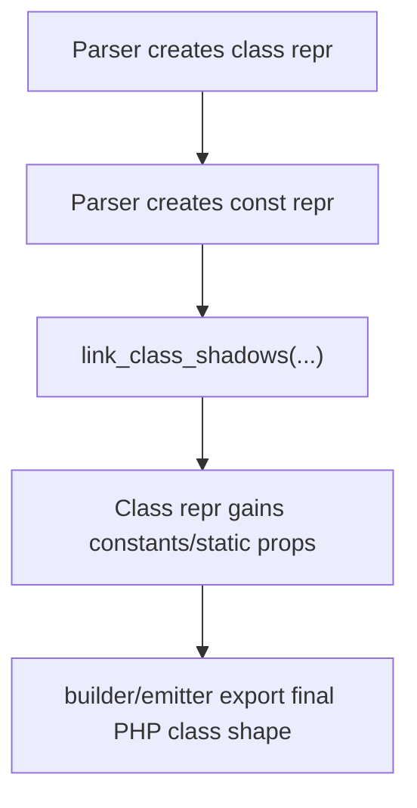

# Class Shadow Linking

## Goal

Class shadows are the mechanism VPHP uses to implement:

- PHP class constants backed by V-side constant carriers
- PHP class static properties backed by V-side shadow state

This lets V remain the semantic source while PHP receives familiar class-level APIs.

## Why Shadows Exist

PHP wants class-level constructs such as:

- `Article::MAX_TITLE_LEN`
- `Article::$total_count`

But in V, the natural backing data is usually:

- a module-level constant carrier
- a module-level shadow state struct/instance

So the compiler bridges them in two steps:

1. parse class metadata that names the shadow source
2. link the class to the actual shadow carrier later

## Two Shadow Kinds

### 1. Shadow Constants

Purpose:

- expose PHP class constants from a V-side constant carrier

Class-side metadata:

- `shadow_const_name`
- later resolved into `shadow_const_type`

Linked result:

- appended `PhpClassConst` entries on the class repr

### 2. Shadow Statics

Purpose:

- expose PHP static properties from a V-side shadow state struct

Class-side metadata:

- `shadow_static_name`
- later resolved into `shadow_static_type`

Linked result:

- appended `PhpClassProp` entries with `is_static = true`

## Current Linker Entry

Implemented in [class.v](/Users/guweigang/Source/vphpx/vphp/compiler/linker/class.v).

Entry point:

- `link_class_shadows(mut elements, table)`

This runs after all parse passes are complete.

## Pipeline Position

This ordering matters because shadow targets may be declared elsewhere in the source set.

## Shadow Constant Linking

Implemented by:

- `link_class_shadow_constants(...)`

### Input Expectations

The class repr contains:

- `shadow_const_name != ''`

And `elements` contains a matching `repr.PhpConstRepr` whose:

- `name == shadow_const_name`

### What Happens

1. find the matching `PhpConstRepr`
2. copy its `v_type` into `cls.shadow_const_type`
3. iterate over `el.fields`
4. append one `PhpClassConst` per field into `cls.constants`

### Result

The class behaves as if those constants were declared directly on it.

### Important Note

The source `PhpConstRepr` may be:

- a real exported PHP global constant
- or just a shadow carrier

The linker does not care.
It only cares that the repr contains structured constant fields.

## Shadow Static Linking

Implemented by:

- `link_class_shadow_statics(...)`

### Input Expectations

The class repr contains:

- `shadow_static_name != ''`

And `elements` contains a matching `repr.PhpConstRepr` whose:

- `name == shadow_static_name`

That constant repr points to a V type through:

- `v_type`

### What Happens

1. find the matching `PhpConstRepr`
2. copy `el.v_type` into `cls.shadow_static_type`
3. resolve that type in the V type table
4. read its struct fields from `ast.Table`
5. append one `PhpClassProp` per field:
   - `visibility = 'public'`
   - `is_static = true`

### Why `ast.Table` Is Needed

Shadow statics are not reconstructed from string metadata alone.

The linker needs the real V struct definition to determine:

- field names
- field types

That is why `link_class_shadow_statics(...)` receives `table &ast.Table`.

## Why Linking Is Separate From Parsing

Keeping shadow resolution out of the parser helps in three ways.

### 1. Parse order stays simple

Parser can read declarations as they come without requiring every referenced shadow source to already be resolved.

### 2. Repr stays explicit

The class repr can say:

- "I depend on `article_statics`"

without pretending that all derived PHP static properties are already known.

### 3. Linking logic stays centralized

All "resolve this class-level relationship after parse" logic can live in one place.

That becomes more valuable as new inferred relationships appear later.

## Runtime Relationship

Linking is only the compile-time half.

For shadow statics, runtime behavior still requires bridge glue.

That happens later in [v_glue.v](/Users/guweigang/Source/vphpx/vphp/compiler/v_glue.v), where class glue emits:

- `Class.statics()`
- `sync_statics_from_php(ctx)`
- `sync_statics_to_php(ctx)`

So the full picture is:

1. linker decides which PHP static properties exist
2. builder/emitter declare them on the PHP class
3. V glue synchronizes runtime values between PHP and V shadow state

## Design Constraints

Current constraints are intentional.

### Shadow constants

- expect a structured `PhpConstRepr.fields`
- map cleanly to `PhpClassConst`

### Shadow statics

- expect a real V struct type
- derive properties from struct fields
- currently expose linked fields as public static properties

These defaults are conservative and easy to reason about.

## Future Extension Points

This linker can grow in predictable ways.

### Possible future additions

1. inferred interface implementation linking
2. trait flattening/link reconciliation
3. property hook / interface property relationship checks
4. stricter validation for missing or malformed shadow carriers

If those arrive, they should likely become additional linker files rather than enlarging `parser` or `mod.v`.

## Failure Modes To Watch

The current linker is intentionally lightweight, so these are useful things to keep in mind.

1. missing shadow target
   - class keeps unresolved shadow name/type
   - no derived constants/properties are appended

2. unresolved V type
   - static shadow type lookup may fail if the symbol cannot be found in the table

3. malformed carrier
   - if the target does not have the expected shape, linking silently does less work

These are good candidates for future validation improvements.

## Summary

Class shadows are a compile-time + runtime collaboration:

- compile time:
  - linker resolves what the PHP class should expose
- runtime:
  - V glue synchronizes actual values

This design keeps PHP-facing OOP APIs natural while allowing V to remain the real owner of the underlying class-level data.
