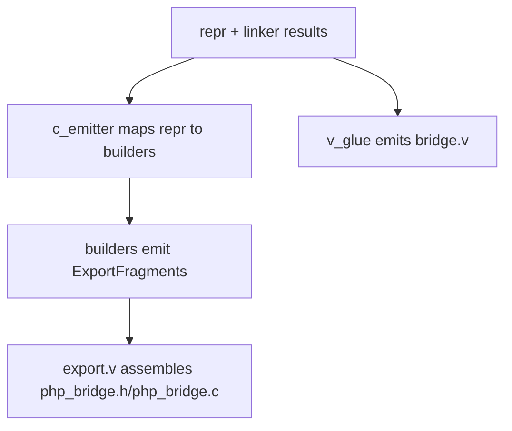

# Export, C Emitter, and V Glue

## Goal

This document explains how these three files collaborate:

- [export.v](/Users/guweigang/Source/vphpx/vphp/compiler/export.v)
- [c_emitter.v](/Users/guweigang/Source/vphpx/vphp/compiler/c_emitter.v)
- [v_glue.v](/Users/guweigang/Source/vphpx/vphp/compiler/v_glue.v)

They all participate in code generation, but they do not have the same job.

That distinction is important.

## High-Level Roles

### `export.v`

Role:

- assembly
- file emission
- fragment collection

It decides:

- what gets collected
- in which order
- into which output file

It should not be responsible for:

- deep wrapper templates
- AST interpretation
- low-level PHP runtime bridge logic

### `c_emitter.v`

Role:

- concrete C wrapper emission

It decides:

- how PHP methods/functions are wrapped in C
- which wrapper template a symbol needs
- how builder fragments are combined with implementation bodies

It is the most C-specific generation file.

### `v_glue.v`

Role:

- V-side bridge emission

It decides:

- how exported wrappers call back into V code
- how PHP data is converted and forwarded through `vphp.Context`
- how class shadow sync helpers are emitted
- how tasks are registered

It is the most runtime-bridge-specific generation file.

## Mental Model

Use this split:

- `export.v` = coordinator
- `c_emitter.v` = C implementation author
- `v_glue.v` = V implementation author

## Output Ownership

### `export.v`

Owns writing:

- `php_bridge.h`
- `php_bridge.c`
- `bridge.v` trigger path

It does not invent all content itself.
It collects and assembles content from other layers.

### `c_emitter.v`

Contributes content for:

- declarations/fragments via builders
- C implementations via wrapper generation

### `v_glue.v`

Produces:

- the entire `bridge.v` content

This is why `export.v` still calls into `VGenerator`.

## Data Flow

More concretely:

1. `compile()` finalizes `elements`
2. `export.v` asks for non-type and type fragments
3. `c_emitter.v` builds builders and fills implementation fragments
4. `ModuleBuilder` assembles final C module sections
5. `v_glue.v` emits the V-side bridge file

## `export.v` in Detail

### Main responsibilities

1. collect non-type fragments
2. collect type fragments
3. write header declarations
4. write implementation sections
5. pass function/minit fragments into `ModuleBuilder`
6. render final extension-level C blocks
7. generate `bridge.v`

### Why fragment collection is split

`export.v` currently separates:

- non-type fragments
- type fragments

This keeps ordering explicit.

That matters because interface/type ordering is semantically important during registration.

### Why `export.v` should stay boring

This file is healthiest when it mostly:

- collects
- merges
- writes

If logic here starts deciding method wrapper templates or parsing meaning from reprs, the boundaries are drifting.

## `c_emitter.v` in Detail

### Main responsibilities

1. map `repr` into builders
2. produce builder-backed fragments
3. generate full C wrapper bodies for:
   - functions
   - classes
   - interfaces
   - enums

### Why builder + emitter both exist

Because not all generated C is equally reusable.

Examples:

- `zend_class_entry` declarations are reusable builder output
- `PHP_METHOD(...)` wrapper bodies are still highly template-specific emitter output

So the current design is:

- builder handles normalized boilerplate
- emitter handles concrete wrapper bodies

### Typical pattern

For a class export:

1. convert `PhpClassRepr` into `ClassBuilder`
2. ask builder for fragments
3. fill `implementations` with wrapper bodies from `gen_class_c(...)`
4. hand the whole thing back to `export.v`

That is why `build_class_export(...)` exists alongside `build_class_type(...)`.

### Return-shape classification

One subtle but important responsibility in `c_emitter.v` is deciding whether a
`@[php_method]` return value should be emitted as:

1. an object-return wrapper, or
2. a plain value/container bridge using `ctx.return_val[...]`

This classification must stay aligned with `v_glue.v`.

Object-return wrappers are only correct for:

- constructors (`construct` / `init`)
- static factory methods returning the receiver type
- methods returning `&SomePhpClass`

Container returns such as:

- `map[string]string`
- `map[string]int`
- `[]string`

are still value returns, even though `TypeMap` may fall back to a generic C
representation for them.

If `c_emitter.v` misclassifies these as object returns, generated C will try to
emit synthetic class-entry symbols such as:

- `map[string]string_ce`
- `[]string_ce`

which are both invalid C identifiers and the wrong runtime model.

The practical rule is:

- object wrappers are chosen from method semantics
- generic fallback C types alone are not enough to imply "PHP object return"

### What should eventually move out of `c_emitter.v`

Potential future refactors:

1. richer arginfo modeling
2. more method-table scaffolding
3. more common class implementation prelude/postlude

What should probably stay:

1. wrapper template selection
2. object-return vs scalar-return wrapper branching
3. PHP runtime bridge-specific C details

## `v_glue.v` in Detail

### Main responsibilities

1. emit global function glue
2. emit class glue
3. emit task registration glue
4. emit class shadow sync helpers

### Why it is separate from `c_emitter.v`

Even though both are "generators", they operate in different worlds:

- `c_emitter.v` targets Zend/C ABI
- `v_glue.v` targets V runtime semantics

Keeping them separate preserves a clean mental boundary between:

- PHP-facing wrappers
- V-facing wrappers

### Important responsibilities unique to `v_glue.v`

1. `Context`-based argument extraction
2. calling the correct V symbol, including original name remapping
3. class handler export generation
4. shadow static sync code generation
5. task registration emission

### Why `v_glue.v` still feels large

Because it currently hosts three domains together:

1. function glue
2. class glue
3. task glue

This is a reasonable next candidate for future splitting.

## Collaboration by Symbol Kind

### Global function

1. parser creates `PhpFuncRepr`
2. `c_emitter.v` creates `FuncBuilder`
3. `FuncBuilder` contributes:
   - declaration
   - function table entry
4. `c_emitter.v` contributes:
   - C wrapper implementation
5. `v_glue.v` contributes:
   - V-side `vphp_wrap_xxx(...)`

### Class

1. parser creates `PhpClassRepr`
2. linker may append shadow-derived constants/properties
3. `c_emitter.v` creates `ClassBuilder`
4. `ClassBuilder` contributes:
   - class entry declaration
   - `MINIT` registration
5. `c_emitter.v` contributes:
   - `PHP_METHOD(...)` wrappers
6. `v_glue.v` contributes:
   - V-side wrapper functions
   - handlers
   - property sync
   - shadow sync helpers

### Interface

1. parser creates `PhpInterfaceRepr`
2. `c_emitter.v` creates `ClassBuilder` with `ClassType.interface_`
3. builder contributes:
   - declaration
   - interface registration
4. emitter contributes:
   - method metadata scaffolding

### Enum

1. parser creates `PhpEnumRepr`
2. `c_emitter.v` creates `ClassBuilder` with `ClassType.enum_`
3. builder contributes:
   - declaration
   - registration
   - constants
4. emitter contributes:
   - enum constructor blocking wrapper

## Boundary Rules

These rules help keep the generation layer understandable.

### `export.v` should

- orchestrate
- merge
- write files

### `export.v` should not

- invent wrapper template policy
- inspect AST
- own class/function semantics

### `c_emitter.v` should

- own C wrapper body generation
- translate finalized reprs into builder usage

### `c_emitter.v` should not

- parse AST
- write final files directly
- own module-level orchestration

### `v_glue.v` should

- own V bridge generation
- translate finalized reprs into V wrapper glue

### `v_glue.v` should not

- register PHP classes directly
- build final C module entry output

## Current Pain Points

These are the current tradeoffs, not necessarily mistakes.

1. `export.v` still manually performs two fragment collection passes
2. `c_emitter.v` remains template-heavy
3. `v_glue.v` still mixes multiple glue domains in one file
4. some builder/emitter boundaries are still evolving

## Good Next Refactors

These would fit the current architecture well.

### For `export.v`

1. introduce slightly richer export collection helpers
2. reduce repeated collection patterns

### For `c_emitter.v`

1. split by symbol family later:
   - function emitter
   - class emitter
   - enum/interface emitter

### For `v_glue.v`

1. split by glue family later:
   - function glue
   - class glue
   - task glue

These should happen only when the boundaries are stable enough to deserve separate modules or files.

## Summary

The three files work best when each keeps a narrow role:

- `export.v` assembles
- `c_emitter.v` emits PHP-facing C wrappers
- `v_glue.v` emits V-facing bridge code

That separation is what keeps the compiler from collapsing back into one giant generation file.
