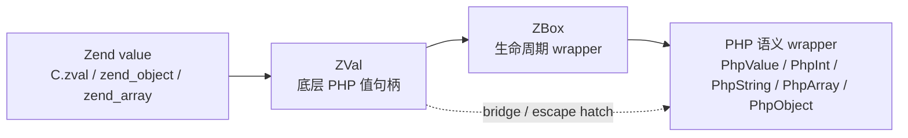
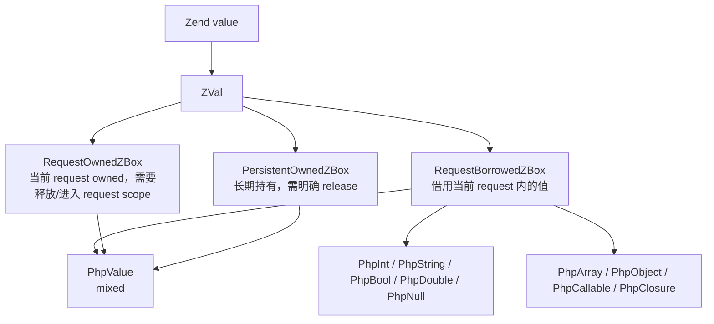

# PHP Interop

`vphp` 的 interop 层负责把 `V -> PHP` 的调用收成一套统一语义：

- 底层 bridge 先拿到 Zend value / `ZVal`
- 生命周期边界交给 `RequestBorrowedZBox` / `RequestOwnedZBox` / `PersistentOwnedZBox`
- 上层业务代码优先使用 `PhpValue` / `PhpInt` / `PhpString` / `PhpObject` 等 PHP 语义 wrapper
- 裸 `ZVal` 入口仍然保留，但命名会显式带出 `_zval` 或 ownership 语义

推荐把这份文档当成使用手册来查。

## 值分层地图

`vphp` 现在把“一个 PHP 值”拆成四层来看：



| 层级 | 代表类型 | 关注点 | 常见使用位置 |
| --- | --- | --- | --- |
| Zend value | `C.zval`, `zend_object`, `zend_array` | PHP 引擎内部内存 | C bridge / Zend API |
| ZVal | `vphp.ZVal` | 低层 PHP 值句柄 | bridge helper、底层调用、escape hatch |
| ZBox | `RequestBorrowedZBox`, `RequestOwnedZBox`, `PersistentOwnedZBox` | 生命周期和释放责任 | 参数读取、临时结果、长期保存 |
| PHP 语义 wrapper | `PhpValue`, `PhpInt`, `PhpString`, `PhpArray`, `PhpObject`, `PhpCallable` | PHP 类型语义 | 扩展业务代码、框架层 API |

更细一点看，`ZBox` 负责回答“这个值能活多久”，语义 wrapper 负责回答“这个值在 PHP 里是什么”：



几个基本判断：

| 问题 | 选择 |
| --- | --- |
| 只是调用 Zend / C bridge | 用 `ZVal` 或显式 `_zval` API |
| 读取 PHP 入参，不保存 | 用 `RequestBorrowedZBox` 或语义 wrapper 参数 |
| 接收 PHP 调用返回值，当前 request 内继续用 | 用 `RequestOwnedZBox` 或 `with_result(...)` |
| 要跨 request / 长期保存 | 用 `PersistentOwnedZBox` / retained handle |
| 希望调用点表达 PHP 类型 | 用 `PhpValue` / `PhpString` / `PhpObject` 等语义 wrapper |

### 示例：从裸 `ZVal` 进入语义 wrapper

```v
fn read_name(raw vphp.ZVal) !string {
	value := vphp.PhpValue.from_zval(raw)
	name := value.as_string()!
	return name.value()
}
```

这里 `raw` 是底层句柄，`PhpValue` 表达 mixed PHP 值，`PhpString` 再表达“我确认它是 PHP string”。

### 示例：读取函数参数

```v
@[php_function]
fn greet(name vphp.PhpString) string {
	return 'Hello ${name.value()}'
}
```

函数参数默认是 request 内借用语义：调用点不需要关心释放，也不应该把这个 wrapper 存进长期结构。

### 示例：调用 PHP 函数并返回标量 wrapper

```v
len := vphp.PhpFunction.named('strlen').call[vphp.PhpInt](vphp.PhpString.of('codex'))!
println(len.value())
```

`call[T]` 只适合可复制的标量 PHP wrapper：`PhpNull` / `PhpBool` / `PhpInt` / `PhpDouble` / `PhpString`。

### 示例：调用 PHP 函数并读取复杂值

```v
count := vphp.PhpFunction.named('array_filter').with_result[vphp.PhpArray, int](fn (filtered vphp.PhpArray) int {
	return filtered.count()
}, items)!
```

`PhpArray` / `PhpObject` / `PhpCallable` / `PhpValue` 这类复杂 wrapper 默认不要从临时返回值里逃逸，优先在 `with_result(...)` callback 内消费。

### 示例：调用对象方法

```v
obj := vphp.PhpObject.borrowed(raw_obj)

title := obj.method[vphp.PhpString]('title')!

payload_kind := obj.with_method_result[vphp.PhpValue, string]('payload',
	fn (payload vphp.PhpValue) string {
	return payload.type_name()
})!
```

对象方法和函数调用遵循同一条规则：标量结果可以用 `method[T]` 直接复制返回，复杂结果放进 `with_method_result(...)`。

### 示例：需要长期保存时升级生命周期

```v
mut owned := vphp.PhpFunction.named('make_handler').request_owned()
defer {
	owned.release()
}

mut stored := owned.clone()
// stored 是 PersistentOwnedZBox，适合放进长期结构；持有者负责 release。
```

长期保存是生命周期问题，不是类型语义问题。即使值在 PHP 语义上是 `PhpObject` 或 `PhpCallable`，保存时也必须有 persistent / retained 语义。

## 所有权速查（新）

`ZVal` 的 bridge action 现在有显式所有权版本：

- 默认入口：`request-owned`（请求结束自动释放）
- `*_owned_persistent`：跨请求/长期持有，需手动 `release()`
- `*_borrowed`：只借用 Zend 内部值，不持有

默认方法（`call/method/construct/static_method/static_prop/prop/@const`）都等价于 `*_owned_request`。

typed helper 也有对应版本：

- `*_owned_request_v[T]`
- `*_owned_persistent_v[T]`
- `*_borrowed_v[T]`（适用于 `prop/static_prop/const`）
- object helper 同理：`*_owned_request_object[T]` 等

`vphp` 还提供了类型封装，便于在框架内部做约束：

- `RequestBorrowedZBox`
- `RequestOwnedZBox`
- `PersistentOwnedZBox`

## 定义权与所有权模型

理解 `vphp` interop 时，最重要的一点是先区分：

1. 谁拥有“定义权”
2. 谁拥有“运行时状态”

可以把系统分成两类。

### 1. PHP-owned symbols

这类定义本来就在 PHP / Zend 一侧：

- PHP 全局函数
- PHP userland class
- PHP internal class
- PHP interface / trait
- PHP userland object

当 V 侧访问它们时，本质上只是：

- 拿到一个 `ZVal`
- 再调用 Zend 原本的能力

例如：

```v
dt := vphp.PhpClass.named('DateTimeImmutable').construct(vphp.PhpString.of('2026-03-04'))!

stamp := dt.method[vphp.PhpString]('format', vphp.PhpString.of('c'))!
```

这里：

- `DateTimeImmutable` 的定义权在 PHP
- 对象状态也在 PHP / Zend
- V 只是调用者

这类场景里，不存在“两次定义”。

### 2. V-owned but PHP-exported symbols

这类定义写在 V 侧，但需要导出到 PHP：

- `@[php_function]`
- `@[php_class]`
- `@[php_interface]`
- `@[php_enum]`

这里要分开看：

#### 函数

函数更接近“单份语义 + 一层 PHP 入口”：

- V 侧有真实函数实现
- PHP 侧注册一个 Zend function entry
- 调用时桥接到 V

所以函数不是“两块状态内存”，而是：

- 一份逻辑实现
- 一份 PHP 导出入口

#### 类 / 对象 / static / const

这类有状态实体，就更接近“两套表示”：

- V 侧有 struct / object 语义
- PHP 侧有 class entry / object / property table / static table

因此这里通常会出现：

- V 侧表示
- PHP 侧表示
- 编译器和运行时负责桥接
- 必要时做同步

这也是为什么 `vphp` 里会有：

- object wrapper
- generated `get_prop / set_prop / sync_props`
- class static shadow
- class const shadow

### 一句话总结

- PHP 原生定义：`V -> Zend`
- V 导出定义：`V 定义 + PHP 导出壳 + 必要的桥接/同步`

### 对对象最实用的理解

如果对象来自 PHP 原生定义，例如：

```v
obj := vphp.PhpClass.named('DateTimeImmutable').construct()!
```

那么 V 侧拿到的是“PHP 对象的 `ZVal` 视图”。

如果对象来自 `vphp` 导出的 V 类，例如：

```v
article_z := vphp.php_class('Article').construct([...])
article := article_z.to_object[Article]() or { return }
```

那么它同时有两层：

- PHP 侧对象壳子
- V 侧真实对象指针

这也是为什么：

- 普通 PHP 对象不能随便 `to_object[T]()`
- `vphp` 导出的对象才可以恢复成 `&T`

## 1. 函数

全局函数入口：

```v
length := vphp.PhpFunction.named('strlen').call[vphp.PhpInt](vphp.PhpString.of('codex'))!
```

如果只需要在当前作用域读取复杂返回值，推荐用语义化 callback，
把 PHP 返回值限制在一个小作用域里：

```v
version := vphp.PhpFunction.named('phpversion').with_result[vphp.PhpString, string](fn (res vphp.PhpString) string {
	return res.value()
})!
```

如果结果要交给后续逻辑继续持有，推荐接收 request-owned box：

```v
mut version := vphp.PhpFunction.named('phpversion').request_owned()
defer { version.release() }
```

如果只要标量结果，可以用更直接的命名：

```v
version := vphp.PhpFunction.named('phpversion').result_string()
exists := vphp.PhpFunction.named('function_exists').result_bool(vphp.PhpString.of('strlen'))
```

`php_fn(...)` 仍适合表达 callable 风格的 PHP 函数引用：

```v
res := vphp.php_fn('phpversion').call([])
```

函数相关的常用 API：

| API | 说明 |
| --- | --- |
| `PhpFunction.named(name)` | 获取语义化 PHP 函数 wrapper |
| `function_exists(name)` | 判断 PHP 全局函数是否存在 |
| `PhpFunction.named(name).call[T](args)` | 调用 PHP 全局函数，并返回可复制的 PHP 语义标量 wrapper |
| `PhpFunction.named(name).with_result[T, R](run, args...)` | 调用 PHP 全局函数，并在 callback 内借用 PHP 语义 wrapper |
| `PhpFunction.named(name).call_zval(args)` | 底层 ZVal 调用入口 |
| `PhpFunction.named(name).with_result_zval(run, args...)` | 底层 ZVal callback 入口 |
| `PhpFunction.named(name).result_string(args)` | 调用 PHP 全局函数，并返回 string |
| `PhpFunction.named(name).result_bool(args)` | 调用 PHP 全局函数，并返回 bool |
| `PhpFunction.named(name).result_i64(args)` | 调用 PHP 全局函数，并返回 i64 |
| `PhpFunction.named(name).result_double(args)` | 调用 PHP 全局函数，并返回 f64 |
| `PhpFunction.named(name).request_owned(args...)` | 调用 PHP 全局函数，并接收 request-owned 返回值 |
| `php_fn(name)` | 底层 callable ZVal 函数引用 |
| `z.call(args)` | 调用 callable（request-owned） |
| `z.call_owned_request(args)` | 显式 request-owned |
| `z.call_owned_persistent(args)` | 显式 persistent-owned |
| `z.call(args)` | 底层 callable 调用入口 |
| `z.to_v[T]()` | raw `ZVal` 到 V 值转换 |
| `z.to_object[T]()` | raw `ZVal` 到 vphp 导出对象指针恢复 |

## 2. 类

类入口：

```v
cls := vphp.PhpClass.named('DateTimeImmutable')
obj := cls.construct(vphp.PhpString.of('2026-03-04'))!
```

如果目标是 `vphp` 导出的对象，可以直接恢复成 `&T`：

```v
article_z := vphp.php_class('Article').construct([
	vphp.ZVal.new_string('Bridge'),
	vphp.ZVal.new_int(7),
])
article := article_z.to_object[Article]() or { return }
```

类相关的常用 API：

| API | 说明 |
| --- | --- |
| `PhpClass.named(name)` | 构造 PHP class 语义 wrapper |
| `PhpClass.find(name)` | 存在时返回 PHP class 语义 wrapper |
| `class_exists(name)` | 判断类是否存在 |
| `interface_exists(name)` | 判断接口是否存在 |
| `trait_exists(name)` | 判断 trait 是否存在 |
| `cls.construct(args)` | 构造对象，并返回 `PhpObject` |
| `cls.with_object(run, args...)` | 在 callback 内借用构造出的 `PhpObject` |
| `cls.construct(args...)` | 语义参数构造 PHP 对象，并返回 `PhpObject` |
| `cls.construct_zval(args)` | raw `ZVal` 构造入口 |
| `cls.static_method[T](name, args)` | 调用静态方法，并返回可复制的 PHP 语义标量 wrapper |
| `cls.with_static_method_result[T, R](name, run, args...)` | 静态方法 callback 入口，可借用复杂 PHP 语义 wrapper |
| `cls.static_method_request_owned(name, args...)` | 语义参数 + request-owned 生命周期入口 |
| `cls.static_method_zval(name, args)` | raw `ZVal` 静态方法入口 |
| `cls.static_prop[T](name)` | 读取静态属性，并返回可复制的 PHP 语义标量 wrapper |
| `cls.with_static_prop_result[T, R](name, run)` | 静态属性 callback 入口 |
| `cls.static_prop_zval(name)` | raw `ZVal` 静态属性入口 |
| `cls.const_value[T](name)` | 读取类常量，并返回可复制的 PHP 语义标量 wrapper |
| `cls.with_const_result[T, R](name, run)` | 类常量 callback 入口 |
| `cls.const_names()` | 获取类常量名列表 |
| `cls.const_exists(name)` | 判断类常量是否存在 |
| `php_class(name)` | 获取 class-string `ZVal`，用于底层 interop |

例子：

```v
label := vphp.PhpClass.named('PhpTypedBox').const_value[vphp.PhpString]('LABEL')!
count := vphp.PhpClass.named('PhpCounter').static_prop[vphp.PhpInt]('count')!
```

## 3. 对象

对象的实例调用可以走 `PhpObject` 语义 wrapper；底层 `ZVal` 入口仍然保留：

```v
php_obj := vphp.PhpClass.named('PhpGreeter').construct(vphp.PhpString.of('Codex'))!

msg := php_obj.method[vphp.PhpString]('greet')!
name := php_obj.prop_v[string]('name')!
```

对象相关的常用 API：

| API | 说明 |
| --- | --- |
| `PhpObject.borrowed(z)` | 从 object zval 构造语义对象 wrapper |
| `PhpObject.method[T](name, args)` | 调用实例方法，并返回可复制的 PHP 语义标量 wrapper |
| `PhpObject.with_method_result[T, R](name, args, run)` | 调用实例方法，并在 callback 内借用 PHP 语义 wrapper |
| `PhpObject.method_zval(name, args)` | 底层 ZVal 方法调用入口 |
| `PhpObject.with_method_result_zval(name, run, args...)` | 底层 ZVal callback 入口 |
| `z.method(name, args)` | 调用实例方法（request-owned） |
| `z.method_owned_request(name, args)` | 显式 request-owned |
| `z.method_owned_persistent(name, args)` | 显式 persistent-owned |
| `z.method_v[T](name, args)` | `method(name, args).to_v[T]()` |
| `z.method_object[T](name, args)` | `method(name, args).to_object[T]()` |
| `z.prop(name)` | 读取属性（request-owned） |
| `z.prop_borrowed(name)` | 借用属性 |
| `z.prop_owned_request(name)` | 显式 request-owned |
| `z.prop_owned_persistent(name)` | 显式 persistent-owned |
| `z.prop_v[T](name)` | `prop(name).to_v[T]()` |
| `z.prop_object[T](name)` | `prop(name).to_object[T]()` |
| `z.set_prop(name, value)` | 写属性 |
| `z.has_prop(name)` | 当前可访问 property 存在判断 |
| `z.isset_prop(name)` | 对齐 PHP `isset($obj->prop)` |
| `z.unset_prop(name)` | 对齐 PHP `unset($obj->prop)` |
| `z.method_exists(name)` | 判断类/对象方法是否存在 |
| `z.property_exists(name)` | 判断类/对象属性是否存在 |

属性写入会遵守 PHP 运行时规则：

- readonly 属性不能写
- protected/private 可见性不会被 interop 放宽

## 4. 文件加载

在 V 侧可以直接加载 PHP 文件：

```v
vphp.include('/path/to/file.php')
vphp.include_once('/path/to/file.php')
```

相关 API：

| API | 说明 |
| --- | --- |
| `php_const(name)` | 读取 PHP 全局常量 |
| `global_const_exists(name)` | 判断 PHP 全局常量是否存在 |
| `include(path)` | 对齐 PHP `include` |
| `include_once(path)` | 对齐 PHP `include_once` |

例子：

```v
ver := vphp.php_const('PHP_VERSION').to_string()
loaded := vphp.include_once('/tmp/bootstrap.php')
```

## 5. 元信息

`ZVal` 还提供了一组偏 introspection 的 helper，主要针对对象和 class-string：

| API | 说明 |
| --- | --- |
| `z.class_name()` | 类全名（对象或 class-string） |
| `z.namespace_name()` | 命名空间部分 |
| `z.short_name()` | 短类名 |
| `z.parent_class_name()` | 父类名 |
| `z.interface_names()` | 已实现接口列表 |
| `z.is_internal_class()` | 是否 PHP 内建类 |
| `z.is_user_class()` | 是否用户类 |
| `z.is_instance_of(name)` | 是否是给定类/父类/接口的实例 |
| `z.is_subclass_of(name)` | 是否是给定父类的子类 |
| `z.implements_interface(name)` | 是否实现指定接口 |
| `z.method_exists(name)` | 方法是否存在 |
| `z.property_exists(name)` | 属性是否存在 |
| `z.method_names()` | 方法名列表 |
| `z.property_names()` | 属性名列表 |
| `z.const_names()` | 类常量列表 |
| `z.const_exists(name)` | 类常量是否存在 |

例子：

```v
obj := vphp.PhpClass.named('DateTimeImmutable').construct(vphp.PhpString.of('2026-03-04'))!

println(obj.class_name())
println(obj.parent_class_name())
println(obj.interface_names())
println(obj.const_exists('ATOM'))
```

## Typed 与 Raw 的选择

推荐原则：

1. 已知 PHP 语义返回类型时，优先 `PhpFunction/PhpClass/PhpObject` 上的 `call[T]`、`static_method[T]`、`method[T]`
2. 需要在 callback 内借用复杂 PHP 值时，优先 `with_result[T, R]` / `with_method_result[T, R]`
3. 需要动态判断类型或做通用运行时时，使用 `PhpValue`
4. 只有落到底层 interop 时，才直接使用 raw `ZVal`

例如：

```v
length := vphp.PhpFunction.named('strlen').call[vphp.PhpInt](vphp.PhpString.of('codex'))!
println(length.value())
```

## `vphp` 对象与普通 PHP 对象的边界

`to_object[T]()` 和所有 `*_object[T]()` helper 只适用于：

- PHP 对象底层真的由 `vphp` wrapper 承载

也就是说，这种可以：

```v
article_z := vphp.php_class('Article').construct([...])
article := article_z.to_object[Article]() or { return }
```

这种不可以恢复成 `&Article`：

```v
dt := vphp.PhpClass.named('DateTimeImmutable').construct()!
dt.to_zval().to_object[Article]() or { /* none */ }
```

原因很简单：

- `Article` 带着 V 指针
- `DateTimeImmutable` 没有

## 参数构造建议

导出给 PHP 的函数参数目前分成五类：`vphp.Context`、V 原生值、
PHP 语义 wrapper、生命周期/裸 `ZVal` escape hatch、以及 `@[params]`
struct。完整规则见 [../compiler/README.md](../compiler/README.md) 的
“Exported Function Parameter Forms”。

导出函数的返回值也分成五类：`ctx.return()` 手动返回、V 原生值、V
容器/struct 序列化、PHP 语义 wrapper、生命周期/裸 `ZVal` 返回。完整
规则见 [../compiler/README.md](../compiler/README.md) 的
“Exported Function Return Forms”。

其中最容易踩坑的是 PHP 语义 wrapper：`vphp.PhpObject`、
`vphp.PhpArray`、`vphp.PhpCallable`、`vphp.PhpValue` 等返回时保留原
PHP 值语义，不会被当成 V struct 展开成数组。

`Context` 是显式进入底层调用帧的入口，但它本身也不再直接暴露 C 指针：

```v
pub struct Context {
pub:
	ex  vphp.ZExData
	ret vphp.PhpReturn
}
```

`ZExData` 和 `ZVal` 属于同一层级：它是 Zend execute data 的低层句柄。
`PhpReturn` 是 return slot 的语义 wrapper。常规代码应该通过
`ctx.arg_*()` / `ctx.args(...)` / `ctx.return()` 操作参数和返回值；
只有 bridge-level 代码才需要 `ctx.ex.raw_ex()` 或
`ctx.return().raw_zval()`。

手动组装参数时，推荐统一使用：

```v
vphp.ZVal.new_null()
vphp.ZVal.new_int(42)
vphp.ZVal.new_float(3.14)
vphp.ZVal.new_bool(true)
vphp.ZVal.new_string('hello')
```

旧的 `new_val_*` 兼容入口还在，但不再主推。

## 数组遍历 helper：`each / fold / reduce`

对 `array` / `object` 类型的 `ZVal`，现在有两组遍历语义：

### 原生遍历

- `foreach(...)`
- `each(...)`

其中：

- `each(...)` 是更语义化的别名
- 适合做副作用式遍历
- 不显式返回累积结果

例如：

```v
struct IterState {
mut:
	buf   string
	first bool = true
}

mut state := IterState{}
mut ref := &state

z.each(fn [ref] (key vphp.ZVal, val vphp.ZVal) {
	unsafe {
		if !(*ref).first {
			(*ref).buf += ','
		}
		(*ref).buf += '${key.to_string()}=${val.to_string()}'
		(*ref).first = false
	}
})
```

`each(...)` / `fold(...)` 不只适用于 PHP array。
只要 PHP 对象实现了可遍历语义（例如 `Iterator` / `IteratorAggregate`），
底层也会按 PHP `foreach ($obj as $key => $value)` 的方式遍历它。

### 带累积器的遍历

- `foreach_with_ctx(init, cb)`
- `fold(init, cb)`
- `reduce(init, cb)`

其中：

- `fold(...)` / `reduce(...)` 是更直观的语义化别名
- 当前 `reduce(...)` 与 `fold(...)` 保持同义，统一采用显式初始值版本
- 适合把 PHP 数组折叠成：
  - `[]string`
  - `map[string]string`
  - 字符串汇总
  - 任意自定义累积器

例如：

```v
items := z.fold[[]string]([]string{}, fn (key vphp.ZVal, val vphp.ZVal, mut acc []string) {
	acc << '${key.to_string()}=${val.to_string()}'
})

settings := z.fold[map[string]string](map[string]string{}, fn (key vphp.ZVal, val vphp.ZVal, mut acc map[string]string) {
	acc[key.to_string()] = val.to_string()
})

summary := z.reduce[string]('', fn (_ vphp.ZVal, val vphp.ZVal, mut acc string) {
	if acc.len > 0 {
		acc += '|'
	}
	acc += val.to_string()
})
```

推荐习惯：

- 只遍历副作用：`each(...)`
- 要累积结果：`fold(...)`
- 兼容旧代码：`foreach(...)` / `foreach_with_ctx(...)`

## 数组 key 语义：list / assoc / mixed

PHP `array` 的 key 可能同时包含 `int` 和 `string`，所以桥接层不要默认把 key 全部字符串化再回查。

现在 `ZVal` 上推荐这样区分：

- `is_list()`
- `keys()`
- `keys_string()`
- `assoc_keys()`
- `get_key(key_zval)`
- `get(string)`

建议用法：

- 处理 PHP list：先 `is_list()`，再按顺序值处理
- 处理关联数组：用 `assoc_keys()` + `get(...)`
- 需要保留原始 key 类型：用 `keys()` 或 `foreach(...)`
- 已知只有字符串键：才用 `keys_string()`

例如：

```v
if payload.is_list() {
	for idx := 0; idx < payload.array_count(); idx++ {
		println(payload.array_get(idx).to_string())
	}
} else {
	for key in payload.assoc_keys() {
		println('${key}=${payload.get(key) or { vphp.ZVal.new_null() }.to_string()}')
	}
}
```

如果需要同时支持数字键和字符串键，推荐保留 key 的原始类型：

```v
keys := payload.keys()
for idx := 0; idx < keys.array_count(); idx++ {
	key := keys.array_get(idx)
	val := payload.get_key(key) or { continue }
	println('${key.type_name()}:${key.to_string()}=${val.to_string()}')
}
```

经验规则：

- `assoc_keys()` 适合框架配置、JSON object、metadata、表单字段
- `is_list()` 适合 tags、messages、rows、ops 这类顺序数据
- `keys_string()` 只适合“确认全部是字符串键”的场景
- 不要对 list 走“`array_keys` -> 字符串 key -> `get(string)`”这条链

## 错误处理建议

两种常用风格：

### 严格桥接

当 PHP 调用失败就应该立刻转成 PHP 异常时：

```v
length := vphp.PhpFunction.named('strlen').call[vphp.PhpInt](vphp.PhpString.of('codex')) or {
	vphp.throw_exception('strlen failed: ${err.msg()}', 0)
	return
}
```

### 宽容桥接

当结果只是增强信息，有清晰 fallback 时：

```v
mode := cfg.prop_v[string]('mode') or { 'default' }
count := vphp.PhpClass.named('PhpCounter').static_prop[vphp.PhpInt]('count') or { vphp.PhpInt.zero() }
```

经验规则：

- 核心控制流：抛异常
- 可选信息：本地 fallback

## 完整示例：include PHP 模块文件后在 V 侧使用

一个很实用的 interop 场景是：

1. 在 PHP 文件里定义 class
2. 同一个文件返回 config array
3. V 侧 `include_once`
4. V 侧构造该类、调用方法、读取类信息
5. V 侧遍历返回的数组

例如 PHP fixture：

```php
<?php

namespace Demo\IncludeCase;

final class ModuleBox
{
    public function __construct(public string $name) {}

    public function describe(): string
    {
        return "box:{$this->name}";
    }
}

return [
    'mode' => 'prod',
    'driver' => 'mysql',
    'host' => '127.0.0.1',
];
```

V 侧可以这样使用：

```v
config := vphp.include_once(path)
if !config.is_array() {
	return
}

if !vphp.class_exists('Demo\\IncludeCase\\ModuleBox') {
	return
}

box := vphp.PhpClass.named('Demo\\IncludeCase\\ModuleBox').construct(vphp.PhpString.of('codex')) or { return }

desc := box.method[vphp.PhpString]('describe') or { return }
class_name := box.class_name()
short_name := box.short_name()

mut entries := []string{}
entries = config.foreach_with_ctx[[]string](entries, fn (key vphp.ZVal, val vphp.ZVal, mut acc []string) {
	acc << '${key.to_string()}=${val.to_string()}'
})

println('count=${config.array_count()}')
println('class=${class_name}')
println('short=${short_name}')
println('desc=${desc.value()}')
println('items=${entries.join(",")}')
```

这条链说明了：

- `include_once()` 不只是加载值，也可以加载 PHP 类型定义
- `PhpClass.named(...)` 不会主动检查类是否存在，存在性判断应显式走 `class_exists(...)` 或 `PhpClass.find(...)`
- PHP 返回的数组可以直接在 V 侧 `count + foreach`
- 同一条 interop 链里可以同时处理：
  - 文件加载
  - 类构造
  - 方法调用
  - 元信息读取
  - 数组遍历
