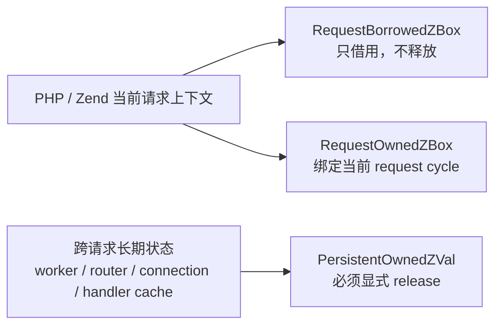
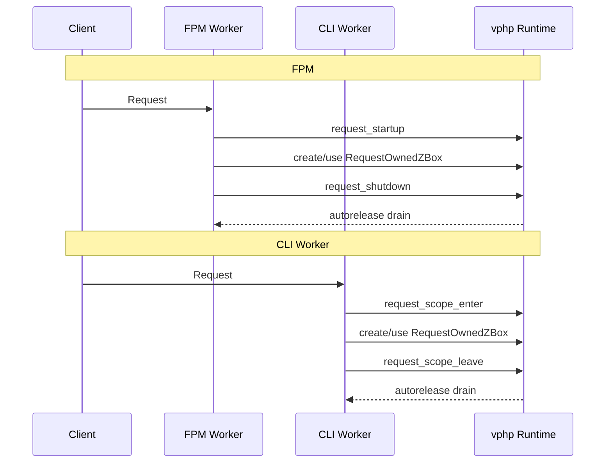

# VPHP Lifecycle Model (Zend-first)

## Goal

Stop incremental leak-fixes and move to one consistent model:

1. Explicit ownership (`borrowed` vs `owned`)
2. Request arena boundaries (nestable)
3. Zend-managed memory as first choice for cross-boundary runtime state

This follows the same philosophy used by `ext-php-rs` (`ZBox` + request lifecycle), while keeping V ergonomics.

## Core Rules

1. Any value crossing V/PHP boundary must declare ownership.
2. Borrowed values are never released by V.
3. Owned values are released once, at scope end or explicit handoff.
4. Request-dispatch code runs inside `RequestScope`.
5. Long-lived bridge pools/registries use Zend allocator APIs.

## V Primitives

`vphp/lifecycle.v` introduces:

- `OwnershipKind`
- `RequestBorrowedZBox`
- `RequestOwnedZBox`
- `PersistentOwnedZBox`
- `RequestScope`
- `with_request_scope(...)`

These are the canonical APIs for framework authors.

## Request Cycle Mental Model

`ZVal` 是否安全，不取决于运行模式本身，而取决于当前 request cycle 是否闭合。

- FPM 模式里，Zend/FPM 天然提供每次请求的 startup/shutdown 边界。
- CLI 长驻 worker 模式里，进程不会在每次请求后退出，所以框架或宿主必须自己补上 request scope。

### FPM vs CLI Worker

```mermaid
flowchart TD
    subgraph FPM["FPM / FastCGI"]
        A1["Worker 进程已启动"] --> A2["请求 1 到来"]
        A2 --> A3["RINIT / request_startup"]
        A3 --> A4["业务代码运行<br/>创建 RequestOwnedZVal"]
        A4 --> A5["RSHUTDOWN / request_shutdown"]
        A5 --> A6["request-owned 自动释放"]
        A6 --> A7["请求 2 到来"]
        A7 --> A8["RINIT / request_startup"]
        A8 --> A9["业务代码运行"]
        A9 --> A10["RSHUTDOWN / request_shutdown"]
        A10 --> A11["request-owned 自动释放"]
    end

    subgraph CLI["CLI 长驻进程 / Worker"]
        B1["进程启动一次"] --> B2["循环处理请求 1"]
        B2 --> B3["手动 enter request scope"]
        B3 --> B4["业务代码运行<br/>创建 RequestOwnedZVal"]
        B4 --> B5["手动 leave request scope"]
        B5 --> B6["request-owned 被 drain"]
        B6 --> B7["循环处理请求 2"]
        B7 --> B8["再次 enter request scope"]
        B8 --> B9["业务代码运行"]
        B9 --> B10["再次 leave request scope"]
        B10 --> B11["request-owned 被 drain"]
    end
```

这张图要表达的重点只有一个：

- FPM 是 Zend 帮你收口。
- CLI worker 是你自己收口。

## Extension Hook Phases

`vphp` exposes two lifecycle layers:

1. framework/runtime hooks
2. extension hooks

The framework hooks wire Zend to `vphp` internals. The extension hooks are the points an extension author can rely on for custom boot/shutdown logic.

### Hook Matrix

| Phase | Zend phase | Auto hook | User hook | Notes |
| --- | --- | --- | --- | --- |
| module init | `MINIT` | `vphp_ext_auto_startup()` | `vphp_ext_startup()` | auto hook is reserved for compiler/runtime generated setup such as interface auto-bind registration |
| module shutdown | `MSHUTDOWN` | `vphp_ext_auto_shutdown()` | `vphp_ext_shutdown()` | auto hook is the symmetric teardown point for generated module-scope state |
| request init | `RINIT` | `vphp_ext_request_auto_startup()` | `vphp_ext_request_startup()` | runs once per request after `vphp_framework_request_startup()` |
| request shutdown | `RSHUTDOWN` | `vphp_ext_request_auto_shutdown()` | `vphp_ext_request_shutdown()` | runs once per request before `vphp_framework_request_shutdown()` completes |

### Call Order

Module init:

1. `vphp_framework_init(module_number)`
2. `vphp_ext_auto_startup()`
3. `vphp_ext_startup()`
4. generated class/interface registration and module wiring

Module shutdown:

1. `vphp_ext_shutdown()`
2. `vphp_ext_auto_shutdown()`
3. `vphp_framework_shutdown()`

Request init:

1. `vphp_framework_request_startup()`
2. `vphp_ext_request_auto_startup()`
3. `vphp_ext_request_startup()`

Request shutdown:

1. `vphp_ext_request_shutdown()`
2. `vphp_ext_request_auto_shutdown()`
3. `vphp_framework_request_shutdown()`

Design rule:

- `auto_*` hooks are reserved for compiler/runtime generated logic
- non-`auto_*` hooks are reserved for extension authors
- this separation keeps generated behavior composable without taking away the developer's own startup/shutdown hook names

### Ownership Placement

对应到使用规则，就是：

1. `RequestBorrowedZBox` 只能在当前调用栈里短暂查看，不能跨 request 保存。
2. `RequestOwnedZBox` 可以拥有数据，但必须在当前 request cycle 结束前统一释放。
3. `PersistentOwnedZBox` 只用于跨请求对象，创建后要有明确的 `release()` 点。

### Sequence View

如果你更习惯用时序理解 request 生命周期，可以把它看成：

一句话记忆：

- `FPM: Zend 帮你收口`
- `CLI Worker: 你自己收口`

## Migration Plan

### Phase 1 (Foundation)

- Keep behavior unchanged.
- Replace ad-hoc mark/drain calls with `RequestScope`.
- Keep runtime counters enabled for observability.

### Phase 2 (Bridge Convergence)

- Convert bridge return paths to explicit `RequestBorrowedZBox` / `RequestOwnedZBox`.
- Remove implicit ownership transfer in helper paths.
- Restrict `dup_persistent()` usage to explicit ownership handoff points.

### Phase 3 (Zend-first Object Backing)

- Move long-lived wrapper pools/metadata to Zend allocator lifecycle.
- Reduce native-side deep clones in request object construction.
- Keep V objects as logical model; Zend owns lifecycle-critical memory blocks.

### Phase 4 (Validation Gates)

- A/B compare on `hello` route:
  - worker RSS slope
  - `runtime_counters` stability
  - throughput regression guard

If RSS still climbs while counters remain flat, treat as allocator residency and optimize allocation patterns rather than release semantics.

## Why this model

- Eliminates hidden ownership bugs.
- Makes nested dispatch safe by construction.
- Aligns with proven extension runtime patterns.
- Keeps V-side API simple and explicit.
