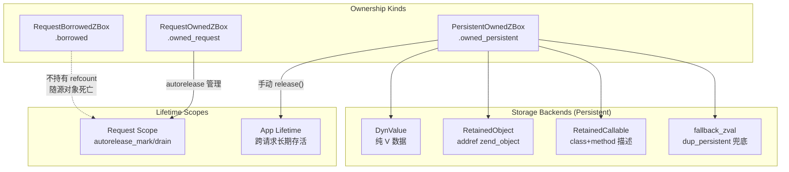

# VPhp/VSlim Ownership 模型分析与收口方案

## 一、Ownership 模型定义



### 三类 Box 的合法边界

| 类型 | 持有 refcount? | 生命周期 | 合法用途 | 危险操作 |
|------|-------------|---------|---------|---------|
| `RequestBorrowedZBox` | ❌ | 仅在当前栈帧/调用链内 | 函数参数传递，临时读取 | 存入 struct 字段、跨请求保存 |
| `RequestOwnedZBox` | ✅ (request autorelease) | 到 `RequestScope.close()` | 一次请求内的计算中间值 | 存入 App 级 struct |
| `PersistentOwnedZBox` | ✅ (手动管理) | 到 `release()` | App 级注册表：route handlers, middlewares, container entries | 直接 `.borrowed()` 后传给 PHP 调用 |

---

## 二、已确认并修掉的根因 ✅

以下问题在这 2.5 天已坐实并修复：

### 1. `Controller::app()` 缺口
- **根因**: Controller 在新 request scope 里调用时，`app_ref` 指向的 App 可能不是当前 dispatch 中的 App（尤其 singleton controller 场景）
- **修法**: 引入 `effective_controller_app()` → 优先用 `current_runtime_dispatch_app()`
- **文件**: [controller.v:5-11](file:///Users/guweigang/Source/vphpx/vslim/src/controller.v#L5-L11)

### 2. PSR-7 clone 深拷贝问题
- **根因**: `VSlimPsr7ServerRequest` 内部的 `PersistentOwnedZBox` 字段（server_params, cookie_params 等）在 clone/snapshot 时共享底层指针
- **修法**: 所有 `clone_*` / `snapshot_*` 路径加 `clone_assoc_payload_ref()` 深拷贝
- **文件**: [app_psr_bridge.v](file:///Users/guweigang/Source/vphpx/vslim/src/app_psr_bridge.v) 全文

### 3. `PersistentOwnedZBox.borrowed()` 危险用法清理
- **根因**: 对 `.dyn_data` 类型调用 `.borrowed()` 会产生一个临时 `RequestOwnedZBox` 然后立即 borrow，但那个 owned box 无人持有 → 可能被提前 drain
- **修法**: [lifecycle.v:763-778](file:///Users/guweigang/Source/vphpx/vphp/lifecycle.v#L763-L778) — 所有非 fallback 路径改为 `clone_request_owned().borrowed()`

### 4. `vphp_get_type(NULL)` 真 bug
- **根因**: C 层 `vphp_get_type()` 没有做 NULL 检查，直接 `Z_TYPE_P(z)` 对 NULL pointer → SIGSEGV
- **修法**: [values.inc.c](file:///Users/guweigang/Source/vphpx/vphp/bridge/values.inc.c) — 所有三个函数加 `z ? ... : 默认值`

### 5. `from_callable_zval()` / `from_object_zval()` 设计修正
- **根因**: 之前 persistent 路径粗暴 `dup_persistent(raw zval)` 对 object 做持久化 → 跨 request 时 GC 已经回收底层 object
- **修法**: [lifecycle.v:326-351](file:///Users/guweigang/Source/vphpx/vphp/lifecycle.v#L326-L351) — 优先走 `RetainedCallable.from_zval()` / `RetainedObject.from_zval()` + addref

### 6. `call.inc.c` 方法调用统一化
- **根因**: `zend_call_method_with_N_params` 系列宏在某些 PHP 版本/edge case 下对参数数组处理不一致
- **修法**: [call.inc.c diff](file:///Users/guweigang/Source/vphpx/vphp/bridge/call.inc.c) — 统一走 `call_user_function()` 路径

---

## 三、当前剩余问题线 🔍

### 线 1: Object Registry 中的 stale entry

**现象**: `vphp_return_obj()` 在 object registry 中找到一个已经 `IS_OBJ_DESTRUCTOR_CALLED` 的 entry，如果不清理会返回已死对象给 PHP → use-after-free

**当前修法** (试验性):
```c
// object.inc.c: 新增 stale entry 检测
if (existing_obj) {
    if (GC_FLAGS(existing_obj) & IS_OBJ_DESTRUCTOR_CALLED) {
        // 清理 stale entry
        zend_hash_index_del(&vphp_object_registry, (zend_ulong)v_ptr);
        existing_obj = NULL;
    }
}
```

**评估**: 这个修法本质上是 **防御性补丁**，不是根因修复。真正的问题是 `vphp_free_object_handler` 在对象析构时没有从 registry 中清除对应的 v_ptr→obj 映射。

**建议**:
- ✅ KEEP 这个 stale 检测作为安全网
- 🔧 额外在 `vphp_free_object_handler` 结尾加 `zend_hash_index_del(&vphp_object_registry, ...)` 以根治

### 线 2: `vphp_free_object_handler` 中 cleanup/free 顺序

**当前变更**: 把 owned v_ptr 的 `cleanup_raw()` + `free_raw()` 从 `zend_object_std_dtor()` **之前**移到了**之后**。

```diff
- // 旧：先 cleanup+free，再 std_dtor
+ // 新：先 std_dtor，再 cleanup+free
```

**评估**: 这个顺序调整有道理 — `std_dtor` 会触发 PHP 侧的属性释放，如果 V 侧先 free 了 v_ptr，PHP 侧 property 访问可能 crash。但需要验证 cleanup 回调里是否有依赖 object 仍存活的逻辑。

**建议**: ✅ KEEP，但需要一个专门的析构顺序 probe 测试

---

## 四、所有未提交改动审查

> 47 files changed, 1364 insertions(+), 672 deletions(-)

### KEEP — 确认正确的修复

| 文件 | 改动类型 | 判定 |
|------|---------|------|
| `vphp/bridge/values.inc.c` | NULL guard 三处 | ✅ KEEP — 修复真 bug |
| `vphp/bridge/call.inc.c` | 统一 call_user_function | ✅ KEEP — 修复一致性问题 |
| `vphp/lifecycle.v` | borrowed() 安全化 + from_callable/from_object 走 retained 路径 | ✅ KEEP — 核心修复 |
| `vphp/object.v` | RetainedObject addref/release 逻辑 | ✅ KEEP — 基础设施 |
| `vphp/zval.v` | adopt/clone ownership 明确化 | ✅ KEEP |
| `vslim/src/controller.v` | effective_controller_app() | ✅ KEEP |
| `vslim/src/container.v` | from_object_zval / from_mixed_zval 路径修正 | ✅ KEEP |
| `vslim/src/request.v` | snapshot_* 深拷贝 | ✅ KEEP |
| `vslim/src/response.v` | snapshot 深拷贝、一致化 | ✅ KEEP |
| `vslim/src/psr_http.v` | PSR-7 immutable clone 正确性 | ✅ KEEP |
| `vslim/src/app_psr_bridge.v` | 所有 payload normalization 的 clone 修正 | ✅ KEEP |
| `vslim/src/app_middleware_runtime.v` | middleware chain dispatch 修正 | ✅ KEEP |
| `vslim/src/php_app_middleware.v` | middleware 注册/解析 | ✅ KEEP |
| `vslim/src/app_dispatch_api.v` | dispatch API request_scope 包裹 | ✅ KEEP |
| `vslim/src/app_route_dispatch.v` | route dispatch payload 管理 | ✅ KEEP |
| `vslim/src/app_kernel.v` | kernel dispatch 流程 | ✅ KEEP |
| `vslim/src/app_execution_kernel.v` | execution kernel | ✅ KEEP |
| `vslim/src/app_phase.v` | before/after phase 处理 | ✅ KEEP |
| `vslim/src/app_services.v` | services 层 | ✅ KEEP |
| `vslim/src/app_terminal.v` | terminal 响应 | ✅ KEEP |
| `vslim/src/app_response.v` | response finalization | ✅ KEEP |
| `vslim/src/route.v` | route 匹配 | ✅ KEEP |
| `vslim/src/runtime.v` | runtime dispatch app | ✅ KEEP |
| `vslim/src/php_app.v` | app 注册 | ✅ KEEP |
| `vslim/src/types.v` | type 定义清理 | ✅ KEEP |
| `vslim/src/view.v` | view helpers | ✅ KEEP |
| `vslim/src/view_render.v` | view 渲染 | ✅ KEEP |
| `vslim/src/stream_response.v` | stream response | ✅ KEEP |
| `vslim/src/database_runtime.v` | database | ✅ KEEP |
| `vslim/src/session_runtime.v` | session | ✅ KEEP |
| `vslim/src/testing_runtime.v` | testing harness | ✅ KEEP |
| `vslim/src/psr7_adapter_runtime.v` | PSR7 adapter | ✅ KEEP |

### KEEP-DEBUG — debug 日志，后续应移除

| 文件 | 改动内容 |
|------|---------|
| `vphp/bridge/object.inc.c` | stale entry 检测 + 大量 snprintf debug_buf 日志 |

> [!IMPORTANT]
> object.inc.c 中的 debug 日志在 production 中应当通过条件编译或 debug flag 禁用。当前 `vphp_bridge_object_debug_log()` 每次都调用，有性能开销。

### Knowledge Studio 应用文件 — 独立功能

| 文件 | 判定 |
|------|------|
| `knowledge-studio/app/Http/Controllers/ConsoleController.php` | 独立功能，不影响 ownership |
| `knowledge-studio/app/Http/routes/web.php` | 同上 |
| `knowledge-studio/app/Repositories/*.php` | 同上 |
| `knowledge-studio/app/Services/*.php` | 同上 |
| `knowledge-studio/database/migrations/*` | 同上 |
| `knowledge-studio/database/seeds/*` | 同上 |
| `knowledge-studio/resources/views/*` | 同上 |

### 测试文件

| 文件 | 判定 |
|------|------|
| `vslim/tests/test_vslim_knowledge_studio_bootstrap_singleton_chain.*` | ✅ KEEP — singleton 场景回归测试 |
| `vslim/tests/test_vslim_vhttpd_dispatch_request_controller_layout_chain.phpt` | ✅ KEEP — controller layout 回归 |
| `vslim/tests/test_vslim_knowledge_studio_bootstrap_singleton_repeated_chain.phpt` | ✅ KEEP — 新增 repeated 场景 |

### `app_memory.v` — 减量但保留

当前 `app_memory.v` 从原来的 ~106 行缩减到 ~36 行（-70 行）。删除的是之前一批 per-field release 逻辑。需要确认 `free()` 里剩余逻辑是否覆盖了所有 PersistentOwnedZBox 字段的清理。

---

## 五、行动计划

### Phase 1: 收口 + 提交（今天）

1. **确认 object registry 根治**
   - 在 `vphp_free_object_handler` 结尾、sidecar cleanup 之后，加入：
     ```c
     if (v_ptr_key) {
         zend_hash_index_del(&vphp_object_registry, (zend_ulong)v_ptr_key);
     }
     ```
   - 保留现有 stale 检测作为安全网

2. **debug 日志可控化**
   - `object.inc.c` 中的 `vphp_bridge_object_debug_log()` 调用已有 `vphp_bridge_object_debug_enabled()` 检查部分，但新增的几处没有。统一加 `if (vphp_bridge_object_debug_enabled())` 守卫

3. **分批 git commit**
   ```
   commit 1: fix: vphp NULL guard 和 call_user_function 统一化
   commit 2: fix: ownership lifecycle — borrowed/retained/persistent 模型修正
   commit 3: fix: vslim PSR-7 深拷贝和 controller app 绑定
   commit 4: fix: vslim middleware chain 和 dispatch 流程修正
   commit 5: feat: knowledge-studio 控制台功能扩展
   commit 6: test: 新增 ownership 回归测试
   ```

### Phase 2: 验证（明天）

1. 跑全量 `.phpt` 测试
2. knowledge-studio 真实链路顺序请求验证
3. 如果全部通过，push + PR

---

## 六、Ownership 模型不变量（规范）

以下不变量应始终成立，违反任何一条都是 bug：

> [!CAUTION]
> 1. **PersistentOwnedZBox 绝不直接 `.borrowed()` 后跨调用链传递** — 除非 fallback_zval 类型
> 2. **跨请求存活的对象必须走 RetainedObject（addref）或 DynValue（纯 V 数据）** — 不允许原始 zval 跨请求
> 3. **所有返回给 PHP 层的 object 必须通过 `return_owned_object_raw()` 或 `return_borrowed_object_raw()`** — 不允许裸指针
> 4. **`RequestScope.close()` 之后，所有该 scope 内的 RequestOwnedZBox 视为无效**
> 5. **VSlimPsr7ServerRequest 的 snapshot 必须深拷贝所有 PersistentOwnedZBox 字段**

> [!TIP]
> 排查方法论：
> - 任何 SIGSEGV / 空 body / invalid middleware 现象，**先问是哪个 box 类型在哪个 scope 里**
> - 用最小 probe 隔离，不准靠大链路推断
> - 修法只允许 owner-first（谁创建谁释放）或 retained-first（显式 addref）
