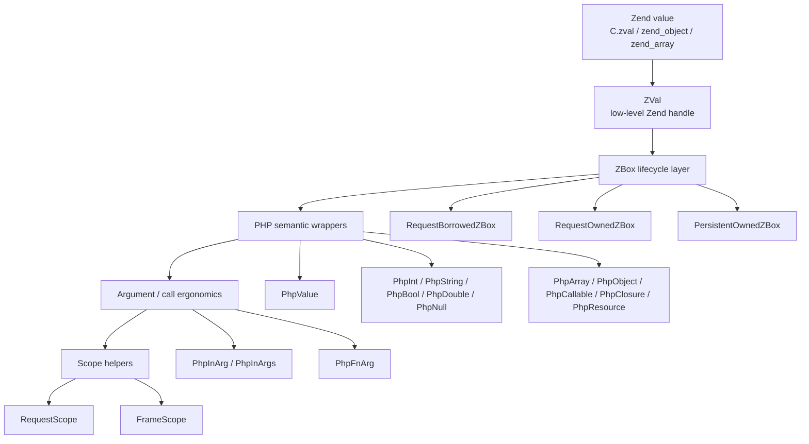
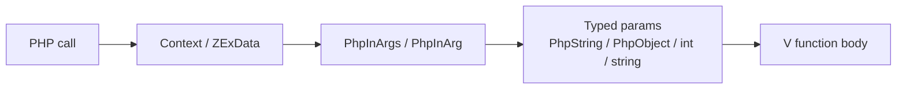
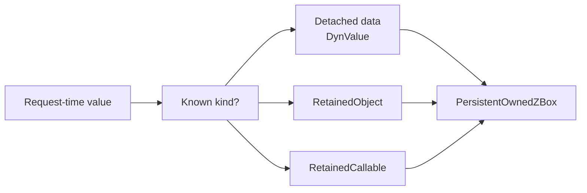

# VPHP Value Layers

This document explains how VPHP value types relate to each other.

Use it when choosing between:

- `ZVal`
- `RequestBorrowedZBox` / `RequestOwnedZBox` / `PersistentOwnedZBox`
- `PhpValue` / `PhpInt` / `PhpString` / `PhpArray` / `PhpObject` / ...
- `PhpInArg` / `PhpFnArg`
- `RequestScope` / `FrameScope`

## One Value, Several Questions

A PHP value crosses several boundaries before application code should touch it.
Each layer answers a different question:



| Layer | Main types | Question answered |
| --- | --- | --- |
| Zend | `C.zval`, `zend_object`, `zend_array` | What does the PHP engine store? |
| Low-level handle | `ZVal` | How does V touch the Zend value? |
| Lifecycle | `RequestBorrowedZBox`, `RequestOwnedZBox`, `PersistentOwnedZBox` | How long can this value live, and who releases it? |
| PHP semantics | `PhpValue`, `PhpInt`, `PhpArray`, `PhpObject`, ... | What PHP type does this value mean? |
| Arguments | `PhpInArg`, `PhpFnArg` | Is this value coming from PHP, or going into a PHP call? |
| Scopes | `RequestScope`, `FrameScope` | Where are temporary request-owned values released? |

The important rule: do not use a lower layer when a higher layer expresses the
intent clearly.

## `ZVal`

`ZVal` is the bridge-level escape hatch over a Zend value.

Use it for:

- C / Zend bridge helpers
- raw interop code with explicit `_zval` APIs
- implementing semantic wrappers
- places where PHP key type or low-level zval state must be inspected directly

Avoid it in extension application code when a semantic wrapper can say the same
thing:

```v
// Prefer this in application code.
fn greet(name vphp.PhpString) string {
	return 'Hello ${name.value()}'
}

// Keep this style in bridge-level code.
fn greet_raw(name vphp.ZVal) string {
	return 'Hello ${name.to_string()}'
}
```

## `*ZBox`

`ZBox` types add lifecycle and ownership to a Zend value.

| Type | Meaning | Typical source | Release rule |
| --- | --- | --- | --- |
| `RequestBorrowedZBox` | Borrowed view of a request value | PHP arguments, borrowed wrappers | Do not release |
| `RequestOwnedZBox` | Temporary value owned in the current request | PHP call result, `RequestOwnedZBox.new_*`, adopted zval | Release once or hand to a scope |
| `PersistentOwnedZBox` | Long-lived detached data or retained handle | app state, route metadata, cached callables | Owner must release |

Request-owned values are for the current request or call flow. Persistent-owned
values are for long-lived storage. Converting from request to persistent is an
ownership/lifecycle decision, not a PHP type decision.

Common constructors:

```v
borrowed := vphp.RequestBorrowedZBox.of(z)
owned := vphp.RequestOwnedZBox.of(z)
stored := vphp.PersistentOwnedZBox.of(z)
```

When the input kind is known, prefer the explicit persistent constructor:

```v
stored_data := vphp.PersistentOwnedZBox.of_data(dyn)
stored_object := vphp.PersistentOwnedZBox.of_object(obj.to_zval())
stored_callable := vphp.PersistentOwnedZBox.of_callable(callable.to_zval())
```

For `DynValue`, retained object, or retained callable data, use:

```v
stored := vphp.DynValue.persistent_owned_zbox(value)
```

`value` may be:

- `DynValue`
- `RetainedObject`
- `RetainedCallable`

## PHP Semantic Wrappers

Semantic wrappers describe PHP type intent.

| Wrapper | Meaning |
| --- | --- |
| `PhpValue` | mixed PHP value |
| `PhpNull`, `PhpBool`, `PhpInt`, `PhpDouble`, `PhpString` | scalar/null PHP values |
| `PhpArray` | PHP array |
| `PhpObject` | PHP object |
| `PhpCallable`, `PhpClosure` | callable / closure semantics |
| `PhpResource` | PHP resource |
| `PhpIterable`, `PhpReference`, `PhpThrowable`, `PhpEnumCase` | specialized PHP semantics |

These wrappers are built on top of `PhpValueZBox`, so they can carry borrowed,
request-owned, or persistent-owned storage while presenting a PHP type API.

Examples:

```v
value := vphp.PhpValue.from_zval(raw)
name := value.require_string()!

arr := vphp.PhpArray.empty()
arr.string('name', 'codex')

obj := vphp.PhpObject.borrowed(raw_obj)
title := obj.method[vphp.PhpString]('title')!
```

Use `with_result(...)` / `with_method_result(...)` for complex temporary return
values so the lifecycle stays inside the callback:

```v
count := vphp.PhpFunction.named('array_filter').with_result[vphp.PhpArray, int](
	fn (filtered vphp.PhpArray) int {
	return filtered.count()
}, items)!
```

Use `call[T]` / `method[T]` for copied scalar wrappers:

```v
length := vphp.PhpFunction.named('strlen').call[vphp.PhpInt](vphp.PhpString.of('codex'))!
```

## `PhpInArg` And `PhpFnArg`

These two names are intentionally different.

### `PhpInArg`

`PhpInArg` means: "a PHP argument that came into a V-exported function".

It carries:

- `value PhpValue`
- optional `PhpInArgMeta` with `index` and `name`

Use it when the function needs dynamic access to the original PHP argument list:

```v
arg := ctx.arg_at(0)
name := arg.name()
value := arg.string_value() or { vphp.PhpString.empty() }
```

Normally, exported V functions should prefer typed parameters instead:

```v
@[php_function]
fn hello(name vphp.PhpString, count int) string {
	return '${name.value()}:${count}'
}
```

### `PhpFnArg`

`PhpFnArg` means: "a value being passed from V into a PHP function, method, or
callable".

It is a sum type over semantic wrappers, plus `PhpInArg` for pass-through cases:

```v
pub type PhpFnArg = PhpArray
	| PhpInArg
	| PhpBool
	| PhpCallable
	| PhpClosure
	| PhpDouble
	| PhpEnumCase
	| PhpInt
	| PhpIterable
	| PhpNull
	| PhpObject
	| PhpReference
	| PhpResource
	| PhpScalar
	| PhpString
	| PhpThrowable
	| PhpValue
```

That lets V call PHP with semantic values directly:

```v
result := vphp.PhpFunction.named('sprintf').call[vphp.PhpString](
	vphp.PhpString.of('hello %s'),
	vphp.PhpString.of('codex'),
)!
```

Rule of thumb:

| Direction | Type |
| --- | --- |
| PHP -> V argument metadata | `PhpInArg` / `PhpInArgs` |
| V -> PHP call argument | `PhpFnArg` |
| Already typed V-exported function parameter | `PhpString`, `PhpObject`, `int`, `string`, etc. |

## Scopes

### `RequestScope`

`RequestScope` manages request-owned values for a request/call boundary.

Compiler-generated glue uses:

```v
mut vphp_scope := vphp.PhpScope.once()
defer {
	vphp_scope.close()
}
```

Use `PhpScope.request()` when a larger request-level window is needed. Use
`PhpScope.once()` for one call boundary.

Most extension code should not need to call low-level autorelease functions
directly.

### `FrameScope`

`FrameScope` is for building temporary PHP call arguments inside one V frame.

It owns the request-owned boxes it creates and releases them all at once:

```v
mut frame := vphp.PhpScope.frame()
defer {
	frame.release()
}

args := [
	frame.string('codex'),
	frame.int(42),
]

result := vphp.PhpFunction.named('handler').request_owned(...args)
```

Use `FrameScope.args_from_persistent_owned(...)` when long-lived stored values
need to be passed into a request-time PHP callable:

```v
mut frame := vphp.PhpScope.frame()
defer {
	frame.release()
}

args := frame.args_from_persistent_owned(stored_args)
result := handler.fn_request_owned(...args)
```

`FrameScope` is not persistent storage. It is a short-lived conversion and
cleanup helper.

## Common Flows

### PHP Calls V



Supported parameter styles:

| Style | Example | Use when |
| --- | --- | --- |
| `Context` | `fn handle(ctx vphp.Context)` | Need raw execute data or manual arg access |
| V scalars | `fn add(a int, b string)` | Simple scalar parameters |
| PHP semantic wrappers | `fn run(argv vphp.PhpIterable)` | Want PHP type semantics |
| optional params | `fn value(default ?vphp.PhpValue)` | Missing argument matters |
| `@[params]` struct | `fn create(p CreateParams)` | Named/default argument groups |

Do not combine `Context` with `PhpInArgs` as public parameters. `PhpInArgs` is
derived from the context inside glue.

### V Calls PHP


Prefer semantic call APIs:

```v
upper := vphp.PhpFunction.named('strtoupper').call[vphp.PhpString](
	vphp.PhpString.of('codex'),
)!

sent := conn.with_method_result[vphp.PhpValue, bool]('send',
	fn (result vphp.PhpValue) bool {
	return result.is_valid()
}, vphp.PhpString.of('payload'))!
```

Use `_zval` APIs only at bridge boundaries or when the raw zval behavior is the
point of the code.

### Store For Later



Use:

```v
stored := vphp.PersistentOwnedZBox.of(value.to_zval())
```

or, when the retained / dynamic type is already known:

```v
stored := vphp.DynValue.persistent_owned_zbox(ref.clone())
```

The owner of a `PersistentOwnedZBox` must have a matching `release()` path.

## Naming Rules

Current naming direction:

| Pattern | Meaning |
| --- | --- |
| `from_zval(...)` | Build a semantic wrapper view from an existing `ZVal` |
| `from_request_owned_zbox(...)` | Build a semantic wrapper from `RequestOwnedZBox` |
| `from_persistent_owned_zbox(...)` | Build a semantic wrapper from `PersistentOwnedZBox` |
| `from_persistent_zval(...)` | Preserve a persistent zval payload inside a semantic wrapper |
| `to_zval()` | Expose the underlying zval view |
| `zval()` | Read the underlying `ZVal` from a PHP input argument |
| `zbox()` | Borrow a PHP input argument as `RequestBorrowedZBox` |
| `to_request_owned()` | Materialize an owned request box |
| `persistent_owned_zbox(...)` | Produce `PersistentOwnedZBox` |
| `request_owned(...)` | PHP call result owned by current request |
| `with_result(...)` | Borrow a result inside a callback |
| `_zval` suffix | Low-level escape hatch |

Names should reveal both type semantics and lifecycle semantics. If a helper
returns `PersistentOwnedZBox`, its name should say `zbox`, not just `box`.

## Remaining Edges To Clean Up

The model is now coherent, but a few edges are still worth tightening:

1. `with_request_zval(...)` still exists in vphp internals. That is reasonable at
   the lifecycle boundary, but new application code should prefer semantic
   helpers such as `with_request_value`, `with_request_array`, or
   `with_request_object`.
2. Generated glue still has to touch `Context` and raw argument slots. That is a
   compiler boundary detail; public extension signatures should continue moving
   toward typed scalar/semantic wrappers and `@[params]` structs.
