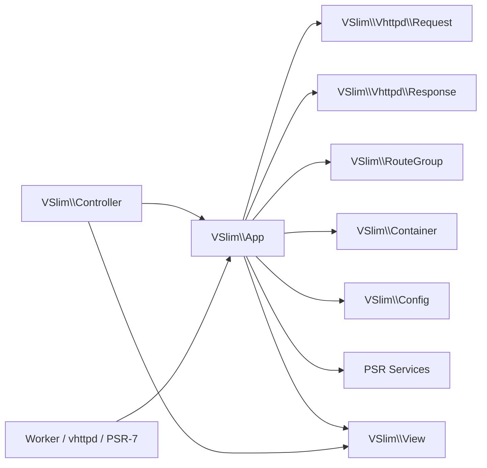

# VSlim

Documentation entry:

- overview: [docs/OVERVIEW.md](/Users/guweigang/Source/vphpx/vslim/docs/OVERVIEW.md)

`VSlim` 是一个运行在 `vphp` 之上的 PHP 微框架扩展，核心目标是给 PHP 用户提供熟悉的 runtime builder 体验：

- `VSlim\App` 负责路由注册、分发、middleware、phase middleware
- `VSlim\Cli\App` 负责共享 app service graph 上的 command bootstrap / discovery / execution
- `VSlim\Vhttpd\Request` / `VSlim\Vhttpd\Response` 提供轻量 request/response facade
- `VSlim\Stream\Response` 提供扩展原生流式响应类型
- `VSlim\WebSocket\App` 提供扩展原生 WebSocket handler
- `VSlim\Mcp\App` 提供扩展原生 MCP handler
- `VSlim\View` / `VSlim\Controller` 提供轻量 MVC 能力；View 现在按“指令 + 表达式 + 变量路径”三层组织
- `VSlim\Container` / `VSlim\Config` 提供基础依赖注入与 TOML 配置
- `vslim_handle_request(...)` / `dispatch_envelope(...)` 提供和 worker / `vhttpd` 的集成边界

## 它和上游 Web Server 的关系

`VSlim` 不是 web server，也不绑死某一个 web server。

更准确地说：

- `VSlim`
  - 负责应用层：route / middleware / controller / PSR bridge / response normalization
- 上游 web server / runtime
  - 负责 transport：socket / keep-alive / TLS / process model / static files / reverse proxy

当前推荐把接入方式分成 3 类看：

- PHP 内置 server
  - 适合本地开发和最小 demo
  - 通常是 `php -S ... demo_app.php`
  - 入口一般是 `VSlim\Vhttpd\Request -> $app->dispatch_request(...) -> VSlim\Vhttpd\Response`
- `vhttpd` + php-worker
  - 适合当前主线 worker/runtime 集成
  - transport 边界可以是 envelope，也可以是 `Psr7Adapter`
  - 这条链路里 `VSlim\Vhttpd\Request/Response` 更像 worker facade，框架内核正在继续收成 PSR-7 / PSR-15 主通道
- nginx / Apache / Caddy + PHP-FPM
  - 适合传统部署
  - nginx 只做 reverse proxy / static / process boundary
  - PHP 侧可以自己把全局变量组装成 `VSlim\Vhttpd\Request`，也可以直接走 PSR-7 request adapter

一句话：

- `VSlim\Vhttpd\Request/Response` 是 transport-friendly facade
- `Psr\Http\Message\ServerRequestInterface` / `ResponseInterface` 是框架内部更标准的 HTTP 契约
- `vhttpd`、PHP 内置 server、nginx 只是不同的上游接入方式，不改变 `VSlim` 作为框架层的定位

这份 README 只做两件事：

1. 给一个最简单、能跑通的 tutorial
2. 作为整个 `docs/` 的索引页

注意：本文档以代码和测试为准，旧文档只作为历史参考。

## 从哪里开始

如果你的目标是“起一个新项目，同时带 HTTP 和 CLI 入口”，推荐按这个顺序读：

1. 项目模板入口：
   [`templates/app/README.md`](/Users/guweigang/Source/vphpx/vslim/templates/app/README.md)
2. 更接近真实目录布局的骨架示例：
   [`examples/skeleton/README.md`](/Users/guweigang/Source/vphpx/vslim/examples/skeleton/README.md)
3. 骨架分层和 `bootstrapDir()` 设计说明：
   [`docs/app/skeleton.md`](/Users/guweigang/Source/vphpx/vslim/docs/app/skeleton.md)

如果你只是想先理解 API 和 builder，再继续往下读这份 README 即可。

## 测试分层

日常开发默认跑：

```bash
make test
```

这条命令只覆盖轻量 PHPT，不包含依赖 `vhttpd`、`httpd` 或 `worker` 进程链路的重集成测试。

需要跑完整 runtime 集成回归时，使用：

```bash
make runtime-check
```

这条命令会先构建预编译的 [vhttpd](/Users/guweigang/Source/vhttpd/vhttpd)，再运行 `httpd` / `vhttpd` / `worker` 相关测试。

## Release Bundles

`vslim` 现在有一套统一的 release 打包入口：

```bash
make dist
```

这会先构建当前平台扩展，再打出一个 release bundle，里面至少包含：

- `extension/`
  当前平台的预编译扩展二进制
- `template/`
  可直接起项目的 app 模板
- `docs/`
  上游 README 和模板说明

如果只想打模板 + bridge source 包，用：

```bash
make dist-source
```

当前 GitHub workflow 的发布策略是：

- Linux amd64：发布二进制 bundle
- macOS amd64：发布 Intel 二进制 bundle
- macOS arm64：发布 Apple Silicon 二进制 bundle
- Windows amd64：发布 x64 二进制 bundle

Windows bundle 的原生 DLL 通过 PHP 官方 devel pack + `nmake` 构建，目标是与 PHP `8.5`、`NTS`、`x64` 的 MSVC toolchain 保持一致。V 侧在 Windows job 中只负责 `emit-only` 生成桥接 C，最终 `php_vslim.dll` 由 MSVC 编译链产出。

## PSR 进展

当前主线已经不再以 legacy 兼容为目标；除了和 `vhttpd` 对接的 request / response 边界需要继续兼容生态，其余有 PSR 规范的位置都按 PSR 语义收口。

当前已经落地并稳定回归的部分：

- `PSR-7`
  原生提供 `VSlim\Psr7\Stream` / `Request` / `ServerRequest` / `Response` / `Uri` / `UploadedFile`
- `PSR-15`
  `VSlim\App`、route / group / global middleware、`before()` / `after()` phase middleware 都走 PSR-15 request/handler 语义
- `PSR-17`
  原生提供 `VSlim\Psr17\*Factory`
- `PSR-14`
  原生提供 `VSlim\Psr14\EventDispatcher` / `ListenerProvider`，支持 exact / parent / interface / wildcard listener 解析与 stoppable event
- `PSR-11`
  `VSlim\Container`、`ContainerException`、`NotFoundException` 已支持接口绑定与 first-touch metadata 查询
- `PSR-3`
  `VSlim\Log\PsrLogger` 已对齐 `LoggerInterface`，非法 level 会抛 `InvalidArgumentException`；`VSlim\App::psrLogger()` 会稳定复用同一个 PSR-3 wrapper，并始终绑定当前 native logger；`VSlim\App` 还会把 `logger` 与 `Psr\Log\LoggerInterface` 同步进 container
- `PSR-16`
  原生提供 `VSlim\Psr16\Cache` / `CacheException` / `InvalidArgumentException`；当前实现是 worker-local in-memory cache，已覆盖 first-touch 接口绑定、mixed value、iterable key/value、TTL 与异常语义，并支持注入 `Psr\Clock\ClockInterface`
- `PSR-6`
  原生提供 `VSlim\Psr6\CacheItemPool` / `CacheItem` / `CacheException` / `InvalidArgumentException`；当前实现与 `PSR-16` 一样是 worker-local in-memory cache，已覆盖 deferred write、expiration、first-touch 接口绑定与异常语义，并支持注入 `Psr\Clock\ClockInterface`
- `PSR-18`
  原生提供 `VSlim\Psr18\Client` / `ClientException` / `RequestException` / `NetworkException`；已覆盖 first-touch 接口绑定、异常 `getRequest()` 契约和 invalid-request 失败路径
- `PSR-20`
  原生提供 `VSlim\Psr20\Clock`；`now()` 直接返回 `DateTimeImmutable`，并已覆盖 first-touch 接口绑定与返回类型契约；`VSlim\App`、`PSR-16`、`PSR-6` 已能接入注入的 `ClockInterface`，其中 `VSlim\App` 还会把 `clock` 同步进内置 container

这轮收进来的关键点：

- `PSR-7 / 17` 不只是“行为像”，现在连 PHP 层接口签名也进一步对齐了更完整的 PSR contract
- `PSR-7` 这轮继续补齐了几个容易被忽略但很关键的 contract：
  `getHeaders()` 现在保留原始 header 大小写；
  `withMethod()` / `createRequest()` / `createServerRequest()` 不再默默吞掉空 method；
  `withRequestTarget()` 现在会拒绝带空白的非法 target；
  `ServerRequest` 的 `serverParams` / `cookieParams` / `queryParams` 会保留数组结构，不再先被压平成字符串 map
- `PSR-14` 这轮顺手补齐了 `vphp` 的 `php_return_type` 编译能力，让 `dispatch(object): object`、`getListenersForEvent(object): iterable` 这一类接口能按官方签名导出到 PHP
- `PSR-16` 现在已经有一版可回归的 simple cache：`null|int|DateInterval` TTL、`iterable` keys / values、invalid key / invalid iterable key 异常路径都已按 contract 收口；当前边界明确是“单实例 / 单 worker 内存缓存”，还不是跨 worker 共享存储
- `PSR-6` 现在也已经接上了完整的 cache item / item pool contract：`CacheItemInterface` / `CacheItemPoolInterface` 的 first-touch 绑定、`static` fluent return、`iterable getItems()`、`saveDeferred()` / `commit()` 和绝对/相对过期时间都已回归；当前边界同样明确是“单实例 / 单 worker 内存缓存”
- `PSR-18` 已经不只是 first-touch `instanceof` 绿了；异常对象现在也有稳定的 request identity contract，可直接回归 `attachRequest()` / `getRequest()` 和 `sendRequest()` 的签名元数据
- `PSR-20` 不再只是独立 class；`VSlim\Psr20\Clock::now()` 按标准直接吐出 `DateTimeImmutable`，`PSR-16 / PSR-6` 的 TTL / expiration 路径已经可以统一走注入的 `ClockInterface`，`VSlim\App` 的 runtime trace 时间戳也已经能走 app-level clock，并且 `container()->get('clock')` / `container()->get(Psr\Clock\ClockInterface::class)` 都会同步拿到同一个 clock 对象
- `Stream::seek/read/write`、`Response::withStatus`、`Request/ServerRequest::withUri`、多组 `Psr17` factory 参数已经放宽到更接近官方接口的 mixed / optional 语义
- `PSR-7 / 15 / 17` 与 `PSR-11` 都补了 first-touch / autoload binding 用例，避免只有“先 require 接口再 instanceof”这条路径是绿的
- `vhttpd -> VSlim` 的 `PSR-7 / PSR-15` worker 对接链路保持可用

当前 README 对应的高价值回归覆盖包括：

- `tests/test_vslim_logger_psr3.phpt`
- `tests/test_vslim_logger_psr3_first_touch.phpt`
- `tests/test_vslim_app_logger_container_integration.phpt`
- `tests/test_vslim_app_psr_logger_integration.phpt`
- `tests/test_vslim_psr14_first_touch.phpt`
- `tests/test_vslim_psr14_contracts.phpt`
- `tests/test_vslim_psr16_first_touch.phpt`
- `tests/test_vslim_psr16_cache_behaviour.phpt`
- `tests/test_vslim_psr16_clock_integration.phpt`
- `tests/test_vslim_psr6_first_touch.phpt`
- `tests/test_vslim_psr6_cache_behaviour.phpt`
- `tests/test_vslim_psr6_clock_integration.phpt`
- `tests/test_vslim_psr18_first_touch.phpt`
- `tests/test_vslim_psr18_contracts.phpt`
- `tests/test_vslim_app_clock_integration.phpt`
- `tests/test_vslim_app_clock_container_integration.phpt`
- `tests/test_vslim_borrowed_framework_getters.phpt`
- `tests/test_vslim_psr20_first_touch.phpt`
- `tests/test_vslim_psr20_contracts.phpt`
- `tests/test_vslim_psr7_stream_semantics.phpt`
- `tests/test_vslim_psr7_validation_semantics.phpt`
- `tests/test_vslim_psr7_psr17_interface_contracts.phpt`
- `tests/test_vslim_psr7_psr15_first_touch.phpt`
- `tests/test_vslim_psr15_app_handle.phpt`
- `tests/test_vslim_psr15_container_middleware.phpt`
- `tests/test_vslim_psr15_mixed_middleware.phpt`
- `tests/test_vslim_container_psr11_ext.phpt`
- `tests/test_vslim_container_psr11_instanceof_first_touch.phpt`
- `tests/test_vslim_container_psr11_catch_first_touch.phpt`
- `tests/test_vslim_container_psr11_class_string_first_touch.phpt`
- `tests/test_psr7_bridge.phpt`
- `tests/test_psr7_bridge_laminas.phpt`
- `tests/test_psr7_worker_app.phpt`
- `tests/test_psr15_worker_app.phpt`
- `tests/test_psr15_worker_stack.phpt`

如果你想看长期目标、推进顺序和哪些能力应该先升级 `vphp` 再下放，继续看 [`docs/psr-roadmap.md`](/Users/guweigang/Source/vphpx/vslim/docs/psr-roadmap.md)。

## 1 分钟认识 VSlim

最小可用对象是 `VSlim\App`。你注册路由，然后直接 dispatch：

```php
<?php

use Psr\Http\Message\ServerRequestInterface;

$app = new VSlim\App();

$app->get('/hello/:name', function (ServerRequestInterface $req) {
    return new VSlim\Vhttpd\Response(
        200,
        'Hello, ' . $req->getAttribute('name'),
        'text/plain; charset=utf-8'
    );
});

$res = $app->dispatch('GET', '/hello/codex');

echo $res->status . PHP_EOL;
echo $res->body . PHP_EOL;
```

输出：

```text
200
Hello, codex
```

## CLI Quickstart

`VSlim\Cli\App` 现在已经能和 `VSlim\App` 共用 bootstrap、container 和配置图，所以一个项目可以同时暴露 HTTP 入口和 CLI 入口，而不需要维护两套装配逻辑。

最小示例：

```php
<?php

$cli = new VSlim\Cli\App();
$cli->bootstrapDir(__DIR__);

$exitCode = $cli->runArgv([
    'bin/vslim',
    'about',
    '--format=json',
]);
```

如果 command 对象实现了 `definition(): array`，runtime 会自动完成几件事：

- 在 `run()` / `runArgv()` 之前先解析 arguments / options
- 通过 `argument()` / `option()` / `warnings()` 暴露解析结果
- 为 `--help` / `commandHelp()` 自动生成 usage、options、examples、notes
- 在解析失败时输出错误信息并附带对应 command usage

模板里自带的 [`AboutCommand.php`](/Users/guweigang/Source/vphpx/vslim/templates/app/app/Commands/AboutCommand.php) 就是最小参考；更具体的模板说明见 [`templates/app/README.md`](/Users/guweigang/Source/vphpx/vslim/templates/app/README.md)。

如果你想直接看“HTTP 入口 + CLI 入口 + provider/module/middleware/controller”怎样一起落到一个项目目录里，继续按这个顺序看最顺手：

1. [`templates/app/README.md`](/Users/guweigang/Source/vphpx/vslim/templates/app/README.md)
2. [`examples/skeleton/README.md`](/Users/guweigang/Source/vphpx/vslim/examples/skeleton/README.md)
3. [`examples/README.md`](/Users/guweigang/Source/vphpx/vslim/examples/README.md)

## 性能
在MacBook Air M2 + 4 个 PHP 进程的条件下，用 K6 压测，详情如下

### 核心指标
| 指标         | 数值            | 评价     |
| ------------ | --------------- | -------- |
| 吞吐量       | **5,019 req/s** | 优秀     |
| 平均响应时间 | **3.1ms**       | 非常快   |
| P95 响应时间 | **5.65ms**      | 很稳定   |
| 最大响应时间 | 29.1ms          | 无尖刺   |
| 错误率       | **0%**          | 完美     |
| 并发用户     | 30 VUs          | 中等压力 |

### 总体评价
这个成绩在 MacBook Air M2 + 4 个 PHP 进程的条件下非常亮眼：

- 5000+ req/s 对于 PHP 来说属于高性能范畴，说明你的框架/服务本身开销很低
- 3ms 平均延迟极低，结合 0 错误率，说明系统完全没有过载
- P95 仅 5.65ms，延迟分布非常集中，没有长尾问题
- 627,497 次 checks 全部通过，业务逻辑正确性 100%


```bash
k6 run k6_demo.js

         /\      Grafana   /‾‾/  
    /\  /  \     |\  __   /  /   
   /  \/    \    | |/ /  /   ‾‾\ 
  /          \   |   (  |  (‾)  |
 / __________ \  |_|\_\  \_____/ 


     execution: local
        script: k6_demo.js
        output: -

     scenarios: (100.00%) 1 scenario, 30 max VUs, 55s max duration (incl. graceful stop):
              * mixed_routes: Up to 30 looping VUs for 50s over 3 stages (gracefulRampDown: 5s, gracefulStop: 30s)


  █ THRESHOLDS 

    checks
    ✓ 'rate>0.99' rate=100.00%

    http_req_duration
    ✓ 'p(95)<800' p(95)=5.65ms
    ✓ 'p(99)<1500' p(99)=8.61ms

    http_req_failed
    ✓ 'rate<0.01' rate=0.00%

    server_error_rate
    ✓ 'rate<0.005' rate=0.00%


  █ TOTAL RESULTS 

    checks_total.......: 627497  12549.903605/s
    checks_succeeded...: 100.00% 627497 out of 627497
    checks_failed......: 0.00%   0 out of 627497

    ✓ api users no 5xx
    ✓ api users status 200
    ✓ api users json
    ✓ unauthorized status 401
    ✓ hello status 200
    ✓ hello has body
    ✓ hello request-id header
    ✓ health status 200
    ✓ health body ok
    ✓ forms status 200
    ✓ forms json ok

    CUSTOM
    server_error_rate..............: 0.00%  0 out of 250976

    HTTP
    http_req_duration..............: avg=3.1ms  min=130µs    med=3.05ms max=29.1ms  p(90)=5.15ms p(95)=5.65ms
      { expected_response:true }...: avg=3.1ms  min=130µs    med=3.05ms max=29.1ms  p(90)=5.15ms p(95)=5.65ms
    http_req_failed................: 0.00%  0 out of 250976
    http_reqs......................: 250976 5019.505443/s

    EXECUTION
    iteration_duration.............: avg=3.12ms min=145.12µs med=3.08ms max=29.13ms p(90)=5.17ms p(95)=5.67ms
    iterations.....................: 250976 5019.505443/s
    vus............................: 1      min=0           max=29
    vus_max........................: 30     min=30          max=30

    NETWORK
    data_received..................: 52 MB  1.0 MB/s
    data_sent......................: 24 MB  479 kB/s


running (50.0s), 00/30 VUs, 250976 complete and 0 interrupted iterations
mixed_routes ✓ [======================================] 00/30 VUs  50s
```

## Tutorials

### Tutorial 1：最简单的路由

```php
<?php

$app = new VSlim\App();

$app->get('/ping', function () {
    return 'pong';
});

$res = $app->dispatch('GET', '/ping');
echo $res->status . PHP_EOL; // 200
echo $res->body . PHP_EOL;   // pong
```

这里可以先记住 3 个事实：

- handler 可以返回 `string`
- `string` 会被自动归一化成 `200 text/plain`
- `dispatch()` 直接返回 `VSlim\Vhttpd\Response`

### Tutorial 2：读取路径参数、query 和 body

```php
<?php

use Psr\Http\Message\ServerRequestInterface;

$app = new VSlim\App();

$app->post('/users/:id', function (ServerRequestInterface $req) {
    $query = $req->getQueryParams();
    parse_str((string) $req->getBody(), $body);
    return [
        'status' => 200,
        'content_type' => 'application/json; charset=utf-8',
        'body' => json_encode([
            'id' => $req->getAttribute('id'),
            'trace' => $query['trace_id'] ?? null,
            'name' => $body['name'] ?? null,
        ], JSON_UNESCAPED_UNICODE),
    ];
});

$res = $app->dispatch_body(
    'POST',
    '/users/7?trace_id=demo',
    'name=neo'
);

echo $res->body . PHP_EOL;
```

这里用到了：

- `getAttribute()` 读取路由参数
- `getQueryParams()` 读取 query string
- `getBody()` 读取原始 body
- handler 也可以返回数组，VSlim 会归一化成 `Response`

### Tutorial 3：middleware、before、after

```php
<?php

use Psr\Http\Message\ResponseInterface;
use Psr\Http\Message\ServerRequestInterface;
use Psr\Http\Server\MiddlewareInterface;
use Psr\Http\Server\RequestHandlerInterface;

$app = new VSlim\App();

$app->middleware(new class implements MiddlewareInterface {
    public function process(ServerRequestInterface $request, RequestHandlerInterface $handler): ResponseInterface
    {
        $query = $request->getQueryParams();
        if (($query['token'] ?? '') !== 'demo') {
            return (new VSlim\Psr7\Response(403, ''))->withBody(new VSlim\Psr7\Stream('forbidden'));
        }
        return $handler->handle($request);
    }
});

$app->before(new class implements MiddlewareInterface {
    public function process(ServerRequestInterface $request, RequestHandlerInterface $handler): ResponseInterface
    {
        if ($request->getUri()->getPath() === '/healthz') {
            return (new VSlim\Psr7\Response(200, ''))->withBody(new VSlim\Psr7\Stream('ok-from-before'));
        }
        return $handler->handle($request);
    }
});

$app->after(new class implements MiddlewareInterface {
    public function process(ServerRequestInterface $request, RequestHandlerInterface $handler): ResponseInterface
    {
        return $handler->handle($request)->withHeader('x-demo', 'yes');
    }
});

$app->get('/hello/:name', function (ServerRequestInterface $req) {
    return 'hello:' . $req->getAttribute('name');
});

$res = $app->dispatch('GET', '/hello/codex?token=demo');
echo $res->status . PHP_EOL;
echo $res->body . PHP_EOL;
echo $res->header('x-demo') . PHP_EOL;
```

行为规则：

- `before()` / `after()` 是独立的 phase middleware 通道，使用 PSR-15 `process()` 签名
- `before()` 可以短路返回响应，也可以 `return $handler->handle($request);`
- `before()` 在继续链路里对内建 PSR request 做的修改会继续传给后续 route / middleware；当前已验证 `withAttribute()` 的 `string/int/bool/array`，以及 `withMethod()` / `withUri()` / `withHeader()` / `withQueryParams()` / `withParsedBody()` / `withBody()`
- `middleware()` 是标准 PSR-15 middleware 通道，必须实现 `process(ServerRequestInterface $request, RequestHandlerInterface $handler): ResponseInterface`
- `after()` 包裹最终响应，可以返回一个新的 `Response`

### Tutorial 4：group 和命名路由

```php
<?php

use Psr\Http\Message\ServerRequestInterface;

$app = new VSlim\App();
$app->set_base_path('/demo');

$api = $app->group('/api');

$api->get_named('users.show', '/users/:id', function (ServerRequestInterface $req) {
    return 'user:' . $req->getAttribute('id');
});

echo $app->url_for('users.show', ['id' => '42']) . PHP_EOL;
echo $app->url_for_abs('users.show', ['id' => '42'], 'https', 'example.local') . PHP_EOL;

$redirect = $app->redirect_to('users.show', ['id' => '42']);
echo $redirect->status . PHP_EOL;
echo $redirect->header('location') . PHP_EOL;
```

输出类似：

```text
/demo/api/users/42
https://example.local/demo/api/users/42
302
/demo/api/users/42
```

说明：

- `set_base_path()` 会影响 `url_for*()` 生成的 URL
- `redirect_to()` 使用路由名生成 `location`
- `group('/api')` 会把该组下的路由统一加前缀

### Tutorial 5：resource / singleton

如果你想快速得到 REST 风格路由，可以直接注册 controller：

```php
<?php

use Psr\Http\Message\ServerRequestInterface;

final class UserController
{
    public function index(ServerRequestInterface $req): string { return 'index'; }
    public function show(ServerRequestInterface $req): string { return 'show:' . $req->getAttribute('id'); }
    public function store(ServerRequestInterface $req): string { return 'store'; }
    public function update(ServerRequestInterface $req): string { return 'update:' . $req->getAttribute('id'); }
    public function destroy(ServerRequestInterface $req): string { return 'destroy:' . $req->getAttribute('id'); }
    public function create(ServerRequestInterface $req): string { return 'create'; }
    public function edit(ServerRequestInterface $req): string { return 'edit:' . $req->getAttribute('id'); }
}

$app = new VSlim\App();
$app->container()->set(UserController::class, new UserController());
$app->resource('/users', UserController::class);
```

这会注册：

- `GET /users` -> `index`
- `GET /users/create` -> `create`
- `POST /users` -> `store`
- `GET /users/:id` -> `show`
- `GET /users/:id/edit` -> `edit`
- `PUT/PATCH /users/:id` -> `update`
- `DELETE /users/:id` -> `destroy`

如果你不需要 `create/edit` 这种页面路由，使用 `api_resource()`。resource/singleton controller 现在也建议直接用 PSR `ServerRequestInterface`。

### Tutorial 6：最简单的 View

```php
<?php

$app = new VSlim\App();
$app->set_view_base_path(__DIR__ . '/views');
$app->set_assets_prefix('/assets');

$res = $app->view('home.html', [
    'title' => 'VSlim Demo',
    'name' => 'neo',
]);

echo $res->content_type . PHP_EOL;
echo $res->body . PHP_EOL;
```

模板里可以直接用：

```html
<h1>{{ title | trim }}</h1>
<p>{{ name | trim }}</p>
<p>{{ trace | default("n/a") }}</p>
<script src="{{asset:app.js}}"></script>
```

也就是说，当前 `View` 不只是简单 token 替换，还支持轻量表达式，例如：

- `{{ title | trim }}`
- `{{ missing_title | default("Anonymous") }}`
- `{{ user.display_name() }}`

### Tutorial 7：worker / envelope 集成

当 VSlim 运行在 PHP worker 后面时，可以直接消费 envelope：

```php
<?php

$app = new VSlim\App();
$app->get('/hello/:name', function (Psr\Http\Message\ServerRequestInterface $req) {
    return 'hello:' . $req->getAttribute('name');
});

$res = $app->dispatch_envelope([
    'method' => 'GET',
    'path' => '/hello/codex?trace_id=demo',
    'body' => '',
    'scheme' => 'https',
    'host' => 'example.local',
    'headers' => [
        'x-request-id' => 'req-1',
    ],
]);

echo $res->status . PHP_EOL;
echo $res->body . PHP_EOL;
echo $res->header('x-request-id') . PHP_EOL;
```

如果你更想要简单 map，可以使用：

```php
$map = $app->dispatch_envelope_map($envelope);
```

### Tutorial 8：最简单的流式响应

```php
<?php

$app = new VSlim\App();

$app->get('/stream/text', function () {
    return VSlim\Stream\Response::text((function (): iterable {
        yield "hello\n";
        yield "stream\n";
    })());
});

$app->get('/stream/sse', function () {
    return VSlim\Stream\Response::sse((function (): iterable {
        yield ['event' => 'token', 'data' => '{"token":"hello"}'];
        yield ['event' => 'done', 'data' => '{"done":true}'];
    })());
});
```

如果你要接 Ollama，则直接：

```php
<?php

$app->map(['GET', 'POST'], '/ollama/text', function (VSlim\Vhttpd\Request $req) {
    return VSlim\Stream\Factory::ollama_text($req);
});

$app->map(['GET', 'POST'], '/ollama/sse', function (VSlim\Vhttpd\Request $req) {
    return VSlim\Stream\Factory::ollama_sse($req);
});
```

这里保留 `VSlim\Vhttpd\Request`，因为当前 `VSlim\Stream\Factory::ollama_*()` 仍然直接接收它。

### Tutorial 9：原生 MCP handler

```php
<?php

$app = new VSlim\App();
$app->get('/', static fn () => ['name' => 'vslim-native-mcp-demo']);

$app->mcp()
    ->server_info(['name' => 'vslim-native-mcp-demo', 'version' => '0.1.0'])
    ->capabilities([
        'logging' => [],
        'sampling' => [],
    ])
    ->tool(
        'echo',
        'Echo text',
        [
            'type' => 'object',
            'properties' => [
                'text' => ['type' => 'string'],
            ],
            'required' => ['text'],
        ],
        static function (array $arguments): array {
            return [
                'content' => [
                    ['type' => 'text', 'text' => (string) ($arguments['text'] ?? '')],
                ],
                'isError' => false,
            ];
        }
    );

return $app;
```

这里的关键点是：

- `MCP` 不强绑进 `VSlim\App`
- 但 `vslim.so` 已经提供了原生 `VSlim\Mcp\App`
- 直接用 `$app->mcp()` 就能把 MCP handler 挂到 `VSlim\App`
- bootstrap 现在直接返回一个 `$app` 即可

## 文档索引

### 核心组件

- [`docs/app/README.md`](/Users/guweigang/Source/vphpx/vslim/docs/app/README.md)
  `VSlim\App`：路由注册、dispatch、named routes、resource routes、phase middleware、错误处理、route metadata
- [`docs/app/route-group.md`](/Users/guweigang/Source/vphpx/vslim/docs/app/route-group.md)
  `VSlim\RouteGroup`：分组、嵌套 group、组级 middleware / before / after
- [`docs/http/request.md`](/Users/guweigang/Source/vphpx/vslim/docs/http/request.md)
  `VSlim\Vhttpd\Request`：query、input、JSON/form/multipart、header/cookie/attribute/server、trace/request id
- [`docs/http/response.md`](/Users/guweigang/Source/vphpx/vslim/docs/http/response.md)
  `VSlim\Vhttpd\Response`：headers、cookie、content type、redirect、trace/request id 透传
- [`docs/http/psr-http.md`](/Users/guweigang/Source/vphpx/vslim/docs/http/psr-http.md)
  `VSlim\\Psr7\\Stream`、`VSlim\\Psr7\\Response`、`VSlim\\Psr7\\Uri` 与 `VSlim\\Psr17\\*Factory`：当前原生 PSR HTTP 面
- [`docs/stream/README.md`](/Users/guweigang/Source/vphpx/vslim/docs/stream/README.md)
  `VSlim\Stream\Response`、`VSlim\Stream\Factory` 以及 VSlim + Ollama 的流式集成示例
- [`docs/stream/factory.md`](/Users/guweigang/Source/vphpx/vslim/docs/stream/factory.md)
  `VSlim\Stream\Factory`：text、sse、ollama 快捷入口
- [`docs/stream/ollama.md`](/Users/guweigang/Source/vphpx/vslim/docs/stream/ollama.md)
  `/ollama/text`、`/ollama/sse`、`vhttpd -> VSlim -> Ollama` 链路说明
- [`docs/websocket/README.md`](/Users/guweigang/Source/vphpx/vslim/docs/websocket/README.md)
  `VSlim\WebSocket\App`：on_open / on_message / on_close 与 vhttpd worker websocket 集成
- [`docs/mcp/README.md`](/Users/guweigang/Source/vphpx/vslim/docs/mcp/README.md)
  `VSlim\Mcp\App`：原生 MCP handler、builtin tools/resources/prompts、queue helper
- [`docs/view/view.md`](/Users/guweigang/Source/vphpx/vslim/docs/view/view.md)
  `VSlim\View`：模板路径、layout、include、if/for、helper、轻量表达式、对象方法调用
- [`docs/view/controller.md`](/Users/guweigang/Source/vphpx/vslim/docs/view/controller.md)
  `VSlim\Controller`：render、layout、redirect_to、和 `App` / `View` 的协作
- [`docs/container/container.md`](/Users/guweigang/Source/vphpx/vslim/docs/container/container.md)
  `VSlim\Container`：PSR-11、`set()`、`factory()`、handler 自动解析
- [`docs/config/config.md`](/Users/guweigang/Source/vphpx/vslim/docs/config/config.md)
  `VSlim\Config`：TOML 加载、typed getter、JSON bridge、和 `App` 的整合
- [`docs/logger/logger.md`](/Users/guweigang/Source/vphpx/vslim/docs/logger/logger.md)
  `VSlim\\Log\\Logger` 与 `VSlim\\Log\\PsrLogger`：原生日志与 PSR-3 包装层

### 集成与运行时

- [`docs/integration/worker.md`](/Users/guweigang/Source/vphpx/vslim/docs/integration/worker.md)
  envelope、`dispatch_envelope()`、`dispatch_envelope_map()`、worker 返回值归一化
- [`docs/integration/psr7.md`](/Users/guweigang/Source/vphpx/vslim/docs/integration/psr7.md)
  `VPhp\\VSlim\\Psr7Adapter`、PSR-7 request 转 `VSlim\Vhttpd\Request`
- [`docs/psr-roadmap.md`](/Users/guweigang/Source/vphpx/vslim/docs/psr-roadmap.md)
  `vslim` 的长期 PSR 路线图：全 PSR 目标、推进顺序、以及何时先升级 `vphp`

## 框架骨架

- `VSlim\App` 现在会默认托管并同步一组标准服务到 container：
  `config`、`clock`、`logger`、`events`、`events.provider`、`cache`、`cache.pool`、`http_client`
- 这些服务同时暴露常用 contract key：
  `Psr\\Clock\\ClockInterface`、`Psr\\Log\\LoggerInterface`、`Psr\\EventDispatcher\\EventDispatcherInterface`、`Psr\\EventDispatcher\\ListenerProviderInterface`、`Psr\\SimpleCache\\CacheInterface`、`Psr\\Cache\\CacheItemPoolInterface`、`Psr\\Http\\Client\\ClientInterface`
- `VSlim\App` 还内建了 provider / module 两层 bootstrap：
  `register()` / `registerMany()` / `boot()` 负责 service provider 生命周期，
  `module()` / `moduleMany()` 则可以继续把 providers、routes、middleware 按语义收进模块
- 现在还补了一层实例级 `bootstrap([...])` 入口，可以把 `config/container/providers/modules/routes/boot`
  这些装配动作一次性收进 bootstrap spec；`before` / `middleware` / `after` 可以直接装 pipeline，
  `middleware_setup` / `routes` 支持 callable 列表，`not_found` / `error` / `helpers` / `mcp`
  也能直接在这层装配，已经可以作为项目级 app skeleton
- 同时还补了 `bootstrapFile($path)`，支持把项目入口继续收进单独 PHP 文件；该文件可以返回
  spec、closure 或 `VSlim\App`
- 现在还补了 `bootstrapDir($path)`，把“项目根目录 -> bootstrap/app.php”固化成约定入口；
  demo app 已经按这套 skeleton 拆成 `bootstrap/ + routes/ + provider + views`
- `VSlim\Cli\App` 也复用这套 shared skeleton，并额外约定 `bootstrap/cli.php` 与
  `app/Commands/*.php`；命令可以直接复用同一个 `container/config/provider/module` 图
- `bootstrapDir($path)` 现在还有第二层 convention fallback：如果没有 `bootstrap/app.php`，
  会继续按 `config/app.toml`、`bootstrap/runtime.php`、`bootstrap/services.php`、
  `bootstrap/errors.php`、
  `bootstrap/providers.php`、`bootstrap/modules.php`、`bootstrap/middleware.php`、
  `routes/*.php`、`views/` 自动装配
- 现在还补了一层 app 目录约定：`app/Providers/*.php`、`app/Modules/*.php`、
  `app/Http/controllers.php`、`app/Http/errors.php`、`app/Http/routes/*.php`、
  `app/Http/middleware.php`、`app/Http/Controllers/*.php`、
  `app/Http/Middleware/*.php`、`resources/views`
  也能直接被 `bootstrapDir()` 收进应用骨架
- 这一层的推荐分工是：简单 `VSlim\Controller` 子类交给
  `app/Http/Controllers/*.php` 自动绑定；需要业务构造参数的 controller 收到
  `app/Http/controllers.php`；应用级错误处理收在 `app/Http/errors.php`；
  middleware 挂载继续留在 `app/Http/middleware.php`
- 目标是让 `VSlim\App` 直接成为上层框架的默认 kernel / service graph，而不是只做一个路由器壳

### 现成示例

- [`examples/demo_app.php`](/Users/guweigang/Source/vphpx/vslim/examples/demo_app.php)
  综合示例：现在按 `bootstrapDir()` skeleton 启动，覆盖路由、provider、resource、view、error handler、worker 兼容
- [`examples/skeleton_app.php`](/Users/guweigang/Source/vphpx/vslim/examples/skeleton_app.php)
  更贴近真实项目目录的 app skeleton：`app/Providers`、`app/Modules`、`app/Http/controllers.php`、
  `app/Http/Controllers`、`app/Http/middleware.php`、`resources/views`
- [`templates/app/README.md`](/Users/guweigang/Source/vphpx/vslim/templates/app/README.md)
  最小可复制的项目模板，现已同时带 `VSlim\App` 和 `VSlim\Cli\App` 入口约定
- [`docs/app/skeleton.md`](/Users/guweigang/Source/vphpx/vslim/docs/app/skeleton.md)
  `VSlim\App` 作为项目骨架入口时的推荐目录、职责边界和分工
- [`examples/config_usage.php`](/Users/guweigang/Source/vphpx/vslim/examples/config_usage.php)
  `Config` 示例
- [`tests/test_php_route_builder.phpt`](/Users/guweigang/Source/vphpx/vslim/tests/test_php_route_builder.phpt)
  最完整的 builder 行为样例

## 组件总览



## 真理之源

如果文档和实现不一致，以这些文件为准：

- [`src/php_app.v`](/Users/guweigang/Source/vphpx/vslim/src/php_app.v)
- [`src/request.v`](/Users/guweigang/Source/vphpx/vslim/src/request.v)
- [`src/response.v`](/Users/guweigang/Source/vphpx/vslim/src/response.v)
- [`src/mvc.v`](/Users/guweigang/Source/vphpx/vslim/src/mvc.v)
- [`src/container.v`](/Users/guweigang/Source/vphpx/vslim/src/container.v)
- [`src/config_runtime.v`](/Users/guweigang/Source/vphpx/vslim/src/config_runtime.v)
- [`tests/`](/Users/guweigang/Source/vphpx/vslim/tests)
