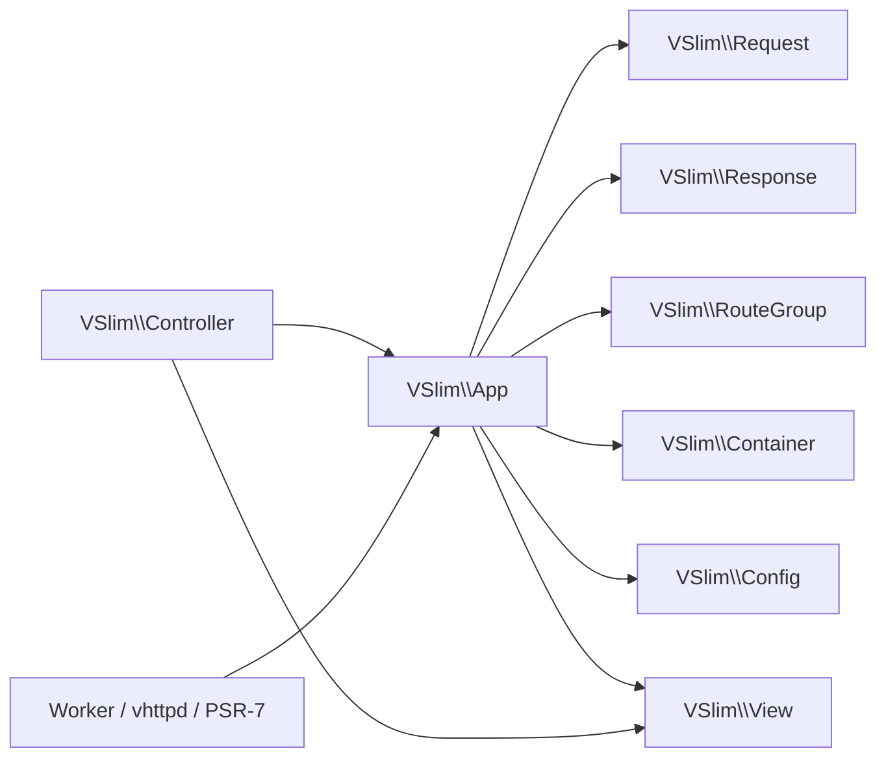

# VSlim

Documentation entry:

- overview: [docs/OVERVIEW.md](/Users/guweigang/Source/vphpx/vslim/docs/OVERVIEW.md)

`VSlim` 是一个运行在 `vphp` 之上的 PHP 微框架扩展，核心目标是给 PHP 用户提供熟悉的 runtime builder 体验：

- `VSlim\App` 负责路由注册、分发、middleware、hooks
- `VSlim\Request` / `VSlim\Response` 提供轻量 request/response facade
- `VSlim\Stream\Response` 提供扩展原生流式响应类型
- `VSlim\WebSocket\App` 提供扩展原生 WebSocket handler
- `VSlim\Mcp\App` 提供扩展原生 MCP handler
- `VSlim\View` / `VSlim\Controller` 提供轻量 MVC 能力；View 现在按“指令 + 表达式 + 变量路径”三层组织
- `VSlim\Container` / `VSlim\Config` 提供基础依赖注入与 TOML 配置
- `vslim_handle_request(...)` / `dispatch_envelope(...)` 提供和 worker / `vhttpd` 的集成边界

这份 README 只做两件事：

1. 给一个最简单、能跑通的 tutorial
2. 作为整个 `docs/` 的索引页

注意：本文档以代码和测试为准，旧文档只作为历史参考。

## 测试分层

日常开发默认跑：

```bash
make test
```

这条命令只覆盖轻量 PHPT，不包含依赖 `vhttpd`、`httpd` 或 `worker` 进程链路的重集成测试。

需要跑完整 runtime 集成回归时，使用：

```bash
make runtime-check
```

这条命令会先构建预编译的 [vhttpd](/Users/guweigang/Source/vhttpd/vhttpd)，再运行 `httpd` / `vhttpd` / `worker` 相关测试。

## 1 分钟认识 VSlim

最小可用对象是 `VSlim\App`。你注册路由，然后直接 dispatch：

```php
<?php

$app = new VSlim\App();

$app->get('/hello/:name', function (VSlim\Request $req) {
    return new VSlim\Response(
        200,
        'Hello, ' . $req->param('name'),
        'text/plain; charset=utf-8'
    );
});

$res = $app->dispatch('GET', '/hello/codex');

echo $res->status . PHP_EOL;
echo $res->body . PHP_EOL;
```

输出：

```text
200
Hello, codex
```

## 性能
在MacBook Air M2 + 4 个 PHP 进程的条件下，用 K6 压测，详情如下

### 核心指标
| 指标         | 数值            | 评价     |
| ------------ | --------------- | -------- |
| 吞吐量       | **5,019 req/s** | 优秀     |
| 平均响应时间 | **3.1ms**       | 非常快   |
| P95 响应时间 | **5.65ms**      | 很稳定   |
| 最大响应时间 | 29.1ms          | 无尖刺   |
| 错误率       | **0%**          | 完美     |
| 并发用户     | 30 VUs          | 中等压力 |

### 总体评价
这个成绩在 MacBook Air M2 + 4 个 PHP 进程的条件下非常亮眼：

- 5000+ req/s 对于 PHP 来说属于高性能范畴，说明你的框架/服务本身开销很低
- 3ms 平均延迟极低，结合 0 错误率，说明系统完全没有过载
- P95 仅 5.65ms，延迟分布非常集中，没有长尾问题
- 627,497 次 checks 全部通过，业务逻辑正确性 100%


```bash
k6 run k6_demo.js

         /\      Grafana   /‾‾/  
    /\  /  \     |\  __   /  /   
   /  \/    \    | |/ /  /   ‾‾\ 
  /          \   |   (  |  (‾)  |
 / __________ \  |_|\_\  \_____/ 


     execution: local
        script: k6_demo.js
        output: -

     scenarios: (100.00%) 1 scenario, 30 max VUs, 55s max duration (incl. graceful stop):
              * mixed_routes: Up to 30 looping VUs for 50s over 3 stages (gracefulRampDown: 5s, gracefulStop: 30s)


  █ THRESHOLDS 

    checks
    ✓ 'rate>0.99' rate=100.00%

    http_req_duration
    ✓ 'p(95)<800' p(95)=5.65ms
    ✓ 'p(99)<1500' p(99)=8.61ms

    http_req_failed
    ✓ 'rate<0.01' rate=0.00%

    server_error_rate
    ✓ 'rate<0.005' rate=0.00%


  █ TOTAL RESULTS 

    checks_total.......: 627497  12549.903605/s
    checks_succeeded...: 100.00% 627497 out of 627497
    checks_failed......: 0.00%   0 out of 627497

    ✓ api users no 5xx
    ✓ api users status 200
    ✓ api users json
    ✓ unauthorized status 401
    ✓ hello status 200
    ✓ hello has body
    ✓ hello request-id header
    ✓ health status 200
    ✓ health body ok
    ✓ forms status 200
    ✓ forms json ok

    CUSTOM
    server_error_rate..............: 0.00%  0 out of 250976

    HTTP
    http_req_duration..............: avg=3.1ms  min=130µs    med=3.05ms max=29.1ms  p(90)=5.15ms p(95)=5.65ms
      { expected_response:true }...: avg=3.1ms  min=130µs    med=3.05ms max=29.1ms  p(90)=5.15ms p(95)=5.65ms
    http_req_failed................: 0.00%  0 out of 250976
    http_reqs......................: 250976 5019.505443/s

    EXECUTION
    iteration_duration.............: avg=3.12ms min=145.12µs med=3.08ms max=29.13ms p(90)=5.17ms p(95)=5.67ms
    iterations.....................: 250976 5019.505443/s
    vus............................: 1      min=0           max=29
    vus_max........................: 30     min=30          max=30

    NETWORK
    data_received..................: 52 MB  1.0 MB/s
    data_sent......................: 24 MB  479 kB/s


running (50.0s), 00/30 VUs, 250976 complete and 0 interrupted iterations
mixed_routes ✓ [======================================] 00/30 VUs  50s
```

## Tutorials

### Tutorial 1：最简单的路由

```php
<?php

$app = new VSlim\App();

$app->get('/ping', function () {
    return 'pong';
});

$res = $app->dispatch('GET', '/ping');
echo $res->status . PHP_EOL; // 200
echo $res->body . PHP_EOL;   // pong
```

这里可以先记住 3 个事实：

- handler 可以返回 `string`
- `string` 会被自动归一化成 `200 text/plain`
- `dispatch()` 直接返回 `VSlim\Response`

### Tutorial 2：读取路径参数、query 和 body

```php
<?php

$app = new VSlim\App();

$app->post('/users/:id', function (VSlim\Request $req) {
    return [
        'status' => 200,
        'content_type' => 'application/json; charset=utf-8',
        'body' => json_encode([
            'id' => $req->param('id'),
            'trace' => $req->query('trace_id'),
            'name' => $req->input('name'),
        ], JSON_UNESCAPED_UNICODE),
    ];
});

$res = $app->dispatch_body(
    'POST',
    '/users/7?trace_id=demo',
    'name=neo'
);

echo $res->body . PHP_EOL;
```

这里用到了：

- `param()` 读取路由参数
- `query()` 读取 query string
- `input()` 读取“query + parsed body 合并后的输入”
- handler 也可以返回数组，VSlim 会归一化成 `Response`

### Tutorial 3：middleware、before、after

```php
<?php

$app = new VSlim\App();

$app->before(function (VSlim\Request $req) {
    if ($req->path === '/healthz') {
        return 'ok-from-before';
    }
    return null;
});

$app->middleware(function (VSlim\Request $req, callable $next) {
    if ($req->query('token') !== 'demo') {
        return new VSlim\Response(403, 'forbidden', 'text/plain; charset=utf-8');
    }
    return $next($req);
});

$app->after(function (VSlim\Request $req, VSlim\Response $res) {
    $res->set_header('x-demo', 'yes');
    return $res;
});

$app->get('/hello/:name', function (VSlim\Request $req) {
    return 'hello:' . $req->param('name');
});

$res = $app->dispatch('GET', '/hello/codex?token=demo');
echo $res->status . PHP_EOL;
echo $res->body . PHP_EOL;
echo $res->header('x-demo') . PHP_EOL;
```

行为规则：

- `before()` 返回非空值时会短路，不再进入 route
- `middleware()` 必须返回一个有效响应，或者调用 `$next($req)`
- `after()` 可以原地修改 `Response`，也可以返回一个新的 `Response`

### Tutorial 4：group 和命名路由

```php
<?php

$app = new VSlim\App();
$app->set_base_path('/demo');

$api = $app->group('/api');

$api->get_named('users.show', '/users/:id', function (VSlim\Request $req) {
    return 'user:' . $req->param('id');
});

echo $app->url_for('users.show', ['id' => '42']) . PHP_EOL;
echo $app->url_for_abs('users.show', ['id' => '42'], 'https', 'example.local') . PHP_EOL;

$redirect = $app->redirect_to('users.show', ['id' => '42']);
echo $redirect->status . PHP_EOL;
echo $redirect->header('location') . PHP_EOL;
```

输出类似：

```text
/demo/api/users/42
https://example.local/demo/api/users/42
302
/demo/api/users/42
```

说明：

- `set_base_path()` 会影响 `url_for*()` 生成的 URL
- `redirect_to()` 使用路由名生成 `location`
- `group('/api')` 会把该组下的路由统一加前缀

### Tutorial 5：resource / singleton

如果你想快速得到 REST 风格路由，可以直接注册 controller：

```php
<?php

final class UserController
{
    public function index(VSlim\Request $req): string { return 'index'; }
    public function show(VSlim\Request $req): string { return 'show:' . $req->param('id'); }
    public function store(VSlim\Request $req): string { return 'store'; }
    public function update(VSlim\Request $req): string { return 'update:' . $req->param('id'); }
    public function destroy(VSlim\Request $req): string { return 'destroy:' . $req->param('id'); }
    public function create(VSlim\Request $req): string { return 'create'; }
    public function edit(VSlim\Request $req): string { return 'edit:' . $req->param('id'); }
}

$app = new VSlim\App();
$app->container()->set(UserController::class, new UserController());
$app->resource('/users', UserController::class);
```

这会注册：

- `GET /users` -> `index`
- `GET /users/create` -> `create`
- `POST /users` -> `store`
- `GET /users/:id` -> `show`
- `GET /users/:id/edit` -> `edit`
- `PUT/PATCH /users/:id` -> `update`
- `DELETE /users/:id` -> `destroy`

如果你不需要 `create/edit` 这种页面路由，使用 `api_resource()`。

### Tutorial 6：最简单的 View

```php
<?php

$app = new VSlim\App();
$app->set_view_base_path(__DIR__ . '/views');
$app->set_assets_prefix('/assets');

$res = $app->view('home.html', [
    'title' => 'VSlim Demo',
    'name' => 'neo',
]);

echo $res->content_type . PHP_EOL;
echo $res->body . PHP_EOL;
```

模板里可以直接用：

```html
<h1>{{ title | trim }}</h1>
<p>{{ name | trim }}</p>
<p>{{ trace | default("n/a") }}</p>
<script src="{{asset:app.js}}"></script>
```

也就是说，当前 `View` 不只是简单 token 替换，还支持轻量表达式，例如：

- `{{ title | trim }}`
- `{{ missing_title | default("Anonymous") }}`
- `{{ user.display_name() }}`

### Tutorial 7：worker / envelope 集成

当 VSlim 运行在 PHP worker 后面时，可以直接消费 envelope：

```php
<?php

$app = new VSlim\App();
$app->get('/hello/:name', function (VSlim\Request $req) {
    return 'hello:' . $req->param('name');
});

$res = $app->dispatch_envelope([
    'method' => 'GET',
    'path' => '/hello/codex?trace_id=demo',
    'body' => '',
    'scheme' => 'https',
    'host' => 'example.local',
    'headers' => [
        'x-request-id' => 'req-1',
    ],
]);

echo $res->status . PHP_EOL;
echo $res->body . PHP_EOL;
echo $res->header('x-request-id') . PHP_EOL;
```

如果你更想要简单 map，可以使用：

```php
$map = $app->dispatch_envelope_map($envelope);
```

### Tutorial 8：最简单的流式响应

```php
<?php

$app = new VSlim\App();

$app->get('/stream/text', function () {
    return VSlim\Stream\Response::text((function (): iterable {
        yield "hello\n";
        yield "stream\n";
    })());
});

$app->get('/stream/sse', function () {
    return VSlim\Stream\Response::sse((function (): iterable {
        yield ['event' => 'token', 'data' => '{"token":"hello"}'];
        yield ['event' => 'done', 'data' => '{"done":true}'];
    })());
});
```

如果你要接 Ollama，则直接：

```php
<?php

$app->map(['GET', 'POST'], '/ollama/text', function (VSlim\Request $req) {
    return VSlim\Stream\Factory::ollama_text($req);
});

$app->map(['GET', 'POST'], '/ollama/sse', function (VSlim\Request $req) {
    return VSlim\Stream\Factory::ollama_sse($req);
});
```

### Tutorial 9：原生 MCP handler

```php
<?php

$app = new VSlim\App();
$app->get('/', static fn () => ['name' => 'vslim-native-mcp-demo']);

$app->mcp()
    ->server_info(['name' => 'vslim-native-mcp-demo', 'version' => '0.1.0'])
    ->capabilities([
        'logging' => [],
        'sampling' => [],
    ])
    ->tool(
        'echo',
        'Echo text',
        [
            'type' => 'object',
            'properties' => [
                'text' => ['type' => 'string'],
            ],
            'required' => ['text'],
        ],
        static function (array $arguments): array {
            return [
                'content' => [
                    ['type' => 'text', 'text' => (string) ($arguments['text'] ?? '')],
                ],
                'isError' => false,
            ];
        }
    );

return $app;
```

这里的关键点是：

- `MCP` 不强绑进 `VSlim\App`
- 但 `vslim.so` 已经提供了原生 `VSlim\Mcp\App`
- 直接用 `$app->mcp()` 就能把 MCP handler 挂到 `VSlim\App`
- bootstrap 现在直接返回一个 `$app` 即可

## 文档索引

### 核心组件

- [`docs/app/README.md`](/Users/guweigang/Source/vphpx/vslim/docs/app/README.md)
  `VSlim\App`：路由注册、dispatch、named routes、resource routes、hooks、错误处理、route metadata
- [`docs/app/route-group.md`](/Users/guweigang/Source/vphpx/vslim/docs/app/route-group.md)
  `VSlim\RouteGroup`：分组、嵌套 group、组级 middleware / before / after
- [`docs/http/request.md`](/Users/guweigang/Source/vphpx/vslim/docs/http/request.md)
  `VSlim\Request`：query、input、JSON/form/multipart、header/cookie/attribute/server、trace/request id
- [`docs/http/response.md`](/Users/guweigang/Source/vphpx/vslim/docs/http/response.md)
  `VSlim\Response`：headers、cookie、content type、redirect、trace/request id 透传
- [`docs/stream/README.md`](/Users/guweigang/Source/vphpx/vslim/docs/stream/README.md)
  `VSlim\Stream\Response`、`VSlim\Stream\Factory` 以及 VSlim + Ollama 的流式集成示例
- [`docs/stream/factory.md`](/Users/guweigang/Source/vphpx/vslim/docs/stream/factory.md)
  `VSlim\Stream\Factory`：text、sse、ollama 快捷入口
- [`docs/stream/ollama.md`](/Users/guweigang/Source/vphpx/vslim/docs/stream/ollama.md)
  `/ollama/text`、`/ollama/sse`、`vhttpd -> VSlim -> Ollama` 链路说明
- [`docs/websocket/README.md`](/Users/guweigang/Source/vphpx/vslim/docs/websocket/README.md)
  `VSlim\WebSocket\App`：on_open / on_message / on_close 与 vhttpd worker websocket 集成
- [`docs/mcp/README.md`](/Users/guweigang/Source/vphpx/vslim/docs/mcp/README.md)
  `VSlim\Mcp\App`：原生 MCP handler、builtin tools/resources/prompts、queue helper
- [`docs/view/view.md`](/Users/guweigang/Source/vphpx/vslim/docs/view/view.md)
  `VSlim\View`：模板路径、layout、include、if/for、helper、轻量表达式、对象方法调用
- [`docs/view/controller.md`](/Users/guweigang/Source/vphpx/vslim/docs/view/controller.md)
  `VSlim\Controller`：render、layout、redirect_to、和 `App` / `View` 的协作
- [`docs/container/container.md`](/Users/guweigang/Source/vphpx/vslim/docs/container/container.md)
  `VSlim\Container`：PSR-11、`set()`、`factory()`、handler 自动解析
- [`docs/config/config.md`](/Users/guweigang/Source/vphpx/vslim/docs/config/config.md)
  `VSlim\Config`：TOML 加载、typed getter、JSON bridge、和 `App` 的整合

### 集成与运行时

- [`docs/integration/worker.md`](/Users/guweigang/Source/vphpx/vslim/docs/integration/worker.md)
  envelope、`dispatch_envelope()`、`dispatch_envelope_map()`、worker 返回值归一化
- [`docs/integration/psr7.md`](/Users/guweigang/Source/vphpx/vslim/docs/integration/psr7.md)
  `VPhp\\VSlim\\Psr7Adapter`、PSR-7 request 转 `VSlim\Request`

### 现成示例

- [`examples/demo_app.php`](/Users/guweigang/Source/vphpx/vslim/examples/demo_app.php)
  综合示例：路由、container、resource、view、error handler、worker 兼容
- [`examples/config_usage.php`](/Users/guweigang/Source/vphpx/vslim/examples/config_usage.php)
  `Config` 示例
- [`tests/test_php_route_builder.phpt`](/Users/guweigang/Source/vphpx/vslim/tests/test_php_route_builder.phpt)
  最完整的 builder 行为样例

## 组件总览



## 真理之源

如果文档和实现不一致，以这些文件为准：

- [`src/php_app.v`](/Users/guweigang/Source/vphpx/vslim/src/php_app.v)
- [`src/request.v`](/Users/guweigang/Source/vphpx/vslim/src/request.v)
- [`src/response.v`](/Users/guweigang/Source/vphpx/vslim/src/response.v)
- [`src/mvc.v`](/Users/guweigang/Source/vphpx/vslim/src/mvc.v)
- [`src/container.v`](/Users/guweigang/Source/vphpx/vslim/src/container.v)
- [`src/config_runtime.v`](/Users/guweigang/Source/vphpx/vslim/src/config_runtime.v)
- [`tests/`](/Users/guweigang/Source/vphpx/vslim/tests)
